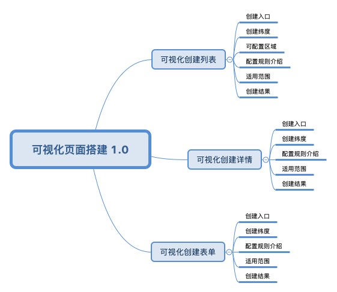

# 可视化页面搭建 1.0

## 为什么要做可视化页面搭建

* 统一 saas 系统中各个页面的样式和交互

saas 系统而多个独立部署的系统组合而成，这些系统的样式，交互存在差异，通过可视化搭建生成的页面底层使用同一套组件这可以满足样式，交互一致，并且面对之后的样式和交互变更满足批量修改

* 缩短常规页面开发时间

saas 系统是一个 toB 系统，这里面存在数量可观的类似的页面，开发重复页面容易磨灭开发人员的积极性，整理各类页面的共同之处，通过可视化搭建系统来减少页面开发重复度，让开发人员集中精力开发逻辑复杂的页面

## 搭建范围

cms 1.0 可创建的页面类型有：列表，详情，表单，在 [http://saas-test.dmallmax.com/saasfe-cms-single/#/saasfe/cms/tableListConfig/modules](http://saas-test.dmallmax.com/saasfe-cms-single/#/saasfe/cms/tableListConfig/modules)中创建模块，已有的模块有 mis,mis-new,psi,wms,fin，然后在模块中创建页面

1. [列表可视化创建](./list/)

