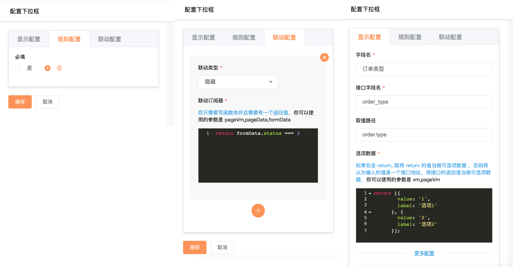
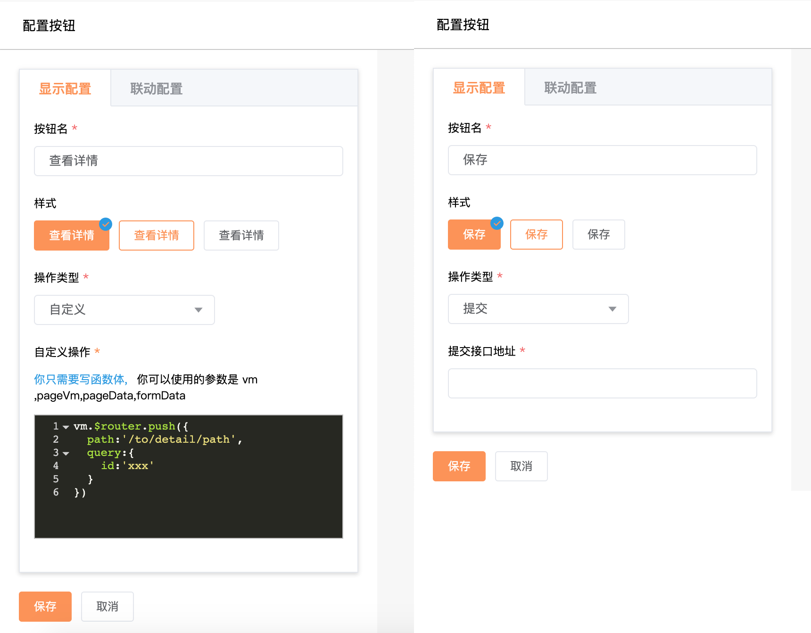

# 页面可视化搭建系统设计思路

## 为什么要做页面可视化搭建系统

* 统一微前端架构各个微应用页面的样式和交互

  我们公司的供应链 saas 系统而多个独立部署、技术栈不统一的系统组合而成，这些系统的样式，交互存在差异，通过页面可视化搭建系统生成的页面底层使用同一套组件库，这可以满足样式，交互一致，并且面对之后的样式和交互变更支持批量修改

* 缩短常规页面开发时间

  我们公司的供应链 saas 系统是一个 toB 系统，这里面存在数量可观的类似的页面，开发重复页面容易磨灭开发人员的积极性，整理各类页面的共同之处，通过可视化搭建系统来减少页面开发重复度，让开发人员集中精力开发逻辑复杂的页面

整个可视化搭建系统分为三部分，分别是配置页(setting),视图页(view) 和 json schema。配置页生成 json schema，视图页消费 json schema


## 写在前面

1. 使用 codemirror 实现在可视化界面上编辑自定义行为的代码
2. 接口地址只填写以`/`开头的相对路径，视图页在运行的时候决定接口所在的环境
3. 使用 cool-path 实现按字段路径取值、按字段路径修改值
4. 使用 new Function 在视图页将 json schema 对应的字符串转化成对象或者函数

可创建的页面类型有：列表、详情、表单。详情和表单页的设计思路差别不大，列表页与另外两种页面差别比较大。

## 功能

### 列表页

定义按钮操作、定义搜索项（单行搜索框\事件选择器\下拉框\级联选择器\批量输入搜索）、动态获取下拉框和级联选择器的备选数据、列表排序、table 行多选、自定义 table 行的操作、自定义 table 列的显示内容

### 详情页\表单页

表单联动、表格数据格式校验、一列布局、多列布局、表格分页、自定义文本的显示内容

## 列表页设计

经过分析我们公司的列表页布局有一个统一的模式。列表由右上角的操作按钮、左上角的标题\面包屑、正上面的筛选区域、中间的 table 以及正下方的分页器组成，中间的 table 是必须存在的，其他内容可选。如下图所示：


由于列表页有一个统一的布局模式，在列表的配置页，我将列表页分成多个独立的区域进行分别配置，如下图：


**基本配置**区域中填写的数据不会显示在列表视图页中，这个区域填写的数据只是为了方便列表配置数据的查找。

### 全局配置

由于列表页是一个动态的页面，页面中大部分数据都是从后端开发人员提供的接口中得到的，每一个接口都对应了多个环境，在我们公司每个接口至少有开发环境、测试环境、生成环境这三个环境，所以在列表配置页中不能将接口的域名写死，在需要填写接口地址的地方只能填写接口的相对路径，除此之外这个页面可视化搭建系统需要为多个独立部署的系统生成页面，所以在**全局配置**区域要选择后端接口的所属系统，如下图：


列表视图页中从 json schema 中得到接口所属系统标识符，再根据视图页的运行环境动态生成接口的域名

并不是所有的列表页都存在按钮、filterStatus 和搜索框，在这三个区域可以根据实际情况进行配置。

### 按钮配置


在配置按钮的时候必须选择按钮的操作类型，目前可选的操作类型有：上传、导出、自定义，不同操作类型的按钮需要填写的配置项有所不同。在这里以导出为例，不同的列表页导出之后需要进行的后续操作有所差异，所以配置人员可以自定义导出之后的回调函数，为了减少配置人员对参数顺序的记忆成本，在 codemirror 代码编辑器中只能写函数体中的内容，配置页将 json schema 保存到服务器之前会将代码编辑器中的内容包裹在函数中，简化代码如下：

```js
if(button.type === 'upload') {
  button.callback = 'function (vm,content) {'+ toSwitch(button.callback) +'}'
} else {
  button.callback = 'function (vm) {'+ toSwitch(button.callback) +'}'
}
```

当再此编辑函数体的内容时，需要将函数中的函数体取出，简化代码如下：

```js
const toSwitch = (func) => {
    const matchResult = func.toLocaleString().match(/(?:\/\*[\s\S]*?\*\/|\/\/.*?\r?\n|[^{])+\{([\s\S]*)\}$/)
    const body = (matchResult||[])[1] || ''
    return body.trim();
}

button.callback = toSwitch(button.callback)
```

由于不同的接口需要传递的参数形式有所不同，所以在所有填写接口地址的地方，都可以自定义组装接口的参数，视图页在渲染页面时有生成接口参数的行为，在自定义组装接口参数编辑器中可以修改这一默认行为。

filterStatus 配置较为简单，在这儿略过

### 搜索区域配置

searchBox 区域可配置的搜索框有：单行输入框、下拉框、级联选择器、时间选择器、时间范围选择器。


不同的搜索框需要填写的配置项不同。对于时间范围选择器而言，有的列表接口要求将开始时间和结束时间放在同一个数组中，有的列表接口则要求将开始时间和结束时间分别放在不同的字段中，所以搜索框的字段名具有解构的功能。在填写字段名时可以填写 `[param1,param2]` 这种格式。在视图页解析 json schema 时会将搜索框的参数赋给解构之后的参数，简化代码如下：

```js
function separateParam (originalArr,key){
        const keyArr = key.replace(/^\[/,'').replace(/\]$/,'').split(',');
        const result = {};
        keyArr.forEach((key,index) => {
          result[key] = originalArr[index]
        });
        return result;
}
```

在某些列表中可能需要给搜索框设置默认值，默认值可能是固定的静态数据也可能是视图页运行时动态生成的数据。如果默认值输入框中包含 return，则会认为默认值是从函数中动态生成，配置页在将 json schema 保存到服务器之前会将代码编辑器中输入的内容包裹到函数中。

视图页给搜索框赋默认值的代码如下：

```js
function getDefaultValue(searchConfig) {
  return isFunction(searchConfig.default) ? searchConfig.default(vm) : searchConfig.default;
}

```

下拉框和级联选择器需要有下拉备选项，这些下拉备选项可以从接口中获取也可以配置静态的数据

### table 区域

table 配置是列表页配置中最为复杂的地方，table 也是列表视图中主要的内容，它的复杂之处在于，列数不固定，每列的显示形式不固定，配置区域如下：


由于 table 每一列要展示的数据的嵌套层级不固定，所以表头字段支持按路径取值。例如：表头字段可以是`order.id`，这使用[cool-path](https://github.com/janryWang/cool-path)来实现这个功能。

table 支持的列的展示形式有：多选、操作、文本。如果某一列是操作列，就必须自定义操作列的展示形式。如果某一列是文本，默认情况会根据表头字段去取值，然后将文本内容显示在界面上，考虑到实际的需求，配置人员也可以改变这一默认行为，去自定义显示内容。自定义显示内容使用的 [Vue 的渲染函数](https://cn.vuejs.org/v2/guide/render-function.html)来实现,简化代码如下：

```vue
    <template v-if="col.render">
        <v-render
              :render-func="col.render"
              :row="scope.row"
              :index="scope.$index"
              :col="col"
        />
    </template>
    
    // v-render 组件定义如下
    
    components:{
      vRender:{
          render(createElement) {
            // 这儿的 this.renderFunc 是在列表配置界面写的函数
            return this.renderFunc(createElement,this.row,vm.$parent,this.col,this.index,this.oldRowData)
          },
          props:{
            renderFunc:{
              type:Function,
              required: true
            },
            row:{
              type:Object,
              default(){return {}}
            },
            index:{
              type:Number,
              default:0
            },
            col:{
              type:Object,
              default() { return {} }
            }
          },
          data(){
            return {
              oldRowData:deepClone(this.row)
            }
          }
        }
    }
    
```

由于 table 中要展示的数据都是从后端提供的接口获取，在我们公司内部这个页面搭建系统要服务于多个独立的系统，这些系统的后端接口规范不尽相同，所以在配置页可以根据接口返回的值组装 table 要展示的数据。组装 table 数据与组装接口参数类似，都是在代码编辑框中写函数，然后函数必须有一个返回值，视图页会将返回值当作接口参数或者 table 数据。

## 详情页/表单页的设计

详情页和表单页的设计思路相同，不同的是在页面上展示的组件不同，在下面的文字中统称为详情页。详情页中有两种类型的组件，分别是布局组件和基础组件，基础组件只能放置在布局组件中，布局组件不能相互嵌套。

在这里我以`行`为纬度来创建详情页，并且将行分成一至三列，每一列可以容纳任意多个基础组件，选中基础组件或者布局组件对这个组件进行配置，可以将配置详情页当做搭积木。


### 页面数据的获取

由于创建的是动态页面需要请求后端接口，所以在创建详情页时需要选择接口所属的后端系统并且在需要填写接口地址的地方只能填写接口的相对路径，这一点与配置列表页相同。

对于所有的详情页而言，它们都需要将详情数据展示在界面上，在这里暂且将这些数据统称为详情页面数据。在我们公司的业务系统中通常通过详情 ID 或者其他的参数从接口中获取页面数据。

在页面可视化搭建系统中有两种方式获取页面数据，分别是：

1. 填写获取页面数据的接口地址，这种方式将大部分的工作都交给视图页自动完成，最为简单。
2. 在配置页自定义函数得到页面数据，在这里支持 promise 和 同步执行的函数，这种方式很灵活

先介绍第一种方式，界面如下：


在接口地址输入框中，可以填写类似这样的内容`/basic/someApi/detail?poId=202004130000121&type&code=333`，视图页在拿到 json schema 去生成视图的时候会将poId，type和code 作为接口的参数，并且视图页会优先从浏览器地址栏中取这些参数的值，如果浏览器不存在某个参数,程序就使用 json schema 中给定的值。例如：浏览器地址栏的查询字符串为?po_id=99&type=2,视图页在请求`/basic/someApi/detail`这个接口时，传给接口的参数为：`{po_id:99,type:2,code:333}`。这种方式会将接口返回的`content`字段当前页面数据。

根据接口地址输入框中的值与浏览器地址栏中的 query 获取接口参数的代码如下：

```js
/**
 * 从 query 中得到接口的参数
 * @param params
 * @param query
 * @returns {{[p: string]: *}}
 */
export function getParams(params, query) {
  const result = {
    ...params
  };
  Object.keys(result).forEach(key => {
    // 用浏览器 query 中的参数值替换 params 中的值
    if(query[key]){
      result[key] = query[key]
    }
  });
  return result
}
```

第二种方式：在配置页自定义函数得到页面数据，这种方式你只需要写函数体，并且必须有一个返回值，界面如下：


这种方式支持 promise 和同步执行的函数。如果函数返回 promise，视图页会将 promise resolve 的值当作页面数据，如果是同步执行的函数，视图页会将同步函数的返回值当作页面数据。

结合这两种方式视图页获取页面数据的代码如下：

```js
/**
 * 获取页面数据
 * @param pageConfig 页面配置
 * @param vm 详情页的 Vue 实例
 * @returns {Promise<any | never>}
 */
export function fetchPageData({pageConfig,vm}){
  return new Promise((resolve, reject) => {
    // 从接口中获取页面数据
    if(pageConfig.url) {
      const paramsFromUrl = getParamsFromUrl(pageConfig.url)
      // 得到完整的接口地址
      const fullUrl = getFullUrl(pageConfig.belong,paramsFromUrl.origin)
      request(fullUrl, getParams(paramsFromUrl.params,vm.$route.query)).then(res => {
        resolve(res.content)
      })
    } 
    // 通过自定义函数获取页面数据
    else if(pageConfig.getPageData ){
      if(typeof pageConfig.getPageData === 'function') {
        const result = pageConfig.getPageData.call(vm,vm)
        resolve(result);
      } else {
        resolve(pageConfig.getPageData)
      }
    } else {
      resolve({})
    }
  }).then((content) => {
    return content
  })
}
```

### 组件的配置参数

如下是一个输入框组件的配置：

```json
{
  "title": "用户名",
  "path":"user.name",
  "key":"userName",
  "type":"string",
  "visible":true,
  "x-linkages":[],
  "x-component":"dm-input",
  "x-component-props":{
    "type":"text",
    "size":"small",
    "placeholder":"请输入用户名"
  },
  "x-props":{
    "style":{
      "margin":"7px 5px",
      "color":"#333333"
    }
  },
  "editable":true,
  "triggerType":"submit",
  "events":{},
  "x-rules":{
    "format":"",
    "required":false,
    "pattern":"",
    "max":"5",
    "min":"2"
  }
}
```

组件可配置的字段如下：

|属性名|描述|类型|
|-----|----|----|
|title|字段标题|string|
|path|取值路径|string|
|key|接口字段名|string|
|description|字段描述|string|
|default|UI 组件字段默认值|any|
|editable|是否可编辑|boolean|
|type|字段值类型|string,object,array,number,boolean
|enum|枚举数据|array,object,function|
|url|获取枚举数据或者 UI 组件数据的接口地址|string
|items|组件的子组件的配置字段|array|
|triggerType|字段校验时机|string
|visible|字段是否可见|boolean
|events| UI 组件的事件 | Object |
|x-props|字段的扩展属性|object
|x-component|字段的 UI 组件名|string
|x-component-props|字段 UI 组件的属性|object
|x-linkages|字段联动|array
|x-rules|字段规则|object

x-props 数据属性

|属性名|描述|类型|
|----|----|----|
|style|字段的 UI 组件的 style 样式| object |
|className|字段的 UI 组件的 className | string|
|label|字段的 UI 组件的枚举 label 取值路径|string|
|value|字段的 UI 组件的枚举 value 取值路径|string|
|buttonType| 按钮的操作类型| string|
|render|自定义组件的显示内容| function
|buttonSubmitUrl|提交按钮的接口地址|string
|paging|列表是否分页|boolean


x-rules 数据属性

|属性名|描述|类型|
|----|----|----|
|format|字段值类型|string
|required|是否必填|boolean
|pattern|正则|RegExp,string
|max|最大长度|number
|min|最小长度|number
|len|长度|number
|maximum|最大数值|number
|minimum|最小数值|number
|message|错误文案|string

format 的可选值：url，邮箱，手机号，金额，数字

x-linkages 字段联动

|属性名|描述|类型|可选值|
|----|----|----|----|
|type|联动类型|String|linkage:hidden,linkage:disabled,linkage:value|
|subscribe|联动订阅器|Function|-|

下面以文本组件，下拉框组件，按钮组件为例进行说明

### 文本组件

文件组件用于在详情页中显示某个字段对应的值，他的配置界面如下：


先介绍非自定义文本组件显示内容的情况，这个时候文本组件的取值路径是必填项的，视图页会根据取值路径从页面数据中取文本组件的显示内容。取值路径还支持在路径后面增加过滤器，这里的过滤器和[Vue 中的过滤器](https://cn.vuejs.org/v2/guide/filters.html)功能一致。取值路径例如为：

```
create_at|formatDate('datetime')： 从页面数据的 create_at 字段中取值，然后使用 formatDate 格式化 create_at 字段对应值
```

简化代码如下：

... vue 组件
```js
computed:{
    // 使用计算属性得到文本组件要显示的内容 
   textContent(){
    const p = this.fieldSchema.path.split('|')
    // 如果填写了取值路径
    if(formatPathStr(p[0])) {
      const filters = p.slice(1)
      // 这里的 Path 指 cool-path
      const path = new Path(p[0]);
      // 从页面数据中取值
      let value = path.getIn(this.pageVm.pageData)
      // 过滤器
      if (filters && filters.length) {
        value = filters.reduce((a, b) => {
          return this.evalFilter(b, a, this)
        }, value)
      }
      return value || '- -'
    } else {
      return this.fieldSchema.default ||'- -'
    }
  }
},
methods:{
   evalFilter(filterStr,val){
    const parms = filterStr.match(/^([_$0-9A-Za-z]+)\(([^()]+)\)$/) || ['', filterStr]
    const fn = parms[1]
    let args = [val]
    try {
      args = args.concat(eval(`[${parms[2]}]`))
    } catch (e) {
      console.error(e)
      this.$message.error(this.fieldSchema.title+'执行过滤器时拼接参数出错了')
    }
    // 根据过滤器名得到过滤器对应的方法
    const filterFn = this.$options.filters && this.$options.filters[fn]
    if (typeof filterFn == 'function') {
      return filterFn.apply(this, args)
    }
    return val
  }
}
```

从上面的配置文件组件的可视化界面中可以看到，我们还可以配置文本组件的枚举数据，这个枚举数据主要是考虑到接口返回的页面数据中的某些字段是数字或者英语单词，但是在界面上我们需要显示这些字段的中文含义，枚举数据可以是从接口中获取会可以在配置页中写死，枚举数据的获取方式与上面介绍的页面数据获取方式类似，在这里不再赘述。

不自定义文本组件显示内容已经可以满足大部分使用场景，这种方式有一个局限性：一个文本组件只能显示一个字段的值，在某些时候可能需要将多个字段合并在一个文本组件中显示在界面，在这种情况下我使用[Vue的渲染函数](https://cn.vuejs.org/v2/guide/render-function.html)来自定义文本组件的显示内容。自定义的渲染函数类似于下面这样：

```
    return h('div',[
        h('span',pageData.user.name),
        h('span',pageData.uesr.age)
    ])
```

在视图页在渲染视图时会执行文件组件的渲染函数，简化代码如下：

````vue
<template>
<!--do something-->
  <v-render
     :renderFunc="fieldSchema['x-props'].render"
  />
</template>
<script>
// do something
components:{
  vRender:{
    render(createElement) {
      const parentVm = this.$parent;
      return this.renderFunc(createElement,parentVm,parentVm.pageVm,parentVm.pageVm.pageData)
    },
    props:{
      renderFunc:{
        type:Function,
        required: true
      },
    }
  }
}
</script>
````

在可视化创建详情页中，除了文本组件支持写渲染函数之外，表格组件中的列也支持写渲染函数

### 下拉框组件

下拉框组件的配置界面如下：



下拉框组件有三个区域进行配置，在这里着重介绍下拉框的显示配置和联动配置，先介绍显示配置再介绍联动配置

下拉框是一个表单组件，它除了可以对数据进行展示还可以对数据进行修改，我将表单组件的值(即：组件 value 属性对应的值)存放在 vuex 中。对于详情页而言，表单组件需要显示它的初始值，表单的初始值位于页面数据中，为了让表单组件在 vuex 中取到它要展示的值，在表单组件 created 钩子函数中，我将这个表单组件在页面数据中的值另存到 vuex 中，在此之后表单组件取值和修改值都是针对 vuex 中的数据进行操作，简化之后的代码如下：

```vue
<template>
  <dm-select
      v-model="value"
      v-bind="fieldSchema['x-component-props']"
      :class="fieldSchema['x-props'].className"
    >
     <!--....some options-->
  </dm-select>
</template>
<script>
  export default {
    computed:{
      value:{
        get() {
          // 从 Vuex 的 formData 中取值
          return new Path(this.fieldSchema.key).getIn(this.formData)
        },
        set(value){
          // 将表单字段的保存到 Vuex 的 formData 中
          this.saveFormData({name:this.fieldSchema.key,value:value})
        }
      },
    },
    created(){
      this.setFieldInitValue()
    },
    methods:{
      setFieldInitValue(){
            // 从页面数据中取表单组件的初始值
            let initValue = new Path(this.fieldSchema.path).getIn(this.pageData)
            // 将表单组件的初始值保存到 Vuex 的 formData 中
            this.saveFormData({name:this.fieldSchema.key,value:initValue})
      }
    }
  }
</script>
```

下拉组件除了要显示选中的值，还需要备选数据，它的备选数据可以通过从接口中获取也可以在配置中写死，支持返回一个 promise，返回同步计算的值或者填写 url。下拉框的备选数据获取方式与上面介绍的页面数据的获取方式类似，不再赘述。

select 的联动配置

表单联动是指：这个表单组件的状态受其他表单组件的值的影响，目前支持的联动类型有：隐藏、禁用、组件值联动。联动订阅器用于观察 formData 中值的变化，针对表单组件的联动类型对组件的状态作出影响。联动订阅器是一个函数，在视图页中使用联动订阅器计算计算属性的值，所以只要在联动订阅器中访问的值发生了变化，就会重新计算计算属性，进而影响组件的状态。简化的代码如下：

```vue
<template>
  <dm-select
      v-model="value"
      :disabled="disabled"
      :hidden="hidden"
    >
     <!--....some options-->
  </dm-select>
</template>
<script>
export default {
  computed:{
    disabled(){
      if(this.linkages['linkage:disabled']) {
        return this.linkages['linkage:disabled'](this.pageVm,this.pageVm.pageData,this.formData)
      } else {
        return false
      }
    },
    hidden(){
      if(this.linkages['linkage:hidden']) {
        return this.linkages['linkage:hidden'](this.pageVm,this.pageVm.pageData,this.formData)
      } else {
        return false
      }
    },
    value:{
      get() {
        // 从 Vuex 的 formData 中取值
        return new Path(this.fieldSchema.key).getIn(this.formData)
      },
      set(value){
        // 将表单组件的值保存到 Vuex 的 formData 中
        this.saveFormData({name:this.fieldSchema.key,value:value})
      }
    },
    valueOfLinkage(){
      if(this.linkages['linkage:value']) {
        return this.linkages['linkage:value'](this.pageVm,this.pageVm.pageData,this.formData)
      } else {
        return ''
      }
    }
  },
  watch:{
    valueOfLinkage(val){
      this.value = val
    }
  }
}
</script>
```

表单组件的值联动比隐藏联动和禁用联动要复杂一些，这是因为联动订阅器可以改变表单组件的值，表单组件它自身也可以改变它的值。表单组件的值由最后一次变化为准。

对于禁用联动，它的联动订阅器中可填写的内容如下：

```js
if(formData.status + '' === '2') {
  return true
} else {
  return false
}
```

上面的联动订阅器表示：当 vuex 中的 formData.status 等于 2 时，这个表单组件会被禁用

对于隐藏联动，它的联动订阅器中可填写的内容如下：

```js
if(formData.username.length > 3) {
  return true
} else {
  return false
}
```

上面的联动订阅器表示：当 vuex 中的 formData.username 的长度 > 3 时，这个表单组件会被隐藏

对于值联动，它的联动订阅器中可以填写的内容如下：

```js
if(formData.id) {
  return 3
} else {
  return ''
}
```

上面的联动订阅器表示：当 vuex 中的 formData.id 为 truly 时，这个表单组件的值会被置为 3

### 按钮组件

按钮组件的配置界面如下：



按钮组件是一种比较特别的组件，与其他组件相比它的操作行为不固定而且影响范围比较广。根据业务需求分为三种操作类型，分别是：提交(即：将表单数据提交到服务器)，重置(即：将表单组件的值重置为初始状态)，自定义(即：自定义按钮的点击事件处理程序)。在下面只介绍`提交`和`自定义`这两种类型。

提交操作

通常在将表单数据提交到服务器之前，我们需要对表单数据进行校验，只有所有的数据符合要求才能将表单数据提交到服务器，否则将错误语显示到界面上。为了满足这个需求，我们需要在按钮提交事件的处理程序中访问到所有的表单数据以及表单组件的数据校验规则，由于表单数据保存在 Vuex 中，并且存放数据校验规则的 json schema 在视图页中全局共享，所以在提交事件处理程序中能够很容易拿到想要的数据。需要注意的是，如果某个表单组件的数据没有通过校验，它错误信息要显示在表单组件所在的位置，这就意味着消费错误信息的位置和生成错误信息的位置不相同。

我将对错误信息进行操作的方法收集到单独的模块中。简化代码如下：

```js
/**
 *表单错误收集器
 **/

import Vue from 'vue'
export const errorCollector = new Vue({
  data(){
    return {
      errorObj:{}
    }
  },
  methods:{
    clearError(){
      this.errorObj = {}
    },
    delError(name){
      const errorObj = {
        ... this.errorObj
      }
      delete errorObj[name]
      this.errorObj = errorObj
    },
    setError(name,value){
      this.errorObj = {
        ... this.errorObj,
        [name]: value
      }
    },
    initFieldError(name){
      this.errorObj = {
        ... this.errorObj,
        [name]: ''
      }
    }
  }
})
```

错误信息收集器是一个 Vue 实例，在每个表单组件中引入错误信息收集器，并且将它作为组件的一个 data 属性，错误信息作为组件的计算属性，这样一来只要错误信息收集器中的数据发生变化界面就会更新，简化代码如下：

```vue
<template>
<!-- do something-->
<div>{{ errorMsg }}</div>
</template>
<script>
export default {
  data(){
    return {
      errorCollector:errorCollector
    }
  },
  computed:{
    errorMsg(){
      return this.errorCollector.errorObj[this.fieldSchema.key]
    }
  }
}
</script>
```

自定义操作

自定义操作实际上 json schema 中定义按钮的点击事件处理程序，在视图页中的实现比较简单

## 如何使用

在开发环境 json schema 保存在数据库，要在测试环境和生产环境使用 json schema 生成页面，需要将 json schema 下载到项目中的一个特定文件夹中，当在浏览器中访问这个视图页时，会根据页面 ID 到下载好的静态文件中读取页面的 json schema，然后视图页将页面渲染出来。

从静态文件中读取配置代码如下：

```js
 import("@static/jsons/tables/table_string_"+id+".json").then(fileContent => {
        console.log('配置数据：',fileContent)
    })
```

json 文件中保存的 json schema 是一个字符串，但是在视图页渲染界面的时候需要的是一个对象，并且对象的某些字段必须是函数。为了将字符串转成需要的格式，我使用 `new Function('return ' + strConfig)()` 来完成这一需求,简化代码如下：

```js
function parseStrConfig(jsonSchema) {
    return  new Function('return ' + jsonSchema)();
}
```

## 存在的不足

1. 生产出的页面不能独立于页面搭建系统运行。要想在其他系统中使用生成的页面，必须在对应系统中使用 iframe 或者 single-spa 微前端技术引入页面搭建系统
2. 页面的 json schema 没有与页面搭建系统独立。由于每创建一个页面就要该页面的 json schema 下载到页面可视化搭建系统中，这导致页面可视化搭建系统需要被频繁的发布，但是页面可视化搭建系统的业务功能相对稳定
