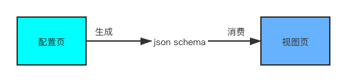
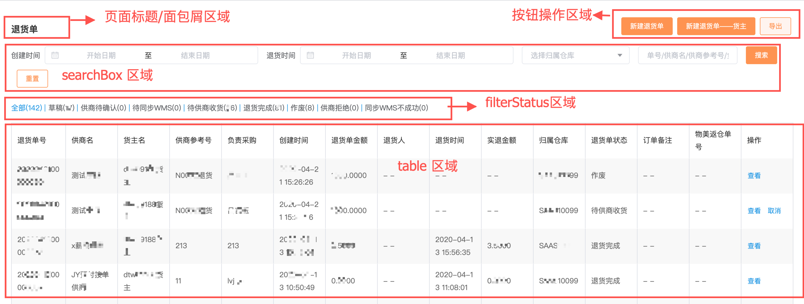
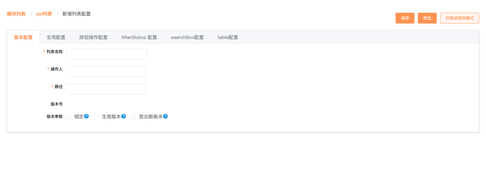
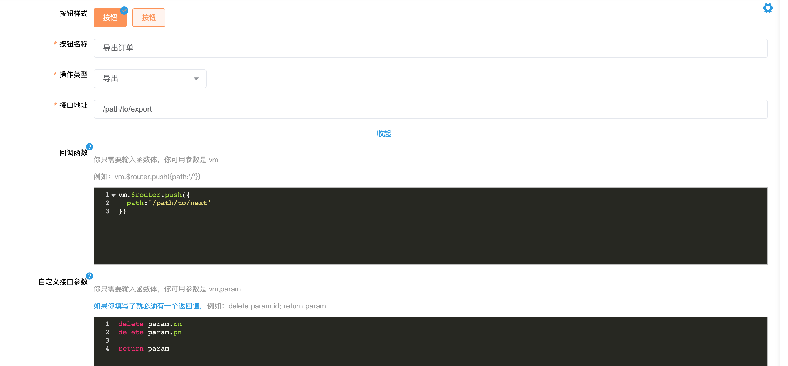
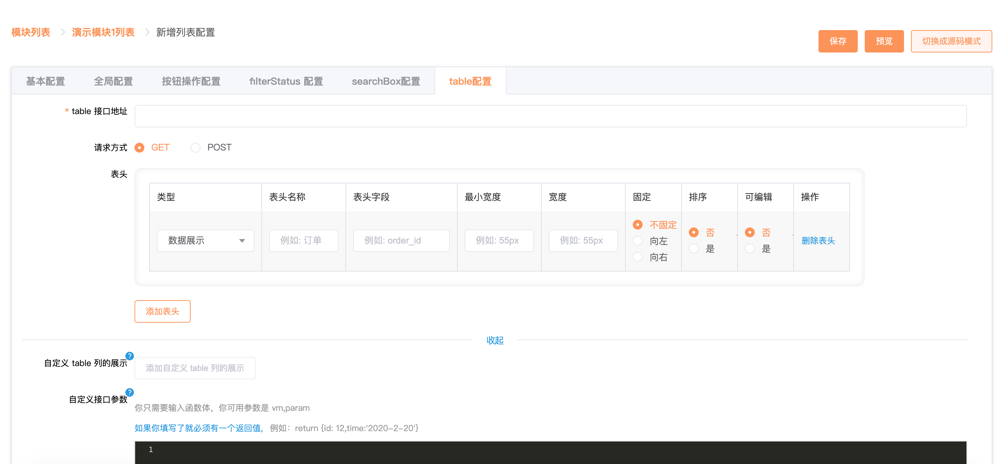
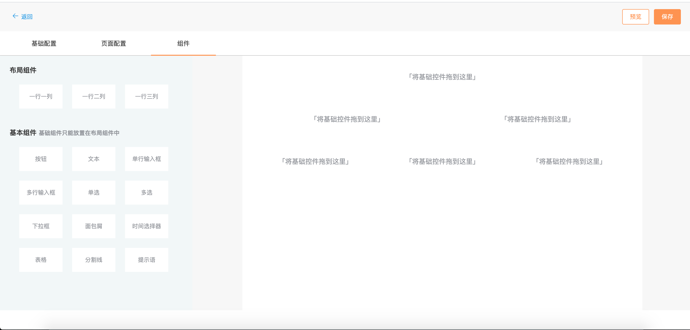
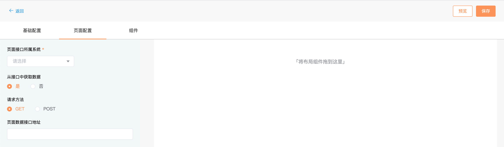
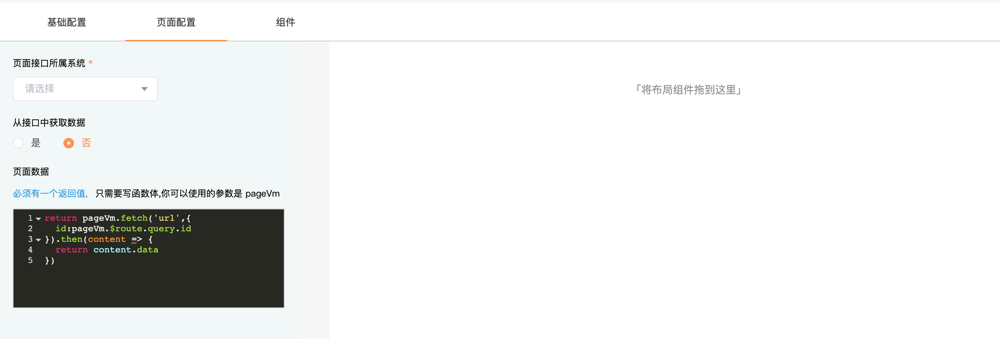
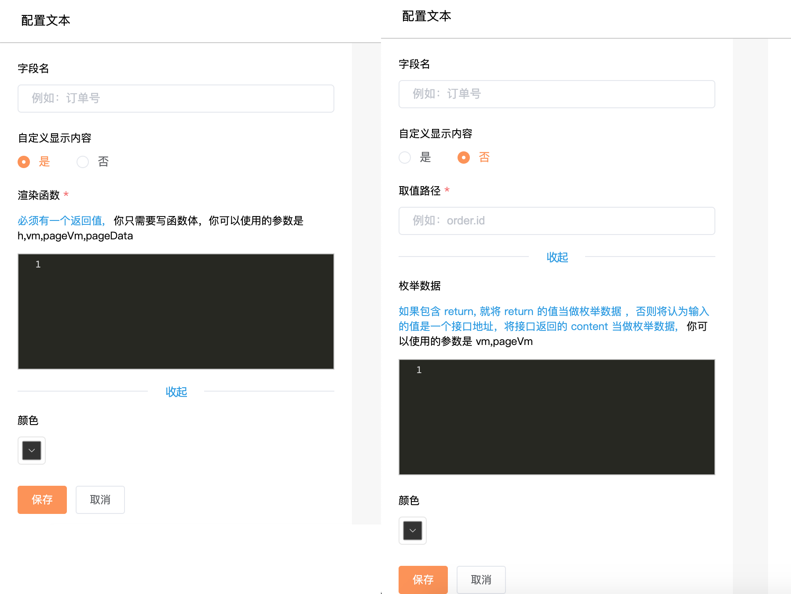

# 页面可视化搭建系统设计思路

## 为什么要做页面可视化搭建系统

* 统一微前端架构各个微应用页面的样式和交互

  我们公司的供应链 saas 系统而多个独立部署、技术栈不统一的系统组合而成，这些系统的样式，交互存在差异，通过页面可视化搭建系统生成的页面底层使用同一套组件，这可以满足样式，交互一致，并且面对之后的样式和交互变更满足批量修改

* 缩短常规页面开发时间

  我们公司的供应链 saas 系统是一个 toB 系统，这里面存在数量可观的类似的页面，开发重复页面容易磨灭开发人员的积极性，整理各类页面的共同之处，通过可视化搭建系统来减少页面开发重复度，让开发人员集中精力开发逻辑复杂的页面

整个可视化搭建系统分为三部分，分别是配置页(setting),视图页(view) 和 json schema。配置页生成 json schema，视图页消费 json schema



可创建的页面类型有：列表、详情、表单。详情和表单页的设计思路差别不大，列表页与另外两种页面差别比较大。本篇文章先介绍列表页的设计思路再介绍详情页的设计思路

## 列表页设计

经过分析我们公司的列表页布局有一个统一的模式。列表由右上角的操作按钮、左上角的标题或面包屑、正上面的筛选区域、中间的 table以及正下方的分页器组成，中间的 table 是必须存在的，其他内容可选。如下图所示：



由于列表页有一个统一的布局模式，在列表的配置页面，我将列表页分成多个独立的区域进行分别配置，如下图：



**基本配置**区域中填写的数据不会显示在列表视图页中，这个区域填写的数据只是为了方便列表配置数据的查找。

### 全局配置

由于列表页是一个动态的页面，页面中大部分数据都是从后端开发人员提供的接口中得到的，每一个接口都对应了多个环境，在我们公司每个接口至少有开发环境、测试环境、生成环境这三个环境，所以在列表配置页中不能将接口的域名写死，在需要填写接口地址的地方只能填写接口的路径，除此之外这个页面可视化配置系统需要为多个独立部署的系统生成页面，所以在**全局配置**区域要选择后端接口的所属系统，如下图：


在列表的视图页中从 json schema 中得到接口所属系统标识符，再根据视图页的运行环境动态生成接口的域名

并不是所有的列表页都存在按钮、filterStatus 和搜索框，在这三个区域可以根据实际情况进行配置。

### 按钮配置



在配置按钮的时候必须选择按钮的操作类型，目前可选的操作类型有：上传、导出、自定义，不同操作类型的按钮需要填写的配置项有所不同。在这里以导出为例，不同的列表页导出之后需要进行的后续操作有所差异，所以配置人员可以自定义导出之后的回调函数，为了减少配置人员对参数顺序的记忆成本，在代码编辑器中只能写函数体中的内容，将 json schema 保存到服务器之前要将代码编辑器中的内容包裹在函数中，代码如下：

```js
if(button.type === 'upload') {
  button.callback = 'function (vm,content) {'+ toSwitch(button.callback) +'}'
} else {
  button.callback = 'function (vm) {'+ toSwitch(button.callback) +'}'
}
```

当再此编辑函数体的内容时，需要将函数中的函数体取出，代码如下：

```js
const toSwitch = (func) => {
    const matchResult = func.toLocaleString().match(/(?:\/\*[\s\S]*?\*\/|\/\/.*?\r?\n|[^{])+\{([\s\S]*)\}$/)
    const body = (matchResult||[])[1] || ''
    return body.trim();
}

button.callback = toSwitch(button.callback)
```

由于不同的接口需要传递的参数有所不同，所以在所有的填写接口地址的地方，都可以自定义接口的参数，每个接口都会有默认的参数，在自定义接口参数编辑器中可以修改这一默认行为。

filterStatus 配置较为简单，在这儿略过

### 搜索区域配置

searchBox 区域可配置的搜索框有：单行输入框、下拉框、级联选择器、时间选择器、时间范围选择器。


不同的搜索框需要填写的配置项不同。对于时间范围选择器而言，有的列表接口要求将开始时间和结束时间放在同一个数组中，有的列表接口则要求将开始时间和结束时间分别放在不同的字段中，所以搜索框的字段名具有解构的功能。在填写字段名时可以填写 `[param1,param2]` 这种格式。在列表视图页解析 json schema 时会将搜索框的参数赋给解构之后的参数，代码如下：

```js
function separateParam (originalArr,key){
        const keyArr = key.replace(/^\[/,'').replace(/\]$/,'').split(',');
        const result = {};
        keyArr.forEach((key,index) => {
          result[key] = originalArr[index]
        });
        return result;
}
```

在某些列表中可能需要给搜索框设置默认值，默认值或是固定的静态数据，亦或者动态生成的数据。如果默认值输入框中包含 return,则会认为默认值是从函数中动态生成，在将 json schema 保存到服务器之前会将代码编辑器中输入的内容包裹到函数中。

列表视图页给搜索框赋默认值的代码如下：

```js
function getDefaultValue(searchConfig) {
  return isFunction(searchConfig.default) ? searchConfig.default(vm) : searchConfig.default;
}

```

下拉框和级联选择器需要有下拉备选项，这些下拉备选项可以从接口中获取也可以配置静态的数据

### table 区域

table 配置是列表页配置中最为复杂的地方，table 也是列表视图中主要的内容，它的复杂之处在于，列数不固定，每列的显示形式不固定，配置区域如下：



由于 table 每一列要展示的数据的嵌套层级不固定，所以表头字段支持按路径取值。例如：表头字段可以是`order.id`，这使用[cool-path](https://github.com/janryWang/cool-path)来实现这个功能。

table 支持的列的展示形式有：多选、操作、文本。如果某一列是操作列，就必须自定义操作列的展示形式。如果某一列是文本，默认情况会根据表头字段去取值，然后将文本内容显示在界面上，考虑到实际的需求，配置人员也可以改变这一默认行为，去自定义显示内容。自定义显示内容使用的 [Vue 的渲染函数](https://cn.vuejs.org/v2/guide/render-function.html)来实现,代码如下：

```vue
    <template v-if="col.render">
        <v-render
              :render-func="col.render"
              :row="scope.row"
              :index="scope.$index"
              :col="col"
        />
    </template>
    
    // v-render 组件定义如下
    
    components:{
      vRender:{
          render(createElement) {
            // 这儿的 this.renderFunc 是在列表配置界面写的函数
            return this.renderFunc(createElement,this.row,vm.$parent,this.col,this.index,this.oldRowData)
          },
          props:{
            renderFunc:{
              type:Function,
              required: true
            },
            row:{
              type:Object,
              default(){return {}}
            },
            index:{
              type:Number,
              default:0
            },
            col:{
              type:Object,
              default() { return {} }
            }
          },
          data(){
            return {
              oldRowData:deepClone(this.row)
            }
          }
        }
    }
    
```

由于 table 中要展示的数据都是从后端提供的接口获取，在我们公司内部这个页面搭建系统要服务于多个独立的系统，这些系统的后端接口规范不尽相同，所以在列表配置页可以根据接口返回的值自定义 table 要展示的数据。自定义接口返回值与自定义接口参数类似，都是在代码编辑框中写函数。

## 详情页/表单页的设计

详情页和表单页的设计思路相同，不同的是在页面上展示的组件不同，在下面的文字中统称为详情页。详情页中有两种类型的组件，分别是布局组件和基础组件，基础组件只能放置在布局组件中

以`行`为纬度来创建详情页，并且将行分成一至三列，每一列可以容纳任意多个基础组件，选中基础组件或者布局组件对这个组件进行配置，可以将配置详情页当做搭积木。



### 页面数据的获取

由于创建的是动态页面，需要请求后端接口，所以在创建详情页时需要选择接口所属的后端系统，在需要填写接口地址的地方只能填写接口路径，这一点与配置列表页相同

对于所有的详情页而言，它们都需要展示特定的数据，在这里暂且将这些数据称为详情页面数据。在我们公司的业务系统中通常通过详情 ID 或者其他的参数从接口中获取页面数据。

在页面可视化搭建系统中有两种方式获取页面数据，分别是：

1. 只填写页面数据接口的 url 地址，这种方式将大部分的工作都交给系统完成，最为简单。
2. 在配置页自定义函数得到页面数据，在这里支持 promise 和 同步执行的函数，这种方式很灵活

先介绍第一种方式，界面如下：



在接口地址输入框中，可以填写类似这样的内容`/basic/someApi/detail?poId=202004130000121&type&code=333`，视图页在拿到 json schema 去生成视图的时候会将poId，type和code 作为接口的参数，并且视图页会优先从浏览器地址栏中取这些参数的值，如果浏览器不存在某个参数,程序就使用 json schema 中给定的值。例如：浏览器地址栏的查询字符串为?po_id=99&type=2,视图页在请求`/basic/someApi/detail`这个接口时，传给接口的参数为：`{po_id:99,type:2,code:333}`。这种方式会将接口返回的`content`字段当前页面数据。

根据接口地址输入框中的值与浏览器地址栏中的 query 获取接口参数的代码如下：

```js
/**
 * 从 query 中得到接口的参数
 * @param params
 * @param query
 * @returns {{[p: string]: *}}
 */
export function getParams(params, query) {
  const result = {
    ...params
  };
  Object.keys(result).forEach(key => {
    // 用浏览器 query 中的参数值替换 params 中的值
    if(query[key]){
      result[key] = query[key]
    }
  });
  return result
}
```

第二种方式：在配置页自定义函数得到页面数据，这种方式你只需要写函数体，并且必须有一个返回值，界面如下：



这种方式支持 promise 和同步执行的函数。如果函数返回 promise，视图页会将 promise resolve 的值当作页面数据，如果是同步执行的函数，视图页会将同步函数的返回值当作页面数据。

结合这两种方式视图页获取页面数据的代码如下：

```js
/**
 * 获取页面数据
 * @param pageConfig 页面配置
 * @param vm 详情页的 Vue 实例
 * @returns {Promise<any | never>}
 */
export function fetchPageData({pageConfig,vm}){
  return new Promise((resolve, reject) => {
    // 从接口中获取页面数据
    if(pageConfig.url) {
      if(!pageConfig.belong){
        return resolve({})
      }
      const paramsFromUrl = getParamsFromUrl(pageConfig.url)
      const fullUrl = getFullUrl(pageConfig.belong,paramsFromUrl.origin)
      if(!fullUrl) reject()

      const fn = pageConfig.method  === 'POST' ? post : fetch
      fn(fullUrl,getParams(paramsFromUrl.params,vm.$route.query)).then(res => {
        resolve(res.content)
      })
    } 
    // 通过自定义函数获取页面数据
    else if(pageConfig.getPageData ){
      if(typeof pageConfig.getPageData === 'function') {
        const result = pageConfig.getPageData.call(vm,vm)
        resolve(result);
      } else {
        resolve(pageConfig.getPageData)
      }
    } else {
      resolve({})
    }
  }).then((content) => {
    return content
  })
}
```

### 组件的配置参数

如下是一个输入框组件的配置：

```json
{
  "title": "用户名",
  "path":"user.name",
  "key":"userName",
  "type":"string",
  "visible":true,
  "x-linkages":[],
  "x-component":"dm-input",
  "x-component-props":{
    "type":"text",
    "size":"small",
    "placeholder":"请输入用户名"
  },
  "x-props":{
    "style":{
      "margin":"7px 5px",
      "color":"#333333"
    }
  },
  "editable":true,
  "triggerType":"submit",
  "events":{},
  "x-rules":{
    "format":"",
    "required":false,
    "pattern":"",
    "max":"5",
    "min":"2"
  }
}
```

组件可配置的字段如下：

|属性名|描述|类型|
|-----|----|----|
|title|字段标题|string|
|path|取值路径|string|
|key|接口字段名|string|
|description|字段描述|string|
|default|UI 组件字段默认值|any|
|editable|是否可编辑|boolean|
|type|字段值类型|string,object,array,number,boolean
|enum|枚举数据|array,object,function|
|url|获取枚举数据或者 UI 组件数据的接口地址|string
|items|组件的子组件的配置字段|array|
|triggerType|字段校验时机|string
|visible|字段是否可见|boolean
|events| UI 组件的事件 | Object |
|x-props|字段的扩展属性|object
|x-component|字段的 UI 组件名|string
|x-component-props|字段 UI 组件的属性|object
|x-linkages|字段联动|array
|x-rules|字段规则|object

x-props 数据属性

|属性名|描述|类型|
|----|----|----|
|style|字段的 UI 组件的 style 样式| object |
|className|字段的 UI 组件的 className | string|
|label|字段的 UI 组件的枚举 label 取值路径|string|
|value|字段的 UI 组件的枚举 value 取值路径|string|
|buttonType| 按钮的操作类型| string|
|render|自定义组件的显示内容| function
|buttonSubmitUrl|提交按钮的接口地址|string
|paging|列表是否分页|boolean


x-rules 数据属性

|属性名|描述|类型|
|----|----|----|
|format|正则规范类型|string
|validator|自定义校验规则|function
|required|是否必填|boolean
|pattern|自定义正则|RegExp , string
|max|最大长度|number
|min|最小长度|number
|len|长度|number
|maximum|最大数值|number
|minimum|最小数值|number
|enum|枚举校验规则|array
|message|错误文案|string

x-linkages 字段联动

|属性名|描述|类型|可选值|
|----|----|----|----|
|type|联动类型|String|linkage:hidden,linkage:disabled,linkage:value|
|subscribe|联动订阅器|Function|-|

下面以文本组件和下拉框组件组件进行具体举例说明

### 文本组件

文件组件用于在详情页中显示某个字段对应的值，他的配置界面如下：



先介绍非自定义文本组件显示内容的情况，这个时候文本组件的取值路径是必填项，视图页会根据取值路径从页面数据中取文本组件的显示内容。取值路径还支持在路径后面增加过滤器，这里的过滤器和[Vue 中的过滤器](https://cn.vuejs.org/v2/guide/filters.html)功能一致。取值路径如下：

```
create_at|formatDate('datetime')： 从页面数据的 create_at 字段中取值，然后使用 formatDate 格式化 create_at 字段对应值
```

代码实现如下：

... vue 组件
```js
computed:{
    // 使用计算属性得到文本组件要显示的内容 
   textContent(){
    const p = this.fieldSchema.path.split('|')
    // 如果填写了取值路径
    if(formatPathStr(p[0])) {
      const filters = p.slice(1)
      const path = new Path(p[0]);
      // 从页面数据中取值
      let value = path.getIn(this.pageVm.pageData)
      // 过滤器
      if (filters && filters.length) {
        value = filters.reduce((a, b) => {
          return this.evalFilter(b, a, this)
        }, value)
      }
      return value || '- -'
    } else {
      return this.fieldSchema.default ||'- -'
    }
  }
},
methods:{
   evalFilter(filterStr,val){
    const parms = filterStr.match(/^([_$0-9A-Za-z]+)\(([^()]+)\)$/) || ['', filterStr]
    const fn = parms[1]
    let args = [val]
    try {
      args = args.concat(eval(`[${parms[2]}]`))
    } catch (e) {
      console.error(e)
      this.$message.error(this.fieldSchema.title+'执行过滤器时拼接参数出错了')
    }
    // 根据过滤器名得到过滤器对应的方法
    const filterFn = this.$options.filters && this.$options.filters[fn]
    if (typeof filterFn == 'function') {
      return filterFn.apply(this, args)
    }
    return val
  }
}
```

这里使用第三方库 [cool-path](https://github.com/janryWang/cool-path) 来实现路径取值


## 如何使用

配置数据保存在数据库，要在项目中使用配置数据生成页面，需要将配置数据下载到项目中的一个特定文件夹中，当在浏览器中访问这个列表页时，会根据页面 ID 到下载好的静态文件中读取页面的配置数据，然后将配置数据传递到列表视图页，列表视图页将页面渲染出来。

从静态文件中读取配置代码如下：

```js
 import("@static/jsons/tables/table_string_"+id+".json").then(fileContent => {
        console.log('配置数据：',fileContent)
    })
```

在项目中直接获取到的配置数据是一个字符串，但是在使用的时候我们需要的是一个对象，并且某些字段需要是函数。为了将字符串转成需要的格式，我们使用 `new Function('return ' + strConfig)()`,代码如下：

```js
function parseStrConfig(strConfig) {
    let result = null
    try {
        result = new Function('return ' + strConfig)()
    } catch (e) {
        Error('SyntaxError', '解析列表配置出错')
        this.$message.error('解析列表配置出错')
    }

    return result;
}
```

## 存在的不足

1. 生产出的页面不能独立与页面搭建系统运行。要想在其他系统中使用生成的页面，必须在对应系统中使用 iframe 或者 single-spa 微前端技术引入页面搭建系统
2. 页面的配置数据没有与页面搭建系统独立。由于每创建一个页面就要该页面的配置数据下载到页面搭建系统中，这导致页面搭建系统需要被频繁的发布，但是页面搭建系统的业务功能相对稳定

## 一个配置数据例子

```
{
  "pageConfig": {
    "belong": "FIN",
    "title": "这是一个例子",
    "breadcrumbs": [],
    "btns": [
      {
        "name": "新增",
        "url": "",
        "type": "custom",
        "icon": "",
        "buttonType": "primary",
        "plain": false,
        "customParam": "",
        "callback": "",
        "operationFn": function (vm,param,selectedRow) {vm.$router.push({
            path:'/index'
        })},
        "unfold": false,
        "mini": false
      }
    ]
  },
  "searchBoxConfig": {
    "searchConf": [
      {
        "key": "type",
        "type": "select",
        "ph": "",
        "label": "",
        "props": "",
        "default": "",
        "valueFormat": "",
        "formatter": "",
        "ismultiple": false
      }
    ],
    "searchUrl": {
      "type": {
        "url": "/getlist",
        "customParam": "",
        "setData": "",
        "formUrl": true
      }
    }
  },
  "tablePage": {
    "url": "/list",
    "selectableMultiPage": false,
    "unixId": "",
    "method": "GET",
    "defaultParams": {},
    "thead": [
      {
        "value": "订单号",
        "key": "order.id",
        "type": "",
        "width": "",
        "minWidth": "150px",
        "sortable": false,
        "fixed": false,
        "editable": false
      },
      {
        "value": "操作",
        "key": "",
        "type": "operation",
        "width": "200px",
        "minWidth": "",
        "sortable": false,
        "fixed": "right",
        "editable": false
      }
    ],
    "renders": {
      "_OPERATION_":  function (h,row,vm,col,index,oldRowData) {
return h('dm-button',{
  props:{type:'text'},
  on:{
    click(){
      // todo
    }
  }
},'删除')
}
    },
    "paging": true,
    "pages": {
      "size": 15
    },
    "setData": "",
    "customParam": ""
  }
}
```
