# 详情/表单可视化创建入口

在 [http://saas-test.dmallmax.com/saasfe-cms-single/#/saasfe/cms/tableListConfig/modules](http://saas-test.dmallmax.com/saasfe-cms-single/#/saasfe/cms/tableListConfig/modules)中创建模块，已有的模块有 mis,mis-new,psi,wms,fin，然后在模块中创建页面


如上图所示是新建一个 psi 的详情页的入口，访问地址[点这里](http://saasfe-cms-singler.saas1.market-mis.dev01.saasdev.dmallmax.com/#/saasfe/cms/tableListConfig/list?moduleId=9&moduleName=psi&tabsName=detail)

# 详情/表单可视化创建纬度

以`行`为纬度来创建详情，并且将`行`分成一至三列，你可以将基础组件拖拽到列中，每一列可以容纳任意多个基础组件，点击基础组件对这个组件进行配置。可以将配置详情页当做搭积木。


# 详情/表单可视化创建适用范围

1. 重展示低逻辑的详情页
2. 只存在单行输入，多行输入，下拉框，单选，多选，时间选择器等表单控件的表单页并且表单页中各个表单控件不存在联动
3. table 不分页
4. 对于页面中有弹窗操作的页面，只适用提示类弹窗和只有一个输入框的弹窗。[支持的弹窗参考 element-ui 中的 MessageBox 弹窗](https://element.eleme.cn/#/zh-CN/component/message-box)

# 在 [saas](http://saas-test.dmallmax.com/) 中使用创建的详情/表单

详情/表单页创建完成之后会生成一个页面 ID


这个页面的访问路径就是 `/saasfe/dmallmaxDetail/页面ID`，通常对于详情/表单页而言还需要你设置查询字符串，毕竟需要在界面上显示具体的数据，如何设置查询字符串由这个页面的配置决定。

对于更新数据的表单页(即：数据已经新增了，更新数据时)，将浏览器地址栏的查询字符串设置 `pageStatus = edit` 程序才能判断除这个表单页是重新编辑表单数据的状态

# 详情/表单上线

详情/表单页的配置保存在 Node 层的数据库中，如果需要将详情/表单上线联系 `李昭君`

# 详情/表单可视化创建规则

> 在配置过程中会多次提到取值路径的概念，为了实现按照路径取值，程序中使用了 [cool-path](https://github.com/janryWang/cool-path)去实现这一功能

## 基础配置


基本配置中所有字段不会反映到界面上，这些字段只是对当前配置的页面做一些标记，将该页面这个与其他的页面区分开

* 页面名称：配置一个有意义的名字，这个字段会显示在系统下（如：psi）的列表中
* 路径：推荐的值为系统名+需求路径名(如：/psi/purchaseorder/purchase/orderdetail)，这个字段会显示在模块下（如：psi）的列表中
* 操作人：填写配置这个列表的人员姓名
* 版本：列表配置存在版本管理的概念，通过版本参数可以设置列表的生效版本

## 页面配置

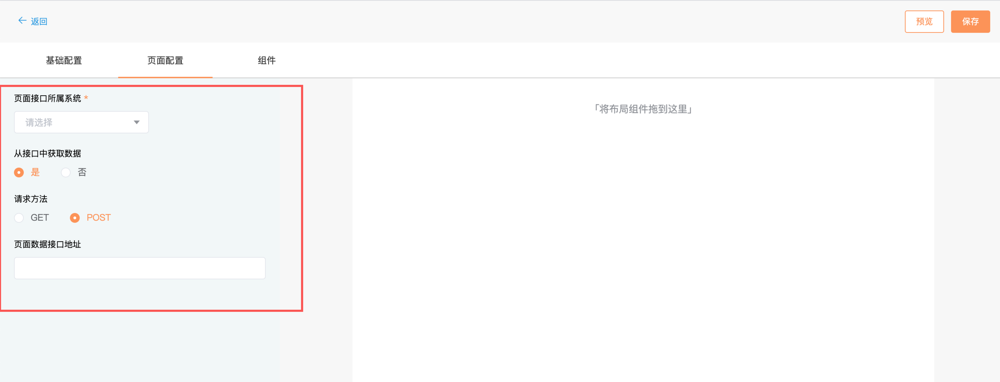

在页面配置区域配置的参数会影响到整个页面。

页面接口所属系统：它的值会影响到整个页面所有接口的域名。

在配置页面数据时你可以直接填写一个接口地址由底层程序从你填写的接口中获取页面数据，在这种情况会将接口返回的 content 字段当前页面数据。在填写接口地址时不需要填写域名，程序会根据你选择的页面接口所属系统生成接口的域名。接口地址支持查询字符串，底层程序会根据查询字符串去确定接口参数。如下：

```js
// 填写的接口地址
/basic/purchaseorder/detail?po_id=202004130000121&type&code=333
```

底层程序会将po_id，type和code 作为接口的参数，并且底层程序会优先从浏览器地址栏中取这些参数的值，如果浏览器不存在某个参数,程序就使用在接口地址中给定的值。如果浏览器地址栏的查询字符串为`?po_id=99999999&type=2`,程序在请求 /basic/purchaseorder/detail 时，传给接口的参数为：{po_id:99999999,type:2,code:333}

除了通过填写一个接口地址让底层程序帮你获取页面数据，你也可以自己设置页面数据，自己设置页面数据会更加灵活。自己设置页面数据时，你只需要写函数体，并且必填有一个返回值。在函数体中能够使用的参数是 pageVm,pageVm 是详情页对应的 Vue 实例。

同步获取页面数据，会将返回值当做页面数据,如下：

```js
return {
  order_id:12222,
  time:'2019-5-3',
  ...
}
```

new 一个 promise 获取页面数据，会将 promise resolve 的值当前页面数据，如下：

```js
return new Promise(resolve => {
  resolve(
     {
      order_id:12222,
      time:'2019-5-3',
      ...
    }
  )
})
```

调用接口获得页面数据，如下：

```js
return pageVm.$fetch(url,param).then(res => {
  // 将这里的 res.content 当前页面数据
  return res.content
})
```

> 自己设置页面数据是非常灵活的，你甚至可以将多个接口的返回值进行合并生成页面数据

## 组件配置

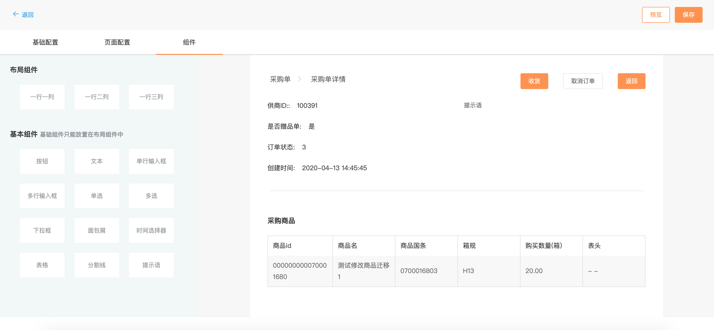

> 在拖动布局组件和基本组件到右侧的展示区域之前你可能需要仔细分析一下你要配置的页面的布局。

### 配置行


将鼠标移动到某一`行`，点击相应的句柄，可以移动`行`的位置，在该`行`下复制出一`行`以及设置这`行`的上下左右边距

### 配置列


将鼠标移动到某一`列`，点击相应的句柄，可以设置这`列`组件的对齐方式和排列方向。默认情况，`列`中的组件纵向排列，向左对齐。

### 配置基础组件


将鼠标移动到某一基础组件上，单击空白区域可以配置这个组件的属性，点击句柄可以复制/删除组件，还能将这个组件拖动到另外的位置

#### 配置按钮组件的属性


在配置按钮组件时，你必须为按钮设置一个名字，并且选择按钮的操作类型，可选的操作类型是：提交，重置，自定义。

提交按钮

提交按钮可能只会在表单页面中才会使用到，它的作用是将用户填写的表单数据提交到服务器。对于提交按钮而言，你还需要填写提交表单数据的接口地址，接口地址你不需要写域名，程序会根据你在页面配置中选择的接口所属系统生成接口域名。在接口地址中也支持查询字符串，底层程序将查询字符串中的参数和表单数据中的参数一同提交到服务器。如果接口地址如下：

```js
/basic/purchaseorder/update?code&id=333
```

底层程序在提交表单数据之前会在浏览器地址栏中查找 code 和 id 的值，如果找到了就将浏览器地址栏中的值作为参数的值，否则将你给定的值作为参数值，最后将 code 和 id 的值与表单数据合并的结果作为提交接口的参数。合并的结果可能如下：

```js
{
  code:111,
  id:333,
  name:'何遇',
  ....
}
```

重置按钮

重置按钮可能只会在表单数据中才会使用，它的作用是重置表单数据

自定义按钮

对于自定义按钮而言，你可以自定义这个按钮要执行的操作，所以它非常灵活。在定义按钮的操作时，你只需写函数体，在函数体中你可以使用的参数是 vm,pageVm,pageData,formData。vm 表示按钮对于的 Vue 实例， pageVm 是详情页对应的 Vue 实例，pageData 是这个页面的数据，它是从页面配置中得到的，formData 是表单数据，在某些时候 formData 你可能用不上。

自定义按钮可以执行的操作有：页面跳转，弹窗操作，调用接口等，下面是这些操作的事例：

页面跳转

```js
// navTo 方法稍后介绍
pageVm.navTo(pageVm,{
  query:{},
  param:{},
  path:'/path/to/target',
  ...
})
```

弹窗操作

```js
pageVm.$confirm('此操作将永久删除数据, 是否继续?', '提示', {
  confirmButtonText: '确定',
  cancelButtonText: '取消',
  type: 'warning'
}).then(() => {
  const url = pageVm.$getFullUrl('PSI','/xxx/xxx/xxx')
  pageVm.$post(url,{
    id:pageData.id
  }).then(() => {
    // 删除之后返回上级页面
    pageVm.$router.back()
  })
}).catch(() => {
  pageVm.$message.info('已取消删除');          
});
```

调用接口

```js
 const url = pageVm.$getFullUrl('PSI','/xxx/xxx/xxx')
  pageVm.$post(url,{
    code:pageVm.$route.query.code
  }).then(() => {
    pageVm.$message.success('操作成功');
    // 更新页面数据
    pageVm.updatePage()
  })
```

#### 配置文本组件的属性

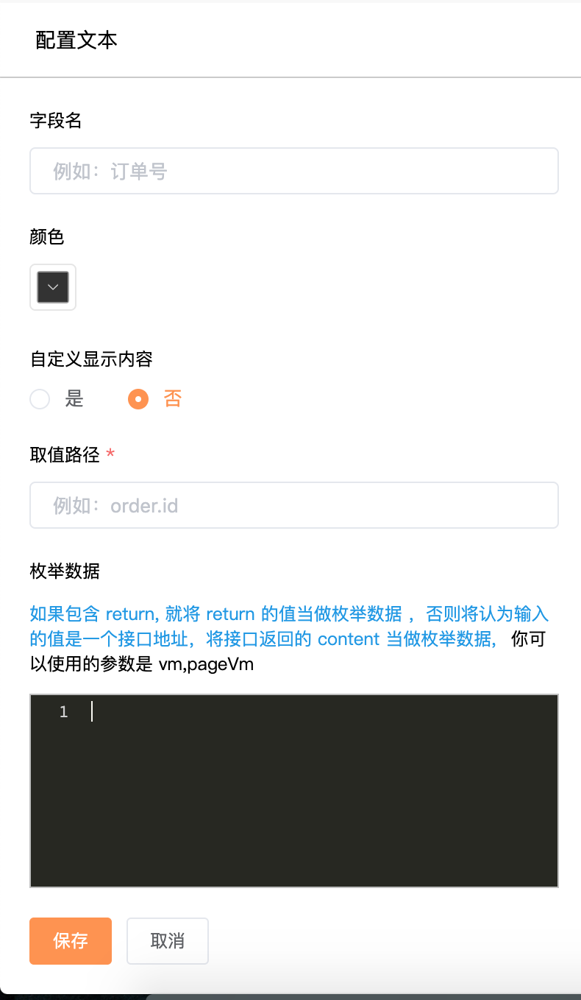

在配置文本组件时，你可以填写一个取值路径，让底层程序在页面数据中根据取值路径去取这个文本应该显示的内容，除此之外你还能自定义文本组件的显示内容，这对于单个文本组件显示多个字段组合值非常有用。

##### 非自定义显示内容

在这种情况，取值路径是必填，底层程序在页面数据中根据取值路径去取这个文本应该显示的内容，所以你需要清楚页面数据的嵌套层级。取值路径还支持在路径后面增加过滤器，这里的过滤器和[Vue 中的过滤器](https://cn.vuejs.org/v2/guide/filters.html)是同一个概念

```js
// 简单的取值路径

user.name // 取页面数据中 user 字段中的 name 字段

// 在路径后面加上过滤器

create_at|formatDate('datetime') // 取页面数据中 create_at 字段 并且将 create_at 字段的值转成 年-月-日 时:分:秒
create_at|formatDate('date') // 取页面数据中 create_at 字段 并且将 create_at 字段的值转成 年-月-日
create_at|formatDate  // 取页面数据中 create_at 字段 并且将 create_at 字段的值转成 年-月-日 时:分
```

枚举数据

在从页面数据中取值之后，可能只能取到某个标识符，但是在界面上需要展示这个标识符对应的含义，这个枚举数据会非常有用，枚举数据必须是字典。如果在配置枚举数据时没有包含返回值，程序会将你填写的值当做接口地址，在写接口地址时不需要写域名，可以在路径后面拼接查询字符串，如下：

```js
/basic/vender/get_delivery_type?code=22&id
```

程序会发 get 请求并且将 code 和 id 当做接口的参数，程序会优先从浏览器地址栏中查找参数值，程序会将接口返回的 content 字段当做枚举数据

配置枚举数据时包含了返回值,你可以返回一个具体值，也能返回一个 promise ，这种情况会更加灵活。在这种时候你只需写函数体，并且你能够使用的参数是 vm,pageVm,vm 是文本组件对应的 Vue 实例,pageVm 是页面对应的 Vue 实例,如下

```js
// 将返回值当做枚举数据
return {
  0:'待发布',
  1:'已发布',
  2:'已删除'
}
```

```js
// 将 resolve 中的参数当前枚举数据
return new Promise(resolve => {
  resolve({
      0:'待发布',
      1:'已发布',
      2:'已删除'
  })
})
```

```js
const url = pageVm.$getFullUrl('PSI','/basic/vender/get_delivery_type')
// 将 res.content.delivery_type 作为枚举数据，它必须是字典
pageVm.$fetch(url,{}).then(res => {
  return res.content.delivery_type
})
```

##### 自定义文本的显示内容

自定义文本的显示内容对于单个文本组件显示多个字段组合值非常有用。在这种情况你需要自己写渲染函数，在此之前你需要对 [Vue 的渲染函数](https://cn.vuejs.org/v2/guide/render-function.html)有所了解。定义文本组件只需要写函数体，并且必须有一个返回值，在函数体中你可以使用的参数有 h,vm,pageVm,pageData, h 是 Vue 提供的 createElement 方法，vm 是文本组件的 Vue 实例，pageVm 是页面对应的 Vue 实例，pageData 是页面数据。例子如下：

```js
const text = pageData.name + ':' + pageData.phone + ' ' + pageData.address
return h('span',text)
```

#### 配置分割线组件


分割线的配置比较简单，只能够配置上下左右边距

#### 配置提示语组件

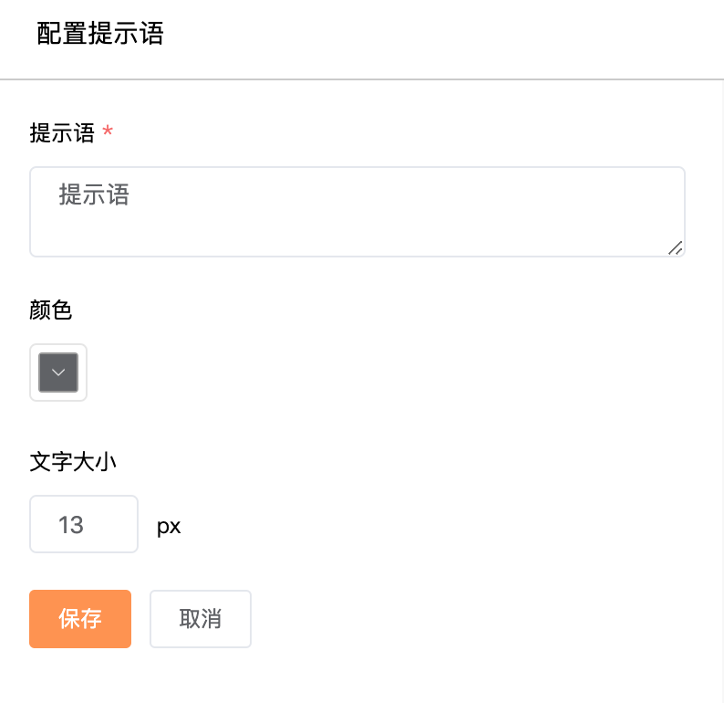

提示语组件用于在界面上显示固定的文字，可以配置文字的大小，颜色，内容

#### 配置面包屑组件

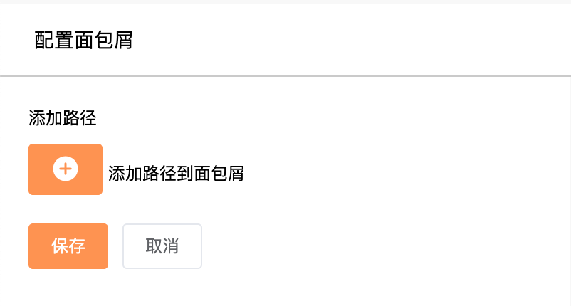

点击整个面包屑组件可以向面包屑添加任意多个面包屑路径

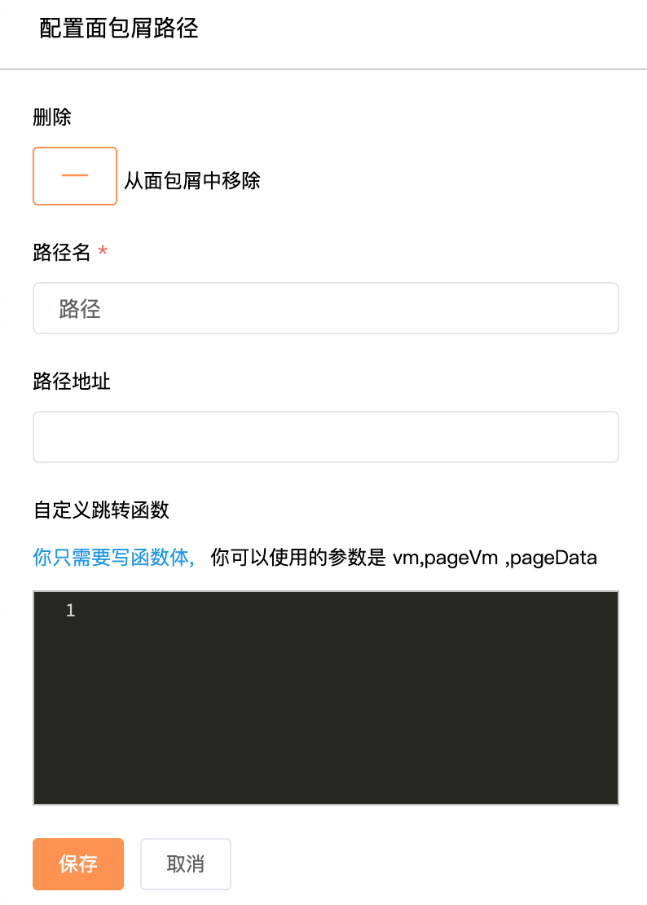

点击任何一个面包屑路径可以配置这个面包屑路径

在配置面包屑的目标跳转地址时，你可以直接在路径地址输入框中输入一个路径,它必须符合 Vue-Router 中的路径，例如：

```js
/saasfe/psi/basicinfo/supply/new?new=true&owner_id=1
```

如果要跳转到前后端分离的系统，这样配置没有问题，但是要跳转到前后端不分离的系统，这样会存在问题，这个时候就需要自定义跳转动作。在自定义跳转动作时，只需要写函数体，在函数体能够使用的参数是 vm,pageVm ,pageData，vm 是面包屑组件的 Vue 实例，pageVm 是页面对应的 Vue 实例， pageData 是页面数据，如下：

```js
// 跳转到某一路径
// 关于 navTo 方法稍后介绍
pageVm.navTo(pageVm,{
  query:{},
  param:{},
  path:'/path/to/target',
  ...
})
```

```js
// 后退
pageVm.$router.back()
```

#### 配置表格

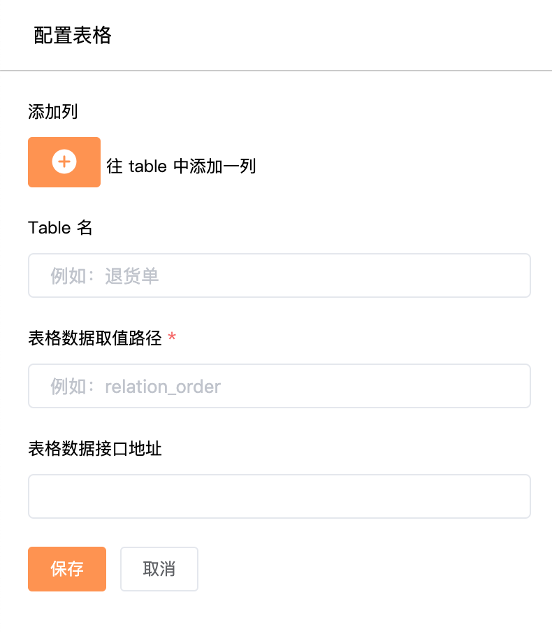

可以给 table 添加任意数量的列，也能给 table 设置一个名称。

如果设置了表格数据接口地址，就从接口返回值的 content 中取值，如果没有设置表格数据接口地址，就从页面数据中取值，***要确保通过取值路径得到的值是个数组***

表格数据接口地址

如果表格的数据需要通过一个接口单独得到，在填写接口地址时不需要设置域名，除了写路径还支持填写查询字符串，如下：

```js
/basic/owner/owner_list?code=2&id
```
程序会将 code 和 id 作为接口的参数，并且程序会优先从浏览器地址栏中取 code 和 id 的值。当接口返回之后程序将返回的 content 字段作为取值路径的数据源

#### 配置表格列

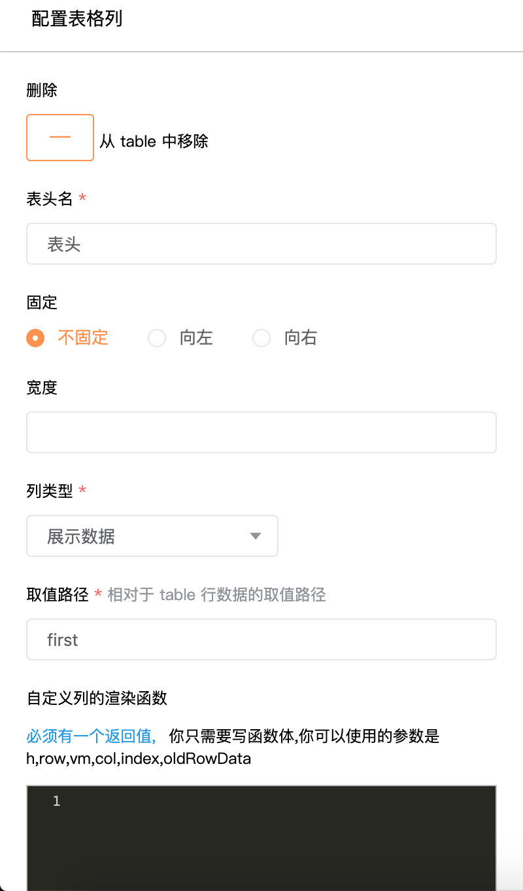

在这里重点介绍一下 table 列的渲染函数。默认情况，程序会根据取值路径从 table 数据中每一条中去取值然后将它显示在界面上。你可以通过定义列的渲染函数去改变这一默认行为，对于操作列而言，必须定义渲染函数。在确定定义渲染函数之前，需要确保你已经对[Vue 的渲染函数](https://cn.vuejs.org/v2/guide/render-function.html)有所了解

在自定义渲染函数中只需要写函数体，并且必须有一个返回值，在函数体中能够使用的参数是 h,row,vm,col,index,oldRowData。h 是  Vue 的 createElement 方法，row 是 table 的行数据，vm 是列表页对应的 vue 组件实例，col 是列数据，index 是列的下标，oldRowData 是 table 的行数据 ，在可编辑 table 中，oldRowData 在取消编辑时会非常有用，你需要借助 oldRowData 将 table 中展示数据恢复成编辑之前的状态，实例代码如下：


```js
const btnGroup = []
// 设置一个删除按钮
btnGroup.push(
  h('dm-button',{
    props:{type:'text'},
    on:{
      click:(event) => {
        // 得到完整的接口地址
        const fullUrl = vm.$getFullUrl('PSI','/xx/xxx/xxx')
        
        vm.$post(fullUrl,{
          id:row.id
        }).then(() => {
          vm.$message.success('删除成功')
          
          // 刷新页面
          vm.updatePage()
        })
        
      }
    }
  },'删除')
)

// 设置跳转按钮

btnGroup.push(
  h('dm-button',{
    props:{type:'text'},
    on:{
      click:(event) => {
        // 稍后介绍 vm.navTo 方法
        vm.navTo(vm,{
          ...,
          query:{
            id:row.id
          },
          param:{}
        })
      }
    }
  },'查看详情')
)

return h('div',btnGroup)
```

> 下面介绍表单组件的配置

#### 配置单行输入框

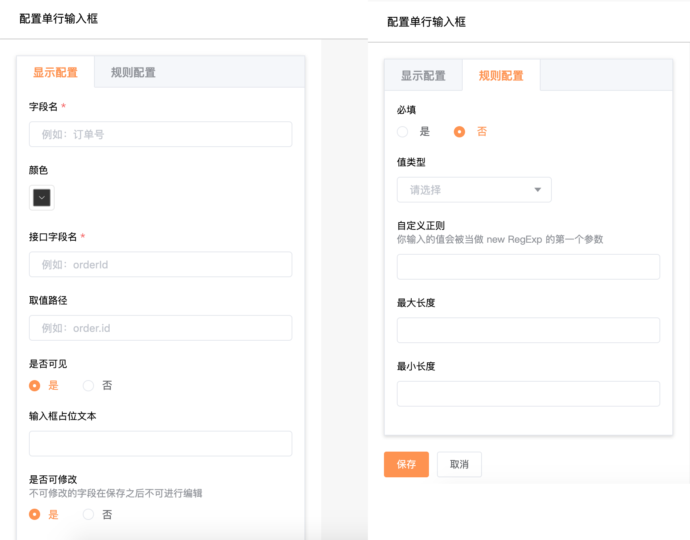

单行输入框作为表单类组件，它有两部分配置，分别是显示配置和规则配置

##### 显示配置

接口字段名是必填的，接口字段名决定了在提交表单时输入框的值保存到哪个参数中。如下：

```js
age // 输入框的值保存到 age 中
user.name // 输入框的值保存到 user 对象中 name 字段中 
```

取值路径

在表单编辑页或者一进入页面就需要在输入框显示默认值的表单页，取值路径会非常有用。程序会从页面数据中根据取值路径去取输入框默认显示值。

可以将某个单行输入框的设置为隐藏状态，这个在界面上就不会显示这个输入框，但是在提交表单数据时，会将这个输入框的值提交到服务器。

如果将某个单行输入框设置为不可修改，那么在新增完成之后编辑表单数据时，这个输入框的值不可修改。在浏览器地址栏的查询字符串设置 pageStatus = edit 程序才能判断除这个表单页是编辑状态

##### 规则配置

可以给单行输入框设置一些校验规则，如果校验不通过，程序不会提交表单输入。

#### 配置多行输入框

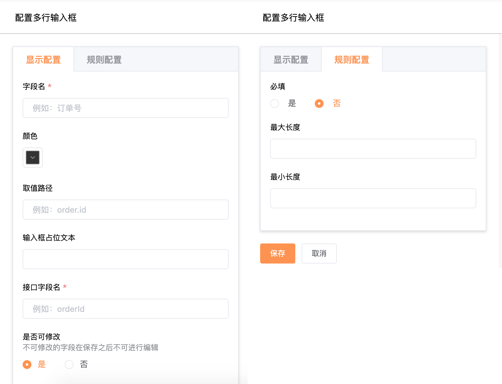

多行输入框作为表单类组件，它有两部分配置，分别是显示配置和规则配置

##### 显示配置

接口字段名是必填的，接口字段名决定了在提交表单时输入框的值保存到哪个参数中。如下：

```js
note // 输入框的值保存到 note 中
user.note // 输入框的值保存到 user 对象中 note 字段中 
```

取值路径

在表单编辑页或者一进入页面就需要在输入框显示默认值的表单页，取值路径会非常有用。程序会从页面数据中根据取值路径去取输入框默认显示值。

如果将某个多行输入框设置为不可修改，那么在新增完成之后编辑表单数据时，这个输入框的值不可修改。在浏览器地址栏的查询字符串设置 pageStatus = edit 程序才能判断除这个表单页是编辑状态

##### 规则配置

可以给多行输入框设置一些校验规则，如果校验不通过，程序不会提交表单输入。

#### 配置时间选择器

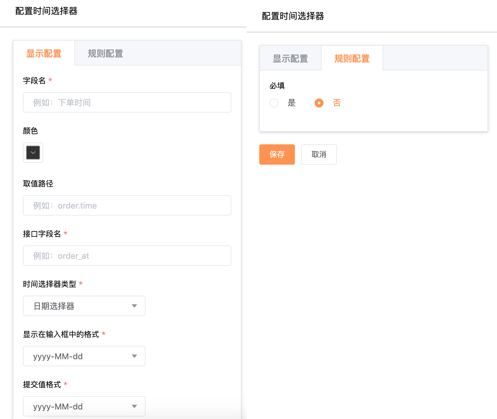

时间选择器作为表单类组件，它有两部分配置，分别是显示配置和规则配置

##### 显示配置

接口字段名是必填的，接口字段名决定了在提交表单时时间选择器的值保存到哪个参数中。如下：

```js
time // 输入框的值保存到 time 中
order.time // 输入框的值保存到 order 对象中 time 字段中 
```

取值路径

在表单编辑页或者一进入页面就需要在时间选择器显示默认值的表单页，取值路径会非常有用。程序会从页面数据中根据取值路径去取时间选择器的默认显示值。

如果将某个时间选择器设置为不可修改，那么在新增完成之后编辑表单数据时，这个时间选择器的值不可修改。在浏览器地址栏的查询字符串设置 pageStatus = edit 程序才能判断除这个表单页是编辑状态

##### 规则配置

可以给时间选择器设置一些校验规则，如果校验不通过，程序不会提交表单输入。

#### 配置单选/多选/下拉框

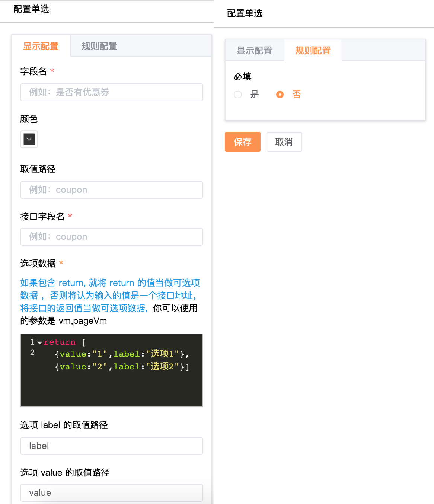

单选/多选/下拉框作为表单类组件，它有两部分配置，分别是显示配置和规则配置

##### 显示配置

接口字段名是必填的，接口字段名决定了在提交表单时单选/多选/下拉框的值保存到哪个参数中。如下：

```js
time // 输入框的值保存到 time 中
order.time // 输入框的值保存到 order 对象中 time 字段中 
```

取值路径

在表单编辑页或者一进入页面单选/多选/下拉框就默认需要选中一个值的表单页，取值路径会非常有用。程序会从页面数据中根据取值路径去取单选/多选/下拉框的默认显示值。

如果将某个单选/多选/下拉框设置为不可修改，那么在新增完成之后编辑表单数据时，这个单选/多选/下拉框的值不可修改。在浏览器地址栏的查询字符串设置 pageStatus = edit 程序才能判断除这个表单页是编辑状态

选项数据

对于单选/多选/下拉框而言，必须配置选项数据，选项数据可以是数组也可以是字典。

如果在配置选项数据时没有返回值，程序会将你填写的值当做接口地址，在写接口地址时不需要写域名，可以在路径后面拼接查询字符串，如下：

```js
/basic/vender/get_delivery_type?code=22&id
```

程序会发 get 请求并且将 code 和 id 当做接口的参数，程序会优先从浏览器地址栏中查找参数值，程序会将接口返回的 content 字段当做选项数据

配置选项数据时有返回值,你可以返回一个具体值，也能返回一个 promise ，这种情况会更加灵活。在这种时候你只需写函数体，并且你能够使用的参数是 vm,pageVm,vm 是单选/多选/下拉框组件对应的 Vue 实例,pageVm 是页面对应的 Vue 实例,如下

```js
// 将返回值当做选项数据
return {
  0:'待发布',
  1:'已发布',
  2:'已删除'
}
```

```js
// 将 resolve 中的参数当选项数据
return new Promise(resolve => {
  resolve({
      0:'待发布',
      1:'已发布',
      2:'已删除'
  })
})
```

```js
const url = pageVm.$getFullUrl('PSI','/basic/vender/get_delivery_type')
// 将 res.content.delivery_type 作为选项数据，它可以是字典也可以是数组
pageVm.$fetch(url,{}).then(res => {
  return res.content.delivery_type
})
```

如果选项数据是数组，就需要指定选项的 value 和 label 的取值路径，如果是字典就不需要指定

##### 规则配置

可以给单选/多选/下拉框设置一些校验规则，如果校验不通过，程序不会提交表单输入。

# pageVm 支持的方法

* pageVm.navTo

通过 pageVm.navTo 实现页面之间的跳转，pageVm.navTo 接受两个参数，第一个参数是 pageVm,第二个参数是一个表示跳转位置的对象。第二个参数的属性如下：

|属性名|描述|必填|类型|
|----|----|----|----|
|belong|目标页所属系统。关于这个字段的具体取值，可以参考 `/account/menu/get` 接口返回的 list 字段中目标页的 belong 字段|否|字符串|
|is_local|关于这个字段的具体取值，可以参考 `/account/menu/get` 接口返回的 list 字段中目标页的 is_local 字段|否|布尔值|
|path|目标页的路径，关于这个字段的具体取值，可以参考 `/account/menu/get` 接口返回的 list 字段中目标页的 path 字段|是|字符串|
|query|目标页的查询参数|否|对象|
|param|其他参数|否|对象|

```js
pageVm.navTo(vm,{
  belong:'MIS',
  path:'/order/user/detail',
  query:{
    id:'xxxx'
  },
  param:{
    // 是否固定左侧菜单和顶部菜单的选中状态
    menuFixed:true,
    // 是否记住列表页 searchBox ，filterStatus，分页器的参数。如果记住参数，在返回列表的时候能够直接用记住的参数请求 table 接口
    keepQuery:true
  }
})
```

* pageVm.$fetch：get 请求的方法，它接受两个参数，第一个参数表示接口地址，第二个参数表示接口参数

```js
pageVm.$fetch(url,{
  id:'xxx',
  ...
}).then(res => {
  const content = res.content;
})
```

* pageVm.$post：post 请求的方法，它接受两个参数，第一个参数表示接口地址，第二个参数表示接口参数

```js
pageVm.$post(url,{
  id:'xxx',
  ...
}).then(res => {
  const content = res.content;
})
```

* pageVm.$del: del 请求的方法，它接受两个参数，第一个参数表示接口地址，第二个参数表示接口参数

```js
pageVm.$del(url,{
  id:'xxx',
  ...
}).then(res => {
  const content = res.content;
})
```

* pageVm.$formatDate: 将时间戳格式化成时间字符串。它接受两个参数，第一个参数表示时间戳，第二个参数表示时间字符串类型,第二个参数非必填

第二个参数的可选值

|值|对应的时间字符串类型|
|----|----|
|datetime|year - month - date  hour : minute : second|
|date|year - month - date|

* pageVm.$loading：显示 loading 效果。具体使用见 [element-ui 的 Loading](https://element.eleme.cn/#/zh-CN/component/loading)

```js
const loading = pageVm.$loading({
    lock: true,
    text: 'Loading',
    spinner: 'el-icon-loading',
    background: 'rgba(0, 0, 0, 0.7)'
})
setTimeout(() => {
// 关闭 loading
loading.close()
},1000)
```

* pageVm.$message：消息提示。具体使用见 [element-ui 的 message](https://element.eleme.cn/#/zh-CN/component/message)

```js
pageVm.$message.success('恭喜你，这是一条成功消息')
pageVm.$message.error('这是一条错误消息')
pageVm.$message.warning('警告哦，这是一条警告消息')
```

* pageVm.$alert: 消息提示。具体使用见 [element-ui 的 MessageBox 弹窗](https://element.eleme.cn/#/zh-CN/component/message-box)

```js
pageVm.$alert('这是一段内容', '标题名称', {
  confirmButtonText: '确定',
  callback: action => {
    pageVm.$message({
      type: 'info',
      message: `action: ${ action }`
    });
  }
});
```

* pageVm.$confirm:确认消息。具体使用见 [element-ui 的 MessageBox 弹窗](https://element.eleme.cn/#/zh-CN/component/message-box)

```js
pageVm.$confirm('此操作将永久删除该文件, 是否继续?', '提示', {
  confirmButtonText: '确定',
  cancelButtonText: '取消',
  type: 'warning'
}).then(() => {
  pageVm.$message.success('删除成功!')
}).catch(() => {
  pageVm.$message('已取消删除')        
});
```

* pageVm.$prompt：提交信息。具体使用见 [element-ui 的 MessageBox 弹窗](https://element.eleme.cn/#/zh-CN/component/message-box)

```js
    pageVm.$prompt('请输入邮箱', '提示', {
      confirmButtonText: '确定',
      cancelButtonText: '取消',
      inputPattern: /[\w!#$%&'*+/=?^_`{|}~-]+(?:\.[\w!#$%&'*+/=?^_`{|}~-]+)*@(?:[\w](?:[\w-]*[\w])?\.)+[\w](?:[\w-]*[\w])?/,
      inputErrorMessage: '邮箱格式不正确'
    }).then(({ value }) => {
      pageVm.$message({
        type: 'success',
        message: '你的邮箱是: ' + value
      });
    }).catch(() => {
      pageVm.$message({
        type: 'info',
        message: '取消输入'
      });       
    });
```

* pageVm.updatePage:刷新页面。无参数

```js
pageVm.updatePage()
```

