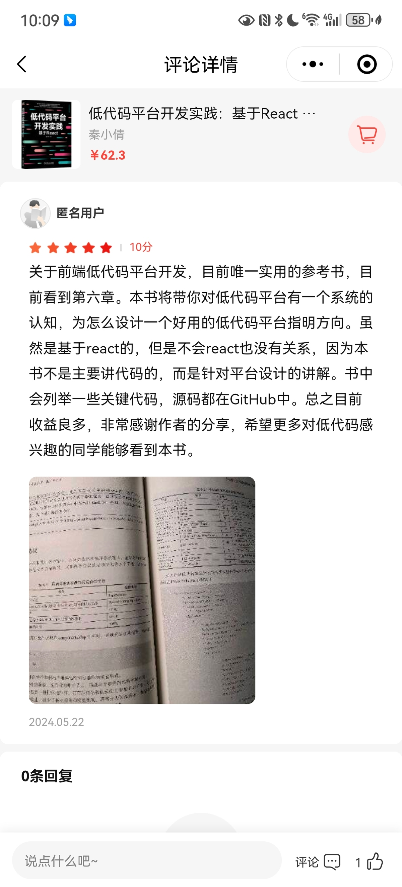

# 回顾 2024，展望 2025

今天是 2024 年 12 月 31 日，我在乌镇回顾 2024，展望 2025，去年没有回顾 2023，因为 2023 年我和我爸打了一架，要回顾就只是一通抱怨，现在想起当时只觉得搞笑。

相较于去年，今年的我在自我价值感上有了很大的提升，以前我对自我价值的判断来源于收入。2023 年被公司裁员后很担心别人觉得我没用，今年 12 月下旬又被新公司裁了，此时不但没觉得自己没用，反而觉得 2025 年有许多事情可以做。

怎么变化的？

答案是经历了一次情绪低谷，还有近 6 个月的独处，在低谷中解剖自己，搞清楚自己厌恶什么相信什么！。

今年我的第一本纸质书出版了。

发行一个月后，出版社编辑联系我说：两网销售惨淡，卖了不到 20 本。由于情绪不好，之后的时间我对销量没有任何关注。12 月初，出版社编辑又联系说：这本书比我们预期卖得要好，现在调拨马上就要 2000 册了。我开心了！

在电商平台看到了这样一条评价：

还有读者在微信上说：

除了好评，在微信读书上还有这样的评价:

书中大概有 22% 的内容介绍 react、mobx、mongodb 。面对这样的评价我开始反思自己当时对读者群体的判断。一个朋友说：按需取用。

写这本书源于出版社编辑的邀请，最终答应出书是为了提高自己的专业能力——通过输出逼自己输入。当得知自己写的内容对读者有用时，我获得了满足。

展望 2025

1. 年后找一个从来没有去过的城市，在那儿生活 1 个月。

今年海涛自驾游长达6个月，我呢？一个人生活在杭州，在此期间我发觉独处时更能深入思考问题，独处也让我感到自在，于是我提议以后的每一年我们都能有 1 个月独处的时间。

2. 读 《思考快与慢》和《模糊性的道德》

在一次谈话中朋友向我推荐了《思考快与慢》，海涛也读过这本书。我阅读它的目的是了解自己的思考路径，找到优化它的方式。

《模糊性的道德》的作者是波伏瓦，她的《第二性》是我阅读的第一本女性主义图书，阅读期间我惊叹于她知识的渊博，“她怎么懂这么多知识”，通过《第二性》我知道了司汤达，后来读了《红与黑》、《红与白》，《阿尔芒丝》、《帕尔马修道院》、《论爱情》还有他的自传。

波伏瓦对司汤达的评价是：

司汤达爱好真实，反感神秘，人类真实的存在境况便足以让他欣喜，他是现实主义者，也是一个女性主义者，是真正爱女人的男人，爱的是女人的真实性，不是某个神秘的女性分身。通常女性主义者都是追求理性的人，追求普世皆然的平等，抽象的自由，司汤达还强调具体的幸福。

司汤达在 1822 年出版的《论爱情》中提到，应该让女人接受和男人一样的教育，应该让女人自己选择丈夫，应该让女人有工作的权利。这些都是使人幸福不可或缺的因素，他还认为女人越了解男人，建立的爱情就越真诚，双方越幸福。《论爱情》在初版后的销量非常惨淡，有个夸张的说法是这本书在出版后的 11 年间仅售出了 7 本。当出版社编辑说我的书，‘两网销售惨淡，卖了不到 20 本’时，我想到了《论爱情》，心中升起了一丝淡定。

波伏瓦是一个非常理性的女人，她的《名士风流》被视为自传体小说，小说中的安娜是波伏瓦的化身，安娜对热恋中的情人说：‘爱情并不是一切’，她还写道：但愿他理解我！但愿他对我保持这份爱，它虽然并非一切，但失去它我将不复存在。波伏瓦在访谈中曾提到：

> 只有别人对我有欲望时，我才会对他产生欲望。确切的说，总是别人的渴望让我心旌荡漾

我把这句话理解为：别人喜欢我，我才可能喜欢他。

她在给热恋情人的信里写道：

> 我渴望能见你一面
> 
> 但请你记得
> 
> 我不会开口要求见你
> 
> 这不是因为我骄傲
> 
> 你知道我在你面前
> 
> 毫无骄傲可言
> 
> 而是因为
> 
> 唯有你也想见我的时候
> 
> 我们的见面才有意义

波伏瓦让我感觉到理性的表现之一是自控。如果一个人说起理论来一套一套的，遵循某个科学的路径，只要他不能暂停，我就怀疑他当时是否处于理性的状态。

《模糊性的道德》是一本哲学书，我对这本书感兴趣是因为，波伏瓦在其中阐述了她的自由观，Chat GPT 对波伏娃的自由观总结如下：

波伏瓦强调，自由伴随着责任。她认为，自由不是为所欲为，而是对他人和世界承担责任。她特别关注如何通过自由的行使来促进他人自由，而非压制或剥夺。她在《模糊的道德》中讨论了这一伦理维度，指出人类的自由与他人的自由紧密相连，彼此依存。

在《模糊的道德》中，波伏瓦提出，一个真正自由的人必须主动采取行动，去创造条件使他人也能够实现自由。这种促进他人自由的行为，是对个体责任的体现。波伏瓦从存在主义的视角强调，自由并不是逃避责任的借口，而是需要个体面对选择、承担后果，并对集体福祉作出贡献的动力。

从图书简介中我体会到自由不是固定的状态，而是行动，自由体现上挣脱束缚的行动上。我赞同波伏瓦提到的主动采取行动，承担后果，但还做不到阐述清楚，希望《模糊性的道德》能帮助我阐述自己的观点。

2. 写《低代码平台开发进阶》网络付费小册

小册的名字是 Chat GPT 取的，我将小册的目录和写作目的发给 Chat GPT，它帮我生成了名称和简介，如下

> 《低代码平台开发进阶》是《低代码平台开发实践：基于React》一书的深度补充，旨在带领开发者深入探索低代码平台的核心技术与开发技巧。本专栏将为你解锁低代码平台的高级功能，介绍如何在 React 框架下构建高效、可扩展的低代码应用。无论你是初学者，还是已经有一定经验的开发者，这个专栏都将帮助你更好地掌握低代码平台的设计理念与实际应用。
> 
> 在本课程中，你将学到：
> 
> 深入了解低代码平台的架构与组件化开发
> 
> 如何开发和优化低代码物料，如组件、模板和插件
> 
> 探索数据注入与元数据模型在低代码中的应用
> 
> 实战演练表单联动、组件联动及复杂交互逻辑的实现
> 
> 提升低代码平台的性能与可维护性，掌握高效的代码生成与部署方法
> 
> 通过本专栏，你不仅能熟练掌握低代码开发的基础技能，还能深入理解如何在实际项目中运用低代码平台来提升开发效率，降低开发成本，满足业务需求的灵活性。
> 
> 适合对象：
> 
> 已有一定开发经验的 React 开发者
> 
> 希望深入掌握低代码开发的技术人员
> 
> 对低代码平台应用开发感兴趣的产品经理和技术负责人
> 
> 无论你是想提升开发效率，还是在低代码平台开发上寻找更多的解决方案，这个专栏都将为你提供实用的技术干货与案例分析

我在这个基础上改一改就可以用了。

未来有希望，把艰难挺过去！！！
