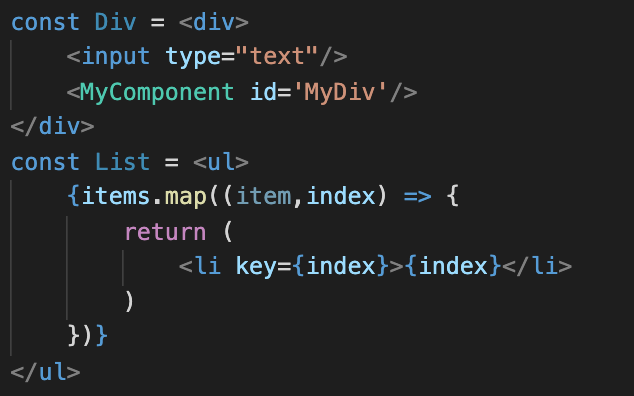
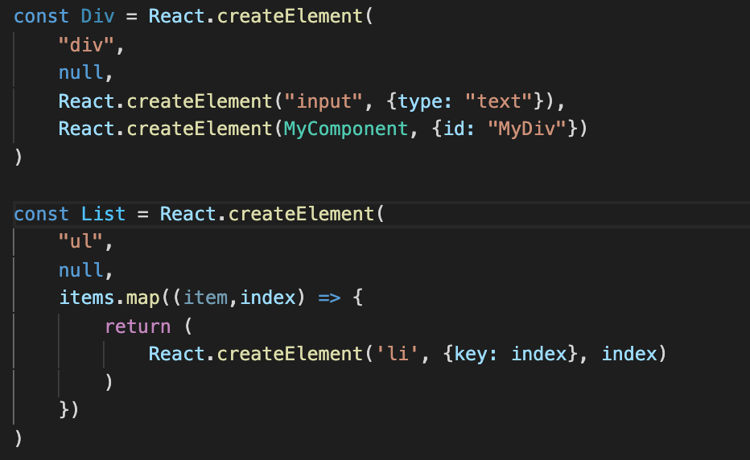

# 手把手带你实现一个 Mini React

## Babel 与 JSX

在 React 的官网中推荐使用 JSX 描述 UI，可以将 JSX 当作模版语言。但是 JSX 不是合法的 html 片段也不是合法的 Javascript 语法。在 React 官网上还提到 JSX 最终会被转化为 JS 函数调用并且在使用 JSX 的作用域中需要能够访问到 React。那么是谁将 JSX 转化成 JS 函数滴调用的呢？为什么在使用 JSX 的作用域中需要访问到 React？

@babel/plugin-transform-react-jsx 将 JSX 转化成了 JS 函数调用，它是 Babel 的一个插件，它只是遍历每个 JSX 节点并将它们转换为函数调用。



被转换成



从上图可以看出 JSX 被转换成了 React.createElement 函数调用的形式，这就是在使用 JSX 的作用域中需要能够访问到 React 的原因。@babel/plugin-transform-react-jsx 将 JSX 转换成 React.createElement 函数调用这是它的默认行为，我们通过修改它的配置来改变函数名，配置如下：

```js
module: {
        rules: [{
            test: /\.js$/,
            exclude: /node_modules/,
            use: {
                loader: 'babel-loader',
                options: {
                    plugins: [
                        ["@babel/plugin-transform-react-jsx", {
                            pragma: 'createElement'
                        }]
                    ],
                }
            }
        }]
    }
```

将 @babel/plugin-transform-react-jsx 的 pragma 参数改成 createElement，这使得 JSX 被转化为 createElement 函数调用。这时我们需要在使用 JSX 的作用域中能够访问到 createElement 函数。下面我们开始实现 createElement

## 实现 createElement

经过分析可知 createElement 的第一个参数是被创建元素的类型，它可能是字符串也可能是一个自定义组件，第二个参数是被创建的元素的属性，它可以是 null，剩余的参数是被创建的元素的子元素。createElement 的声明如下：

```javascript
function createElement(type: any, attrs: IBaseObject, ...children: []): CustomNode | ElementNode;
```

在 DOM 中有两种常见的节点，分别是元素节点和文本节点，在 Mini React 中我们除了要实现这两种浏览器内置的 DOM 节点类型之外还要实现一个自定义组件类型。

首先定义一个 Mini React 组件类型

```typescript
type MiniComponent = ElementNode | Component | TextNode
```

### 文本节点类型

文本节点的实现非常简单，它只需要文件节点对应的内容，代码如下：

```typescript
class TextNode {
    root: Text

    constructor(content: string) {
        this.root = document.createTextNode(content)
    }
}
```

### 元素节点类型

对于元素节点，我们需要根据元素类型（这里的元素类型指标签名）创建出这个类型的 Node，并且这个 Node 要有给自己设置属性的方法和添加子 Node 的方法，代码如下：

```typescript
class ElementNode {
    root: HTMLElement

    constructor(type: string) {
        this.root = document.createElement(type)
    }

    setAttribute(name: string, value: string) {
        this.root.setAttribute(name,value);
    }

    appendChild(component: MiniComponent) {
        this.root.appendChild(component.root)
    }
}
```

### 自定义组件类型

通过 createElement 的类型声明可知，自定义组件类型也有属性和子元素，但是自定义组件没有浏览器内置的 API，我们需要实现这些 API，使用过 React 的同学都知道 React 的类组件必须有 render 方法，所以在 Mini React 中也要求自定义组件必须有 render 方法，代码如下：

```typescript
abstract class Component {
    props: {[attr: string]: any}
    _root?: HTMLElement
    children: MiniComponent[]

    abstract render() : ElementNode | Component

    constructor() {
        this.props = Object.create(null)
        this.children = []
    }

    setAttribute(name: string, value: any) {
        this.props[name] = value
    }

    appendChild(component: MiniComponent) {
        this.children.push(component)
    }

    get root(): HTMLElement {
        if(!this._root) {
            this._root = this.render().root
        }
        return this._root;
    }
}
```

这里的 get root 会导致一个递归调用，一直到 render 方法返回的是一个 ElementNode 类型为止。实现了这三个类型之后，我们开始实现 createElement，在 createElement 函数内部就是根据 type 的类型创建出不同的 Node，然后调用这些 Node 的方法，代码如下：

```typescript
function createElement(type: any, attrs: {[attr: string]: any}, ...children: any[]): Component | ElementNode {
    let component: Component | ElementNode;
    if (typeof type === 'string') {
        component = new ElementNode(type)
    } else {
        component = new type()
    }

    for (const attrName in attrs) {
        component.setAttribute(attrName, attrs[attrName])
    }
    function insertChildren(children: any[]) {
        for (let child of children) {
            let childComponent: MiniComponent
            if (child === null) {
                continue;
            }
            if (typeof child === 'string') {
                childComponent = new TextNode(child)
            } else {
                childComponent = child
            }
            if (Array.isArray(child)) {
                insertChildren(child)
            } else {
                component.appendChild(childComponent)
            }
        }
    }

    insertChildren(children)
    return component
}
```

到目前为止我们已经实现了 createElement 方法，但是只有 createElement 还不够，我们还缺少将组件渲染到浏览器 DOM 树的方法，在这里将它命名为 renderDom，renderDom 参照 ReactDOM.render 的用法，它的实现很简单：

```typescript
function renderDom (compnent: Component | ElementNode, parent: HTMLElement) {
    parent.appendChild(compnent.root);
}
```

在目前为止我们已经可以将一些简单的组件显示到界面上了，但是这些组件还不能根据用户的交互而更新。在 react 中，组件的 props 或者 state 发生了变化就会触发组件的重新渲染，但是组件不能改变它的 props，它只能改变它的 state，自定义组件的 setState 方法用于去更新 state。接下来我们就开始实现 setState 方法

## 更新界面

首先我们先在 Component 抽象类中增加 state 属性，setState 方法，rerender 方法。setState 用于修改 state，rerender 使用新的 state 重新渲染组件。

```typescript
abstract class Component {
    ...
    state: {[attr: string]: any}
    constructor() {
        ...
        this.state = null;
    }
    ...
    setState(newState: {[attr: string]: any}) {
        // todo
    }
    rerender() {
        // todo
    }
}
```

### setState

我们先实现 setState，setState 只是将新的 state 与旧的 state 进行合并得到一个最终的 state。

```typescript
setState(newState: {[attr: string]: any}) {
   if(this.state === null || typeof this.state !== 'object') {
        this.state = newState;
        this.rerender()
        return ;
    }
    const merge = (oldState: {[attr: string]: any}, newState: {[attr: string]: any}) => {
        for (const key in newState) {
            if(oldState[key] !== null && typeof oldState[key] === 'object') {
                merge(oldState[key], newState[key])
            } else {
                oldState[key] = newState[key]
            }
        }
    }

    merge(this.state, newState)
    this.rerender()
}
```

### rerender

我们先回头看一下前面的代码是如何将组件渲染在界面上的，在前面我们使用了 appendChild API 将子元素添加到父元素中，但是当我们需要根据新的 state 重新渲染界面时，appendChild API 就不满足需求了，我们需要使用更精细化操作 dom 的 API，在 Mini React 中，我使用 HTML5 中的 Range API 来更新界面上的 DOM。

回到重新渲染这个话题上，在 state 发生变化之后，我们是在原来的 range 上进行增删改，所有在初始渲染上，我们需要将最开始的 range 保存下来，然后在重新渲染的时候再使用这个 range。我们要将所有使用 (node as HTMLElement).appendChild 的地方全部替换成 Range。我们首先改造 renderDom。

```typescript
function renderDom(compnent: Component | ElementNode, parent: HTMLElement) {
    const range = document.createRange()
    range.setStart(parent,0)
    range.setEnd(parent,parent.childNodes.length)
    range.deleteContents()
    compnent[RENDER_TO_DOM](range)
}
```

接下来实现上面三种组件类型的`[RENDER_TO_DOM]`方法，总的来说`[RENDER_TO_DOM]`方法就是将组件的 root 插入到 range 中，TextNode 和 ElementNode 的 `[RENDER_TO_DOM]` 是一样的，如下：

```typescript
[RENDER_TO_DOM](range: Range) {
    range.deleteContents()
    range.insertNode(this.root)
}
```

自定义组件（即：Component）的`[RENDER_TO_DOM]`与其他的两种类型的`[RENDER_TO_DOM]`有所不同，这源于 Component 的真实 DOM 树是从它的 render 方法中返回的，并且 Component.render 返回的可能依然是一个 Component 而非 ElementNode，但是 range 中只能插入真实的 DOM，在我们前面使用 appendChild 时，Component.root 实际上是 Component.render 返回值的 root，并且会触发递归调用。所以现在的`Component[RENDER_TO_DOM]`类似,  `Component[RENDER_TO_DOM]`实际上调用的是 `Component.render()[RENDER_TO_DOM]`,这里也有触发递归调用，代码如下：

```typescript
[RENDER_TO_DOM](range: Range) {
    // 将 range 保存下来，供 rerender 的时候使用
    this._range = range
    // 这里会导致一个递归调用，一直到 render 方法返回的是一个 ElementNode 类型为止
    this.render()[RENDER_TO_DOM](range)
}
```

现在三种组件类型的`[RENDER_TO_DOM]`方法已经实现了，我们还需要改造 ElementNode.appendChild 方法，因为在这个方法我们依然使用的是 (node as HTMLElement).appendChild, 我们要将它改成 Range API,如下：

```typescript
appendChild(component: Component | ElementNode | TextNode) {
    const range: Range = document.createRange()
    // 因为是在节点的最后添加子元素，所以将 range 移动到末尾
    range.setStart(this.root, this.root.childNodes.length)
    range.setEnd(this.root,this.root.childNodes.length)
    component[RENDER_TO_DOM](range)
}
```

最后实现 Component.rerender，它只是使用 _range 重新调用一次`Component[RENDER_TO_DOM]`,如下：

```typescript
rerender() {
    this._range.deleteContents()
    this[RENDER_TO_DOM](this._range)
}
```

## 创建虚拟 DOM 以及虚拟 DOM 的 diff 算法

在现在为止 Mini React 已经实现了重新渲染，但是我们一直操作的是真实 DOM 并且更新范围非常大。接下来我们要实现虚拟 DOM 并且减少更新范围。

虚拟 DOM 和 虚拟 DOM 的 diff 算法主要是为了优化重新渲染的性能，在重新渲染的时候会将新旧虚拟 DOM 进行对比，然后只将有变更的虚拟 DOM 反映到真实的 DOM 上。既然要对比新旧虚拟 DOM，那么我们就要将旧的虚拟 DOM 保存下来供重新渲染的时候使用。我们给每一个组件类型都增加 vdom 属性，vdom 用于保存虚拟 DOM。

diff 算法有很多种类型，在 Mini React 中使用的是一种非常简单的 diff 算法，它的思想如下：

1. 如果两个新旧 vNode 的 type 不同就认为它们是不同的 Node，然后 diff 算法终止
2. 如果两个文本 vNode 的内容不同就认为它们是不同的 Node，然后 diff 算法终止
3. 如果两个 vNode 的 props 中相同的属性不相同就认为它们是不同的 Node，然后 diff 算法终止
4. 如果新的 vNode.props 的数量小于旧的 vNode.props 的数量就认为它们是不同的 Node，然后 diff 算法终止
5. 如果经过前面 4 条规则之后确定两个 vNode 是一样的 Node，就遍历新旧 vNode 的子 vNode，并且使用 1-4 条中的规则去对比子 vNode

如果认为新旧 vNode 是不同的 Node，那么就销毁整个旧的 vNode 对应的 DOM 树并且使用新的 vNode 重新渲染 DOM 树

对于 TextNode 而言，它有一个 type 属性 (表示这是一个文本 vNode，type 为固定的值)，content 属性（文本 vNode 的内容），_range 属性（文本 vNode 的插入范围）,vdom 属性（返回文本 vNode 自身）还有一个 `[RENDER_TO_DOM]`方法，这个方法用于将 vNode 渲染到界面上。

```typescript
class TextNode {
    type: string;
    content: string;
    _range: Range;
    constructor(content: string) {
        this.type = '#text';
        this.content = content;
        this._range = null
    }
    get vdom(): TextNode {
        return this;
    }
    [RENDER_TO_DOM](range: Range) {
        const root = document.createTextNode(this.content)
        range.deleteContents()
        this._range = range;
        range.insertNode(root)
    }
}
```

与前面的 TextNode 相比，新的 TextNode 去掉了一些属性也新增了一些属性，需要注意的是去掉了 root 属性，这是因为我们创建的是一个 vNode，root 是一个真实的 DOM Node, 它不应该保存在 vNode 中，它只能在 vNode render to dom 的时候被创建并作为临时使用。

ElementNode 在 render to dom 之前也不能有任何关于真实 DOM 的操作，所以我们要修改 ElementNode.setAttribute 和 ElementNode.appendChild，我们要把真实的 DOM 操作放在 `[RENDER_TO_DOM]`中。简化代码如下：

```typescript
class ElementNode {
    ... dosomething
    setAttribute(name: string,value: any) {
        this.props[name] = value
    }
    appendChild(component: Component | ElementNode | TextNode) {
        this.children.push(component)
    }
    [RENDER_TO_DOM](range: Range) {
        const root = document.createElement(this.type);
        range.deleteContents()
        for (const name in this.props) {
            const value = this.props[name]
            ... dosomething
            root.setAttribute(name,value);
        }
        if (!this.vChildren) {
            this.vChildren = this.children.map(child => child.vdom);
        }
        for (const child of this.vChildren) {
            const childRange = document.createRange()
            childRange.setStart(root, root.childNodes.length)
            childRange.setEnd(root, root.childNodes.length)
            child[RENDER_TO_DOM](childRange)
        }
        this._range = range;
        range.insertNode(root)
    }
}
```

我们将 setAttribute 和 appendChild 修改成只是往 vNode 上增加属性，在`[RENDER_TO_DOM]`中才操作真实的 DOM。现在我将 ElementNode 和 TextNode 改造的差不多了，接下来轮到改造 Component 了。回到 vdom 这个属性上，vdom 保存是虚拟 DOM (即：vNode)，对于 ElementNode 和 TextNode 而言它的 vdom 是它的实例本身，但是 Component.vdom 不再是 Component 的实例本身了，Component.vdom 等于 Component.render().vdom，这是因为Component 中与渲染结果相关的是从 render 方法中返回的对象。在前面我们提到需要将旧的 vNode 保存下来，在这里我将它保存到 _vdom 中。

```typescript
class Component {
    ... do something
    get vdom(): ElementNode {
        // 这里会触发递归调用，一直到 render 返回是非 Component 结束
        return this.render().vdom
    }
    [RENDER_TO_DOM](range: Range) {
        this._range = range
        // 将本次用于渲染的 vNode 保存下来
        this._vdom = this.vdom;
        this._vdom[RENDER_TO_DOM](range)
    }
}
```

在前面为了实现用户界面更新我们定义了 rerender 方法，但是这个方法的弊端是：不管怎么修改 Component.state 的值，当重新渲染的时候 Component.range 对应的整个 DOM 树都会摧毁重建。我们现在要做的是利用 diff 算法对比新旧 vNode 的变更，减少真实 DOM 的更新范围。现在给 Component 增加一个 update 方法，这个方法用于对比新旧 vNode，然后调用新的`vNode[RENDER_TO_DOM]`去更新界面，代码如下：

```typescript
class Component {
    ... do something
    update() {
        // 利用前面提到的 diff 算法规则比较两个 vNode 是否是相同的
        function isSameNode(oldNode: TextNode | ElementNode, newNode: TextNode | ElementNode): boolean {
            ... dosomething
        }
        const update = (oldNode: TextNode | ElementNode, newNode: TextNode | ElementNode) => {
            if (!isSameNode(oldNode, newNode)) {
                // 如果不是相同的 vNode，则重建整个新 vNode 对应的 DOM 树
                newNode[RENDER_TO_DOM](oldNode._range)
                return;
            }
            newNode._range = oldNode._range

            ... dosomething

            // 得到子 vNode
            const newChildren = newNode.vChildren;
            const oldChildren = oldNode.vChildren;

            // 最后一个 node 所在的 range
            let tailRange = oldChildren[oldChildren.length - 1]._range

            for (let i = 0; i < newChildren.length; i++) {
                let newChild = newChildren[i];
                let oldChild = oldChildren[i];

                if (i < oldChildren.length) {
                    update(oldChild, newChild)
                }

                // 如果 newChildren 的长度大于 oldChildren 的长度，将新的 node 插入到末尾
                else {
                    let range = document.createRange()
                    // 将 range 移动到末尾
                    range.setStart(tailRange.endContainer, tailRange.endOffset);
                    range.setEnd(tailRange.endContainer, tailRange.endOffset);

                    newChild[RENDER_TO_DOM](range)
                    tailRange = range;
                }
            }
        }
        const vdom = this.vdom;
        update(this._vdom,vdom);
        // 保存本次更新的 vdom
        this._vdom = vdom;
    }
}
```

现在删除 rerender 方法，并且将 setState 方法中调用 rerender 的地方改成调用 update。现在 ini React 可以支持局部更新了。

## Mini React 运行流程图

## 在 Preact 中虚拟 DOM 算法流程图
