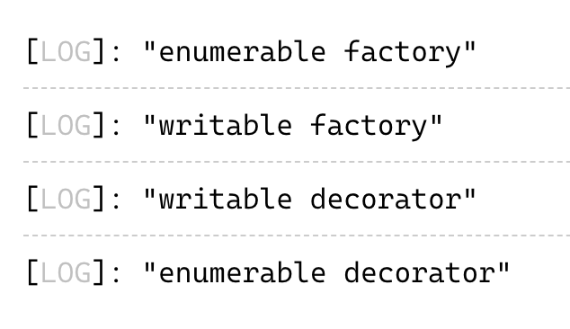

# Typescript 装饰器

在 JavaScript 中，装饰器特性还没有正式发布，目前处于 Stage 2；在 TypeScript 中，装饰器是一个实验特性，如果要启用对装饰器的支持，那么必须将experimentalDecorators 配置项设置为 true。使用装饰器能在不修改类的基本功能的情况下，给类或者类的方法添加一些附加行为。

## 装饰器的基本语法

装饰器是函数，可以用来装饰类、类的方法、访问器、属性和方法的参数，语法为：@expression，这里的 expression 必须是函数，该函数在程序初始化时被调用，在函数内部改写被装饰的目标或添加附加功能。同一个目标能用多个装饰器去装饰，在写法上能将它们分行相互重叠放置，也能将它们在同一行并排放置。示例代码如下：

```
// 相互重叠放置
@decoratorA
@decoratorB
target

// 并排放置
@decoratorA @decoratorB target
```

上面的两种写法，装饰器的调用顺序是一样的，为：decoratorA(decoratorB(target))。用多个装饰器装饰类的数据属性，代码如下：

```typescript
function NonWritable<T>(target: T, propertyKey: keyof T) {
    console.log('NonWritable')

    Object.defineProperty(target, propertyKey, {
        writable: false
    });
}

function NonEnumerable<T>(target: T, propertyKey: keyof T) {
    console.log('NonEnumerable')

    Object.defineProperty(target, propertyKey, {
        enumerable: false
    });
}

class User {
    @NonEnumerable
    @NonWritable
    name?: string
}
```

上述代码在 name 属性上应用了两个装饰器，分别是 NonWritable 和 NonEnumerable，NonWritable 先被调用，NonEnumerable 后被调用。

在这里引入一个与装饰器相关的概念，即：装饰器工厂。装饰器工厂是一个返回装饰器的函数，调用语法是：@decoFactory(...args)。在项目开发中，装饰器工厂比装饰器函数用得更多，因为可以给它传自定义参数，重用性更强。接下来用装饰器工厂改写前面举例的装饰器，结果如下：

```typescript
function writable(bool: boolean) {
    console.log('writable factory')
    return function <T>(target: T, propertyKey: keyof T) {
        console.log('writable decorator')

        Object.defineProperty(target, propertyKey, {
            writable: bool
        });
    }
}

function enumerable(bool: boolean) {
    console.log('enumerable factory')
    return function <T>(target: T, propertyKey: keyof T) {
        console.log('enumerable decorator')

        Object.defineProperty(target, propertyKey, {
            enumerable: bool
        });
    }
}

class User {
    @enumerable(false)
    @writable(false)
    name?: string
}
```

在 [TS Playground](https://www.typescriptlang.org/play?#code/Q) 中运行上述代码，得到的结果如下：



## 类装饰器

类装饰器作用于类，用于修改或者替换类的定义，构造函数是它接受的唯一参数，类装饰器可以没有返回值，如果有，那么它必须是构造函数，原始的构造函数会被替换成返回的构造函数，用法如下：

```typescript
type Ctor = new (...args: any[]) => Object;

function withLog<T extends Ctor>(ctor: T){
    // 返回一个继承自原始类的新类
    return class extends ctor {
        log() {
            console.log('Reported')
        }
    }
}

@withLog
class User {
    name?: string
}

const user= new User();
// 装饰器修改了类的实现，但不会改成类的类型
(user as any).log()
```

当将 @withLog 放在User类上时，withLog 的泛型类型参数 T 等同于 typeof User 。

## 方法装饰器

方法装饰器作用于类的静态方法和实例方法，使用它可以修改或者替换方法的定义，接受如下三个参数：

1. 如果方法装饰器装饰的目标是静态方法，那么第一个参数为静态成员的类（或者称为构造函数）；如果方法装饰器装饰的目标是实例方法，那么第一个参数是类（或者称为构造函数）的原型。
2. 方法名
3. 方法的属性描述符。如果TS的编译目标小于 ES5，那么第三个参数为undefined。

方法装饰器可以没有返回值，如果有，那么它必须是访问描述符，原始的构造函数会被替换成返回的访问描述符。方法装饰器用法如下：

```typescript
function readonly<T>(target: T, name: string, descriptor: PropertyDescriptor){
    descriptor.writable = false
}

function vPrefix(target: typeof User, name: string, descriptor: PropertyDescriptor) {
    return {
        ...descriptor,
        value: () => {
            return `v${descriptor.value()}`
        }
    }
}

class User {
    @vPrefix
    static getVersion() {
        return '1.0.0'
    }

    @readonly
    printName() {
        return 'default name'
    }
}
```

上述代码，装饰器 readonly 作用于User的实例方法，那么 readonly 的第一个参数为 User.prototype；装饰器 vPrefix 作用于 User 的静态方法，那么 VPrefix 的第一个参数为 User。

## 访问器装饰器

访问器装饰器作用于类的静态访问器和实例访问器，可以用来修改或者替换访问器的定义，它接受的参数与方法装饰器的参数一样。访问器有 getter/setter，理论上来讲，可以给访问器的 getter 和 setter 分别提供装饰器，但是不鼓励这么做，推荐给 getter/setter 其中一个提供装饰器，然后在装饰器返回的属性描述符中定义 get 和 set。用法如下：

```typescript
function toUpperCase<T>(target: T, name: string, descriptor: PropertyDescriptor) {
    return {
        ...descriptor,
        get: function(): string{
	    // 如果装饰器作用于静态访问器上，this 指向类；如果作用在实例访问器上，this指类的实例
            const val: string = descriptor!.get!.call(this)
            return val.toUpperCase()
        },

        set: function(val: string) {
	     // todo someThing
            descriptor!.set!.call(this, val)
        }
    }
}

class User {
    firstName: string = 'bella'
    lastName: string = 'Q'

    @toUpperCase
    get fullName() {
        return this.firstName + ' ' + this.lastName
    }

    set fullName(fullName: string) {
        const [firstName, lastName] = fullName.split(' ')
        this.firstName = firstName
        this.lastName = lastName
    }
}

const user = new User()
console.log(user.fullName)
```

## 属性装饰器

属性装饰器作用于类的静态属性和实例属性，只接受两个参数，第一个参数与方法装饰器的第一个参数一样，第二个参数是属性名。它没有返回值。

装饰器函数在类定义之后就会执行，此时实例还没有创建，因此实例不可能作为装饰器函数的参数。当属性装饰器作用于实例属性时，装饰器函数的第一个参数是类的原型，如此以来，就不能在属性装饰器中修改实例属性的属性描述符，如果一定要将属性装饰器作用于实例属性上，那么需要采用曲线救国的方式，下面是一个简单的示例。

```typescript
function toUpper(target: any, key: string) {
   target.__cache__  = {}
   const cache: { [attr: string]: string } = {}
   const desc: PropertyDescriptor = {
       enumerable: true,
       configurable: true,
       get() {
           return cache[key]?.toUpperCase()
       },
       set(val: string) {
            cache[key] = val
       }
   }
   Object.defineProperty(target.__cache__, key, desc)
}

class Base {
    __cache__: { [attr: string]: string } = {}
}

class User extends Base {
    @toUpper
    private name?: string;

    constructor(name: string) {
        super()
        this.setName(name)
    }
    getName() {
        return Object.getPrototypeOf(this).__cache__['name']
    }
    setName(val: string){
        Object.getPrototypeOf(this).__cache__['name'] = val
    }
}
```

静态属性位于类上，在类定义好之后，静态属性就确定了，所以属性装饰器可以直接修改静态属性的属性描述符，下面是一个演示属性装饰器作用于静态属性的示例。

```typescript
function toUpper(target: any, key: string) {
   const cache: {[key: string]: any} = {}
   const desc = Object.getOwnPropertyDescriptor(target, key)
   cache[key] = desc?.value

   Object.defineProperty(target, key, {
       enumerable: true,
       configurable: true,
       get() {
         const value = cache[key]
         return typeof value === 'string' ? value.toUpperCase() : value
       },
       set(value: any) {
        cache[key] = value
       }
   })

   return target
}

class User {
    @toUpper
    static version: string = 'v2.3.4'
}
```

当属性装饰器作用在静态属性上时，装饰器函数的第一个参数是静态成员的类，静态属性直接位于类上，所以可以用 Object.getOwnPropertyDescriptor 得到静态属性的访问描述符，也能用 Object.defineProperty 修改静态属性的访问描述符。

## 参数装饰器

参数装饰器作用于构造函数和方法的参数上，参数装饰器接受3个参数，它的前两个参数与方法装饰器的前两个参数一样，第3个参数表示参数的索引序号，参数装饰器的返回值会被忽略。下面是一个使用参数装饰器的示例：

```typescript
function toNumber(target: any, name: string, index: number) {
    Reflect.defineMetadata(name+'_toNumber', true, target)
}

class User {
    age: number | string
    constructor(@toNumber age: number | string) {
        this.age = age
    }

    getAge() {
        const toNumber = Reflect.getMetadata('undefined_toNumber', User)
        if (toNumber && typeof this.age === 'string') {
            return Number(this.age)
        } else {
            return this.age
        }
    }
}
```

## 总结

装饰器有多种类型，不同类型的装饰器可以同时使用，不同类型的装饰器的执行顺序如下：

1. 实例属性装饰器、实例方法参数装饰器、实例方法装饰器、实例访问器装饰器
2. 静态属性装饰器、静态方法参数装饰器、静态方法装饰器、静态访问器装饰器
3. 构造函数参数装饰器
4. 类装饰器

装饰器可以用来转换类或其属性的行为，但不能改变类型定义。