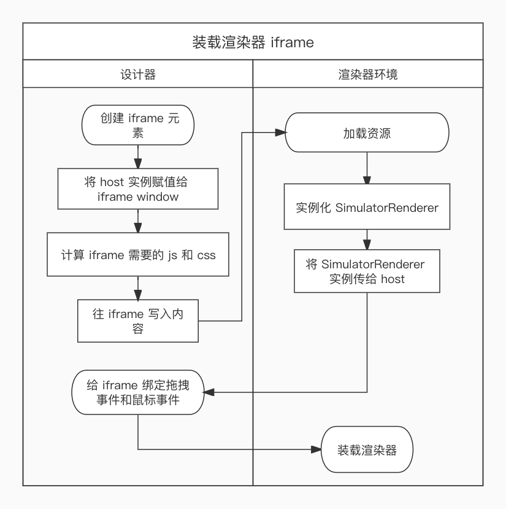
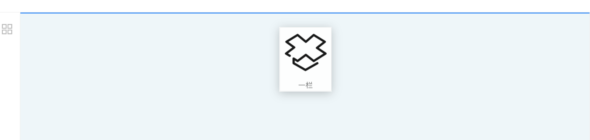

# 低代码跨 iframe 拖拽

低代码引擎是低代码分层架构中最复杂的部分，引擎的核心功能包含入料、设计、画布渲染和出码等，它们的含义如下：

* 入料：向引擎注入设置器、插件和组件。
* 设计：对组件进行布局设置、属性设置以及增删改操作后，形成符合页面搭建协议的JSON Schema。
* 画布渲染：将 JSON Schema 渲染成 UI 界面。
* 出码：将 JSON Schema 转化成手写代码，这通常发生在页面发布的时候。

本文主要介绍拖拽定位，即：拖拽过程中探测组件的可插入点。为了给渲染器提供一个纯净的渲染环境，渲染器和设计器处于不同的 iframe 中，因此拖拽组件，不仅涉及在同一个 iframe 中拖拽组件，还涉及跨 iframe 拖拽组件。渲染器所在的 iframe 由设计器唤起，在正式介绍拖拽定位之前，先介绍如何唤起渲染器 iframe。

## 唤起渲染器 iframe

iframe 元素的常见用法是将它的 src 属性设置成一个固定的网页地址，让它在当前网页嵌入另一个已经存在的网页，但渲染器没有固定的网页地址，所以在这里要使用一种不常见的用法，即调用 document.write 方法给 iframe 所在的文档写入它要加载的内容。设计器唤起渲染器 iframe 的流程如下图所示：



设计器环境和渲染器环境通过 host 相互通信，SimulatorRenderer 给 host 提供了一些 API 帮助设计器完成交互，设计器给 host 提供了一些 API 帮助渲染器完成画布渲染。

在设计器环境中与渲染器环境相关的只是一个 iframe 元素，如下：

```jsx
<iframe
     name="SimulatorRenderer"
     className="vitis-simulator-frame"
     style={frameStyle}
     ref={this.mountContentFrame}
/>
```

往 iframe 写入内容发生在 host.mountContentFrame 方法中，代码片段如下：

```typescript
this.frameDocument!.open()
this.frameDocument!.write(
     `<!doctype html>
      <html class="engine-design-mode">
        <head>
<meta charset="utf-8"/>
// 这里是渲染器环境要加载的css样式脚本
          ${styleTags}
        </head>
        <body>
	     // 这里是渲染器环境要加载的js脚本
            ${scriptTags}
        </body>
     </html>`
)
   this.frameDocument!.close()
// 监听iframe加载成功和加载失败的事件
this.frameWindow!.addEventListener('load', loaded);
this.frameWindow!.addEventListener('error', errored);
```

用低代码引擎设计界面时，为了让渲染器环境能成功的显示画布，上述 scriptTags 中至少包含 react、react-dom 和 vitis-lowcode-simulator-renderer 的js 脚本，在开发阶段 vitis-lowcode-simulator-renderer 的 js 脚本地址是 http://localhost:5555/js/simulator-renderer.js，等发布之后vitis-lowcode-simulator-renderer 的 js 脚本地址是其 npm 包的 js 地址。

## 拖拽定位

拖拽定位指的是当组件在画布区域拖动时，界面实时的显示组件最近的可放置位置，这是一个与设计器强相关的功能，所以与设计器处于同一个 iframe，相关的 DOM 元素被叠放在画布区域的上面，如下图所示：



上图蓝线所在的位置就是被拖动组件最近可放置的位置，实现该功能需用到 Element.getBoundingClientRect() 方法和 HTML5 的拖放事件。给渲染器中的低代码组件设置 ref 属性，当其装载到界面上即可得到组件的 DOM 元素，从而计算出拖拽过程中鼠标经过的低代码组件。

低代码组件的拖拽能力由 Dragon 实例提供，与拖拽相关的概念有如下3个：

* DragObject：被拖拽的对象，它是画布中的低代码组件或组件面板上的低代码组件。
* LocationEvent：携带了拖拽过程中产生的坐标信息和被拖拽的对象。
* DropLocation：被拖拽对象在画布上最近的可放置点。

DragObject 是一个联合类型，拖拽不同位置的低代码组件，它的类型有所不同，其接口类型定义如下：

```typescript
interface DragNodeObject {
    type: DragObjectType.Node; // 被拖拽的是画布中的低代码组件
    node: Node;
  }
  interface DragNodeDataObject {
    type: DragObjectType.NodeData; // 被拖拽的是组件面板上的低代码组件
    data: ComponentSpec;
  }

type DragObject = DragNodeObject | DragNodeDataObject
```

设计器用 LocationEvent 来计算被拖拽对象最近的可放置点，其接口类型定义如下：

```typescript
interface LocationEvent {
  dragObject: DragObject,
  originalEvent: DragEvent,
  clientX: number,
  clientY: number
}
```

上述接口中 clientY 和 clientX 来自于 DragEvent 对象，它们用来计算画布中离鼠标最近的 Node。

DropLocation是拖拽操作要计算的结果，接口类型定义如下：

```typescript
interface DropLocation {
  // 被拖拽对象可放置的容器
  containerNode: Node;
  // 被拖拽对象在容器中的插入点
index: number;
}
```

以拖拽组件面板中的低代码组件为例，在画布区域显示组件最近的可放置点，总体而言，需经历6个步骤。

### 1. 绑定拖放事件

iframe 和组件面板中的低代码组件绑定拖放事件，得到 DragObject，代码片段如下：

```typescript
// 当组件面板中的组件开始拖动时
<div draggable={true} onDragStart={() => onDragStart(item.packageName)}>xxx</div>
const onDragStart = (packageName: string) => {
  // 得到DragObject
dragon.onNodeDataDragStart(packageName)
}

// 给 iframe 绑定dragover事件，当拖动操作进入画布区域时触发事件
this.frameDocument?.addEventListener('dragover', (e: DragEvent) => {
      e.preventDefault()
      this.project.designer.dragon.onDragOver(e)
})
```

### 2. 获取拖拽过程中的 LocationEvent

LocationEvent 将在 iframe 的 dragover 事件处理程序中实时获取，代码如下：

```typescript
onDragOver = (e: DragEvent) => {
    // 获取 locateEvent 只是简单的取值
	const locateEvent = this.createLocationEvent(e)
}
createLocationEvent = (e: DragEvent): LocationEvent => {
        return {
            dragObject: this.dragObject,
            originalEvent: e,
            clientX: e.clientX,
            clientY: e.clientY
        }
}
```

### 3. 获取离鼠标最近的 Node

Node 被装载在渲染器环境中，只有 SimulatorRenderer 实例才知道每个 Node 的位置，因此这一步需要调用 SimulatorRenderer 给 host 提供的getClosestNodeIdByLocation 方法，getClosestNodeIdByLocation 的代码如下：

```typescript
getClosestNodeIdByLocation = (point: Point): string | undefined => {
    // 第一步：找出包含 point 的全部 dom 节点
    const suitableContainer = new Map<string, DomNode>()
    for (const [id, domNode] of reactInstanceCollector.domNodeMap) {
        const rect = this.getNodeRect(id)
        if (!domNode || !rect) continue
        const { width, height, left, top } = rect
        if (left < point.clientX && top < point.clientY && width + left > point.clientX && height + top > point.clientY) {
            suitableContainer.set(id, domNode)
        }
    }
    // 第二步：找出离 point 最近的 dom 节点
    const minGap: {id: string| undefined; minArea: number} = {
        id: undefined,
        minArea: Infinity
    }
    for (const [id, domNode] of suitableContainer) {
        const { width, height } = domNode.rect
        if (width *  height  < minGap.minArea) {
            minGap.id = id;
            minGap.minArea = width *  height
        }
    }

    return minGap.id
}
```

上述 reactInstanceCollector 对象中保存了画布上全部低代码组件的 DOM 节点，实现这个目的需借助 React 的 ref 属性，在这里不展开介绍。

### 4. 获取拖拽对象最近的可放置容器

每个低代码组件都能设置嵌套规则，规定哪些组件能做为它的子元素和父元素，不符合规则的组件则不可放置，在这一步将使用组件的嵌套规则，代码如下：


```typescript
getDropContainer = (locateEvent: LocationEvent) => {
    // 从上一步得来的潜在容器
    let containerNode = this.host.getClosestNodeByLocation({clientX: locateEvent.clientX, clientY: locateEvent.clientY})
    const thisComponentSpec: ComponentSpec = locateEvent.dragObject.data
    
    while(containerNode) {
        if (containerNode.componentSpec.isCanInclude(thisComponentSpec)) {
            return containerNode
        } else {
            // 继续往上找父级
            containerNode = containerNode.parent
        }
    }
}
```

### 5. 计算被拖动的对象在容器中的插入点

容器可能包含多个子元素，在这一步将利用鼠标位置计算被拖动的对象在容器中的插入点，得到最终的 DropLocation ，代码如下：

```typescript
// 初始值
const dropLocation: DropLocation = { index: 0, containerNode: container}
const { childrenSize, lastChild } = container
const { clientY } = locateEvent
            
if (lastChild) {
    const lastChildRect = this.designer.getNodeRect(lastChild.id)
    // 判断是否要插到容器的末尾
    if (lastChildRect && clientY > lastChildRect.bottom) {
        dropLocation.index = childrenSize
    } else {
        let minDistance = Infinity
        // 容器中最近的插入点
        let minIndex = 0
        for (let index = 0 ; index < childrenSize; index ++) {
            const child = container.getChildAtIndex(index)!
            const rect = this.designer.getNodeRect(child.id)
            if (rect && Math.abs(rect.top - clientY) < minDistance) {
                minDistance = Math.abs(rect.top - clientY)
                minIndex = index
            }
        }
        
        dropLocation.index = minIndex
    }
}

return dropLocation
```

### 6. 在界面上提示最近的插入位置

经过前面的步骤已经得到了插入位置，现在需要在界面上给用户显示相应的提示，这里要用到状态管理库 MobX，在此之前需将 Dragon 实例变成一个可观察对象，再在React组件中使用 mobx-react 导出的 observer，代码如下：

```jsx
import { observer } from 'mobx-react'
observer(function InsertionView() {
    const [style, setStyle] = useState<React.CSSProperties>({})
    useEffect(() => {
        const dropLocation = observableProject.designer.dragon.dropLocation
        if (!dropLocation) {
            setStyle({})
        } else {
            const { width, left, top } = dropLocation.containerRect
            setStyle({
                borderTopStyle: 'solid',
                width,
                left,
                top
            })
        }
    }, [observableProject.designer.dragon.dropLocation])
    return (
       // 这个元素被绝对定位到画布区域的上面
        <div className='vitis-insertion-view' style={style}></div>
    )
})
```

当 dragon.dropLocation 的值发生变化时，InsertionView 组件将重新渲染，实时的给用户提示拖拽对象对接的可插入点。

## 写在后面

低代码的拖拽定位远不止本文介绍的这些功能，至少还包含悬停探测，[详情可查看开源项目](https://github.com/react-low-code/vitis-lowcode-engine/tree/master/packages/engine)，该开源项目持续更新。


