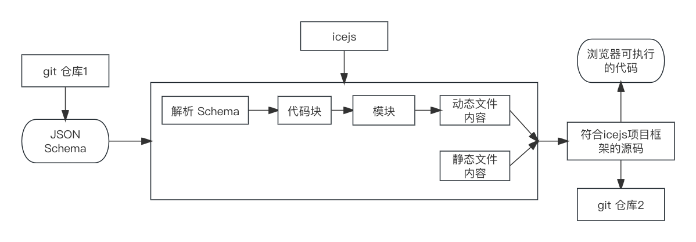
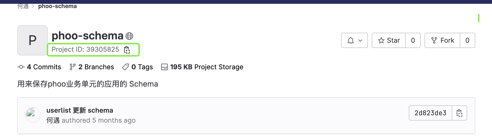

# 在低代码中使用 GitLab API

低代码引擎的产出物是一份符合页面搭建协议的 JSON Schema，其可读性差，且浏览器不能直接运行，将 JSON Schema 转成最终可执行的代码，涉及到出码，流程如下图所示：



整个出码流程在服务端进行，与用户没有交互。由上图可知，出码需要的 JSON Schema 从 git 仓库得来，它输出的符合 icejs 项目框架的源码保存在另一个 git 仓库，本文主要介绍如何用 GitLab API 操作 git 仓库。

开发者手写代码时，会在开发分支编写代码，最终将代码合并到主分支，如 master 分支，存储 Schema 也采用类似的策略，低代码引擎生成的 Schema 被保存到开发分支，发布页面时，开发分支上的Schema 被 cherry-pick 到 master 分支，把 master 分支上的 Schema 转化成源码再打包构建，最后部署上线。

## access_token

使用 GitLab API 之前必须知道你的账号在 GitLab 上的 access_token，之后每一次调用 API 在请求头中携带该 access_token，访问 https://gitlab.com/-/profile/personal_access_tokens 查看账号的 access_token，在 https://docs.gitlab.com/ee/api/ 可查看全部 GitLab API。

在服务端使用 axios 发起 GitLab API 网络请求，这与在客户端使用 axios 一样，先创建一个 axios 实例，设置 baseURL 和 headers，代码如下：

```typescript
import axios from "axios"
import ENV_CONFIG from '../../env.config.json'

const axiosInstance = axios.create({
    baseURL: "https://gitlab.com",
    headers: {
        "PRIVATE-TOKEN": <这里填你的access_token>,
        "Content-Type": 'application/json'
    }
})
```

## 存储Schema

Schema 保存在仓库中，对 GitLab 而言，这里的仓库是指项目，如下图所示：



注意上图标记的 Project ID，该字段在后续存储 Schema 时会继续使用，调用 GitLab API 把某个 Schema 存储到仓库，需经历创建项目、创建分支和提交 commit 这 3 步。

### 创建项目

创建项目发生在新建业务单元的时候，要为每一个业务单元创建一个 GitLab 项目，代码如下：

```typescript
async function createProject(name: string, description: string) {
    const result = await axiosInstance.request({
        method: 'POST',
        url: '/api/v4/projects',
        data: {
            name,
            description,
            default_branch: 'develop',
            initialize_with_readme: true,
            visibility: 'public',
        }
    })
   // 返回Project ID
    return result.data.id
}
```

### 创建分支

上一步所建项目的默认分支名是 develop，这一步基于 develop 创建 master 分支，代码如下：

```typescript
async function createBranch(projectId: string, branch: string, ref: string) {
    const result = await axiosInstance.request({
        method: 'POST',
        url: `/api/v4/projects/${projectId}/repository/branches`,
        params: {
            branch,
            ref
        }
    })
    return result.data
}
```

### 提交 commit

提交 commit 将 Schema 保存到仓库，代码如下：

```typescript
interface CreateCommitParam {
    branch: string, 
    commit_message: string, 
    actions: Action[],
    start_branch?: string,
    start_sha?: string,
    [attr: string]: any
}

async function createCommit(projectId: string, params: CreateCommitParam) {
const result = await axiosInstance.request({
    method: 'POST',
    url: `/api/v4/projects/${projectId}/repository/commits`,
    data: params
})
 return result.data
}
```

上述代码值得关注的是 CreateCommitParam.actions，它表示本次提交要执行的动作集合。Action 接口包含字段如下：

```typescript
interface Action {
    action: 'create' | 'delete' | 'move' | 'update' | 'chmod',
    // action要处理的文件路径
    file_path: string,
    // 当action为move时，它表示被移动文件的原始路径
    previous_path?: string,
    // 当action为create或update时，它表示文件内容
    content?: string,
    // 取值为text或base64，默认值是text
    encoding?: string,
    // 主要action为delete、 move 或update时有效
    last_commit_id?: string,
    // action为chmod时有效
    execute_filemode?: boolean
}
```

### 获取 Schema

Schema 保存到 git仓库，等需要使用的时候再取出来，代码如下：

```typescript
async function getFileContent(projectId: string, ref: string, file_path: string) {
    const result = await axiosInstance.request({
        method: 'GET',
        url: `/api/v4/projects/${projectId}/repository/files/${encodeURIComponent(file_path)}/raw`,
        params: {
            ref
        }
    })

    return result.data
}
```

上述 API 能从特定 git 仓库获取文件的内容，ref 指分支名或 commit id。

## 总结

常规开发中，维护应用程序的版本相当重要，一个常见的例子是使用 git 来维护版本，对于特定版本而言，它一经创建便不可修改。低代码系统用来产生应用程序，因此它也有版本维护的需求，在这里不另辟蹊径，而是沿用常规的方法，用 git 维护版本，Schema 保存到仓库中，调用 GitLab API 时需要的参数被保存在数据库。
