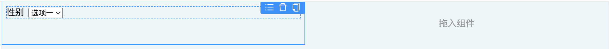

# 低代码组件显示

低代码引擎是低代码分层架构中最复杂的部分，引擎的核心功能包含入料、设计、画布渲染和出码等，它们的含义如下：

* 入料：向引擎注入设置器、插件和组件。
* 设计：对组件进行布局设置、属性设置以及增删改操作后，形成符合页面搭建协议的JSON Schema。
* 画布渲染：将 JSON Schema 渲染成 UI 界面。
* 出码：将 JSON Schema 转化成手写代码，这通常发生在页面发布的时候。

在之前的文章中介绍了[低代码跨 iframe 拖拽](./../drag/index)，本文开始介绍画布渲染。画布渲染就是将设计器生成的 JSON Schema 渲染成 UI 界面，画布渲染有一个单独的 npm 包，简称 ReactRenderer，它与设计器不直接联系，而是通过 SimulatorRenderer 与设计器联系，SimulatorRenderer是另一个 npm 包。画布渲染至少包含四部分内容：

1. 显示组件：这是画布渲染最基础的部分，不涉及任何交互，只是简单的显示。
2. 获取数据源：让组件获取它要显示的数据。
3. 表单联动：使表单控件的状态受其他数据的控制，包含禁用联动、显隐联动和取值联动。
4. 表单校验：校验表单填写的值是否符合要求，不符合则给出错误提示。

本文只介绍画布渲染中的显示组件。

ReactRenderer 的作用是将 JSON Schema 描述的组件树显示在界面上，总体而言，它是一个 React 组件，接受如下属性：

```typescript
interface Props {
  // 页面的 json schema
  schema: PageSchema;
  // schema 中使用的组件
  components: Map<string, React.ElementType>;
  // schema 中的组件装载到界面后要执行的勾子
  onCompGetRef?: (schema: NodeSchema, domElement: HTMLElement | null) => void;
  // 画布渲染模式，设计态或运行态，默认值为运行态
  rendererMode?: RendererMode;
  // 容器组件没有子元素时的提示语
  customEmptyElement?: (schema: NodeSchema) => React.ReactNode;
}
```

上述 schema 和 components 是必填属性，schema 中用到组件必须在 components 中声明，否则画布无法正常渲染。onCompGetRef 是选填属性，在设计态时它为设计器获取 Node 的位置提供了可能。

假如有如下一段 JSON Schema。

```json
{
    "componentName": "Page",
    "packageName": "Page",
    "containerType": "Page",
    "isContainer": true,
    "id": "def133",
    "children": [
        // 行
        {
            "componentName": "Row",
            "packageName": "vitis-lowcode-row",
            "containerType": "Layout",
            "isContainer": true,
            "id": "def134",
            "props": [],
            "children": [
                // 列
                {
                  "componentName": "Column",
                  "packageName": "vitis-lowcode-column",
                  "props": {},
                  "isContainer": true,
                  "id": "def135",
                  "containerType": "Layout",
                  "children": [
                    {
                      "componentName": "Select",
                      "packageName": "vitis-lowcode-select",
                      "props": {"label": "性别"},
                      "extraProps": {"name": "sex"},
                      "isFormControl": true,
                      "id": "def136",
                    }
                  ]
                },
                // 列
                {
                  "componentName": "Column",
                  "packageName": "vitis-lowcode-column",
                  "props": {},
                  "isContainer": true,
                  "containerType": "Layout",
                  "children": []
                  "id": "def137",
                }
              ]
        }
    ],
    "props": {
        "style": "padding: 10px"
    },
    "extraProps": {
        // 这是数据源字段，该字段在下一个小节介绍
        "dataSource": {...}
    }
}
```

上述 schema 在界面上将显示为一行两列布局，第一列有一个下拉选择器，如下图：



ReactRenderer 将 schema 描述的组件分为4种类型，如下：

* 页面容器：这是 schema 的 root 必须是页面容器，它没有发布成单独的 npm 包，而是存在于 ReactRenderer 的内部。
* 布局容器：它通常是页面容器的 children，用来控制页面的布局，比如：行和列。
* 表单控件：它处于 schema 嵌套层级的最后一层，通常位于布局容器中，既能展示数据又能接受用户输入。
* 普通UI组件：它处于 schema 嵌套层级的最后一层，通常位于布局容器中，只能显示数据不能接受用户输入。

## 页面容器

页面容器是整个画布的根节点，对应的 React 组件是 PageRenderer，与视图相关的代码如下：

```tsx
function PageRenderer(props: Props) {
    const context = useContext(Context)
    const rootRef = useGetDOM(props.schema)  // line A
    const { style } = props.schema.props

    return (
        <div 
            data-node-id={props.schema.id} 
            className="vitis-page-container"
            ref={rootRef}   // line B
            style={typeof style === 'string' ? transformStringToCSSProperties(style): undefined}
        >{
            !props.schema.children.length ? 
            context.customEmptyElement ? context.customEmptyElement(props.schema): null: 
            <>{props.schema.children.map(child => <BaseComponentRenderer schema={child} key={child.id}/>)}</>
        }</div>
    )
}
```

如果页面容器有 children，那么 PageRenderer 将遍历每一个 child，将其显示在界面，没有 children，则显示提示语。BaseComponentRenderer 是一个 React 组件工厂，它根据 schema 描述的组件类型，分门别类的渲染组件。

PageRenderer 中最重要的代码是 line A 用到的 useGetDOM，它是一个 React Hook，其作用是等组件装载之后将组件的根 DOM 元素传递出去，让设计器能完成拖拽定位。useGetDOM 的代码如下：

```typescript
function useGetDOM(schema: NodeSchema) {
    const context = useContext(Context)
    const rootRef = useRef<HTMLDivElement>(null)

    useEffect(() => {
        if (context.rendererMode === RendererMode.design && context.onCompGetRef) {
            context.onCompGetRef(schema, rootRef.current)
        }
        return () => {
        if (context.rendererMode === RendererMode.design && context.onCompGetRef) {
                context.onCompGetRef(schema, null)
         }
        }
    },[])

    return rootRef
}
```

## 布局容器

行组件和列组件都属于布局容器，但列组件必须放置在行组件的 children 中，布局容器与视图相关的代码如下：

```typescript
function LayoutComponent(props: Props) {
    const rootRef = useGetDOM(props.schema)
    const context = useContext(Context)
    const { style, ...reset } = props.schema.props
    const Component = context.components.get(props.schema.componentName) // lineA
    if (!Component) { return <div>未知的布局组件</div>}

    return (
    <Component 
        style={typeof style === 'string' ? transformStringToCSSProperties(style): undefined} 
        ref={rootRef}
        {...reset}
    >
        {!props.schema.children.length ?
        context.customEmptyElement ? context.customEmptyElement(props.schema): null
        :
        props.schema.children.map(child => <BaseComponentRenderer schema={child} key={child.id}/>)
        }
    </Component>
    )
}
```

布局容器究竟要渲染哪一个组件，这取决于 lineA 的取值，取值结果直接决定了界面上要显示的内容。

## 表单控件

表单控件能接受用户输入，存储用户输入的值，以及表单联动将在后续的小节重点介绍。表单控件与视图相关的代码如下：

```typescript
function FormControl(props: Props) {
    const rootRef = useGetDOM(props.schema)
    const context = useContext(Context)
    // 获取要渲染组件
    const Com = context.components.get(props.schema.componentName)
    if (!Com) { return <div>未知的表单控件</div> }
    return (<Com {...props.schema.props} ref={rootRef} /> )
}
```

## 普通UI组件

普通 UI 组件只能用来展示数据，它的代码如下：

```typescript
function UIComponent(props: Props) {
    const rootRef = useGetDOM(props.schema)
    const context = useContext(Context)
    const Com = context.components.get(props.schema.componentName)
    if (!Com) { return <div>未知的组件</div> }
    return ( <Com {...props.schema.props} ref={rootRef} />)
}
```

## 小节

画布渲染的第一步就是要组件显示在界面上，不涉及任何交互，获取数据源、表单联动和表单校验是下一步要做的，在后续文章将单独介绍。