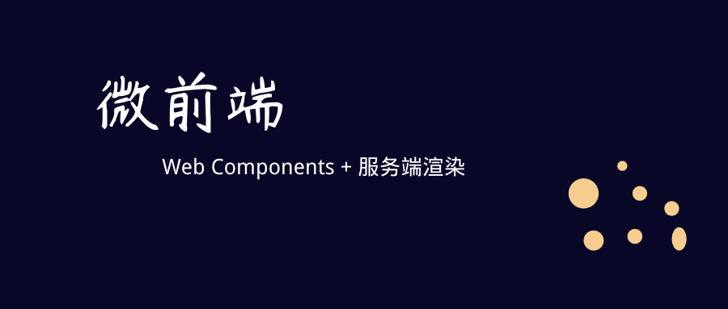

微前端是一种使多个团队能够独立开发一个现代 web 应用的技术，策略或者方法。这项技术源自于微服务。

## 什么是微前端

2016年末微前端在[ThoughtWorks Technology Radar](https://www.thoughtworks.com/radar/techniques/micro-frontends)被第一次提到，它将微服务的概念应用到前端。现在比较流行的方式是创建一个基于微服务的功能丰富并且功能强大的浏览器应用，它被称为单页应用。但是前端层面上，这个应用只由一个前端团队开发，随着不断迭代，维护变得越来越困难，这被我们称为前端巨石应用。

微前端背后的理念是将一个网站或者 web 应用分为多个功能，不同的团队开发他们各自的功能。每个团队都有自己关心和擅长的业务或任务领域。

但是这并不是一个新的概念，它与[ Self-contained Systems](http://scs-architecture.org/) 有很多共同之处。在过去，这种处理方法被称为垂直系统的前端集成。

## 单体前端


## 垂直划分


## 微前端背后的核心理念

- 技术无关

每个团队可以选择或者更新他们自己的技术栈，并且不对其他团队造成影响。

- 隔离团队代码

不共享运行时，即便使用相同的框架。应用程序独立构建，并且不依赖共享状态和全局变量。

- 建立团队前缀

在不可能实现绝对隔离的情况下，使用团队前缀达成隔离的目的。例如：通过给 CSS、Events、Local Storage 和 Cookies 加前缀的方式避免冲突和明确所有权。

- 使用浏览器特性而非自定义 API

使用浏览器自定义事件进行通信，而非建立全局的发布订阅系统。如果不得不建立一个跨团队的 API，尽量保持简单。

- 建立一个有弹性的网站

即便 JS 出错或者禁止执行，也要让你的功能是可用的。

 > 这篇文章分为两个主要部分。首先我们讨论页面合成，即：怎么用不同团队开发组件组成一个页面。之后，我们将演示实现客户端转换的例子。

## 页面合成

除了整合用不同框架写的客户端，服务端代码之外，我们需要商讨如何隔离 JS、避免 CSS 冲突、加载应用所需的资源、共享公共资源以及处理数据抓取，同时我们还需要考虑如何在加载状态给用户一个良好的体验。

### 基本例子

下面将使用拖拉机商品店的产品页作为例子。这里的功能是在三个不同的拖拉机模型中进行切换，并且每一次切换都会改变拖拉机的图片、名称、价格和与这个拖拉机相关的推荐商品。另外这儿还有一个购买按钮，点击购买按钮会将选择的商品添加到购物车，同时顶部的购物车中的商品数量也会得到相应更新。


在第一版代码中所有的 HTML 都使用 JS 和 ES6 模版字符串生成，每一次切换拖拉机会重新渲染整个 HTML，代码被写在一个 js/css 文件中，所有的功能由同一个团队开发。

### 功能划分

在拖拉机商品店的产品页的例子中，我们将整个页面的功能分为由三个不同的团队完成。团队 A (blue) 负责购买流程，即：蓝色虚线的部分，团队 B(green) 负责这个页面的商品推荐区域，即：绿色虚线的部分，这个页面本身由团队 C(red) 负责，即：红色虚线的区域。


团队 C (red) 决定这个页面应该包含那些功能以及页面布局。这个页面中包含团队 C 自己负责的内容，例如：产品图片、名称和可选模型，同时也包含由其他团队负责的内容。

> 在这个例子中，我们使用 Custom Elements 创建组件。

### 创建自定义元素

在这里以购买按钮为例，团队 C(red) 将 `<blue-buy sku="t_porsche"></blue-buy>`添加到页面的指定位置，为了让按钮能够被正常使用，团队 A(blue) 必须在页面上注册 `blue-buy`。

```
class BlueBuy extends HTMLElement {
  connectedCallback() {
    this.innerHTML = `<button type="button">buy for 66,00 €</button>`;
  }

  disconnectedCallback() { ... }
}
window.customElements.define('blue-buy', BlueBuy);
```

现在每当浏览器遇到`blue-buy`标签，`connectedCallback`就会调用，并且 `this` 为自定义元素的根节点，它可以使用浏览器内置 DOM 元素的所有方式和属性，例如：`innerHTML`，`getAttribute()`。


自定义元素的元素名中必须包含一个短横线(-)，在接下来的例子中，我们将自定义元素的命名约定为：团队名-功能。团队的命名空间可以防止冲突，并且只需查看 DOM 就能知道这个功能由哪个团队负责。

## 通信

有两种实现通信的方式，第一种方式是通过向下传递属性的方式进行通信，另一种方式是使用订阅-发布机制进行通信。

### 向下传递属性的方式进行通信

当用户切换拖拉机模型时，购买按钮也必须做出相应的更新。为了实现这个功能，团队 C(red) 可以用一个新的元素替换掉已经存在的元素。

```
/* container.innerHTML;
 = <blue-buy sku="t_porsche">...</blue-buy> */
container.innerHTML = '<blue-buy sku="t_fendt"></blue-buy>';
```

被移除的元素的`disconnectedCallback`会被同步触发，在`disconnectedCallback`中可以做一些清理工作，例如移除事件监听。在那之后新创建的`t_fendt`元素的`connectedCallback`将会被调用。

另一个性能更好的做法是：更新已有元素的 `sku` 属性值。

```
document.querySelector('blue-buy').setAttribute('sku', 't_fendt');
```

为了支持这个功能，团队 A (blue) 在实现自定义元素`blue-buy`时，需要给`blue-buy`定义`attributeChangedCallback`和`observedAttributes`。

```
const prices = {
  t_porsche: '66,00 €',
  t_fendt: '54,00 €',
  t_eicher: '58,00 €',
};

class BlueBuy extends HTMLElement {
  static get observedAttributes() {
    return ['sku'];
  }
  connectedCallback() {
    this.render();
  }
  render() {
    const sku = this.getAttribute('sku');
    const price = prices[sku];
    this.innerHTML = `<button type="button">buy for ${price}</button>`;
  }
  attributeChangedCallback(attr, oldValue, newValue) {
    this.render();
  }
  disconnectedCallback() {...}
}
window.customElements.define('blue-buy', BlueBuy);
```

为了避免代码重复，我们定义了一个 render 方法，它是从`connectedCallback`和`attributeChangedCallback`中调用的。这个方法用于渲染出新的 DOM。

### 使用订阅-发布机制进行通信

通过向下传递属性的方式进行通信，在某些情况下效率太低。在我们的例子中，当用户点击了购买按钮,`mini basket`组件应该更新。`mini basket`和购买按钮都由团队 A (blue) 开发，所以他们能够创建一些内部 API 让`mini basket`知道按钮被点击了，这要求组件之间相互了解，违反了隔离原则。

一个好的方式是使用订阅-发布机制，任何位置的组件都可以发布消息并且其他组件可以订阅这个消息，幸运的是，浏览器原生支持这个功能，我们可以使用 `new CustomEvent(...)`创建自定义事件，它类似于浏览器的 click，select 和 mouseover 等事件。由于大多数原生事件都支持冒泡，这使得侦听 DOM 特定子树上的所有事件成为可能。如果你想监听页面上的所有事件，可以将事件监听器绑定到 window 上。接下来，在这个例子中我们创建一个`blue:basket:changed`事件。

```
class BlueBuy extends HTMLElement {
  [...]
  connectedCallback() {
    [...]
    this.render();
    this.firstChild.addEventListener('click', this.addToCart);
  }
  addToCart() {
    // maybe talk to an api
    this.dispatchEvent(new CustomEvent('blue:basket:changed', {
      bubbles: true,
    }));
  }
  render() {
    this.innerHTML = `<button type="button">buy</button>`;
  }
  disconnectedCallback() {
    this.firstChild.removeEventListener('click', this.addToCart);
  }
}
```

`mini basket`组件现在可以在 window 上订阅这个事件。

```
class BlueBasket extends HTMLElement {
  connectedCallback() {
    [...]
    window.addEventListener('blue:basket:changed', this.refresh);
  }
  refresh() {
    // fetch new data and render it
  }
  disconnectedCallback() {
    window.removeEventListener('blue:basket:changed', this.refresh);
  }
}
```

在这个例子中`mini basket`向其作用域之外的 DOM 元素上添加事件监听器，在大多数情况下这样做没有问题，如果你不想这样做，你也可以让团队 C (red) 负责的页面本身去监听事件然后通知`mini basket`更新，如下所示：

```
// page.js
const $ = document.getElementsByTagName;

$('blue-buy')[0].addEventListener('blue:basket:changed', function() {
  $('blue-basket')[0].refresh();
});
```

## 服务端渲染

在浏览器中使用自定义元素集成组件是一种很好的方式。但是，当构建一个 web 可访问的站点时，初始加载性能很可能会影响到用户，在所有js下载并执行之前，用户会看到一个白屏。并且我们最好思考一下，如果 js 被阻止执行或者发生错误我们网站会怎么样。在服务端渲染出网站的核心内容可以解决 js 被阻止或执行错误的问题，但是 web component 规范没有谈到服务器渲染。无 js，无自定义元素。

### web components + 服务端渲染

为了让服务器渲染能够工作，在这个例子中我们使用代码同构的方式。每一个团队都有他们自己的 express 服务器,并且需要满足每个自定义元素的`render()`方法可以通过 url 进行访问。

```
$ curl http://127.0.0.1:3000/blue-buy?sku=t_porsche

<button type="button">buy for 66,00 €</button>
```

自定义元素的标签名作为路径名，属性作为查询参数。这是一种服务端渲染每个组件内容的方式，结合 `<blue-buy>`服务端渲染的实现方式，可以得到有一种通用的服务端渲染 Web Component 的方式。

```
<blue-buy sku="t_porsche">
  <!--#include virtual="/blue-buy?sku=t_porsche" -->
</blue-buy>
```

`#include`属于服务器端包含(Server Side Includes)的一部分，这是大多数 web 服务器中可用的特性,这和在我们的网站上嵌入当前数据的技术是一样的，这儿也有一些可选的技术，例如：ESI、[nodesi](https://github.com/Schibsted-Tech-Polska/nodesi)、[compoxure](https://github.com/tes/compoxure) 和 [tailor](https://github.com/zalando/tailor)。

在我们的例子中 Server Side Includes 是一种简单并且稳定的方案。在 web 服务器将完整的页面发送到浏览器之前，#include 部分会被 `/blue-buy?sku=t_porsche`的内容替换。我们像如下这样配置 nginx：

```
upstream team_blue {
  server team_blue:3001;
}
upstream team_green {
  server team_green:3002;
}
upstream team_red {
  server team_red:3003;
}

server {
  listen 3000;
  ssi on;

  location /blue {
    proxy_pass  http://team_blue;
  }
  location /green {
    proxy_pass  http://team_green;
  }
  location /red {
    proxy_pass  http://team_red;
  }
  location / {
    proxy_pass  http://team_red;
  }
}
```

配置中的`ssi: on;`表示开启 Server Side Includes 功能并且给每个团队都配置了`upstream`和`location`。

下面的动画展示了拖拉机商店在 js 不可用时在浏览器中的表现情况。


每次切换拖拉机模型都会让页面重新加载。右边的终端展示了如何将页面的请求路由到 team red 的过程，然后请求 team blue and green 的组件填充到它们相应的位置。

当开启浏览器的 JS 功能，在服务器日志信息中只能看到第一次的请求。之后切换拖拉机模型都由客户端处理，产品数据将通过 JavaScript 请求 REST api 得到。

你可以在本地机器上使用这个例子的代码，在此之前你需要安装[Docker Compose](https://docs.docker.com/compose/install/)。

```
git clone https://github.com/neuland/micro-frontends.git

cd micro-frontends/2-composition-universal

docker-compose up --build
```

然后 Docker 会在 3000 端口上启动 nginx，为每个团队构建 node.js 图像。当你在浏览器上打开 http://127.0.0.1:3000/ 你可以看到一个红色的拖拉机。从 docker-compose 的组合日志可以很方便的看到网络中正在发生什么，但是遗憾的是不能控制输出的颜色。

src 文件被映射到各个容器中，当您进行代码更改时，node 应用程序将重新启动。

修改 nginx 的配置文件之后，必须重新`docker-compose`配置才会生效。

### 数据获取和加载状态

使用 Server Side Includes 的缺点是，最慢的组件片段决定了整个页面的响应时间。将组件片段进行缓存是一个值得推荐的做法。将那些生产成本高并且难以被缓存的组件片段从初始化渲染中移除，在浏览器中异步加载它们，是一个很好的方式。

在我们的例子中 团队 B (green) 的`green-recos`用于展示每种拖拉机模型的推荐产品，我们可以将`green-recos`从初始化渲染中移除。做法如下：

before

```
<green-recos sku="t_porsche">
  <!--#include virtual="/green-recos?sku=t_porsche" -->
</green-recos>
```

now

```
<green-recos sku="t_porsche"></green-recos>
```


现在`green-recos`的渲染只在浏览器中进行。从动画中可以看出，这个更改导致了页面的大量回流。商品推荐区域最初是空白的，团队 B(green) 的 JS 加载并执行之后，会调用 API 请求推荐商品，然后推荐商品被渲染并且商品相关的图片被请求，`green-recos`需要更多的空间去展示商品，这导致了页面的回流。

有很多方式去避免这样的页面回流，例如：团队 C(red) 可以固定推荐商品区域的高度，在一个响应式网站上，通常很难确定高度，因为不同的屏幕尺寸可能会有不同的高度。但是更严重的问题是，这导致团队 B (green)和团队 C (red) 之间违反了隔离的标准。如果团队 B (green) 想要给商品推荐区域增加一个标题，为了让页面布局不出现错误，他就必须通知团队 C (red) 调整商品推荐区域的高度。

在这里一个更好的方式是使用骨架屏。使用 Server Side Includes 团队 C (red) 将`green-recos`放在它该放在的位置，团队 B (green) 修改`green-recos`的服务端渲染方法，以致于它生成实际内容的示意图，这样就保留了所需的空间，在客户端填充实际内容就不会导致回流。


当切换拖拉机模型时，在真实数据从服务端返回之前你也可以使用骨架屏，这种方式可以让用户知道正在获取数据。但是如果数据响应特别快，在新数据和老数据之间的骨架闪烁也会让用户感到讨厌。所以要明智地使用这种技术，并努力获得用户的反馈。

[本文例子的 github 仓库地址](https://github.com/neuland/micro-frontends.git)

> 在下一期中我们将对比其他实现微前端的方式，例如：服务端模板合成、构建时集成、运行时集成。我们也会介绍样式隔离、共享公共库。

## 参考文章

1. [Micro Frontends - extending the microservice idea to frontend development](https://micro-frontends.org/)


