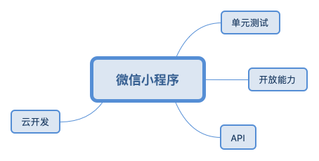
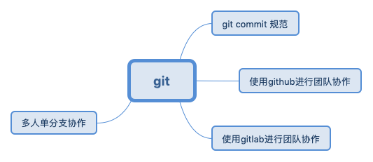
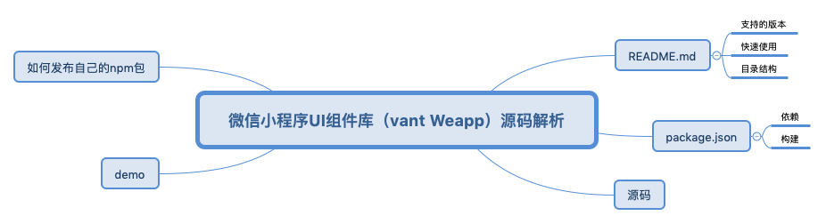

# 短期计划
> 该计划预计时间为8，9，10月。

1. 学习原生canvas,并且调研canvas绘图框架
>  输出：图片裁剪组件，接龙圈分享接龙海报
2. 微信小程序

2. git
>  输出：前端分享

3. 学习音视频传输，编码解码原理
>  输出：一对一视频直播

4. 调研uni-app,Mpx和Chameleon
5. 读Vant Weapp源码，总结微信小程序UI组件开发经验。
>  输出：UI组件库

