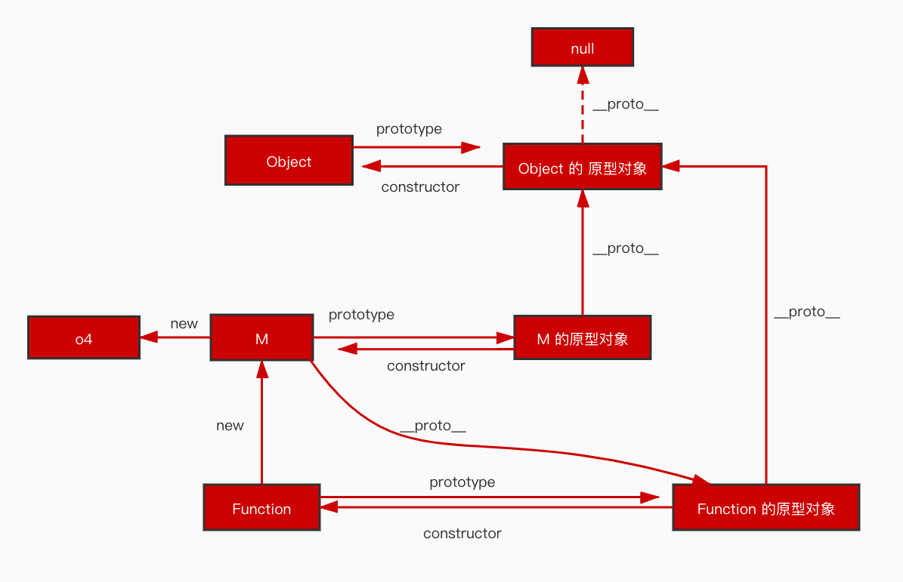
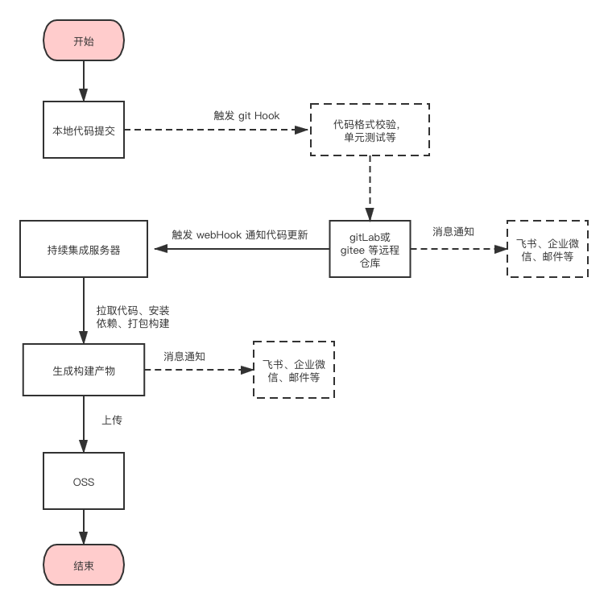

## babel 的编译流程

先说一下我所理解的编译，编译是将源代码转译成目标环境能够执行的代码。我们在项目中使用 babel 通常的目的是为了将新的 ES 规范转译成目标浏览器能够支持语法。

babel 的编译分为三个阶段，分别是：

1. 分析源代码，将源代码解析成抽象语法树。
2. 操作抽象语法树中的节点。
3. 用新的抽象语法树生成代码。

## TS 的必要性

TS 是有必要的，TS 可以解决一下问题：

1. 可以将某些错误在编译阶段就报出来，而不是在运行阶段才报出来。
2. 可以增加代码的可读性。
3. 转变开发思维，这对个人而言是很重要的，我们应该避免让自己的思维成为定式。

## 哪些项目适合做单元测试

在我现在的公司，可视化页面搭建项目我写了单元测试。这个项目它的影响范围广，他的需求比较稳定。所以我觉得基建项目是适合写单元测试的。

## 原型链

以 `const o4 = new M()` 为例，如下是原型链关系图

## 前端性能优化

在做性能优化之前我们确定优化目标、指标、测试环境，这一点很重要。做了这些之后再考虑从那些方面进行优化。

优化的方向：

1. 从资源方面考虑，比如：压缩文件、使用响应式图片等
2. 从传输方面考虑，比如：文件合并、异步加载 js 库、异步加载非主要的 css 文件等
3. 从构建方面考虑，比如：构建生成两份相关功能的代码，一份提供给老浏览器，一份提供给现代浏览器，module/nomodule 原理；在 webpack 中使用 tree-shaking 的功能，删除没有使用的 js 代码，但是它有一些局限性，比如：依赖的是静态的 ES6 的模块语法，这需要关闭 Babel 的模块转换功能，保留 ES6 模块化语法。
4. 从部署方面考虑，比如：使用浏览器缓存、cdn 等
5. 从 js 代码考虑，比如：仔细分析组件中的哪些数据需要响应式，避免组件不必要的 re-render

## Vue3 为什么会比 Vue2 的性能更好

Vue2 中 diff 算法会按照虚拟 DOM 树的层级关系一层一层的遍历，实际上静态的虚拟 DOM 是不会发生变化的，所以如果能够跳过静态虚拟 DOM 树，就能够提升性能，vue3 在 diff 阶段会跳过静态 dom 的对比。

vue 3 还有静态提升的功能，可以提升静态节点树，意思就是说，vue3 可以将静态的虚拟节点保存到变量里面，在渲染函数重新执行的时候，就不去创建虚拟节点了，这减少了创建虚拟节点的性能消耗 

## Vue scoped 是怎么实现单文件组件的样式隔离的

vue-loader 在解析单文件组件时，如果 style 上添加了 scoped，那么就会自动的在组件的所有标签上加上`data-v`开头的特性名，并且写在给 style 设置了 scoped 属性中的选择器也会被加上一个`data-v`开头的特性名

## 构建流程

构建的大概流程

## 怎么优化 webpack 的构建性能

1. 选择一种合适的 devtool, 生成 sourceMap 也是挺耗性能的。
2. 开启 Plugin/Loader 的 Cache 选项。
3. 减少目录的搜索访问。在使用 loader 的时候配置 inculde 和 exculde 减少 loader  的处理范围。
4. 使用 DllPlugin/DllReferencePlugin 进行预先构建，其思路就是把改变频率比较小的第三方库等依赖单独打包构建

## 前端错误采集

在做错误采集的初期，我们需要先确认要采集那些错误信息，是否需要将采集的错误信息全部上传到服务，前端是否要缓存错误信息，错误信息上报失败要如何处理，用什么方式实现错误上报

前端错误采集主要采集两个方面的错误，一个是 js 运行时的错误，另一个是静态资源加载错误。

采集 js 运行时错误：

1. try{}catch(){}
2. window.onerror
3. window.unhandledunrejection

采集资源加载错误：

1. element.onerror
2. 使用 DOM2 事件绑定方式，在 window 上绑定 error，使得事件在捕获阶段被处理

由于浏览器的安全策略，对于非同源的 js 文件中的错误不能得到详细的错误信息。可以给 script 标签加 crossorigin 属性并且给资源设置 Access-Control-Allow-Origin。

采集到错误之后，还需要将错误进行上报。上报错误的方式有：

1. 1 px 的 gif 图片
2. ajax 请求
3. beacon

## 微前端项目怎么通信

有两种通信方式：
1. 使用浏览器自定义事件。
2. 给子项目传递 props，然后再使用发布者-订阅者模式。

我比较推荐的做法是使用使用浏览器自定义事件进行通信

## 微前端项目提取公共依赖

我先说对于前端单体应用如何剥离外部依赖，使用 webpack 的 externals 可以达到剥离依赖的目的，剥离的外部依赖需要在 html 中从 CDN 中引入。对于微前端应用而言，要提取公共依赖还是可以使用 webpack 的 externals，不同的点在于，提取出的公共依赖的引入位置变成了基座项目的 html 文件。

对于微前端项目而言我们需要谨慎思考提取公共依赖的必要性。

## 使用 webpack 构建的前端项目按需加载是怎么实现的

通过 JSONP 函数，配置 output.jsonpFunction 的可以改变 JSONP 函数名。如果同一个页面上有多个 webpack runtime, 需要给这些 webpack runtime 的 output.jsonpFunction 设置为不同的值

## 解释 webpack 中 output.library 和 output.libraryTarget

output.libraryTarget 定义用何种方式去暴露 library，例如：umd、var、commonjs 等。

output.library 的作用取决于 output.libraryTarget 的值。我使用的情况是：外部从 output.library 给定的值上获取入口起点的导出值

## TCP 的三次握手与四次挥手

三次握手的目的是为了让服务端和客户端知道自己和对方的接受、发送能力是正常的

1. 第一次握手：客户端往服务端发送初始序号 seq=x 和请求连接 SYN。第一次握手服务端可以知道，自己的接收能力和客户端的发送能力正常

2. 第二次握手：服务器向客户端发送请求连接 SYN、确认标识 ACK、自己的序号 seq=y、客户端的确认序号 ack=x+1。第二次握手客户端可以知道自己的发送功能、接收功能、服务端的接收功能、服务端的发送功能正常

3. 第三次握手：客户端向服务端发送确认号 ACK、自己的序号 seq=x+1、服务器的确认序号 ack = y + 1。第三次握手服务端知道自己的发送功能、接收功能、客户端的发送功能、接收功能是正常的

四次握手是为了断开客户端和服务端之间的连接

1. 第一次挥手：客户端向服务端发送断开连接 FIN、自己的序列号 seq=u

2. 第二次挥手：服务端接收到客户端的报文之后向客户端发送确认号 ACK、自己的序列号seq=v、客户端的确认序列号ack=u+1

3. 第三次挥手：客户端收到服务端的确认之后，服务端又向客户端发送断开连接 FIN、确认号 ACK、自己的序号 seq=w、客户端的确认序号 ack=u+1

4. 第四次挥手：客户端向服务端发送确认号 ACK、自己的序号 seq=u+1、服务端的确认序列号。服务端收到客户端确认断开连接之后会立即断开连接，客户端要等两个最长报文段寿命之后再断开连接

客户端需要确保最后一次向服务端发送的确认断开报文能够发送到服务端

## 对比 http2 和 http1.1

1. http2 使用二进制传递数据， http1.1 使用字符串传递数据
2. http2 会对请求头和响应头信息进行压缩
3. http2 支持多路复用，传输效率更高。http2 将数据分成独立的二进制帧，二进制帧到达另一端之后进行组装

## 从在浏览器输入 url 到内容展示到浏览器中的过程

将 url 通过 DNS 解析得到域名对应的 IP 地址。首先会从浏览器缓存中查找 IP 地址，如果没有找到或者已经过期，又从操作系统缓存中查找，如果没有找到或者过期了，又从运营商 DNS 服务器查找，如果没有找到或者已经失效，则向根域名服务器查找域名的 IP，根域名服务器会将请求转发到下一级域名服务器，一直到找到 IP 或者没有找到 IP 为止。本地 DNS 服务器拿到 IP 地址之后会将 IP 返回给客户端并且将 IP 地址环境缓存起来

浏览器拿到 IP 地址之后会与服务器建立 TCP 连接进行三次握手，连接连接成功之后浏览器向服务器发送请求，服务器返回请求。进行四次挥手断开 TCP 连接

浏览器拿到 html 文档内容之后，从上往下解析 html，当遇到外部链接时，又会进行上面的 DNS 解析和 TCP 连接的过程。请求外部链接可能会阻塞 html 文档的渲染，这与浏览器版本和标签上的属性有关系。浏览器在解析 html 文档的过程中会生成 DOM 树和 CSSOM 树，用 DOM 树和 CSSOM 树生成 render 树，最后将内容绘制到界面上

## iframe 的优点和缺点

优点

1. 使用 iframe 可以非常简单的将一个页面引入到当前的页面
2. 使用 iframe 引入的窗口会与主窗口完全隔离，这天然的就解决了一些网站安全问题

缺点

1. iframe 子窗口的 url 状态与主窗口的 url 状态难以同步，导致浏览器前进后退按钮失效
2. 搜索引擎爬虫对 iframe 支持不好

## 为什么操作真正的 DOM 会比操作虚拟 DOM 慢

JS 操作 DOM 是浏览器这个宿主环境提供的能力，JS 和 DOM 是完成隔离的，JS 调用 DOM API 需要经历一个慢的中间过程。虚拟 DOM 是 JS 中的对象，JS 可以直接对虚拟 DOM 进行访问

## 在 Vue 中如何从加载和渲染上对组件做优化

使用异步组件在组件被用到的时候再去加载组件的资源。不需要响应式的数据不要放在 data 中，或者将不需要响应式的数据使用 Object.freeze() 冻结起来

## promise 怎么实现请求超时

要使用 Promise.race 这个 API

## 跨域请求

我用的比较多的是使用 CORS 来实现跨域请求，CORS 是 W3C 的标准，它需要服务器和浏览器的共同支持，对于前端的开发人员而言，CORS 通信与同源的 AJAX 通信从代码层面上是一样的。CORS 通信的过程由浏览器自动完成，实现 CORS 的关键在服务器。

当浏览器发生请求是跨域请求，会在请求头中添加一些的字段或者发送额外的请求。究竟是添加字段还是发送额外的请求，这取决于是简单请求还是非简单请求。简单请求需要满足如下条件：

1. 请求方法是：GET、POST 或者 HEAD
2. 请求头中只能有：Accept,Accept-Language,Content-Language,Content-Type
3. Content-Type 只能是：application/x-www-form-urlencoded,multipart/form-data、text/plain
