# 颜色空间

这篇文章会介绍 RGB、HSB 和 HSL

颜色模型是一种数学模型，它使用一组数据来描述颜色，这组数据通常是 3 或者 4 个数，颜色空间是在用户界面中将这些数据表示为颜色的模式，一些设计软件运行设计师通过颜色选择器选择颜色空间、操纵颜色值，进而找到他们想要的颜色。设计师常使用的颜色空间有：RGB、HSB 和 HSL，接下来我们将学习这三种颜色空间它们如何解释和表示颜色。

## RGB 模型

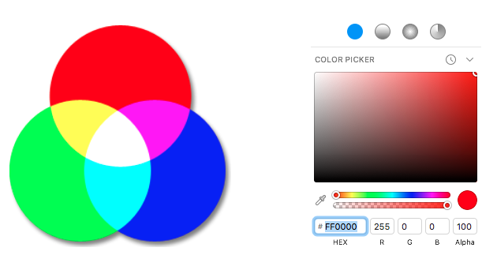

RGB (Red, Green, Blue)是一种颜色模型，它通过三种原色的数值来定义颜色空间:红、绿、蓝,每种颜色的范围从0到255。RGB 模型是一种加法模型，每个原色能够相互结合形成另一个合成色。例如：红色光[R = 255,G = 0, B = 0] 与绿色光[R = 0,G = 255,B = 0] 混合形成黄色光

## HSB

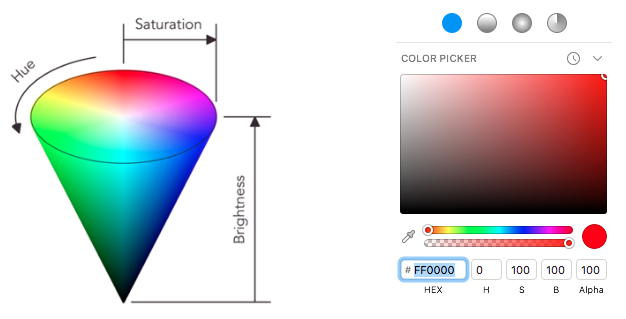

HSB(色相、饱和度、亮度)通过色相、饱和度和亮度来定义颜色空间。

* 色相代表颜色的类型，例如：红、绿、蓝等，它的取值范围是 0 - 360 度
* 饱和度代表色调深浅的程度，它的取值范围是 0 - 100%。单色光的饱和度最高，如果我们想降低饱和度就加白光，白光的越多，饱和度就越低。完全饱和的颜色是指没有渗入白光所呈现的颜色
* 亮度是指颜色的明暗程度，它的取值范围是 0 - 100%，如果要降低亮度就加黑光

## HSL

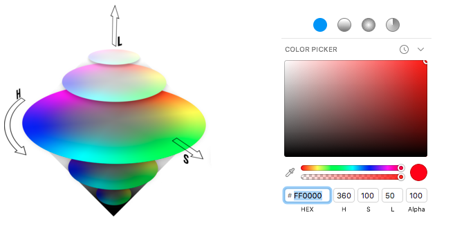

HSL(色相、饱和度、亮度)类似于HSB，但在明与暗之间有一个更加对称的维度。HSL在设计师中很受欢迎，因为它的基本形式与人对颜色的自然理解密切相关，我们对颜色的理解基本上涉及3方面的问题：什么颜色，颜色有多深，颜色有多亮？

* 色相代表颜色的类型，例如：红、绿、蓝等，它的取值范围是 0 - 360 度
* 饱和度代表色调深浅的程度，它的取值范围是 0 - 100%。其中 0% 是灰度它在亮度维度的中间，100%是强烈的颜色。
* * 亮度是指颜色的明暗程度，它的取值范围是 0 - 100%，如果要降低亮度就加黑光

# 什么是 RGB 颜色空间

因为人眼只有对红、绿、蓝颜色敏感的感受器，所以理论上可以把所有可见的颜色分解成这三种原色的组合。彩色显示器仅仅通过混合不同强度的红、绿、蓝，就可以显示数百万种颜色。最常见的做法是将每种颜色的强度范围设置在0到255之间(一个字节)，强度的范围也称为颜色深度。

我们使用三维坐标的形式将三种原色混合在一起，这三个轴分别表示 R(红色)、G(绿色)和B(蓝色),如下所示：

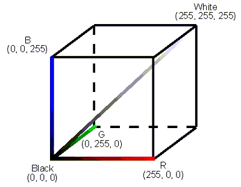

如果你从颜色立方体的黑色原点(0,0,0)到白色原点(255,255,255)画一条对角线，你会得到一条直线，这条直线上的每个点都有相同的R,G和B值,如果三个颜色通道的值相同，他们混合的结果是灰色。当你沿着这条对角线移动时，唯一变化的就是从黑色到白色时灰色阴影的强度。

如果这三个颜色通道的值都是0，这表示光照射，所以结果是黑色，如果这三个通道都是255，这三种光的混合结果是白色，这种混色方式被称为加色混合：

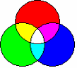

# 色彩管理：概览

“色彩管理”是精确了解图像链中每个设备的色彩特性并将其用于色彩再现的过程。它通常发生在幕后，不需要任何干预，但当颜色问题出现时，理解这个过程可能至关重要。

在数码摄影中，这一成像链通常从相机开始，到最终打印结束，中间可能包括一个显示设备:

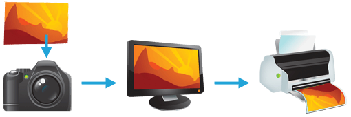

存在许多其他的成像链，但一般来说，任何试图再现颜色的设备都可以从颜色管理中获益。例如，对于摄影来说，你的印刷品或在线图库要按照它们的意图呈现，这通常是至关重要的。颜色管理不能保证相同的颜色复制，因为这是很少可能的，但它至少可以给您更多的控制，任何变化可能发生。

## 需要配置文件和参考颜色

颜色重现有一个基本问题:给定的“颜色数字”并不一定会在所有设备中产生相同的颜色。我们用一个例子来说明为什么会产生问题，以及如何管理它。

假设你在一家餐馆正要点一份辣菜。虽然你喜欢辣，但你的味蕾相当敏感，所以在指定辣味程度的时候你要小心。进退两难的是:对于泰国厨师来说，简单地说“中等”可能意味着一种水平的香料，而对于英国人来说则是完全不同的水平。餐馆可以根据这道菜中辣椒的数量来对其进行标准化，但仅凭这一点是不够的。辣味还取决于品尝者对每种辣椒的敏感度:

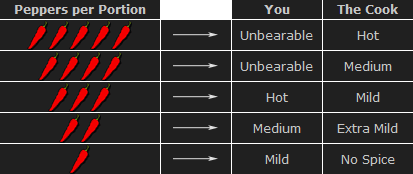

为了解决你的辣味难题，你可以做一次味觉测试，你吃一系列菜，每个菜的辣椒含量都稍微多一点(如上所示)。然后，你可以创建一个个性化的辣度表格，在餐馆里随身携带，指定3等于“辣”，5等于“难以接受”，以此类推(假设所有的辣椒都一样)。下次，当你去一家餐馆说“中等”时，服务员会看着你的表格，把这句话翻译成标准的微辣。然后这个服务员就可以对厨师说要把这道菜做得“微辣”。

总的来说，这一过程包括:(1)确定每个人对辣椒的敏感性;(2)根据辣椒的浓度对辣椒进行标准化;(3)共同利用这一信息，将一个人的“中等”辣度向另一个人的“超温和”辣度转化。这同样的三个原则也被用来管理颜色。

## 颜色配置文件

设备的颜色响应的特征类似于上面示例中创建个性化辣度表的方式。各种各样的数字被发送到这个设备，它的输出在每个实例中被测量:

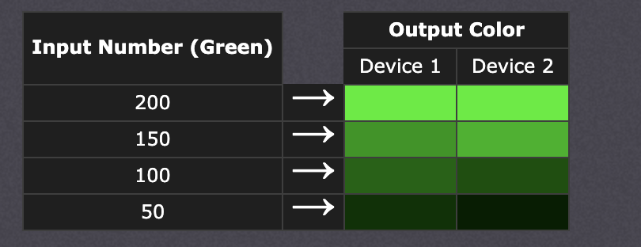

现实世界的颜色配置文件包括所有这三种颜色，更多的值，通常比上面的表格更复杂-但同样的核心原则适用。但是，就像辣的例子一样，单靠配置文件是不够的，这些配置文件必须记录与标准参考颜色相关的内容，你需要用到一个颜色识别的软件，这个软件使用颜色配置文件在不同的设备之间翻译颜色。

## 颜色管理概述

下面的图显示了显示设备和打印机之间转换颜色时的流程:

* Characterize：每个颜色管理设备都需要一个它自己的颜色配置文件，这个颜色配置文件用来描述特定设备的颜色响应。
* Standardize：每个颜色配置文件描述这些颜色相对于一组标准化的参考颜色
* Translate：颜色管理软件使用这些标准化配置文件将颜色从一个设备转换到另一个设备。这通常是由色彩管理模块(CMM)执行。

上述色彩管理系统是由国际色彩协会(ICC)标准化的，现在大多数计算机都在使用。它涉及几个关键概念:颜色配置文件(上面讨论过)、颜色空间和颜色空间之间的转换。

颜色空间：这只是一种引用由特定颜色配置文件描述的颜色/阴影集合的方法。换句话说，它描述了所有可实现的颜色组合。因此，颜色空间是理解两个不同设备之间颜色兼容性的有用工具
Profile Connection Space：这是一个作为标准化参考的颜色空间(“参考空间”)，它独立于任何特定设备的特性。PCS通常是CIE定义的所有可见颜色的集合，并被ICC使用。
Color Translation：CMM 是颜色管理的主要模块，它执行从一个颜色空间转换到另一个颜色空间所需的所有计算，这个过程通常是复杂的。如果打印机不能产生和显示设备一样强烈的颜色会怎样?这被称为“色域不匹配”，意味着不可能精确重现。因此，在这种情况下，CMM只能尽可能地寻找最好的近似。

# 色彩管理：颜色空间

颜色空间是一个有用的概念性工具，我们可以用它理解特定设备或数字文件的颜色功能。当尝试在另一个设备上再现颜色时，颜色空间可以显示你是否能够保留阴影/高亮细节、颜色饱和度以及两者的折衷程度。

## 数字调色板

就像艺术家在调色板上混合原色，以便看到他们所要绘制的颜色/色度范围一样，颜色空间实际上就是一个数字调色板，不同的是颜色空间中这些颜色更精确地组织和量化。

然而，与艺术家的调色板不同的是，色彩空间通常是看不见的，它只是在幕后起作用。即便如此，学习将它们形象化可以帮助你为给定的任务找到最合适的颜色空间

## 可视化的颜色空间

颜色空间将数字与实际的颜色联系起来，你可以认为颜色空间是一个包含所有可实现的颜色组合的三维物体。“色彩空间”中的每个纬度通常代表颜色的某些方面，如明度、饱和度或色相，颜色空间的各个纬度表示什么含义，这取决于颜色空间的类型。

下图中显示了从不同的角度观察颜色空间的样子，空间的最外层是这个颜色空间能够表示的最纯的颜色，空间的内部是各个方向的混合

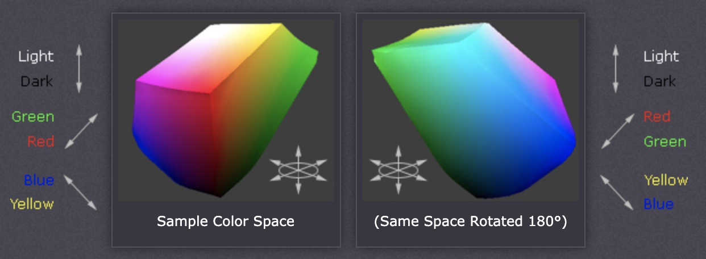

上面的图表旨在帮助您定性地理解和可视化颜色空间，但是它对于现实世界的颜色管理并不是很有用。这是因为一个颜色空间几乎总是需要与另一个空间相比较。

## 比较颜色空间

为了一次显示多个颜色空间，颜色空间通常使用其完整的3D形状的二维切片来表示。这在日常用途中更有用，因为它们允许你快速地看到给定横截面的整个边界。除非特别说明，二维图表通常显示包含50%亮度的所有颜色的横截面(上面显示的颜色空间的垂直中点的水平切片)。

下图同时比较了三个颜色空间:sRGB、宽色域RGB和一个与设备无关的参考空间。sRGB和宽色域RGB是两个工作空间，有时用于图像编辑。

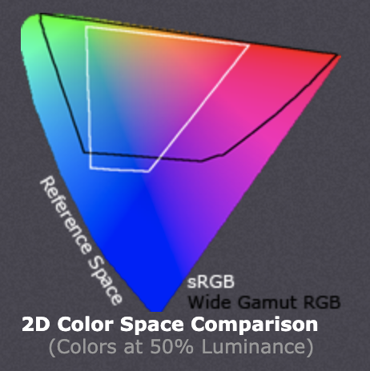

我们能从2D颜色空间的比较中推断出什么?黑色和白色的轮廓显示了每个颜色空间可复制的颜色，作为一些参考空间的子集。参考颜色空间中显示的颜色仅用于定性可视化，因为这取决于显示设备呈现颜色的方式。此外，参考空间几乎总是包含比计算机显示更多的颜色。

从上图中，我们可以看到“宽色域RGB”颜色空间包含更多的红色、紫色和绿色，而“sRGB”颜色空间包含更多的蓝色。请记住，这种分析只适用于50%亮度的颜色，这是占据图像直方图中间色调的颜色。

## 类型:设备相关和工作空间

颜色空间有许多不同的类型和应用。常见的术语包括:

* 与设备相关的空间：表示相对于其他一些参考空间的颜色。它们可以告诉您有关颜色子集的有价值的信息，这些信息可以使用特定的显示器或打印机显示，或者可以使用特定的数码相机或扫描仪捕获。
* 与设备无关的空间：以绝对的形式表示颜色。这些颜色通常是通用的参考色，所以作为比较其他设备的背景很有用。否则，这些通常是一个看不见的色彩空间，因为它们在照片编辑过程中只会有意识地相互作用。
* 工作空间：被图像编辑程序和文件格式用来限制颜色的范围到一个标准的调色板。数字摄影中最常用的两个工作空间是Adobe RGB 1998和sRGB IEC61966-2.1

能够实现更极端颜色的设备或工作空间被称为“宽色域”，而“窄色域”的颜色空间则相反。

## 参考空间

在之前的颜色空间比较中显示的参考空间是什么?今天几乎所有的颜色管理软件都使用 1931 年 CIE 定义的与设备无关的空间。这个空间的目的是描述所有人眼可见的颜色。

CIE可见色空间有几种常见的形式:CIE xyz (1931)， CIE L*a*b*和CIE L u'v'(1976)。每一个都包含相同的颜色，但是它们分配这些颜色的方式不同:

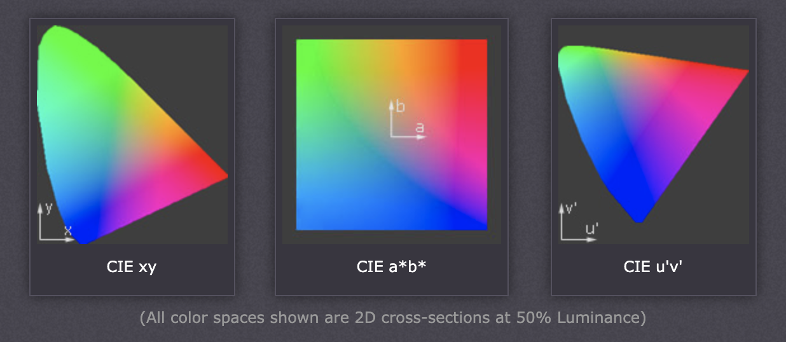

CIE xyz是基于人类眼睛中三种颜色传感器的信号的直接图表。这些也被称为X, Y和Z三刺激函数(创建于1931年)。然而，这种表示方式将太多的区域分配给了绿色——将大部分明显的颜色变化限制在一个小区域内。

CIE L u'v'被创建来纠正CIE xyz失真，通过分配颜色大致成正比他们感知的颜色差异。因此，u'v'中两倍大的区域看起来也会有两倍的颜色多样性——这使得它在可视化和比较不同颜色空间时更加有用。

CIE L*a*b*重新映射可见的颜色，使它们在两个轴上相等地延伸——方便地填充一个正方形。L*a*b*颜色空间中的每个轴也代表一个容易识别的颜色属性，例如红绿和蓝黄偏移(在本教程开始时的3D可视化中使用)。这些特性使L*a*b*成为编辑数字图像(如Adobe Photoshop, GIMP等)的有用颜色空间。

# 颜色空间转换

颜色空间转换是当一个颜色管理模块(CMM)将颜色从一个设备的空间转换到另一个设备的空间时发生的事情。

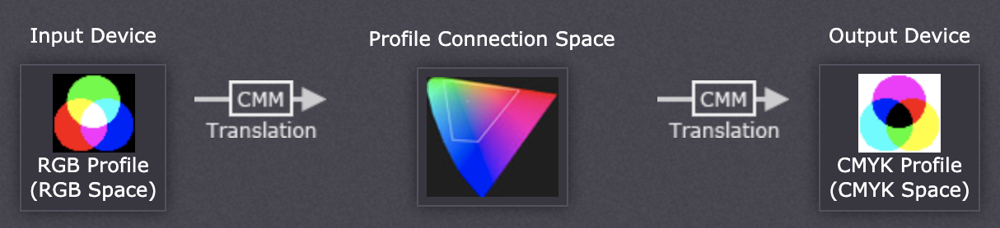

## 背景:色域不匹配和渲染意图

translation 阶段试图在设备之间创造出最佳匹配——即使在看起来不兼容的情况下。如果原始设备的色域比最终设备的色域大，那么原始设备中的一些颜色就会超出最终设备的颜色空间，这种情况被称为色域不匹配，色域不匹配发生在几乎每一个转换中。

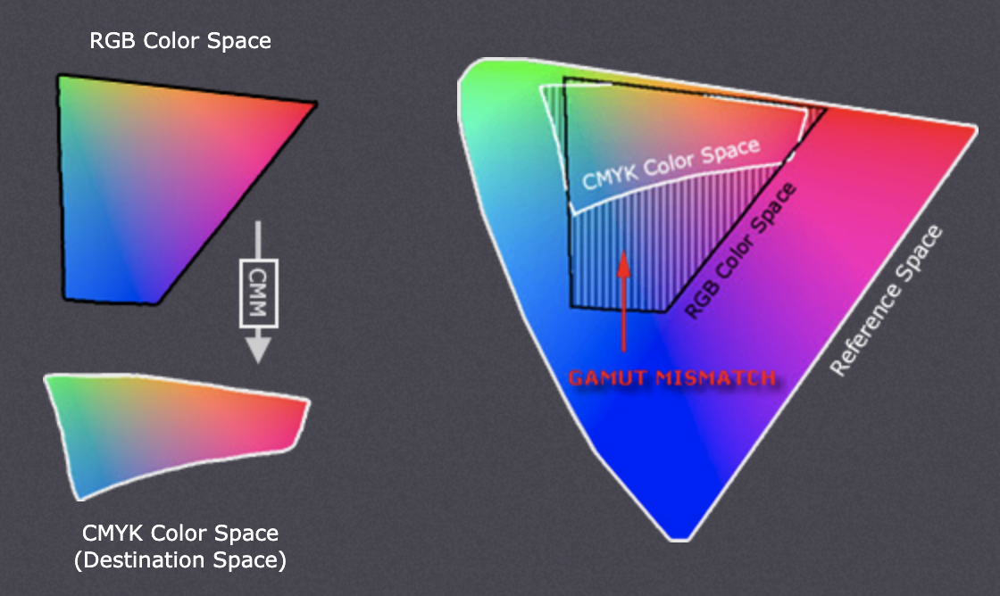

每次出现色域不匹配时，CMM使用渲染意图来决定应该优先处理的图像质量。常见的渲染意图包括:绝对和相对比色、感知和饱和，每种渲染意图类型都以牺牲其他颜色属性为代价来维护一种颜色属性(如下所述)。

## 知觉和相对比色意图

感知和相对比色渲染可能是数字摄影中最有用的转换类型。在色域不匹配的区域中，每一种颜色都有不同的优先级。相对比色法在色域之间保持一种接近准确的关系，即使这种关系超出了色域。相比之下，知觉渲染也试图保持非色域颜色之间的一些关系，即使这会导致色域不准确。下面的例子演示了一维黑-品红色空间中的图像的极端情况:

请注意感知如何通过压缩整个色调范围来保持平滑的色彩渐变，而相对比色剪辑出了色域(在洋红色球状体的中心和它们之间的黑暗)。对于2D和3D颜色空间，相对比色法将它们映射到目标空间中最近的可再现色调。

尽管感知渲染压缩了整个色域，请注意它是如何比色域边缘更精确地重新映射中心色调的。具体的转换取决于转换使用的三坐标测量机;Adobe ACE, Microsoft ICM和Apple colorsync是最常见的一些。

另一个区别是，感知不会破坏任何颜色信息——它只是重新分配它。另一方面，相对比色法会破坏颜色信息。这意味着使用相对比色意图的转换是不可逆的，而感知可以逆转。这并不是说，从空间A转换到B，然后再使用感知返回到A将再现原始;这将需要小心使用色调曲线来逆转转换引起的颜色压缩。

## 绝对比色意图

绝对与相对比色相似，它保留色域和剪辑色域以外的颜色，但它们处理白点的方式不同。白点是一个颜色空间中最纯净和最轻的白色的位置(参见色温的讨论)。如果在白色和黑色点之间画一条线，这将通过最中性的颜色。

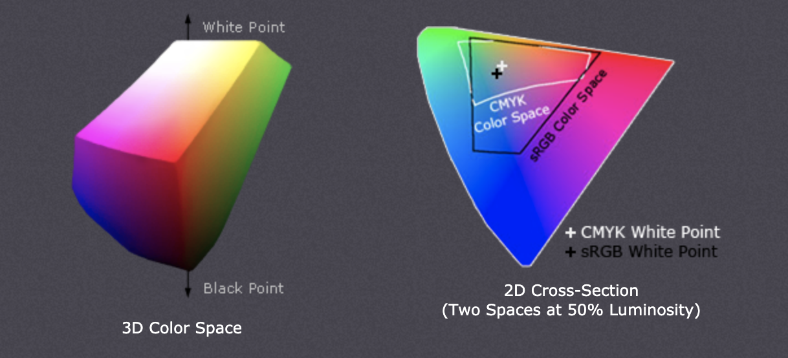

这条线的位置经常在颜色空间之间改变，如右上方的“+”所示。相对比色法使色域内的颜色倾斜，使一个空间的白点与另一个空间的白点对齐，而绝对比色法保持颜色准确(不考虑改变白点)。为了说明这一点，下面的例子展示了两个具有相同色域但不同白点的理论空间:

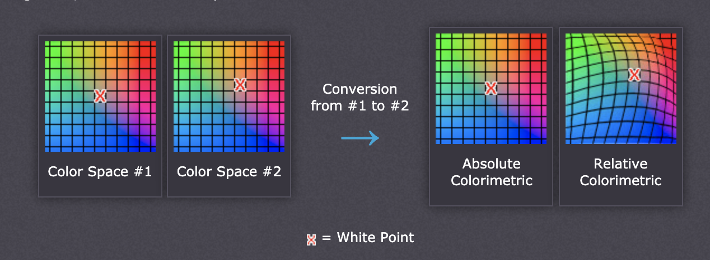

绝对比色保留了白点，而相对比色实际上取代了颜色，使旧的白点与新白点对齐(同时仍然保留颜色的相对位置)。颜色的精确保存可能听起来很吸引人，然而相对比色法调整白点是有原因的。没有这种调整，绝对比色结果不雅观的图像颜色变化，因此很少感兴趣的摄影师。

这种颜色偏移的结果是因为颜色空间的白点通常需要与使用的光源或纸张颜色的白点对齐。如果有人打印到一个颜色空间的纸与蓝色色调，绝对比色将忽略这种色调变化。相对比色法可以补偿颜色，以解释这样一个事实，即最白和最轻的点有一种蓝色的色调。

## SATURATION INTENT

饱和度渲染意图试图保持饱和的颜色，当转换为更大的颜色空间时，在试图保持计算机图形的颜色纯度时最有用。如果最初的RGB设备包含纯(完全饱和)颜色，那么饱和意图将确保这些颜色在新的颜色空间中保持饱和——即使这会导致颜色变得相对更加极端。

饱和度意图不能应用与照片，因为它不会试图维持颜色的真实度。维持色彩饱和度可能会以牺牲色相和亮度为代价，这通常是照片复现不可接受。另一方面，这对于像饼图这样的计算机图形来说是可以接受的。

饱和度意图的另一个用途是在喷墨打印机上打印计算机图形时避免可见的抖动。一些抖动可能是不可避免的，因为喷墨打印机从来没有一个墨水来匹配每一个颜色，然而饱和意图可以减少那些情况，抖动稀疏，因为颜色非常接近纯色。

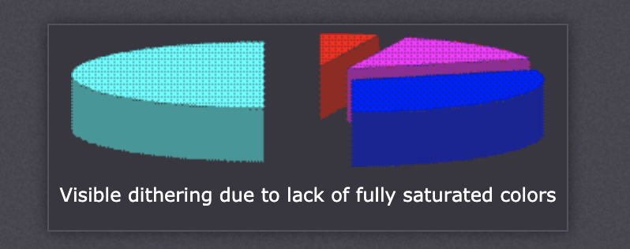

## 注意图像内容

我们必须考虑图像颜色的范围;一个图像是由一个大的颜色空间定义的，并不意味着它使用了所有的颜色，如果目标颜色空间完全包含图像的颜色(尽管比原始空间小)，那么相对色度将产生更准确的结果。

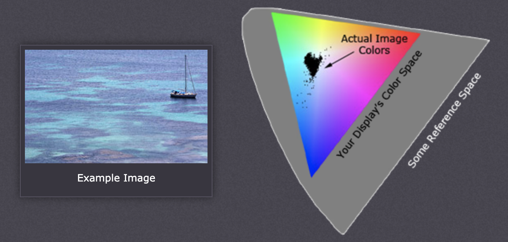

上面的图像几乎没有利用你的计算机显示设备的色域，这实际上是典型的许多摄影图像。如果将上述图像转换为含有较少饱和的红色和绿色的目标空间，则不会将任何图像颜色放置在目标空间之外。在这种情况下，相对比色法可以得到更准确的结果。这是因为感知意图压缩了整个色域——不管这些颜色是否被实际使用。

## 阴影和高亮3d颜色空间的细节

现实世界的照片利用三维色彩空间，即使到目前为止，我们主要分析的是一维和二维的空间。在3D颜色空间中渲染意图的最重要的结果是它如何影响阴影和高亮细节。

如果目标空间不能再重现微妙的暗色调和高光，当使用相对/绝对比色意图时，这个细节可能会被剪辑。感知意图压缩这些暗色调和淡色调以适应新空间，然而这是以降低整体对比度为代价的(相对于用色度意图产生的效果)。

感知比色和相对比色之间的转换差异类似于前面用洋红色图像所证明的。主要的区别是，现在压缩或剪切发生在垂直维度-阴影和高亮颜色。大多数照片不能产生我们在电脑显示器上看到的光到暗的范围，所以这一点在打印数码照片时特别重要。

使用“黑点补偿”设置可以帮助避免阴影裁剪-即使是绝对和相对比色意图。这在几乎所有支持颜色管理的软件(如Adobe Photoshop)的转换属性中都是可用的。

## 建议

那么，数码摄影的最佳渲染意图是什么呢?一般来说，知觉比色法和相对比色法最适合摄影，因为它们的目的是保持原始的视觉外观。

何时使用这些取决于图像内容和预期用途。带有强烈色彩的图像(如明亮的日落或明亮的花卉布局)将使用感知意图在极端色彩中保留更多的颜色层次。另一方面，这可能会以压缩或钝化更温和的颜色为代价。具有更微妙色调的图像(如一些肖像)往往受益于相对比色法(假设没有颜色被放置在色域不匹配区域内)更高的准确性。感知意图总体上是通用和批量使用的最安全的赌注，除非你知道每个图像的细节。

# 色彩空间的基本指南

## 什么是颜色空间

让我们从颜色空间的定义开始。颜色空间描述了一定范围内可测量的颜色和亮度值，它最基本的实用功能是描述捕捉或显示设备再现颜色信息的能力。

例如，如果我有一个在任意“颜色空间a”中拍摄的相机，我拍摄的任何颜色和/或亮度值超过该空间所能定义的值都将无法准确的重现，这些超出颜色空间的值可以用不同的方法处理(有些方法在视觉上比其他方法更悦目)，但是不管怎么处理都不能准确地复现它们在现实世界中出现的样子。使用颜色空间B 的显示器也有同样的问题，数字图像中任何超出颜色空间 B 的颜色值都不能被准确的显示出来。在这两种情况下，更大的颜色空间意味着更大范围的颜色可以被准确捕捉或重现。

此外，确保在颜色空间a中捕捉到的场景和在颜色空间B中渲染的场景的准确再现的唯一好方法是注意捕捉空间和渲染空间之间的差异，并从数学上将信号从一个颜色空间转换到另一个颜色空间。提供一种确保从捕捉到显示的颜色准确性的方法是显式定义的颜色空间的另一个基本功能。

一些颜色空间的名称你可能已经很熟悉，包括Rec. 709, Rec. 2020, DCI-P3, Arri LogC和RedWideGamutRGB。

如果我们将颜色空间当作3d世界中的一个物体，颜色空间会变得更加直观

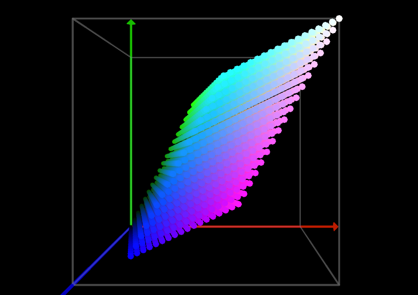

好的，我们现在知道颜色空间定义了颜色和亮度的范围，我们也知道，没有那两个人看待事物的方式是相同的——那么你如何明确地定义像颜色这样光滑的东西呢?令人抓狂的答案是，一个颜色空间只能根据另一个颜色空间来定义。

那么，这种疯狂到什么时候才能结束呢?更好的是，它从哪里开始?是否存在一个基本的颜色空间，与其他所有颜色空间相对照?幸运的是,有。在 1931 年 ICE 定义了一个基于人类感知的颜色空间，这个颜色空间是通过实验测出来的，在目前为止 ICE 在 1931 年定义的这个颜色空间依然是其他颜色空间的标准参考。

## 我为什么关心颜色空间？

好问题!事实是，在运动成像的历史上，除了设计电影胶片的图像科学家，以及后来负责视频采集和广播标准化的工程师之外，这颜色空间对任何人都不重要。我们其他人只能站在他们的肩膀上，在预先设想的管道中操作从捕获到交付。内容创造者几乎没有任何选择或控制。

今天，那些固定的管道和工作流程已经成为过去。源材料可以来自几十种可用的捕捉格式中的一种或几种——iPhone、GoPro、佳能、索尼、RED、Alexa、35mm等——其中许多本身提供多种颜色空间选择。在交付方面，特定内容可能需要在影院、特别提款权和/或HDR电视上播放，更不用说不断增长、不断变化的移动设备和VR设备列表。

这是一个复杂的情况，但它指向一个简单的事实:

我们所捕捉的色彩空间，我们将镜头引导到我们的交付色彩空间的方式，以及在这个过程中我们选择在哪里以及如何进行评分都由我们自己决定，并且对我们的图像的影响不亚于评分本身。

这就是为什么理解色彩空间如此重要，因为如果不了解它，就有可能创造出劣质的图像。

## 定义一个颜色空间

正如我们之前所了解的那样，我们能够根据 CIE 定义的标准参考定义一个新的颜色空间。但在实践中，我们如何清晰而简单地使用这些定义来描述捕获设备或显示?最常见的方法是指定gamut, gamma, 和 white point.

### Gamut

色域是指出了颜色空间中的颜色范围。可以把色域当成颜色空间的边界，如Rec. 709。

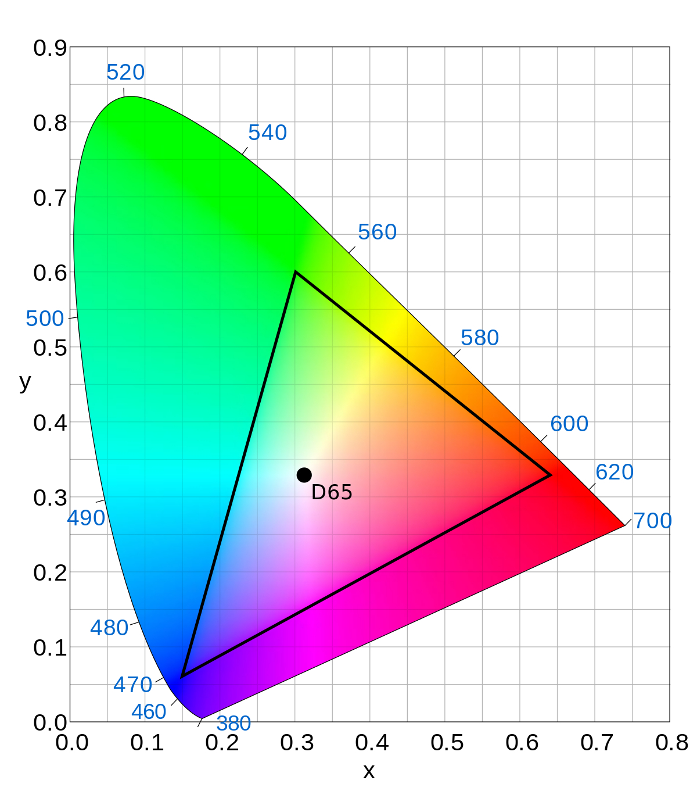

正如你在上图中所看到的，色域可以很容易地绘制在2D图上，但这样做我们还没有完全定义我们的颜色空间。要做到这一点，我们需要三维亮度。

### Gamma

Gamma 曲线也叫色调映射映射曲线，它与非线性的亮度值分布有关，不同的 Gamma 曲线有不同的目的。

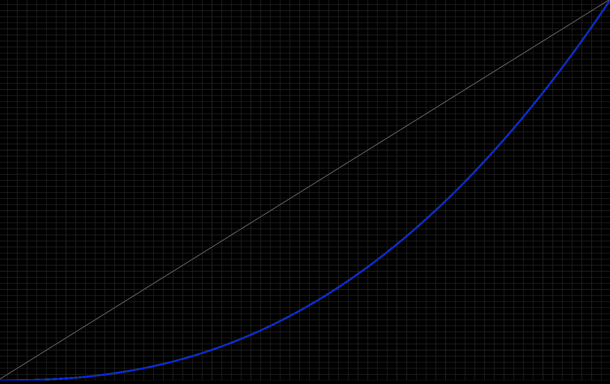

上图是 Gamma 2.4 色调映射曲线，当我们从纯黑色(左下)移动到纯白色(右上)时，蓝色曲线显示了亮度值的非线性分布，白色曲线表示线性分布，线性分布会从左下到右上沿直线移动。

例如，一个对数曲线(如Arri LogC)被设计用来存储最大的动态范围，而Gamma 2.4曲线被设计用来编码亮度值，对人眼感觉是线性的。

下图是 gamma 校正之前的图像

下图是 gamma 2.4 校正之后的图片

### White point

在日常生活中，我们能够准确的识别出白色，如果我在用荧光灯照射的办公室给你一张白纸，然后在阳光明媚的室外再给你一张相同的白纸，你会发生在这两种场景下的白色是不一样的，即便你用同一个相机去拍摄这两个场景中的白纸，它也会得到两个不同的效果。

这是因为我们的眼睛不断地适应环境，利用环境和视觉线索来定义白色。数字传感器和显示器(通常)不是设计来做这个的，所以我们必须为它们提供这些信息。这也意味着我们需要这些信息来精确地定义一个颜色空间。在相机的情况下，我们基本上需要一个数字颜色值来解释相机在捕获时看到的白色，因为显示器可能有不同的目标白点。

把白色想象成一个不固定的变量是很棘手的，但当涉及到图像和显示时，这就是现实。白点通常表示为色温，如3200K或5600K，或作为CIE定义的标准光源之一。

更让人困惑的是，在描述颜色空间时，白点通常是暗含的，而不是明确表示的。正如我们将在下面看到的，在相机的情况下，它是可变的，取决于原始场景。

现在我们已经讨论了这三个参数，下面是一些实际示例：

* An Arri Alexa records media in Arri Wide Color Gamut, with an Arri Log C tone mapping curve, and a white point ranging from 2,000K to 11,000K.
* A RED Dragon captures media in RedWideGamutRGB gamut, with a Log3G10 tone mapping curve, and a white point ranging from 1,700K to 10,000K (other gamut and gamma choices are available).
* A cinema projector has a DCI-P3 gamut, a Gamma 2.6 tone mapping curve, and a standard illuminant D63 white point.
* An SDR TV has a Rec 709 gamut, a Gamma 2.4 tone mapping curve, and a standard illuminant D65 white point.

## 原则和最佳实践

现在我们已经有了一个坚实的技术基础，下面是一些关键的实用原则，可以理解在您的工作流中考虑颜色空间。

### 任何颜色空间都可以通过正确的数学方法转换成其他颜色空间。

这里有一个注意事项：当从一个较大的空间转换到一个较小的空间时，会出现所谓的“域外”值来应对在源空间中无法复制的值。有许多方法可以处理这些不匹配域，但没有办法绕过它们，你不能在数学和物理上作弊。

有各种各样的转换颜色空间的工具，但我最喜欢的是DaVinci Resolve内部的color space Transform插件。

在上图，颜色空间转换插件将一张 Arri Log C/Arri 宽色域图片转换成 RedWideGamutRGB/Log3G10。当目标颜色空间明显小于源颜色空间时，色调和色域映射就起到了主要作用。请注意，颜色空间变换不转换白点，所以如果源颜色空间和目标颜色空间不共享一个共同的白点，您需要考虑这一点，幸运的是，Resolve 16，还有第二个插件是为这个目的设计的，叫做“半音改编”。

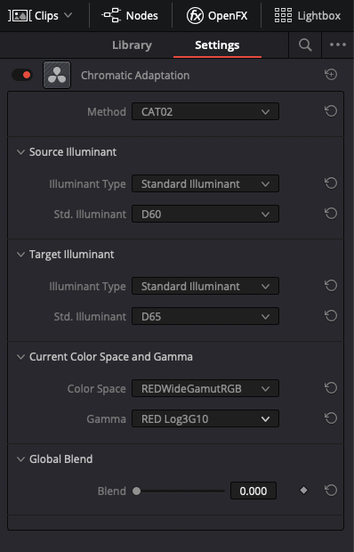

在上面的截图中，Chromatic Adaptation 插件取一个标准光源D60的白点输入图像，并将其转换为标准光源D65的白点。请注意，您需要指定当前颜色空间的色域和 gamma。在上图中选择的颜色空间是 REDWideGamutRGB，gamma 是 Red Log3G10。“方法”下拉列表允许用户在几种算法之间选择进行这种转换，但它们之间的差异相对较小，特别是像这样的小调整。它通常可以保留其默认值CAT02。

记住，为了成功地在颜色空间之间转换，你总共需要6条信息:原始色域、gamma 和白点;以及目标色域，gamma 和白点。

### 在几乎所有情况下，给定的内容片段在交付之前至少需要转换一次颜色空间。

至少，在交付内容之前，您几乎肯定需要从相机颜色空间转换到显示器颜色空间，除非这些恰巧是相同的，这在专业工作流中越来越少。

### 在任何环境中，相同的工具会根据你操作的颜色空间产生不同的效果。

这意味着为了获得一致的行为和结果，理想的方法是在您的工作流中引入第三个颜色空间，在捕获颜色空间和传递颜色空间之间。我们称之为中间空间，或分级空间。我们的想法是，所有的源材料都映射到这个空间，通过应用一个单一的变换来获得我们的显示颜色空间，从而创建我们的最终交付品。

为什么不跳过中间空间，映射到统一配送空间后再做我们所有的评分呢?原因有很多，但也许最大的一个原因是，当在更大的颜色空间中上游进行颜色分级时，效果更好。效果来得更快，看起来更好，感觉更自然。你可以把它想象成在蛋糕放入烤箱前和放入烤箱后对配料进行调整的区别。

### 在任何图像管道中，理想的颜色空间会随着我们从捕捉到传送而逐渐变小。

为什么?因为一旦我们的图像在一个给定的颜色空间中，它之外的任何颜色就永远消失了。我们想要准确地捕捉并尽可能长时间地保留尽可能多的颜色，只为了最终显示而做出妥协，这是无法避免的。

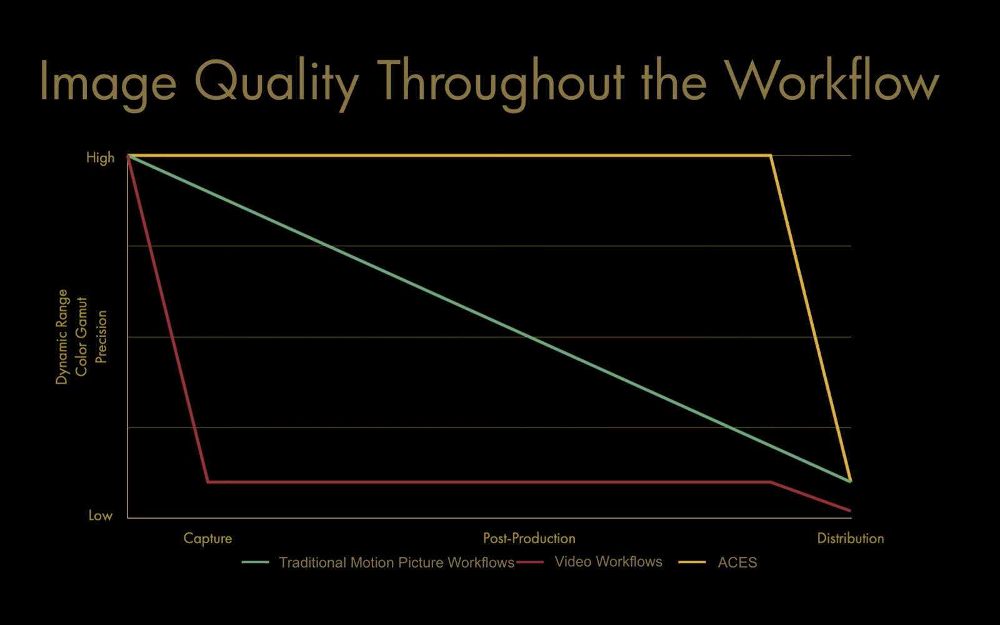

使用这种方法，您最终会得到一个具有巨大的、不受未来影响的颜色空间的图像结果，可以很容易地将其转换为针对其他显示器的颜色空间。稍后，我们将详细介绍这种类型的工作流。

## 颜色空间与颜色模型

在这篇文章中，我们已经讨论了很多关于什么是颜色空间的内容，但是了解它们不是什么也很重要。一个重叠但不同的概念是颜色模型，如RGB、LAB、HSV、CMY和XYZ。

与颜色空间不同，颜色模型并不是要表达不同的颜色和亮度范围，而是要以不同的方式表达相同的颜色和亮度范围。

我们通常最熟悉RGB颜色模型，在该模型中，我们根据红、绿、蓝的比例来描述给定的颜色。其他颜色模型用其他方式来描述目标颜色——例如，HSV 根据颜色的色相、饱和度和亮度来描述颜色。

与颜色空间一样，我们可以从一种颜色模型转换为另一种颜色模型，不同的是颜色模型的转换不会产生视觉上的变化。尽管如此，在不同的颜色模型之间转换仍然有许多创造性和技术性的原因——但那是另一个话题。

## 一个示例工作流

接下来我们将把我们学过的所有东西放到一个实际的现实世界的例子中。

在这个假设的场景中，我们正在制作一个两个小时的纪录片，包括多个来源- Arri Alexa，索尼FS7，和档案视频-这将需要交付到SDR广播和流媒体，HDR广播和流媒体，以及影院发布。从一开始我们便面临着一些挑战:

* 我们如何处理源颜色空间的不匹配?
* 我们应该在什么颜色空间中往返我们的视觉效果?
* 我们应该要求提供什么样的颜色空间的图形?
* 我们是否必须放弃任何全局 LUTs 或 filters，因为它们会根据源颜色空间产生不同的结果
* 在有限的时间和成千上万的镜头来评分，我们如何建立一个控制我们感到舒适和自信的评分环境?
* 我们如何确保在我们的各种可交付成果中最一致的外观?
* 我们如何避免不断依赖主观补偿和猜测来让一切感觉统一，从而把自己逼疯?

这些问题的答案都是一样的:利用我们对颜色空间的理解，采用颜色管理的工作流程，尽可能地消除猜测和主观补偿。

什么是颜色管理的工作流?这不过是一个花哨的术语，用来形容一个工作流，它是以一种有颜色空间意识的方式设计的。

以下是它在流程图中的样子:

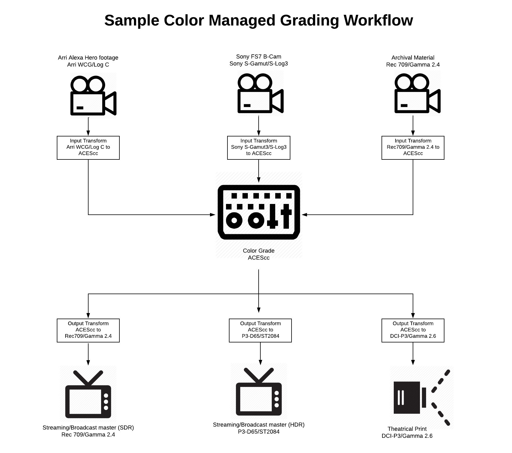

我们将原材料映射到一个大的统一的分级空间，在本例中，我用ACES表示，但唯一重要的因素是空间足够大，所有东西都正确地转换到它。我们可以很容易地使用Arri WCG/Arri Log C作为我们的分级空间。

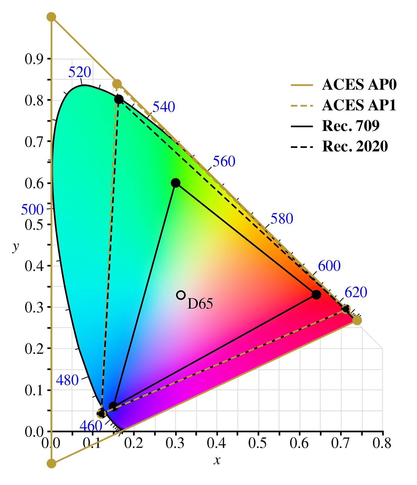

ACES AP0颜色空间包含了人类所能看到的所有颜色，与 ACES AP0 相比 Rec. 709、Rec. 2020的颜色范围小很多，而且使用更小的ACES AP1空间足够了。

一旦我们使用源材料的颜色空间要源材料正确地映射到ACES中，我们就可以进行分级了。因为现在所有的内容都是同一个颜色空间，我们将无需进行最初的视觉匹配，我们的工具将在每个来源中拥有更一致的“感觉”。我们现在不仅可以在单个镜头上部署lut或插件，还可以在整个场景上部署lut或插件，如果我们愿意，甚至可以在整个电影中部署lut或插件。

这并不是说我们已经神奇地让我们的纪录片看起来像Alexa(或者反之亦然)，仅仅通过在一开始有效地管理我们的色彩空间，我们更接近一个视觉流动的电影。我们也将在单个空间中运输任何需要视觉特效的镜头，并可以要求他们在相同的空间交付回来。

在我们的分级过程中，我们有一个下游的颜色空间转换，将我们从ACES转移到我们的主屏的颜色空间，我们使用它来做出我们的创造性的选择。在任何时候，我们都可以将我们的评分系统连接到另一个显示器上，如果我们想要看到我们的工作如何转换到我们的其他目的地显示器上，就可以切换这个转换。

我们可能会发现自己想要针对某个交付内容做出一些主观的调整，但这只是一个例外，而不是规则，而且我们很容易发现它们，因为我们不会因为每次追逐和调整视觉差异而感到疲劳。

最后，我们基本上有一个单一的分级电影，与不同的大师针对我们的三个交付空间。最重要的是，我们为下周或明年可能需要的额外交付品做好了准备，不管需要的颜色空间是什么。

## Closing

祝贺你看到这一个通过颜色空间可以是一个非常令人生畏的话题。如果你感到困惑，或者有问题，那很好!这意味着你正在学习。再看一遍这篇文章，把你的问题贴在下面。

这可能需要数年的时间来熟练掌握这些概念，但你学到的每一点都是一个巨大的添加到你的武库作为一个电影制作人。如今，理解色彩空间比以往任何时候都更重要，而且随着我们的相机和屏幕不断增加，色彩空间的价值只会不断增长。

记住，这最终不是关于记忆技术数据，而是关于塑造你的思维。将自己投入到这些概念中会让你对自己的技艺有一个更清晰、更权威的掌握，并创造出那种吸引你去拍摄电影的令人瞠目的图像。

# 颜色空间——维基百科

“颜色空间”是一个有用的概念性工具，用于理解特定设备或数字文件的颜色功能。当尝试在另一个设备上再现颜色时，颜色空间可以显示你是否能够保留阴影/高亮细节、颜色饱和度以及两者的折衷程度。

颜色模型是一种抽象的数学模型，它使用数字组合的方式来描述颜色，通常是3个或者4个数字。在颜色模型和参考颜色空间之间添加特定的映射函数，可以在参考颜色空间中建立一个明确的“足迹”，称为色域，对于给定的颜色模型，这就定义了一个颜色空间。例如：Adobe RGB和sRGB是两个不同的绝对颜色空间，他们都是基于 RGB 颜色模型的。

在定义颜色空间时，通常的参考标准是 CIELAB 或 CIEXYZ 颜色空间，它们被专门设计为包含人类平均可以看到的所有颜色。

因为“颜色空间”标识了颜色模型和映射函数的特定组合，所以这个词经常被非正式地用于标识颜色模型。然而，即使识别颜色空间自动识别相关的颜色模型，这种用法在严格意义上是不正确的。例如，虽然一些特定的颜色空间是基于RGB颜色模型的，但不存在所谓的单一RGB颜色空间。

## 历史

在 1802 年，Thomas Young 假设在人眼中存在3种不同的光感受器（现在被称为锥细胞），每一种都会特定范围的光敏感。1850年，赫尔曼·冯·赫姆霍兹进一步发展了杨-赫姆霍兹理论:根据视锥细胞对照射视网膜的光波长的反应，可将其分为短偏好(蓝色)、中偏好(绿色)和长偏好(红色)三种类型。三种视锥细胞检测到的信号的相对强度被大脑解释为一种可见的颜色。但是这个时候还没有颜色空间的概念。

颜色空间的概念很可能是由Hermann Grassmann提出的，他将其分为两个阶段。首先，他发展了向量空间的思想，使几何概念在n维空间中的代数表示成为可能Fearnley-Sander(1979)将Grassmann的线性代数基础描述为:

线性空间(向量空间)的定义…在1920年左右，Hermann Weyl和其他人发表了正式的定义后，才广为人知。事实上，这样的定义早在30年前就由  Peano 给出了，因为他对Grassmann 的数学工作非常熟悉。Grassmann 并没有给出一个正式的定义，因为没有可用的语言，但毫无疑问，他有这个概念。

有了这个概念背景，Grassmann 在1853年发表了一个关于颜色如何混合的理论;他的三种颜色定律仍然被教授，如格拉斯曼定律

正如格拉斯曼首先指出的……该光集在无限维线性空间中具有锥状结构。因此，光锥的商集(关于同色异谱)继承了光锥结构，使颜色在三维线性空间中可以表示为凸锥，称为色锥

## 例子

在基于CMYK颜色模型的色彩空间印刷中，可以使用颜料的减法原色(青色、品红、黄色和黑色)创建颜色。为了创建给定颜色空间的三维表示，我们可以将洋红的数量分配给表示的X轴，青色的数量分配给它的Y轴，黄色的数量分配给它的Z轴。由此产生的3d空间为每一种可能的颜色提供了独特的位置，这些颜色可以通过组合这三种颜料来创建。

颜色可以在计算机显示器上使用基于RGB颜色模型的颜色空间创建，使用加色原色(红、绿、蓝)。三维表示将把这三种颜色分别分配到X、Y和Z轴上。请注意，在给定的显示器上产生的颜色将受到复制介质的限制，如荧光粉(在CRT显示器)或滤镜和背光(液晶显示器)。

在显示器上创建颜色的另一种方法是使用HSL或HSV颜色空间，基于色相、饱和度、亮度(值/亮度)。在这样的空间中，变量被赋给柱坐标。

许多颜色空间可以用这种方式表示为三维值，但有些具有更多或更少的维度，而有些(如[潘通](https://en.wikipedia.org/wiki/Pantone#Pantone_Color_Matching_System))则根本不能用这种方式表示。

## 颜色空间转换

颜色空间转换是一种颜色从一种基转换到另一种基的转换。这通常发生在将在一个颜色空间中表示的图像转换为另一个颜色空间的上下文中，其目标是使翻译后的图像尽可能地与原始图像相似。

ICC 文件定义了目标颜色空间相对于 CIE XYZ 颜色空间之间应该如何进行颜色转换。

以从RGB色彩空间转换到CMYK色彩空间的过程为例。首先取得两者的ICC色彩色性文件。然后按照RGB的ICC文件中的定义将其RGB值转换至特性文件相关空间（Profile Connection Space，PCS，这是设备无关颜色空间，通常是 ICE XYZ 颜色空间）。最后将PCS中的数值转换成目标的C、M、Y、K四个数值。

由于RGB和CMYK空间都是依赖于设备的空间，因此没有简单或通用的转换公式来在它们之间进行转换。转换通常通过颜色管理系统完成，使用描述被转换空间的颜色配置文件。ICC配置文件定义了中性的“配置文件连接”颜色空间(CIE XYZ或Lab)与我们感兴趣的颜色空间(在本例中为RGB和CMYK)之间的双向转换。转换的精度取决于配置文件本身，准确的方法，以及由于色域通常不匹配，渲染意图和墨水限制等约束。

颜色转换，或颜色空间转换，是一种颜色的表示从一个颜色空间到另一个颜色空间的转换。在颜色管理链中交换数据并由颜色匹配模块执行时，都需要进行此计算。将配置文件颜色信息转换为不同的输出设备是通过将配置文件数据引用到一个标准颜色空间来实现的。它可以更容易地将颜色从一个设备转换为选定的标准颜色空间，并从该颜色空间转换为另一个设备的颜色。通过确保参考颜色空间覆盖人类可以看到的许多可能的颜色，这个概念允许人们在许多不同的颜色输出设备之间交换颜色。颜色转换可以由两个概要文件(源概要文件和目标概要文件)或一个devicelink概要文件表示。在这个过程中，有一些近似值可以确保图像保持其重要的颜色质量，同时也提供了控制颜色变化的机会

https://baike.baidu.com/item/%E8%89%B2%E5%BD%A9%E7%AE%A1%E7%90%86%E7%B3%BB%E7%BB%9F
https://www.chiphell.com/thread-1355425-1-1.html