# 颜色、颜色空间以及颜色转换的基础指南

在本篇文章中我将介绍人眼是如何识别颜色的、颜色空间的概念以及颜色转换的一些知识，我希望读完这篇文章之后，你能够回答下面两个问题：

1. 人眼是如何感知颜色的？
2. 为什么在不同的显示设备上显示同一图片时颜色不一致？

## 历史

在 1802 年，科学家 Thomas Young 假设在人眼中存在 3 种感光器(现在被称为视锥细胞)，它们每一种只对特定频率的可见光敏感，当不同频率的混合光射入视网膜的之后，三种感光器分别对其中的特定频率的光波产生反应，从而产生混合的颜色知觉，这一理论被称为 3 色理论。后来另一位科学家 Hermann von Helmholtz 在 3 色理论的基础上继续研究，在 1850年，Hermann von Helmholtz 提出：根据这三种视锥细胞对照射在视网膜上的光波长的反应，可以将它们分为短波长偏好、中波长偏好和长波长偏好，这三种视锥细胞检测到的信号的相对强度被大脑解释为一种可见的颜色。在这个时候还没有颜色空间的概念。

颜色空间很可能是由 Hermann Grassmann 提出的，提出颜色空间的概念分为两个阶段：第一个阶段：他提出了向量空间的思想，这使得可以用 n 维空间的代数来表示几何，但是这个时候对向量空间并没有正式的定义。在向量空间的概念下，Hermann Grassmann 在 1853 年发表了一个关于颜色如何混合的理论，被称为 Grassmann's law。Grassmann 首次指出光集在无限维度的线性空间中具有锥状结构，因此，光锥的商集继承了光锥结构，使颜色在三维线性空间中可以表示为凸锥，称为色锥

## 颜色

光学理论上的颜色和物理生物学有关，是由可见光经过周围环境的相互作用后到达人眼，并经过一系列的物理和化学变化转化为人脑所能处理的电脉冲结果，最终形成对颜色的感知。在这里要注意：颜色是人的感知，人对颜色的感知不仅与光的物理性质相关，也与心理等因素相关，另外也受周围环境的影响。

### 可见光

可见光是指能被人眼捕获并在人脑中形成颜色感知的电磁波，这在整个电磁波波谱上只占很小一部分。下图是电磁波波谱和可见光在波谱上所占范围

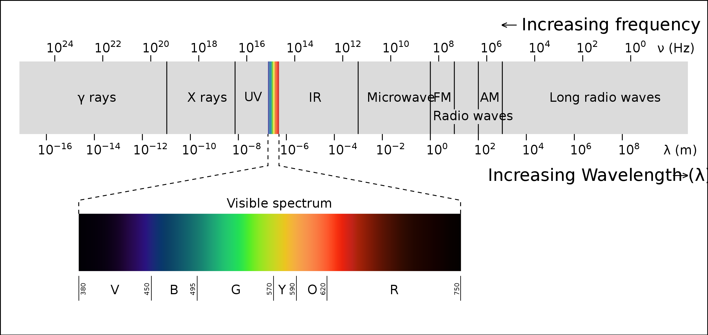

在可见光谱中并没有包含人眼所能分辨的所有颜色，比如：粉红色并没有出现在可见光谱中，这些颜色称为合成色，它可以通过不同波长的单色合成得到

### 人眼

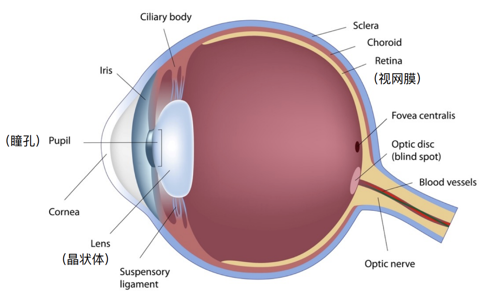

人眼在光学系统中类似于照相机系统，角膜作为人眼光学系统的最外层，将光线聚焦于晶状体的同时，保护着人眼内部的其他结构，光线穿过虹膜后经过瞳孔，瞳孔的开口大小控制光线的接收量，人眼的瞳孔类似于照相机的光圈，晶状体则是凸透镜，睫状肌调节晶状体的焦距，从而使人能够聚焦所看的物体，最后光线达到视网膜，视网膜上的光感细胞能够对光线做出反应。对于近视的人而言，远处的光线进入眼睛之后不能聚焦于视网膜，所以就导致看不清楚

人眼对颜色的感知源于视网膜上的感光细胞对光线做出的反应，接下来我们分析一下视网膜上的感光细胞

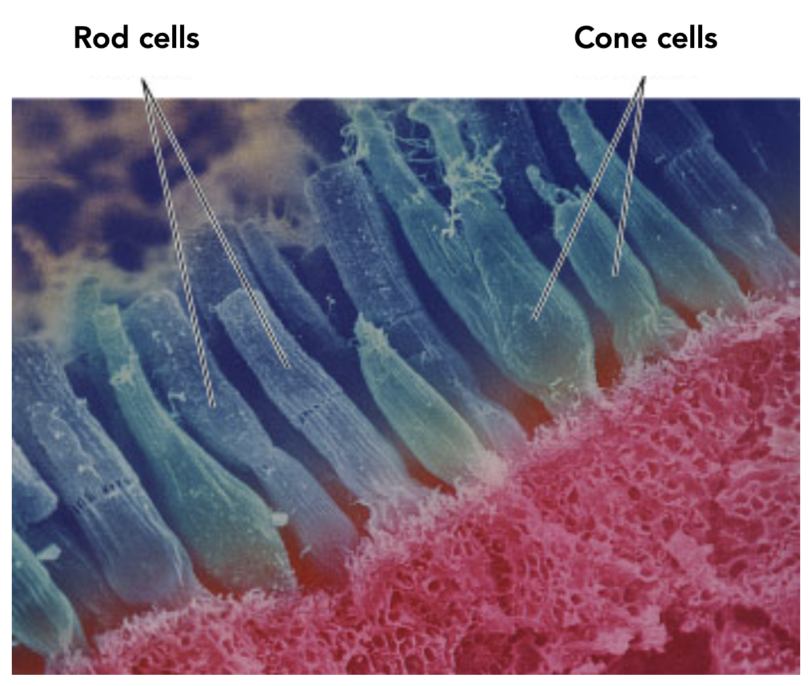

在人眼视网膜上的光感细胞主要分为两种：杆状细胞和锥状细胞。杆状细胞有7千5百万到1亿5千万，锥状细胞有6百万到7百万。杆状细胞被认为无法感知颜色信息，它的视觉一般是灰度视觉，在光线较弱的时候，比如在夜晚，我们能够看到一个灰色的世界，这就是杆状细胞的贡献，但是在光照强的情况下，比如在白天，杆状细胞得到的视觉刺激已经超饱和了，因此不对人的视觉感知产生贡献。

在本篇文章中，我要介绍的内容主要与锥状细胞相关。锥状细胞仅对明亮光线产生刺激反应，在人眼中具有三种类型的锥状细胞，它们分布对不同波长的可见光表现出不同的敏感度，根据锥状细胞对长波长、中波长和短波长可见光的不同敏感度，这三种类型的细胞分别被称为 L 锥状细胞、M 锥状细胞和 S 锥状细胞，S 锥状细胞的数量远小于另外两种锥状细胞的数量。下面是三种细胞对光的敏感曲线

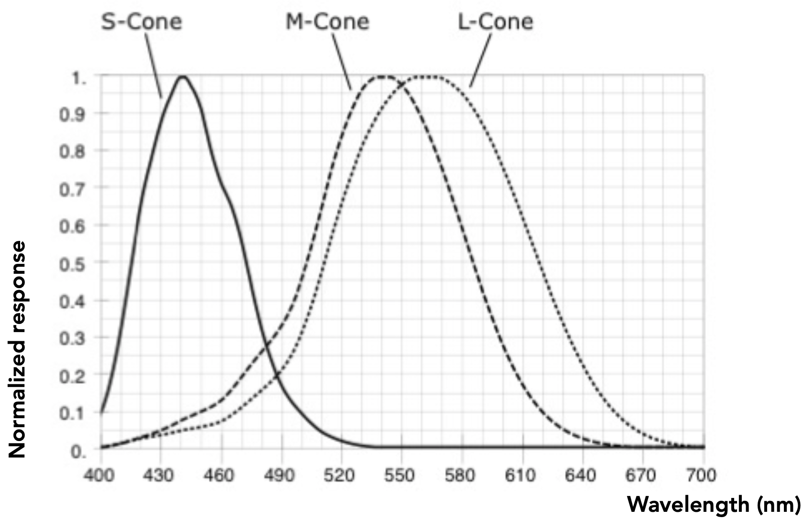

从图片上我们可以看出这三种锥状细胞能够感知所以波长的可见光，但是对不同波长的可见光的敏感度不一样。当视网膜上某种类型的锥状细胞对光的敏感度下降就会导致人对颜色的辨认准确性下降和对不同颜色的分辨能力下降

不同的人眼睛里面这三种锥状细胞的分布和数量非常不一样，下面是12张图，对应了12个不同的人，在这12个人的眼睛里面锥状细胞的分布我们一眼就能发现不一样。

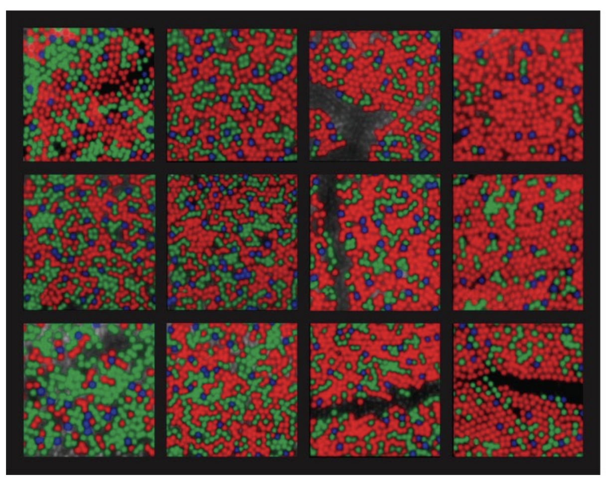

比如右上角的这个人他眼睛里面有很多对红色敏感的锥状细胞(L 型细胞)，但是左下角的这个人他眼睛里面有很多对绿色敏感的锥状细胞(M 型细胞)。所以“每个人眼中的世界不一样”，这句话是有道理的

### 对颜色的感知

通过锥状细胞对光的敏感曲线我们可以知道锥状细胞对于某个波长的单色光的响应是多少，由于有三种锥状细胞，那么我们可以分别得到这三种锥状细胞对于同一个光谱的响应结果，我们可以得到三个数，也就是说对于任何一种可见光光谱，人最终看到的是三个数，这三个数才是人最终感知到的颜色，

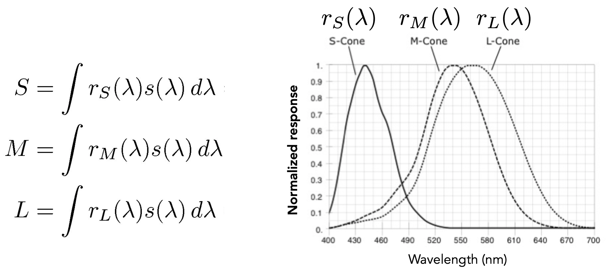

上图中有积分，这是因为在生活中大部分光是复合光，它是由多个不同波长的单色光合成的，所以需要将光谱中每个波长与敏感曲线求响应值，然后再积分。下面是一个光谱：

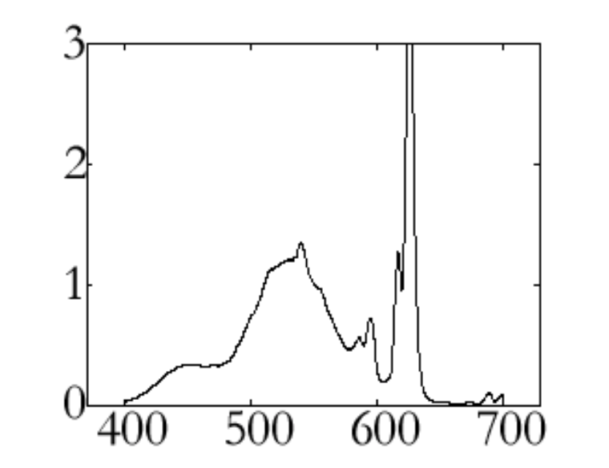

将光谱与光敏感曲线求积分，我们可以得到三个数，在某些时候两个不同的光谱通过与光敏感曲线积分之后，可能会得到两组相同的 S、M、L，这种现象称为同色异谱。同色异谱让我们不再需要关注原来的光谱是怎么样的，我们只需要保证积分得到的 S、M、L 三个数与原来的值相同就能够复现出颜色

现在我们来梳理一下人感知颜色的过程：光线(光谱)进入人的眼睛，照射到视网膜上，被三种锥形细胞感知到，形成三个数，这三个数送到人的大脑里面去，然后人就会认为看到了某个颜色

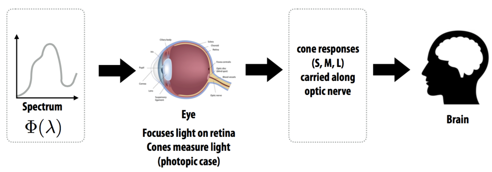

## 颜色空间

前面提到了同色异谱，也就意味着，给定任何一个颜色我可以通过混合其他的颜色去得到它。那么该如何混合呢？

### CIE RGB 颜色空间

给定一组原色，例如：常见的 R、G、B 三种原色为例，我将这个三种颜色各自乘以一个强度，然后将它们混合起来，混合起来之后就可以得到一个颜色，然后使用这三个原色的强度来表示这个混合得到的颜色，例如：将红色的强度调成 0.2，将绿色的强度调成 0.4，将蓝色的强度调成 0.7，那么混合成的这个颜色就表示为 (0.2, 0.4, 0.7)

在三原色加色系统中，允许我们通过线性组合基本颜色的方式来匹配任何给定的颜色。做法很简单就是先选一组原色，例如：红、绿、蓝，再选取任何一个颜色 A，然后修改红绿蓝的强度将他们混合在一起，使得混合的颜色看上去与颜色 A 一样就可以了。根据线性性质，我们可以得到如下的公式：

A = rR + gG + bB

但是存在某些颜色，不管怎么修改原色的强度都不会混合成它,由于在加色系统中不能减，至少要为零，所以有人就想在等式的左边加上一个颜色就相对于在右边减去一个颜色，这一来就使得左右两边相等了

在这一系列实验里，有两个科学家们把左边的颜色按着可见光谱顺序，挨个测试了一遍，得到了单色光的混合叠加的数据，这就是颜色匹配函数，然后定义了 CIE RGB 颜色空间，下面是CIE RGB 颜色空间的颜色匹配曲线

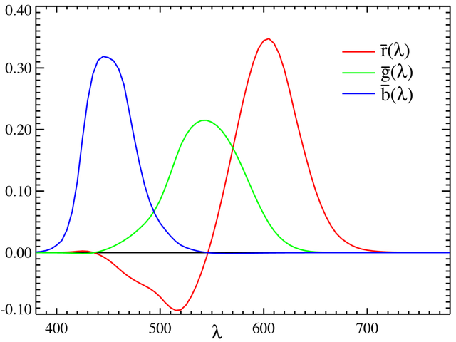

这张图显示了为了匹配给定波长的单色光，需要多少 RGB 原色组合。在 x 轴选取任何一个波长，然后垂直 x 轴做一条直线，这条直线会与三条曲线相交，相交点的 y 坐标值就是需要的 RGB 原色的值

### CIE XYZ 颜色空间

由于不存在负的光强，CIE 委员会根据 CIE RGB 颜色空间的规定，通过定义三种假想的标准原色，然后构造了 CIE YXZ 颜色空间。所以 CIE XYZ 是人造的，它是由 CIE RGB 颜色空间通过线性变换推导出来的，它的颜色匹配曲线如下：

CIE XYZ 与 CIE RGB 的转换矩阵如下：

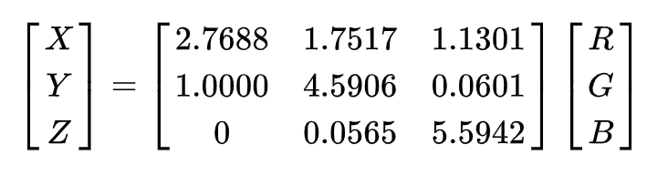

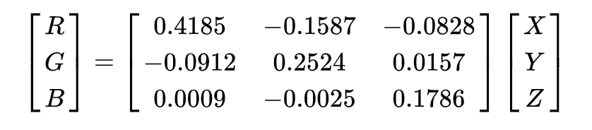

Y 代表亮度，固定 Y 的值，将 CIE XYZ 能够表示的颜色可视化到 2 维平面中，结果如下：

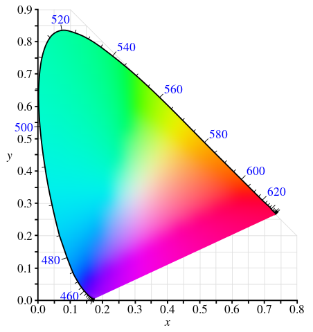

CIE XYZ 颜色空间包含了人眼能够看到的全部颜色，它是一种与设备无关的颜色空间，它不依赖于具体的设备就能准确的表示颜色。除了 CIE XYZ 是与设备无关的颜色空间之外，还有其他的颜色空间也是与设备无关的，例如：CIE LAB。

### RGB 颜色空间/CMYK 颜色空间

RGB 颜色空间使用笛卡尔坐标系定义颜色，它是使用最广泛的颜色空间，几乎所有的电子显示设备都是 RGB 颜色空间，但是 RGB 颜色空间不是指某一个特定的颜色空间，它是任何基于 RGB 颜色模型的加色空间的统称, RGB 颜色模型是是一种加法模型，颜色可以通过在黑色背景上混合不同强度的红、绿、蓝获得。属于 RGB 空间的颜色空间有：sRGB、Adobe RGB 等，与 sRGB 相比，Adobe RGB 能够表示更宽的色域

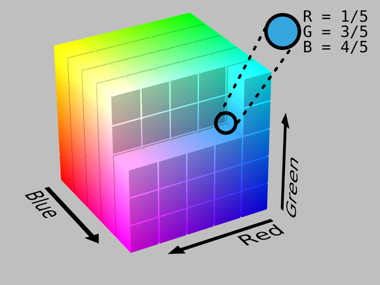

CMYK 颜色空间是基于 CMYK 颜色模型的，它通常用于印刷行业中，CMYK 分别表示青色、品红色、黄色和黑色，理论上来说：黑色可以通过青色、品红色和黄色混合得到，但是由于油墨中通常含有杂质，混合得到的黑色往往是深褐色或者深灰色，并且为了节约打印成本所以直接定义了黑色。CMYK 颜色模型是一种减色模型，根据不同的油墨、介质和印刷特性，存在多种不同的 CMYK 颜色空间

在这里同时出现了颜色模型和颜色空间的概念，他们两者是有区别的。颜色模型是一种数学模型，它使用一组数据来描述颜色，这组数据通常是 3 或者 4 个数。颜色空间描述了一定范围内可测量的颜色值，它最基本的功能是描述显示设备再现颜色信息的能力。

RGB 颜色空间/CMYK 颜色空间是与设备相关的颜色空间，与设备相关的颜色空间是相对于参考空间去定义的，它们的参考颜色空间通常是 CIE XYZ 或 CIE LAB。sRGB 和 Adobe RGB 都是基于 RGB 颜色模型的，但是它们相对于参考颜色空间的映射函数不一样，所以它们的色域不一样。

在前面我提到过，CIE XYZ 颜色空间包含了人眼能够看到的所有颜色。一个颜色空间所有可能表示的颜色范围，称为色域，不同的颜色空间的色域是不同的。下面我们来看一下 RGB 和 CMYK 相对于 CIE XYZ 的色域

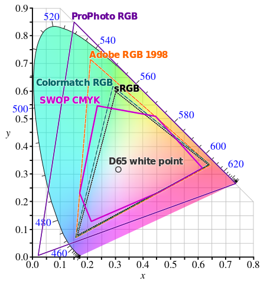

从上图我们可以看出 sRGB 只是一个很小的三角形，sRGB、Adobe RGB 和 SWOP CMYK 的色域是 CIE XYZ 色域的子集，理想情况下，如果某个显示器的颜色空间能够包含 CIE XYZ 颜色空间的所有颜色，那么这个显示器就是最好的，但是现实是很骨感的，大部分显示器的颜色空间只包含 CIE XYZ 色域很小一部分，到目前为止，sRGB 颜色空间还是在电脑显示器中广泛使用。由于印刷和计算机显示器使用了不同的颜色空间，所以在计算机屏幕上看到的色调与印刷出来的有一些差别，主要原因是这两种颜色空间能表示的色域不同。

## 颜色管理

颜色管理是指在颜色失真最小的前提下，将颜色信息从一个颜色空间转换到另一个颜色空间的过程，其目标是使翻译后的图像尽可能地与原始图像相似。

电子显示设备中经常会发生颜色管理，比如：你用你的手机拍了一张照片，然后你将这个照片发送给你的朋友，你的朋友使用他的手机查看你的这个照片，在这个过程中就发生了颜色管理；再比如：你在朋友圈上传了一张图片，你的好友们在它的手机上查看你发的图片，这个过程中也发生了颜色管理。在介绍颜色管理之前，我先介绍一个生活中的例子：

比如，你到一家火锅店吃火锅，火锅店根据辣度将火锅分为：微微辣、微辣、中辣和特辣，不同的辣度对应多少个辣椒，火锅店有自己的标准，由于不同的人对辣味的敏感度是不同的，所以火锅店的微辣对于你而言可能是中辣，为了吃到让你满意辣度的火锅，你在这家店里吃了一系列不同辣度的火锅，然后制定了一个辣度对照表，如下：

以后你再去这家火锅店吃火锅，你就将这个表格带上，对服务员说微辣，并且将这个表格给服务员看，服务员就会帮你翻译成他们火锅店的微微辣，最后厨师只在火锅中放了一个辣椒，做了一锅微微辣的火锅，这刚好符合你的口味

总的来说，这个过程包括：1. 根据辣椒的数量对辣度进行标准化；2. 确定每个人对辣椒的敏感度，制作出一个辣度表格；3. 将一个人的微辣转换成另一个人的微微辣。这三个过程也被应用与颜色管理，下面的图显示了 RGB 颜色空间与 CMYK 空间转换颜色时的流程:

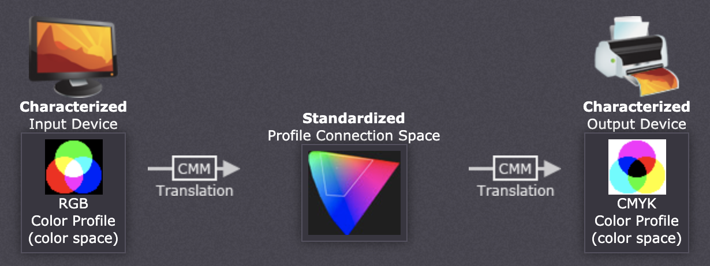

Characterized: 设备特征化。每个颜色管理设备都需要一个它自己的颜色特性文件，颜色特性文件描述了设备相关的颜色空间相对于标准颜色空间(通常是 CIE XYZ 或者 CIE LAB)之间应该如何进行颜色转换，颜色特性文件的作用类似于火锅店例子中的辣度对照表。你可以尝试去修改你的计算机显示器的颜色特性文件，修改之后你会发现你的屏幕显示的颜色会发生变化

Standardized：标准颜色空间，通常是 CIE XYZ 或者 CIE LAB

Translation：将颜色从一个设备的颜色空间转换到另一个设备的颜色空间，这通常是由色彩管理模块(CMM)执行。

以从 RGB 色彩空间转换到 CMYK 色彩空间的过程为例。首先取得两者的颜色特性文件，然后按照 RGB 的颜色特性文件中的定义将其 RGB 值转换至标准颜色空间中的颜色值。最后将标准颜色空间中数值转换成目标的C、M、Y、K四个数值。

如果原始设备的颜色空间的色域比目标设备的颜色空间的色域大，那么原始设备的颜色空间中的一些颜色就会超出目标设备的颜色空间，这种情况被称为色域不匹配，色域不匹配几乎发生在每一个颜色转换中。每次出现色域不匹配时，CMM 使用渲染意图来决定应该如果处理不匹配色域。常见的渲染意图有：绝对色度、相对色度、感知以及饱和，每种渲染意图都以牺牲其他颜色属性为代价来维护另一种颜色属性。感知和相对色度渲染意图可能是数字摄影中最有用的渲染意图。下图显示了感知意图与相对色度渲染意图的区别
ha
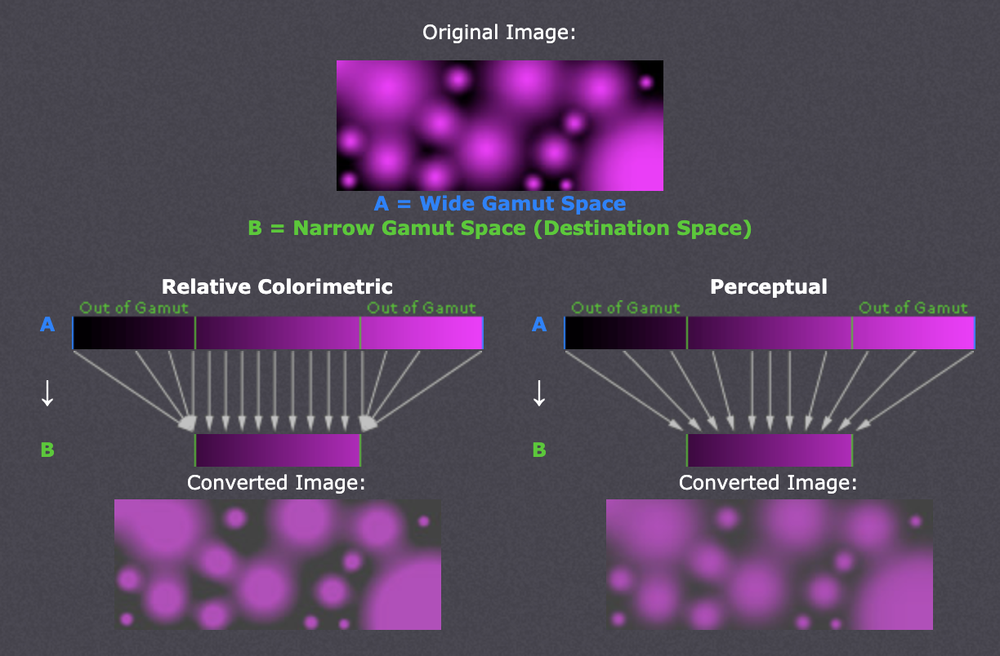

相对色度渲染意图将超出色域的颜色映射到目标空间中最近的色调，感知渲染意图通过压缩整个色域来保持平滑的色彩渐变。如何选择渲染意图，这取决于图像内容和预期用途。一张图片使用了较大的颜色空间，如果将这张图片转化为较小的颜色空间，转换之后的图片不一定与转换之前的图片有很大差异

## 写在后面

人眼对颜色的感知，以及颜色转换是一个很复杂的过程，我希望通过这篇文章你对这些内容有一个基本的了解