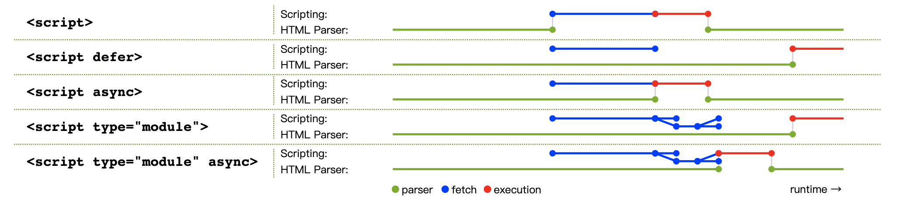

# ECMAScript modules 详解

很多编程语言都有模块这一概念，JavaScript 也不例外，但在 ECMAScript 2015 规范发布之前，JavaScript 没有语言层面的模块语法。模块实际上是一种代码重用机制，要实现代码重用，将不同的功能划分到不同的文件中是必不可少的，如何在其他的文件中使用这些文件定义的功能呢？在 ECMAScript 2015 之前，web 开发人员不得不寻求 JavaScript 语法之外的解决方法，例如：SystemJS、RequireJS 等模块加载工具，也有开发人员使用 webpack、Browserify 等模块打包工具。ECMAScript 2015 发布之后，JavaScript 拥有了语言层面的模块语法，它被称为 ECMAScript modules，简称 ES modules，这使 web 开发人员很容易就能创建模块，使用模块。

在本文中会介绍 ES modules 的基本用法、ES modules 的特点以及在浏览器中使用 ES modules。

## 基本语法

ES modules 是 JavaScript 的标准模块系统，模块是一个简单的 JavaScript 文件，在这个文件中包含 export 或者 import 关键字。export 用于将模块中声明的内容导出，import 用于从其他模块中导入。

### 模块导出的4种写法

模块导出用到的关键字是 export，它只能在模块顶层使用。模块可以导出函数、类、或其他基本类型等。模块导出有4种写法

* 默认导出

```javascript
export default function myFunc() {}
export default function () {}
export default class MyClass {}
export { foo as default }
export default 'Hello Es modules!'
```

* 行内命名导出

```javascript
export function myFunc() {}
export class MyClass {}
export const fooStr = 'Hello Es modules!'
```

* 通过一个 export 子句批量命名导出

```javascript
function myFunc() {}
class MyClass {}
const fooStr = 'Hello Es modules!'

export {myFunc, MyClass , fooStr } // 在这个地方一次性导出多个
```

* 重新导出

```javascript
// 重新导出 other_module 中除默认导出之外的内容
export * from './other_module.js'
// 重新导出 other_module 中的默认导出
export { default } from './other_module.js'
// 重新导出 other_module 中的默认导出，并且将 other_module 中的 sayName 命名为 getName 之后再导出
export { default, sayName as getName } from './other_module.js'
```

虽然模块导出有4种写法，但是只有两种方式，一种默认导出，另一种是命名导出，在同一个模块中命名导出可以有多个，默认导出只能有一个，这两种方式可以混合使用。

在软件开发的过程中，通常有多种写法能到达同一目的，但并不是每一种写法都值得推荐，模块导出也是类似的。如果在同一个模块中，即有默认导出，又有行内命名导出，还有 export 子句批量命名导出，那么你的模块很可能会变得混乱。在这里我推荐使用默认导出，并且将 export default 放在模块的末尾。如果你必须要命名导出，我推荐使用export 子句批量命名导出，并将 export 子句放在文件的末尾。

### 3中模块说明符

介绍完模块导出之后，按理说应该介绍模块导入，但我决定先介绍模块说明符，这是因为模块导入依赖模块说明符。说明符是字符串字面值，它表示导入模块的路径，说明符一共有三种类型，分别是：相对路径、绝对路径和 bare（裸露） 模式。

* 相对路径

```javascript
import foo from './myModule.js'
import { sayName } from '../other_module.js'
```

相对路径说明符以 / 、./ 、../ 开头，当使用相对路径说明符时不能省略文件的扩展名。在 web 项目开发中使用相对路径导入模块的时候，你可能省略了文件扩展名，它还是能够工作，那是因为你的项目使用了如 webpack 这样的模块打包工具。

* 绝对路径

```javascript
import React from 'https://cdn.skypack.dev/react'
```

上述代码表示从 cdn 导入模块，当使用绝对路径导入模块时，是否能省略文件扩展名，这与服务器配置相关。

* bare（裸露） 模式

```javascript
import React from 'react'
import Foo from 'react/lib.js'
```

bare 模式从 node_module 中导入模块，在 web 项目开发中，用这种说明符导入模块很常见，但是 ES modules 并不支持它，在你的项目中，你之所以能够使用它，是因为你的项目用了如 webpack 这样的模块打包工具。

到目前为止，我已经介绍完了3种模块说明符，ES modules 只支持其中两种，分别是：相对路径和绝对路径。

### 模块导入的 6 写法

模块导入用到的关键字是 import，import 与 export 一样只能在模块顶部使用，模块说明符不能包含变量，它必须是固定的字符串字面量。模块导入有6中不同的写法，如下：

* 默认导入

```javascript
// 你可以将 myFunc 改成任何你喜欢的变量名
import myFunc from './myModule.js'
```

* 将模块作为一个对象导入（即命名空间导入）

```javascript
import * as api from './myModule.js'
// 通过对象的 default 属性访问 myModule.js 中的默认导出
console.log(api.default)
```

* 命名导入

```javascript
//   导入 myModule.js 中的fooStr 
import { fooStr } from './myModule.js'
// 将myModule.js中默认导出命名为myFunc 
import { default as myFunc } './myModule.js'
// 将 myModule.js中的 fooStr 命名为 myStr
import { fooStr as myStr } from './myModule.js'
```

当某个模块中导出了很多内容，而你只需要用到它导出的一部分内容，你可以使用这个写法只导入你需要的部分，在做摇树优化的时候这至关重要。

* 只加载模块，不导入任何东西

```javascript
import './myModule.js'
```

不会将 myModule.js 中的任何内容导入到当前模块，但是会执行 myModule.js 模块体，这通常用于执行一些初始化操作。

* 将默认导入与命名导入混合使用

```javascript
import myFunc, { fooStr  } from './myModule.js'
```

* 将默认导入与命名空间导入混合使用

```javascript
import myFunc, * as api from './myModule.js'
```

补充：同一个模块可以被多次导入，但是它的模块体只会执行一次

## ES modules的 4 个特点

### 导入是导出的只读引用

例如有个模块 A，它导出了一个变量 count，模块 B 导入模块 A 的 count，count 对模块 B 而言是只读的，所以在模块 B 中不能直接修改 count，下面用代码演示一下：

```javascript
// 模块A的代码如下：
export var count = 0 // 注意：这里用的是 var 关键字

// 模块B的代码如下：
import { count  } from './moduleA.js'
count++ //  Uncaught TypeError: Assignment to constant variable
```

将上述代码放在浏览器中运行，浏览器会报错，错误类型是：TypeError。如果模块 A 导出了对象 obj，在模块 B 中不能直接给 obj 赋值，但是可以增、删、改 obj 中的属性。

现在我已经介绍了只读的含义，下面介绍引用的含义。引用意味着在项目中多个模块用的是同一个变量，例如：模块 B 和模块 C 都导入了模块 A 的 count 和 changeCount 函数，模块 B 通过 changeCount 修改了 count 的值，模块C中的 count 会被一同修改，代码如下：

```javascript
// 模块A的代码如下：
export var count = 0 
export function changeCount() {
	count++
}

// 模块B的代码如下：
import { count, changeCount } from './moduleA.js'
changeCount ()
console.log(count) // 1

// 模块C的代码如下：
import { count } from './moduleA.js'
console.log(count) // 1
```

模块 B 和模块 C 导入的是引用，而非副本，模块导出的变量在整个项目中是一个单例。

### 支持循环依赖

循环依赖指的是两个模块相互依赖，比如模块 A 导入了模块 B，模块 B 又导入了模块 A。尽管 ES modules 支持循环依赖，但应该避免，因为这会使两个模块强耦合。ES modules 支持循环依赖这是因为导入是导出的只读引用。

### 导入会被提升

如果你知道 JavaScript 函数提升，那么你很容易理解 ES modules 的导入提升。由于 ES modules 的导入会被提升到模块作用域的开头，所以你不需要先导入再使用。下面的代码可以工作：

```javascript
foo()
import foo from './myModule.js'
```

### 导出和静态导入必须位于模块的顶层

导出必须位于模块的顶层这一点毋庸置疑，在 ECMAScript 2020 规范中添加了动态导入，它使模块导入可以不必位于模块的顶层。在后面会单独介绍动态导入，在这里介绍的是静态导入。

ECMAScript 2020 之前，JavaScript 的 ES modules 是一个静态模块系统，它意味着模块的依赖项在你写代码的时候就确定了，不用等到代码运行阶段才确定，这让代码打包工具，如 webpack，很容易就能分析出 ES 模块中的依赖，给摇树优化提供了便利。

即便 ECMAScript 2020 增加了动态导入，静态导入与动态导入在写法上有差异，静态导入使用 import 关键字，动态导入使用 import()。静态导入只能位于模块顶层。

## 模块与常规JavaScript脚本的差异

* 模块运行在严格模式下
* 模块具备词法顶部作用域

这句话的意思是，在模块中创建的变量，如：foo，不能通过 window.foo 访问。代码如下：

```javascript
var foo = 'hi'
console.log(window.foo) // undefined
console.log(foo) // hi
export {} // 将这个文件标记成模块
```

在模块中的声明的变量是针对该模块的，这意味着在模块中声明的任何变量对其他模块都不可用，除非它们被显式地导出。

* 模块中的 this 关键字没有指向全局 this，它是 undefined，如果要在模块中访问全局 this 要使用 globalThis，在浏览器中 globalThis 是 window 对象。
* export 和静态导入 import 只能在模块中使用
* 在模块顶层能使用 await 关键字，在常规 JavaScript 脚步中只能在 async 函数中使用 await 关键字

注意：由于 JavaScript 运行时会区别对待模块和常规的 JavaScript 脚本，所以在写代码的时候做好显示地标记 JavaScript 文件是模块，只要 JavaScript 文件中包含 export 或者 import 关键字，JavaScript 运行时就会认为这个文件是模块

在这部分介绍的这 5 个差异是与 JavaScript 运行环境无关的差异，在之后的部分会介绍在浏览器中使用 ES modules，这那里会补充一些新的差异。

## 在浏览器中使用 ES modules

现代浏览器支持 ES modules，你可以将 script 标签的 type 属性设置为 module 来告诉浏览器这个脚本是模块，代码如下：

```html
<!--外部模块-->
<script type="module" src="./module.js"></script>
<!--内联模块-->
<script type="module">
   import {count} from './moduleA.js';
   import React from 'https://cdn.skypack.dev/react'
   console.log(count, React)
</script>
```

出于对兼容性的考虑，可能还需要 `<script nomodule src=’xxx.js’></script>`，在这里不做介绍。

在之前介绍了模块和常规 JavaScript 脚本与运行环境无关的差异，现在来介绍在浏览器环境中二者的差异

* 模块只会被执行一次

不管模块被引入了多少次，它只会被执行一次，而常规的 JavaScript 脚本执行次数与它被添加到 DOM 的次数一致，添加多少次就执行多少次。比如有下面一段代码：

```html
<!--外部模块-->
<script type="module" src="./module.js"></script>
 <script type="module" src="./module.js"></script>
 <script type="module" src="./module.js"></script>
<!--内联模块-->
<script type="module">
        import { count } from './module.js';
</script>
<script src='./classic.js'></script>
<script src='./classic.js'></script>
```

在上述代码中 module.js 只会被执行一次，classic.js 会被执行两次

* 下载模块脚本不会阻塞 HTML 解析

默认情况，当浏览器下载常规外部脚本时，它会暂停解析 HTML，我们可以在 script 标签上添加 defer 属性，使浏览器在下载脚本期间不暂停解析 HTML。当下载模块脚本时，浏览器默认模块脚本是 defer 的。

下图展示了浏览器获取外部模块脚本和常规脚本的流程



上图源于 (https://html.spec.whatwg.org/multipage/scripting.html#the-script-element)

* 模块脚本通过 CORS 获取

模块脚本以及它的依赖项是通过 CORS 获取的，当获取一个跨域的模块脚本时需要特别注意这个问题，跨域脚本的响应头 Access-Control-Allow-Origin 必须包含当前域，否则模块会获取失败，而获取常规脚本则没有这个限制。

为了保证获取同源模块脚本时，浏览器始终带上 credentials（cookie 等），推荐给 script 标签加上 crossorigin 属性。

## 动态导入

到目前为止介绍的都是静态导入模块，静态导入必须等模块代码全部下载之后才会执行程序，这可能会使网站的首屏渲染性能下降。通过动态导入模块可以根据用户在界面上的操作按需下载资源，节省流量，动态导入在 ECMAScript 2020 正式发布，它需要用到import()，用法如下所示：

```javascript
// 通过相对路径导入
import('./exportDefault.js').then((module) => {
    console.log(module) // line A
})
// 通过绝对路径导入
import('https://cdn.skypack.dev/react').then((react) => {
    console.log(react) // line B
})
```

从上述代码可以看出 import() 的返回值是一个 promise 对象，当模块加载成功之后 promise 对象的状态会变成 fulfilled，import() 可以与 async/await 配合使用

上述代码中的 line A 和 line B 标识的变量 module 和 react 都是 JavaScript 对象，我们可以用对象的点语法和中括号语法访问模块导出的任何方法和属性，模块的默认导出通过 default 属性名访问。

动态导入与静态导入存在如下 3 个差异：

* 动态导入的模块说明符可以是变量，但静态导入的模块说明符只能是字符串字面量
* 动态导入能在模块和常规脚本中使用，但是静态导入只能在模块中使用
* 动态导入不必位于文件的顶层，但静态导入只能位于模块的顶层

虽然动态导入模块和静态导入模块存在差异，但它们都通过 CORS 获取模块脚本，所以在获取跨域模块脚本时，脚本的 Access-Control-Allow-Origin 响应头一定要配置正确。

动态导入和静态导入有它们各自的使用场景。在初始渲染时要用到的模块使用静态导入，其他情况，特别是那些与用户操作相关的功能，可以使用动态导入按需加载依赖的模块，这种做法能提高首屏渲染性能，但是会降低用户操作过程中的性能。所以，哪些模块使用静态导入，哪些模块使用动态导入需要你根据实际情况考虑。

提示：在动态导入模块时要用到 import()，看上去这像是函数调用，实际上它并不是函数调用，而是一种特殊的语法，你不能使用 import.call()、import.apply()、const myImport = import; myImport()。