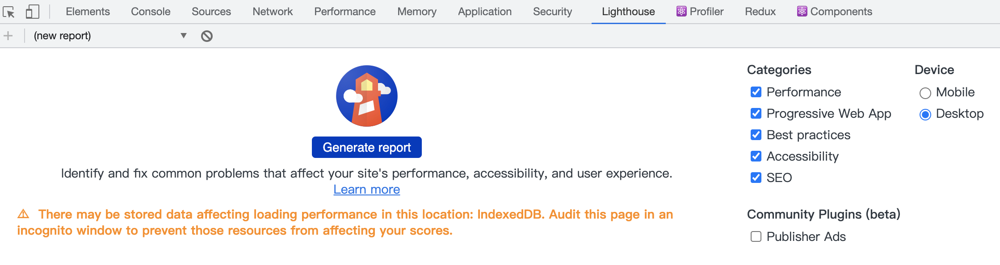

## Fast load times

当创建现代 web 应用时，衡量、优化以及监控 web 应用的性能是至关重要的，在任何成功的在线应用中，性能扮演了一个重要的角色。接下来这系列文章将介绍怎么采取正确的步骤去提升 web 应用的性能。

我们都听说过性能是多么重要。但是，当我们谈论性能、谈论让网站更快——我们具体指的是什么? 我们通常使用速度来衡量一个 web 应用的性能，速度很重要，但它到底是什么意思呢? 经常听到人们谈论他们的网站在x.xx秒或更少的时间内加载，但加载时间不是一个单一的时间，性能也是相对的，这是一种没有任何单一指标能够完全捕捉到的体验。在加载体验中有许多时刻会影响用户是否认为它是“快速”的，如果你只关注其中一个，你可能会忽略在其他时刻带来的糟糕体验。不应该只用一个指标来测量网站的加载速度，而应该对影响用户感知加载速度的体验中的每个时刻进行测量。当用户浏览网页时，通常有下面这些类型的反馈:


传统的性能指标(如 load 时间或 DOMContentLoaded 时间)是不可靠的，因为它们的触发时间可能与这些反馈里程碑对应，也可能不对应。所以出现了一些其他的性能指标


正确的理解这些指标，然后依据这是指标优化用户体验是至关重要的。一些网站根据自己服务类型定义自定义的指标，比如：[pinterest](https://www.pinterest.com/)，访问 pinterest 的用户主要是为了查看图片，所以 pinterest 定义了 Pinner Wait Time，这个指标结合了 Time to Interactive 和图片的加载时间

## 怎么测量速度

由于用户设备、网络连接和其他因素的不同，相同的 web 应用对不同的用户而言它的性能是高度不一致的。这里有一些工具帮助你收集数据，以评估页面性能

### Lab 数据（实验室数据） 与 Field 数据（实测数据）

实验室数据是在受控环境中通过预定义的设备和网络设置收集的性能数据，而 Field data 是从用户实际页面加载中收集的性能数据，这两种类型的数据都有自己的优点和局限性。

实验室数据提供了可复现的结果和调试环境，但可能无法捕获到用户实际的性能瓶颈，也无法与页面实际性能指标相关联。使用实验室测量速度的时候，您需要了解用户常用的设备和网络，并在测试性能时尽可能地接近这些条件。记住即使在有 4G/5G 网络覆盖的地区，用户在乘坐电梯、通勤或其他环境时，可能仍然会感受到较慢或间歇性的网络连接。

实验室数据也被称为真实用户监控数据，它能够捕捉真实的用户体验，并且使用它能够与页面实际性能指标相关联，但是它的调试能力有限

### 工具

使用 Lighthouse 生成实验室数据，Lighthouse 是一个开源的自动化工具，用于改进网络应用的质量。 您可以将其作为一个 Chrome 扩展程序运行，或从命令行运行。 您为 Lighthouse 提供一个您要审查的网址，它将针对此页面运行一连串的测试，然后生成一个有关页面性能的报告，在这里你可以找到[Lighthouse 的安装和使用方法](https://developers.google.com/web/tools/lighthouse/)



使用 [Chrome User Experience Report](https://developers.google.com/web/tools/chrome-user-experience-report/)生成真实的用户体验报告，即实测数据

[PageSpeed Insights](https://developers.google.com/speed/pagespeed/insights/)既能够生成实验室数据也能够生成实测数据，它使用 Lighthouse 生成实验室数据，使用 Chrome User Experience Report 生成实测数据


[Chrome 开发者工具](https://developer.chrome.com/docs/devtools/)是一套直接内置到谷歌 Chrome 浏览器的 web 开发工具。它允许您分析页面的运行时，以及识别和调试性能瓶颈。

### 怎么让你的网站保持好的性能

你可能会发现当你做了性能优化之后你网站的性能确实变好了，但是过了一段时间之后网站的性能有下降了。这是因为网站性能很像健身，只是一段时间健身是不够的，你必须改变你的生活方式。

你可能听说过财务预算，在这里也有一个类似的概念，叫做性能预算。性能预算是一组影响网站性能的度量标准的限制，当你设定一个限制之后，在未来就确保你的网站性能在这个范围内。下面是一个页面的性能预算事例：


一旦设置好，就必须执行性能预算，你可以将 Lighthouse 引入到你的持续集成中去，如果关键指标低于性能预算中的阈值持续集成就会失败。此外，通过仪表板或摘要报告进行定期报告可以帮助提高可见性和可靠性。Pinterest 是一个实施性能预算的企业，他们使用性能预算来确保他们的网站能保持好的性能。

### 使用 RAIL 模型度量性能

RAIL 是一个以用户为中心的性能模型，它为我们考虑性能的问题提供了方法论。该模型将用户体验分解为多个关键操作(例如，点击、滚动、加载)，并帮助您定义每个操作的性能目标。RAIL 这四个字母表示 web 应用生命周期中四个不同的方面，即：响应(response)，动画(animation)，空闲(idle)和加载(load)。用户对每一种环境都有不同的性能期望，所以性能目标是基于环境和用户体验研究(用户如何感知延迟)来定义的。下面是 RAIL 模型的四部分


空闲(idle)时间是指用户不与网页交互的时间，而不是指浏览器没有工作要处理的时间。这种交互可以是移动鼠标、点击页面或使用键盘。使用 window.requestIdleCallback 可以让浏览器在空闲的时候去执行某个方法

#### 关注用户

让用户成为你性能优化的焦点，下表描述了用户对性能延迟的感知

0 到 16ms：只要每秒渲染 60 帧以上，也就是 16ms 一帧，用户会觉得动画是流畅的
0 到 100ms：在这个时间内响应用户操作，用户会觉得结果是即时的。如果时间再长，动作和响应之间的联系就会中断。
100 到 1000ms：在这个时间内，用户感觉这是一个自然和持续的任务进程的一部分。对于web上的大多数用户来说，加载页面或更改视图是一项任务。
1000ms 以上：超过 1000毫秒(1秒)，用户就会对正在执行的任务失去注意力。
10000ms 以上：超过 10000 毫秒(10秒)，用户就会感到沮丧，并可能放弃任务。他们可能会回来，也可能不会回来。

网络条件和硬件会用户对性能延迟的感知。例如，通过 Wi-Fi 连接，在性能强大的台式机上加载网站通常不到1秒，用户已经习惯了这一点。在3G连接较慢的移动设备上加载网站需要更多的时间，所以移动用户通常更有耐心。

#### 目标和指导方针

在 RAIL 模型的背景下，目标和指导方针有不能的含义：

目标：关键性能指标与用户体验相关。例如，在100毫秒内响应用户点击这是一个目标，由于人类的感知是相对恒定的，所以这些目标不太可能在短期内改变。

指导方针：帮助你实现目标的建议。这些是特定于当前硬件和网络条件的，因此可能会随着时间而变化。

下面我根据目标和指导方针分别对响应(response)，动画(animation)，空闲(idle)和加载(load)进行说明

##### 响应：在 50ms 内处理事件

目标：在 100ms 内完成从用户输入到响应之间的转换，让用户感觉交互是即时的。

指导方针

* 在 100ms 内给用户一个他可感知的响应，50ms 内处理用户的输入。这适用于大多数输入，如单击按钮、切换表单控件或启动动画。这不适用于触摸、拖动或滚动。
* 立即响应用户输入并不总是正确的做法，尽管这听起来违反直觉。您可以使用这个100毫秒的时间来做其他耗时的工作，但要小心不要阻塞用户。
* 对于需要超过50毫秒才能完成的动作，你始终应该给用户提供反馈。

究竟是 50ms 还是 100ms？

我们的目标是在100毫秒内响应用户输入，那么为什么我们的预算只有50毫秒呢？这是因为浏览器除了要处理用户输入还要处理其他的任务，而处理这些任务会占用处理用户输入的时间。如果浏览器在空闲的时候正在处理任务，而这时用户触发了一个输入，那么这个处理输入就需要排队。如果我们处理用户输入只需要 50ms，那么我们就有 50ms 的缓冲时间。下图反映了这种情况


##### 动画：在 10ms 内生成一帧

目标

* 在 10ms 生成动画中的一帧。从技术上来讲，每一帧动画的最大预算是 16ms 秒，但是由于浏览器大概需要 6ms 的时间来渲染帧，因此生成动画的指导方针是每帧 10ms。
* 以视觉流畅为目标。用户会注意到帧率的变化。

指导方针

* 动画对性能的要求很高，在生成动画的时候我们要尽可能少做事情。我们要尽可能在 100ms 的响应时间内做预计算，这样你就能最大限度地将帧率提高达到60帧每秒。
* 查看 [Rendering Performance](https://developers.google.com/web/fundamentals/performance/rendering) 得到更多的动画优化策略.

动画的类型包括：

1. 视觉动画，显示/隐藏、过渡和 loading 指示器
2. 滚动
3. 拖拽

#### 空闲时间：使空闲时间最大化

目标：最大化空闲时间，以增加浏览器在 50ms 内处理用户输入的几率。

指导方针

* 在空闲时间去执行可延迟的工作。例如：在页面初始化加载的时候，加载尽可能少的内容，在空闲时间再加载额外的内容
* 把在空闲时间要执行的任务控制到 50ms 内完成，如果时间再长，在 100ms 内可能完成不了从用户输入到响应之间的转换。你可以参考 50ms 内处理用户输入的图来加强理解

#### 加载：在5秒内交付内容并使页面可交互

如果页加载太慢，用户的注意力会被转移，加载速度快的网站平均会话时间长，跳出率低，广告可见性高。

目标

* 基于用户的设备和网络环境去优化页面加载性能。在 3G 网络环境下的中档移动设备上首次加载比较好的目标是：在5秒内交付内容并使页面可交互，非首次加载比较好的目标是：在2秒内交付内容并使页面可交互

指导方针

* 分析你的用户使用的常用设备和网络条件，基于设备和网络条件测试加载性能。你可以在[The Mobile Economy](https://www.gsma.com/mobileeconomy/)上查看全球移动行业现状，你也可以使用[WebPageTest](https://www.webpagetest.org/easy)来分析你的 web 应用的性能，它提供了页面在各种条件下如何执行的深度诊断信息
* 使用 navigator.connection 可以得到当前用户的网络连接情况
* 使用 [lightHouse 识别哪些是阻塞浏览器渲染的资源](https://web.dev/render-blocking-resources/)
* 你不需要在5秒内加载所有内容，可以使用图片懒加载、代码分割等等

识影响页面加载性能的因素:

1. 网速和延迟
2. 硬件
3. 缓存
4. 解析 JavaScript

#### RAIL 测量工具

有一些工具可以帮助你自动化完成您的 RAIL 测量。使用哪种方式取决于您需要什么类型的信息，以及您喜欢什么类型的工作流程。

Chrome 开发者工具

使用 Chrome 开发者工具你可以得到在页面加载或运行时发生的一切的深入分析报告。这里介绍了[如何使用 Chrome 开发者工具分析运行时性能](https://developer.chrome.com/docs/devtools/evaluate-performance/)、[某个功能的性能分析](https://developer.chrome.com/docs/devtools/evaluate-performance/reference/#activities)

Lighthouse

Lighthouse 是一个可选的 Chrome 开发者工具，它可以作为一个 Chrome 扩展，也可以作为一个 Node.js 模块。使用 lighthouse 能生成类似这样的一个报告


与响应相关的指标

1. [FID](https://web.dev/lighthouse-max-potential-fid/): 基于主线程空闲时间，估计应用程序响应用户输入需要多长时间。
2. [不使用被动事件监听器优化性能](https://web.dev/uses-passive-event-listeners/)
3. [TBT](https://web.dev/lighthouse-total-blocking-time/): 度量页面上响应用户输入(如鼠标点击、屏幕点击或键盘按压)被阻塞的总时间
4. [Time To Interactive](https://web.dev/interactive/): 度量用户何时可以与页面上所有元素进行交互。

与加载相关的指标

1. [不注册 service worker](https://web.dev/service-worker/): service worker可以在用户的设备上缓存公共资源，减少了通过网络获取资源的时间。
2. [在移动设备上页面加载不够快](https://web.dev/load-fast-enough-for-pwa/)
3. [识别哪些是阻塞浏览器渲染的资源](https://web.dev/render-blocking-resources/)
4. [推迟加载离屏的图片资源](https://web.dev/offscreen-images/)
5. [使用适当尺寸的图片](https://web.dev/uses-responsive-images/): 不要提供明显大于视口渲染尺寸的图像。
6. [不要串联关键请求](https://web.dev/critical-request-chains/)
7. [使用 HTTP/2](https://web.dev/uses-http2/)
8. [使用有效的编码图像](https://web.dev/uses-optimized-images/)
9. [压缩文本资源](https://web.dev/uses-text-compression/)
10. [减少页面网络请求的总规模](https://web.dev/total-byte-weight/)
11. [减少 DOM 节点的数量](https://web.dev/dom-size/): 通过只发送呈现页面所需的DOM节点来减少网络字节数。

WebPageTest 

WebPageTest是一个web性能工具，它使用真正的浏览器访问网页并收集时间指标。在webpagetest.org/easy上输入URL，可以获得关于在3G连接较慢的Moto G4设备上的页面加载性能的详细报告。您还可以将其配置为包含Lighthouse审计。

#### 总结

RAIL是一个镜头，它将一个网站的用户体验视为一个由不同交互组成的旅程。了解用户如何看待您的站点，以便设置对用户体验有最大影响的性能目标。

1. 关注用户
2. 在 100ms 内响应用户输入
3. 当动画或滚动时，在10毫秒内生成一帧。
4. 使主线程空闲时间最大化。
5. 在5秒内交付内容并使页面可交互

## 渲染性能

在这里将介绍浏览器如何处理 JS、HTML 和 CSS，并确保你编写的代码尽可能搞笑的运行

### 60fps 和屏幕刷新率

现在大多数设备的屏幕刷新率是 60次/秒，如果页面上有一个动画或者用户正在滚动页面，那么浏览器渲染动画或者渲染页面的每一帧的速率应该与屏幕刷新率保持一致。每一帧的预算仅比 16ms 多一点点(1 秒/ 60 = 16.66 毫秒)，但由于浏览器要做一些内部任务，因此与动画相关的任务要在 10ms 内完成，如果无法满足 16ms/帧的预算，就会导致卡顿

### 像素管道

将某一帧绘制到屏幕上最大会经历下面5个部分，这5部分按顺序执行就像是一个管道，不一定每帧都总是会经过管道中的这5个部分


下面来分布介绍这5个分部代表的含义

Javascript：一般来说，我们会使用 JavaScript 来实现视觉变化的效果。例如：删除/增加 DOM 节点、 jQuery 的 animate 函数做一个动画或者拖拽数据进行排序。除了使用 Javascript，还有一些其他的方式来实现视觉变化效果，例如：css Animations、Transitions 和 Web Animation API。

样式计算：在这个过程会使用 CSS 选择器的匹配规则（如：.headline 或 .nav > .nav__item）计算元素要应用哪些 CSS 规则，得到规则之后将会计算出元素最终的样式

布局：在知道元素应用了哪些规则之后，浏览器将计算它要占据的空间大小以及它在屏幕中的位置。网页的布局模式意味着一个元素可能影响其他元素，例如 body 元素的宽度一般会影响其子元素的宽度以及树中各处的节点，因此对于浏览器来说，布局过程是经常发生的。

绘制：绘制是填充像素的过程，它涉及绘出文本、颜色、图像、边框和阴影，基本上包括元素的每个可视部分。绘制通常在多个层级上完成。

合成：由于页面上的各个部分可能被绘制到多层，为了正确的渲染页面，绘制到多个层上的各个部分需要按照正确的顺序绘制到屏幕上。对于与另一元素重叠的元素来说，这点特别重要，因为一个错误可能使一个元素错误地出现在另一个元素的上层。

管道中的这五个部分都有可能造成卡顿，因此在做性能分析的时候你最好能够分析出你的代码会触发管道中的哪些部分。不管是使用 JavaScript 还是 CSS 实现视觉变化，管道针对指定帧的运行通常有三种方式:

#### JS / CSS > 样式 > 布局 > 绘制 > 合成


如果你修改了元素的几何属性，如：宽度、高度、左侧和顶部位置等，那么浏览器将必须检查所有其他元素，然后“自动重排”页面。任何受影响的部分都需要重新绘制，而且最终绘制的元素需进行合成。也就是说修改元素的几何属性会导致管道中的这5部分都运行一边

#### JS / CSS > 样式 > 绘制 > 合成


如果你只改变了与绘制相关的属性，如：背景、颜色与阴影等，则浏览器会跳过布局，但仍将执行绘制。

#### JS / CSS > 样式 > 合成


如果您更改一个既不要布局也不要绘制的属性，如：transform 和 opacity，则浏览器将跳到只执行合成。

第三种方式的性能开销是最小的

## 以用户为中心的性能指标

我们已经知道了网站的性能对网站来说是至关重要的，但是当我们谈论网站的性能或者当我们说某个网站很快，那么这里`快`是指什么意思？

网站的性能是相对的：

* 同一个网站对一个用户而言可能是快的，但是对另一个用户而言可能是慢的
* 两个站点可能是在相同的时间内完成加载的，但用户可能会觉得其中一个网站似乎加载得更快
* 一个站点可能看起来加载得很快，但随后用户交互的响应却很慢(或者根本没有响应)。

当我们谈论性能的时候，我们要精准并且用客观的标准要衡量性能，在衡量性能的时候我们会用到一些性能指标，只一个指标去衡量性能是不够的

### 定义指标

在过去，我们使用页面的 load 事件去测量网站的性能，在这里我要指出的是，虽然加载完成是页面生命周期中一个定义好的时刻，但是这个时刻并不一定是用户关心的。例如，服务器可以返回一个最小的页面，该页面会立即被加载完，但随后延迟获取内容，直到加载事件触发几秒钟后才在页面上显示内容。虽然这样的页面在技术上可能有一个快速的加载时间，但该时间并不与用户实际体验的页面加载相对应。

在过去的几年里，Chrome 团队的成员与[W3C Web 性能工作组](https://www.w3.org/webperf/)合作致力于定义一套标准化的 api 和指标，以更准确地衡量用户对网页性能的体验。

为了确保这些指标与用户体验相关，我们讨论下面几个关键问题

Is it happening?

导航启动成功吗?服务器有响应吗?

Is it useful?

是否呈现了足够的内容让用户能够参与其中?

Is it usable?

用户是否可以与页面交互

Is it delightful?

交互是否是流畅并自然的

### 如何度量这些指标

有两个方式去测量性能指标

1. 通过实验测量：使用工具在一致的受控环境中模拟页面加载
2. 用户实际测量：真正的用户使用页面时实际加载和页面交互

这两种方式各有利弊，您通常可能需要同时使用这两个方式来确保良好的性能。

通过实验测量

当开发新功能时，通过实验测试性能是必不可少的。在功能发布到生产环境之前，不可能测量它们在真实用户上的性能特征，所以在特性发布之前通过实验测试性能是防止性能退化的最好方法。

用户实际测量

通过实验测出来的数据不能代表用户实际的使用情况，网站的性能与用户的设备和网络环境相关，还可能与用户在页面上做过的交互相关。此外，页面加载可能不是确定性的。例如，加载个性化内容的网站可能会在不同用户之间体验到截然不同的性能特征，通过实验测试无法捕捉到这些差异。要真正了解您的站点对用户的性能的唯一方法是在用户加载并与之交互时实际测量其性能。[Real user monitoring](https://en.wikipedia.org/wiki/Real_user_monitoring)

### 不同类型的指标

下面有一些其他的与用户体验相关的指标

1. 可感知的加载速度：页面加载并将其所有视觉元素呈现到屏幕的速度。
2. 负载响应：为了让组件快速响应用户交互，页面加载和执行所需的JavaScript代码的速度有多快
3. 运行时响应：在页面加载完之后，页面响应用户交互的速度有多快。
4. 视觉稳定性：页面上的元素是否以用户意想不到的方式移动，并可能干扰他们的交互?
5. 流畅性：过渡和动画渲染在一致的帧率和流动从一个状态到下一个?

考虑到以上所有类型的性能指标，很有可能没有一个单一的指标足以捕获页面的所有性能特征。

### 需要衡量的重要指标

[First contentful paint (FCP)](https://web.dev/fcp/): 测量从页面开始加载到页面的任何部分呈现在屏幕上的时间。可以通过 lab 和 filed 测量

[Largest contentful paint (LCP)](https://web.dev/lcp/): 测量从页面开始加载到屏幕上显示最大文本块或图像元素的时间。可以通过 lab 和 filed 测量

[First input delay (FID)](https://web.dev/fid/): 衡量从用户第一次与你的网站交互(例如，当他们点击链接，点击按钮，或使用自定义的，javascript驱动的控件)到浏览器真正能够响应该交互的时间。可以通过 filed 测量

[Time to Interactive (TTI)](https://web.dev/tti/): 度量从页面开始加载到可视化呈现、它的初始脚本(如果有的话)已经加载以及它能够可靠地快速响应用户输入的时间。可以通过 lab 测量

[Total blocking time (TBT)](https://web.dev/tbt/): 度量FCP和TTI之间的总时间，其中主线程被阻塞的时间长到足以阻止输入响应。 可以通过 lab 测量

[Cumulative layout shift (CLS)](https://web.dev/cls/): 度量从页面开始加载到其生命周期状态变为隐藏之间发生的所有意外布局变化的累积得分。可以通过 lab 和 filed 测量

虽然这个列表包含了衡量与用户相关的性能的许多不同方面的指标，但它并不包括所有方面(例如，运行时响应性和流畅性目前还没有包括在内)。在某些情况下，将引入新的指标来覆盖缺失的区域，但在其他情况下，最佳的指标是专门为您的站点量身定制的指标。

### 自定义指标

上面列出的性能指标有助于对大多数网站的性能特征有一个大致的了解。它们还有助于为网站提供一套通用的指标，以便将它们的表现与竞争对手进行比较。然而，有时特定站点在某些方面是独特的，需要额外的指标来捕捉完整的性能画面。例如，LCP指标旨在衡量页面的主要内容何时完成加载，但也可能出现最大的元素不是页面主要内容的一部分的情况，因此LCP可能不相关。为了解决这种情况，Web性能工作组还标准化了底层api，这些api对实现你自己的定制指标很有用:

1. [User Timing API](https://w3c.github.io/user-timing/)
2. [Long Tasks API](https://w3c.github.io/longtasks/)
3. [Element Timing API](https://wicg.github.io/element-timing/)
4. [Navigation Timing API](https://w3c.github.io/navigation-timing/)
5. [Resource Timing API](https://w3c.github.io/resource-timing/)
6. [Server Timing API](https://w3c.github.io/server-timing/)

参考[自定义指标](https://web.dev/custom-metrics/)了解如何使用这些 api 来衡量特定于您站点的性能特征。

## 自定义指标

拥有以用户为中心的指标是很有价值的，你可以使用这些指标去衡量任何给定的网站的性能。这些指标让你：

1. 理解你的用户是如何体验你的网站的
2. 将你的站点与竞争对手的站点进行比较
3. 在你的分析工具中跟踪有用和可操作的数据，而不需要编写定制代码

通用的度量标准提供了一个很好的基准，但是在许多情况下，为了获得特定站点的完整体验，您需要度量的不仅仅是这些度量标准。如果通用的度量标准不能满足你的需要，你可以自定义度量标准，例如：

1. 一个单页面应用程序(SPA)从一个“页面”过渡到另一个“页面”需要多长时间
2. 已登录用户从数据库获取的数据到数据显示在页面上需要多长时间 
3. 二次访问者访问资源的缓存命中率

### 用于度量自定义指标的 api

历史上，web 开发人员没有太多底层 API 去衡量性能，因此他们不得不使用一些 hack 的方式去衡量一个站点是否运行良好。例如，使用 requestAnimationFrame 计算每两帧之间的增量来确定主线程是否由于 JavaScript 任务的长时间运行而阻塞。如果增量明显大于屏幕的帧率，这时就认为有一个 js 长任务阻塞了主线程。尽管如此，我们并不推荐使用这种方法，因为它们实际上会影响性能(例如，会消耗电池)。

有效的性能评估的第一条规则是确保您的性能评估技术不会导致性能问题。因此，对于您在站点上度量的任何自定义指标，如果可能的话，最好使用以下api之一。

#### PerformanceObserver

理解 PerformanceObserver API 对于创建自定义性能指标至关重要，因为它是您从本文讨论的所有其他性能API获取数据的机制。

使用 PerformanceObserver 你可以被动地订阅与性能相关的事件，这意味着这些api通常不会干扰页面的性能，因为它们的回调通常在浏览器[空闲期间](https://w3c.github.io/requestidlecallback/#idle-periods)触发。

给 PerformanceObserver 传递一个回调函数就能够创建一个性能观察者对象，过 observe 方法告诉观察者要监听哪些类型的性能记录，每当分派新的性能记录时，都会运行这个回调。代码如下：

```javascript
// 捕获错误，因为一些浏览器在使用新的' type '选项时抛出错误
// https://bugs.webkit.org/show_bug.cgi?id=209216
try {
  const po = new PerformanceObserver((list) => {
    for (const entry of list.getEntries()) {
      // Log the entry and all associated details.
      console.log(entry.toJSON());
    }
  });

  po.observe({type: 'some-entry-type'});
} catch (e) {
  // Do nothing if the browser doesn't support this API.
}
```

传递给observe()方法的对象还可以指定一个 entryTypes 数组(为了通过同一个观察者观察多类记录)。虽然指定 entryTypes 是一个较早的选项，但浏览器支持更广，现在首选使用 type，因为它允许指定额外的配置(如buffered标志，下面讨论)。

下面的小节列出了所有可供观察的类型，但是在较新的浏览器中，您可以通过 PerformanceObserver.supportedEntryTypes 来检查哪些类型是可用的

##### 观察已经发生的条目

默认情况下，PerformanceObserver 对象不能得到历史的条目，如果您希望延迟加载性能分析代码(不阻塞高优先级的资源)，这可能会产生问题。要想得到历史发生的条目，你可以给 observe 方法的 buffered 参数设置为 true，当第一次调用 PerformanceObserver 回调时，浏览器将从它的[性能条目缓冲区](https://w3c.github.io/performance-timeline/#dfn-performance-entry-buffer)中取出历史条目。

```javascript
po.observe({
  type: 'some-entry-type',
  buffered: true,
});
```

为了避免内存问题，性能条目缓冲区不是无限的。对于大多数典型的页面加载，缓冲区不太可能被填满，条目也不会丢失。

#### 要避免遗留的性能 api

在出现 Performance Observer API 之前，开发人员可以使用在 [performance](https://w3c.github.io/performance-timeline/) 对象上定义的以下三个方法来访问性能项:

1. [getEntries()](https://developer.mozilla.org/en-US/docs/Web/API/Performance/getEntries)
2. [getEntriesByName()](https://developer.mozilla.org/en-US/docs/Web/API/Performance/getEntriesByName)
3. [getEntriesByType()](https://developer.mozilla.org/en-US/docs/Web/API/Performance/getEntriesByType)

虽然这些 api 仍然受到浏览器支持，但不建议使用它们，因为它们不允许您侦听何时发出新条目。此外，许多新的 api(比如Long Tasks)并不是通过 performance 对象暴露的，它们只是通过 PerformanceObserver 暴露的。除非您特别需要 Internet Explorer 兼容性，否则最好在代码中避免使用这些方法并使用 PerformanceObserver。

#### User Timing API

[User Timing API](https://w3c.github.io/user-timing/)是基于时间指标的通用度量 API，它允许您任意标记时间点，然后测量这些标记之间持续的时间。代码如下：

```javascript
// 记录任务运行前的时间。
performance.mark('myTask:start');
await doMyTask();
// 记录任务运行后的时间。
performance.mark('myTask:end');

// 测量任务开始和结束之间的增量
performance.measure('myTask', 'myTask:start', 'myTask:end');
```

虽然像 Date.now() 或 performance.now() 这样的API提供了类似的功能，但使用 User Timing API 的好处是它与性能工具集成得很好。例如，Chrome 开发者工具在性能面板中能够可视化显示 User Timing 测量结果，还有许多性能分析提供商也会自动跟踪测量结果，并将数据发送到他们的后端进行分析。

只是测量 User Timing 可能是不够的，你可能配合 PerformanceObserver 去观察类型为 measure 的条目，代码如下：

```javascript
try {
  // Create the performance observer.
  const po = new PerformanceObserver((list) => {
    for (const entry of list.getEntries()) {
      // Log the entry and all associated details.
      console.log(entry.toJSON());
    }
  });
  // 开始监听
  po.observe({type: 'measure', buffered: true});
} catch (e) {
  // Do nothing if the browser doesn't support this API.
}
```

#### Long Tasks API 

Long Tasks API 对于了解浏览器的主线程是否阻塞足够长，从而影响帧率或输入延迟非常有用。目前，这个 API 将报告执行时间超过 50ms 的任务。每当你需要运行对性能消耗高的代码时，确定代码是否阻塞了主线程是很有用的。事实上，许多高级指标(如：TTI 和 TBT)都是建立在Long Tasks API本身之上的。

只是确定是否有阻塞主线程的长任务，你可能配合 PerformanceObserver 去观察类型为 longtask 的条目，代码如下：

```javascript
try {
  // Create the performance observer.
  const po = new PerformanceObserver((list) => {
    for (const entry of list.getEntries()) {
      // Log the entry and all associated details.
      console.log(entry.toJSON());
    }
  });
  // 开始监听
  po.observe({type: 'longtask', buffered: true});
} catch (e) {
  // Do nothing if the browser doesn't support this API.
}
```

#### Element Timing API

Largest Contentful Paint(LCP) 用于测量最大的图像或文本块何时被绘制到屏幕上，但在某些情况下，您想要测量不同元素的渲染时间，使用[Element Timing API](https://wicg.github.io/element-timing/)可以实现这个需求。实际上 Largest Contentful Paint(LCP) 就是基于 Element Timing API 的，你给需要测量渲染时间的元素上添加 elementtiming 属性然后再配合 PerformanceObserver 去观察类型为 element 的条目，代码如下：

```html

<p elementtiming="important-paragraph">This is text I care about.</p>
...
<script>
try {
  // Create the performance observer.
  const po = new PerformanceObserver((entryList) => {
    for (const entry of entryList.getEntries()) {
      // Log the entry and all associated details.
      console.log(entry.toJSON());
    }
  });

  po.observe({type: 'element', buffered: true});
} catch (e) {
  // Do nothing if the browser doesn't support this API.
}
</script>
```

Element Timing API 支持的元素如下：

1. 
2. 在 <svg/> 里的 <image/> 
3. <video/> 的封面
4. 带 background-image 的元素
5. 文本节点

#### Event Timing API

First Input Delay (FID)指标用来测量从用户第一次与页面交互到浏览器实际开始处理事件处理程序以响应该交互的时间。然而，在某些情况下，度量事件处理时间本身以及渲染下一帧之前的时间也是有用的。

[Event Timing API](https://wicg.github.io/event-timing/)暴露了事件生命周期中多个事件戳，如下：

1. startTime: 浏览器接受到事件的时间
2. processingStart: 浏览器能够开始处理事件的事件处理程序的时间。
3. processingEnd: 浏览器执行完事件处理程序中所有同步代码的时间。
4. duration: 度量事件的整个持续时间，从浏览器接收输入到处理完所有事件处理程序后绘制下一帧为止。

下面的示例演示如何使用这些值来创建自定义度量值:

```javascript
// Catch errors since some browsers throw when using the new `type` option.
// https://bugs.webkit.org/show_bug.cgi?id=209216
try {
  const po = new PerformanceObserver((entryList) => {
    const firstInput = entryList.getEntries()[0];

    // Measure First Input Delay (FID).
    const firstInputDelay = firstInput.processingStart - firstInput.startTime;

    // Measure the time it takes to run all event handlers
    // Note: this does not include work scheduled asynchronously using
    // methods like `requestAnimationFrame()` or `setTimeout()`.
    const firstInputProcessingTime = firstInput.processingEnd - firstInput.processingStart;

    // Measure the entire duration of the event, from when input is received by
    // the browser until the next frame can be painted after processing all
    // event handlers.
    // Note: similar to above, this value does not include work scheduled
    // asynchronously using `requestAnimationFrame()` or `setTimeout()`.
    // And for security reasons, this value is rounded to the nearest 8ms.
    const firstInputDuration = firstInput.duration;

    // Log these values the console.
    console.log({
      firstInputDelay,
      firstInputProcessingTime,
      firstInputDuration,
    });
  });

  po.observe({type: 'first-input', buffered: true});
} catch (error) {
  // Do nothing if the browser doesn't support this API.
}
```

Event Timing API 公开某些事件的定时信息，当用户输入与跟随输入处理的绘制操作之间的时间差超过某个阈值时，就会显示时间信息。

给定一个事件，可以通过以下步骤去确定这是事件是否能被看作是 Event Timing

1. 如果事件的 itrusted 属性值设置为 false，则返回false。
2. 如果事件的 type 是这些类型: auxclick, click, contextmenu, dblclick, mousedown, mouseenter, mouseleave, mouseout, mouseover, mouseup, pointerover, pointerenter, pointerdown, pointerup, pointercancel, pointerout, pointerleave, gotpointercapture, lostpointercapture, touchstart, touchend, touchcancel, keydown, keypress, keyup, beforeinput, input, compositionstart, compositionupdate, compositionend, dragstart, dragend, dragenter, dragleave, dragover, drop, 则返回 true

#### Resource Timing API

[Resource Timing API](https://w3c.github.io/resource-timing/)让开发人员可以详细了解页面的资源是如何加载的。这个 API 不仅仅会提供时间相关的信息，它还会提供其他更多的信息，如下：

1. initiatorType: 这个资源是怎么被捕获的，通过`<script>`、`<link>` 还是 `fetch()`
2. nextHopProtocol: 捕获这个资源用的协议，例如：h2 或者 quic
3. encodedBodySize：以编码之后资源的大小
4. decodedBodySize：以解码之后资源的大小
5. transferSize：在网络上实际传输的资源的大小。如果资源是在缓存中获取的，该值可以比 encodedBodySize 小得多，如果不需要缓存重新验证这个值为零。

您可以使用 transferSize 属性来度量缓存命中率，也能度量总缓存资源大小，这可能有助于理解您的资源缓存策略如何影响重复访问者的性能。下面的示例记录了页面请求的所有资源，并指出是否在缓存中取得了每个资源。

```javascript
// Catch errors since some browsers throw when using the new `type` option.
// https://bugs.webkit.org/show_bug.cgi?id=209216
try {
  // Create the performance observer.
  const po = new PerformanceObserver((list) => {
    for (const entry of list.getEntries()) {
      // If transferSize is 0, the resource was fulfilled via the cache.
      console.log(entry.name, entry.transferSize === 0);
    }
  });
  // Start listening for `resource` entries to be dispatched.
  po.observe({type: 'resource', buffered: true});
} catch (e) {
  // Do nothing if the browser doesn't support this API.
}
```

#### Navigation Timing API 

[Navigation Timing API](https://w3c.github.io/navigation-timing/) 与 Resource Timing API 类似，但是 Navigation Timing API 只会上报导航请求。导航请求的目标是“document”。通俗地说，当你在浏览器的位置栏中输入一个URL并且按回车键，导航请求就会发生，或访问从一个网页到另一个网页的链接。在页面上放置iframe这会导致对 iframe 的 src对应页面的导航请求。

许多开发人员通过 Navigation Timing API 的 responseStart 属性来了解服务器响应时间

```javascript
try {
  // Create the performance observer.
  const po = new PerformanceObserver((list) => {
    for (const entry of list.getEntries()) {
      // 如果transferSize为0，则表示在缓存中取得了资源。
      console.log('Time to first byte', entry.responseStart);
    }
  });
  // Start listening for `navigation` entries to be dispatched.
  po.observe({type: 'navigation', buffered: true});
} catch (e) {
  // Do nothing if the browser doesn't support this API.
}
```

使用 service worker 的开发人员可能关心的是 service worker 启动时间。导航请求的 service worker 启动时间可以使用 responseStart 和 workerStart 属性得到

```javascript
// Catch errors since some browsers throw when using the new `type` option.
// https://bugs.webkit.org/show_bug.cgi?id=209216
try {
  // Create the performance observer.
  const po = new PerformanceObserver((list) => {
    for (const entry of list.getEntries()) {
      console.log('Service Worker startup time:',
          entry.responseStart - entry.workerStart);
    }
  });
  // Start listening for `navigation` entries to be dispatched.
  po.observe({type: 'navigation', buffered: true});
} catch (e) {
  // Do nothing if the browser doesn't support this API.
}
```

#### Server Timing API

[Server Timing API](https://w3c.github.io/server-timing/)允许你将任意服务器指标传递给浏览器，你可以让浏览器知道，请求处理的各个部分分别花了多长时间。例如，您可以得到某个请求在数据库中查找数据所花费的时间——这在调试由服务器慢速引起的性能问题时很有用。对于使用第三方分析工具的开发人员来说，Server Timing API 是将服务器性能数据与这些分析工具可能测量的其他业务指标关联起来的唯一方法。

要使用 Server Timing API 我们要使用 Server-Timing 响应头，这是一个例子。

```
HTTP/1.1 200 OK

Server-Timing: miss, db;dur=53, app;dur=47.2
```

然后，从页面中您可以从 Navigation Timing API 和 Resource Timing API 中读取数据。

```javascript
// Catch errors since some browsers throw when using the new `type` option.
// https://bugs.webkit.org/show_bug.cgi?id=209216
try {
  // Create the performance observer.
  const po = new PerformanceObserver((list) => {
    for (const entry of list.getEntries()) {
      // Logs all server timing data for this response
      console.log('Server Timing', entry.serverTiming);
    }
  });
  // Start listening for `navigation` entries to be dispatched.
  po.observe({type: 'navigation', buffered: true});
} catch (e) {
  // Do nothing if the browser doesn't support this API.
}
```

## 如何使用当前的分析工具衡量 Web 性能指标(Web Vitals)

能够测量和报告页面的实际性能对于诊断和改进性能非常重要，如果没有实际数据，就不可能确定您对站点所做的更改是否真的达到了预期的结果。许多流行的[Real User Monitoring (RUM)](https://en.wikipedia.org/wiki/Real_user_monitoring)分析工具已经支持测量核心 Web Vitals 指标。如果你正在使用 RUM 分析工具，你可以通过 RUM 分析工具测量出的数据分析你的网站是否满足推荐的 Core Web Vitals 阈值，并防止未来出现倒退

虽然我们推荐使用支持 Core Web Vitals 参数的分析工具，但如果你目前使用的分析工具不支持这些参数，你也不需要切换。几乎所有的分析工具都允许你自定义指标或事件，这意味着你可以使用当前的分析提供商来度量 Core Web Vitals 指标。

本文将讨论使用第三方或内部分析工具测量 Core Web Vitals 指标(或任何自定义指标)的最佳实践，还可以作为分析供应商希望向其服务添加 Core Web Vitals 支持的指南。

### 使用自定义指标或事件

如上所述，大多数分析工具都允许你测量自定义数据。如果你的分析工具支持这一点，你应该能够使用这种机制衡量每个 Core Web Vitals 指标。在分析工具中衡量自定义参数或事件通常有三个步骤:

1. 定义或注册自定义度量
2. 在前端JavaScript代码中计算指标的值。
3. 将度量值发送到分析后端，确保名称或ID与第1步中定义的匹配

对于步骤1和步骤3，您可以参考分析工具的文档获取说明。对于第2步，您可以使用 web-vitals JavaScript 库来计算每个 Core Web Vitals 指标的值。

下面的代码示例展示了在代码中跟踪这些指标并将它们发送到分析服务。

```javascript
import {getCLS, getFID, getLCP} from 'web-vitals';

function sendToAnalytics({name, value, id}) {
  const body = JSON.stringify({name, value, id});
  // Use `navigator.sendBeacon()` if available, falling back to `fetch()`.
  (navigator.sendBeacon && navigator.sendBeacon('/analytics', body)) ||
      fetch('/analytics', {body, method: 'POST', keepalive: true});
}

getCLS(sendToAnalytics);
getFID(sendToAnalytics);
getLCP(sendToAnalytics);
```

### Ensure you can report a distribution 

一旦您计算出每个 Core Web Vitals 指标的值，并使用自定义指标或事件将它们发送到您的分析服务，下一步就是构建一个报告或仪表板显示已收集的值。为了确保您达到了推荐的Core Web Vitals阈值，您需要在报告中显示每个指标在第75个百分位数的值。如果您的分析工具没有提供分位数报告作为内置功能，您可能仍然可以通过生成按升序列出每个指标值的报告来手动获取这些数据。一旦生成这个报告,结果是75%的完整,分类列表的所有值报告将第75百分位的指标和将这种情况不管你怎么段数据(设备类型、连接类型、国家等等)。

如果您的分析工具默认不提供度量级报告粒度，那么如果您的分析工具支持自定义维度，您可能会获得相同的结果。通过为您跟踪的每个单独的度量实例设置惟一的自定义维度值，如果您将自定义维度包含在报表配置中，那么您应该能够生成按单个度量实例分解的报表。因为每个实例都有一个惟一的维度值，所以不会发生分组。

这里有一个使用 [web-vitals + Google Analytics 的例子](https://github.com/GoogleChromeLabs/web-vitals-report)


### 在正确的时候发送数据

有的性能指标在页面加载完成的时候就能被确定，但是某些性能指标则跟随页面整个生命周期，例如：CLS，只有在页面卸载的时候才最终确定。对于跟随页面整个生命周期的性能指标，我们什么时候将计算出的数据发送到服务器呢？在这里不推荐使用 beforeunload 和 unload 事件，这是因为 unload 事件和 beforeunload 事件在某些情况不会被触发，并且这两个事件会阻止浏览器进行 [back/forward 导航优化](https://developers.google.com/web/updates/2018/07/page-lifecycle-api#back-forward-cache),推荐使用 visibilitychange 事件，[详细的内容看这里](https://developers.google.com/web/updates/2018/07/page-lifecycle-api#legacy-lifecycle-apis-to-avoid)

### 监控一段时间内的性能

完成性能指标统计和指标展示之后，下一步就是监控网站的性能变化

#### 版本变更

跟踪性能变化的一种不可靠的方法是将更改部署到生产环境中，然后假设在部署日期之后接收到的所有指标对应于新站点，在部署日期之前接收到的所有指标对应于旧站点。之所以不可靠是因为很多因素(包括HTTP、service worker或CDN层的缓存)都可能阻止这一工作。更好的方法是为每个部署创建一个唯一的版本，然后在分析工具中跟踪该版本。大多数分析工具都支持设置版本。如果没有，您可以创建一个自定义维度，并将该维度设置为部署的版本。

#### 运行实验

通过同时跟踪多个版本，可以进一步进行版本控制。如果你的分析工具允许你定义实验组，那就使用这个功能。否则，您可以使用自定义维度来确保您的每个度量值都可以与报表中的特定实验组相关联。通过在分析中进行实验，您可以对用户的一个子集进行实验性更改，并将该更改的性能与对照组用户的性能进行比较。一旦您确信更改确实能提高性能，您就可以将其推广到所有用户。实验组应该始终设置在服务器上。避免使用在客户端上运行的任何实验或A/B测试工具。这些工具通常会在确定用户的实验组之前阻止渲染，这对LCP时间是有害的。

#### 确保测量不会影响性能

在测量实际用户的性能时，确保正在运行的任何性能度量代码不会对页面的性能产生负面影响。在生产站点上部署 RUM 分析代码时，一定要遵循这些原则

##### 推迟加载你的分析代码

分析代码应该总是以异步的、非阻塞的方式加载，通常它应该最后加载，如果以阻塞的方式加载分析代码，则会对LCP产生负面影响。所有用于衡量 Core Web Vitals 指标的 api 都是专门为支持异步和延迟脚本加载(通过buffered标志)而设计的，所以没有必要急着尽早加载脚本。

如果度量的指标在页面加载时间轴中稍后无法计算，则应该只内联需要运行的代码(这样它就不是一个阻塞页面渲染的请求)，并推迟其余的代码。不要因为一个单一的指标需要提前计算就加载所有的分析代码。

##### 不要创建长任务

分析代码通常在响应用户输入的情况下运行，但如果分析代码执行大量 DOM 度量或使用其他 cpu 密集型 api，那么分析代码本身就会导致响应能力变差。另位，如果包含分析代码的JavaScript文件很大，那么执行该文件会阻塞主线程并对FID产生负面影响。

##### 使用非阻塞api

例如 sendBeacon() 和 requestIdleCallback() 是专门为运行非关键任务而设计的，而且不阻塞用户关键任务，推荐在 RUM 分析库中使用这些 api。通常，应该使用sendBeacon() API 发送所有分析数据，并且应该在空闲期间运行分析测量代码。

##### 不要追踪超过你需要的信息

浏览器公开了大量性能数据，但并非所有的性能数据您都应该记录它并将其发送到分析服务器。例如，Resource Timing API 为页面上加载的每个资源提供详细的计时数据。然而，不太可能所有这些数据都对提高资源负载性能有必要或有用。简而言之，不要仅仅因为数据存在就跟踪它，要确保在数据将会被使用再去跟踪它。

## 性能预算

性能是用户体验的重要组成部分，它影响业务指标，为了让网站有一个好的性能，你必须清楚地定义它。现在我们开始为网站定义性能预算

### 定义

性能预算是对影响网站性能的度量施加的一组限制。这可能是页面的总大小，在移动网络上加载所需的时间，甚至是发送的HTTP请求的数量。性能预算可以作为网站开发的切入点，它可以作为设计、技术和添加功能的决策点的参考，预算可以让设计师考虑高分辨率图像的效果和他们选择的网页字体的数量，它还可以帮助开发人员比较解决问题的不同方案

### 选择指标

#### 基于数量的指标

这些参数在开发的早期阶段非常有用，因为它们体现了页面包含大量图像和脚本对性能的影响，它们也很容易与设计人员和开发人员进行沟通。我们前面提到过一些你可以在性能预算中包括的东西，如页面大小和 HTTP 请求的数量，但你可以将它们分成更细粒度的限制，如:

1. 图片的最大尺寸
2. web 字体的最大数量
3. 脚本的最大大小
4. 页面引入的外部资源的总数，例如第三方脚本

然而，这些数字并不能告诉你与用户体验相关的信息。具有相同请求数量或相同大小的两个页面可能根据请求资源的顺序呈现不同的内容。如果某个页面上的关键资源，如某个图像或样式表，在很后面才被加载，用户将等待更长时间才能看到有用的内容，用户会认为该页面变慢了。如果在另一个页面上，最重要的部分加载得很快，他们甚至可能不会注意到页面的其他部分没有加载。这就是为什么还需要定义其他类型的指标


#### 基于里程碑的指标

里程碑时间点标记页面加载期间发生的事件，如 DOMContentLoaded 或 Load 事件。最有用的时间指标是以用户为中心的性能指标，它能告诉您加载页面的体验。这些指标可以通过浏览器api获得，并作为Lighthouse报告的一部分

First Contentful Paint (FCP)度量浏览器何时显示 DOM 的第一个内容，比如文本或图像。Time to Interactive (TTI)衡量的是一个页面需要多长时间才能完全交互并对用户输入做出可靠的响应。这是一个非常重要的指标，以跟踪您是否希望在页面上进行任何类型的用户交互，如点击链接、按钮、输入或使用表单元素。

#### 基于规则的指标

Lighthouse 和 WebPageTest 根据通用的最佳实践规则计算性能分数，这些规则可以作为指导原则使用，Lighthouse 还提供简单优化的提示。如果您同时跟踪基于数量和以用户为中心的性能指标，分数就会得到最好的结果。在项目的早期阶段关注资产规模，并尽快开始跟踪FCP和TTI。

### 建立一个基线

真正知道什么对你的网站最有效的唯一方法是尝试——研究，然后测试你的发现。分析竞争对手，看看你的表现如何。如果你没有时间，这里有一些好的默认值:

* Time to Interactive (TTI)小于 5s
* 关键路径资源的大小小于 170KB

这些数字是根据真实世界的基准设备和3G网络速度计算出来的。如今，超过一半的互联网流量是通过移动网络实现的，所以你应该使用3G网络速度作为起点。

### 性能预算的例子

你应该对网站上不同类型的页面定义不同的预算，因为内容会有所不同。例如：

* 我们的产品页面必须在移动端提供少于 170kb 的 JavaScript
* 桌面端搜索页面包含的图片少于2 MB
* 在Moto G4手机3G速度较慢的情况下，我们的主页必须在5秒内加载并进行交互
* 我们的博客必须在 Lighthouse 性能审计中获得 > 80分

### 将性能预算加入到构建流程中


选择一个工具将在很大程度上取决于您的项目规模和您可以用于该任务的资源。有一些开源工具可以帮助你在构建过程中增加性能预算:

* [Webpack performance features](https://webpack.js.org/configuration/performance/)
* [bundlesize](https://github.com/siddharthkp/bundlesize)
* [Lighthouse CI](https://github.com/GoogleChrome/lighthouse-ci)

如果某件事超过了一个确定的阈值，你可以:

* 优化现有功能或资源
* 删除现有的功能或资源
* 不添加新功能和资源

### 跟踪性能

确保你的网站足够快意味着你必须在最初发布后继续测量，随着时间的推移监视这些指标并从实际用户那里获取数据将向您展示性能变化如何影响关键业务指标。

### 总结

性能预算的目的是确保您在整个项目中关注性能，尽早设置它将有助于防止以后回溯。它应该是帮助你弄清楚在你的网站上包含什么内容的参考点。主要思想是设置目标，以便在不损害功能或用户体验的情况下更好地平衡性能。

## 定义 Core Web Vitals 指标阈值

Core Web Vitals 是一组测量真实网络用户体验的性能指标。Core Web Vitals 包括指标，以及每个指标的目标阈值，这有助于开发人员定性地了解他们的网站体验是“好”、“需要改进”还是“差”。这篇文章将解释通常用于选择 Core Web Vitals 指标阈值的方法，以及每个 Core Web Vitals 指标的阈值是如何选择的。

### 复习: Core Web Vitals 指标和阈值

在 2020 年的 Core Web Vital 指标有三个:Largest Contentful Paint(LCP)、First Input Delay(FID) 和 Cumulative Layout Shift(CLS)。每个指标都从不同的纬度去衡量用户体验: LCP 测量感知到的加载速度，并标记页面加载时间轴上的点，此时页面的主要内容可能已经加载;FID 测量响应性并量化用户首次尝试与页面交互时的体验;和CLS测量视觉稳定性，并量化可见页面内容的意外布局变化的数量。每个 Core Web Vitals 指标都有相关的阈值，将性能分为“好”、“需要改进”或“差”:


此外，为了对页面或站点的整体性能进行分类，我们使用该页面或站点的所有页面浏览量的第75个百分位数。换句话说，如果一个站点至少有75%的页面浏览量达到“良好”阈值，那么该站点就被归类为具有“良好”性能。相反，如果至少有25%的页面浏览量满足“差”阈值，则该站点被归类为具有“差”性能。例如，第75百分位LCP为2秒被归类为“好”，而第75百分位LCP为5秒被归类为“差”。

### Core Web Vitals 的标准阈值

当为 Core Web Vitals 指标建立阈值时，我们首先要确定每个阈值必须满足的标准。下面，我将解释我们在谷歌中用于评估2020年 Core Web Vitals 阈值的标准。接下来的章节将更详细地介绍如何应用这些标准在2020年为每个指标选择阈值。在未来的几年里，我们期望对标准和阈值进行改进和增加，以进一步提高我们衡量优秀用户网络体验的能力。

#### 高质量的用户体验

我们的主要目标是优化用户体验，鉴于此，我们的目标是确保满足 Core Web Vitals “良好”阈值的页面提供高质量的用户体验。为了确定与高质量用户体验相关的阈值，我们着眼于人类感知和人机交互研究。虽然这项研究有时使用一个固定的阈值来总结，但我们发现，潜在的研究通常是用一系列的值来表达的。例如，关于用户在失去注意力之前通常等待的时间的研究有时被描述为1秒，而潜在的研究实际上被表示为一个范围，从几百毫秒到几秒。事实上，感知阈值的变化取决于用户和上下文进一步支持聚合和匿名的Chrome指标数据，这表明用户在中止页面加载之前不会等待一个单一的时间量的网页显示内容。相反，这些数据显示了一个平滑的连续分布。更深入地了解人类感知阈值和相关人机交互研究，see The [Science Behind Web Vitals](https://blog.chromium.org/2020/05/the-science-behind-web-vitals.html).

如果相关的用户体验研究对于给定的指标是可用的，并且在文献中有合理的一致的值范围，我们使用这个范围作为输入来指导阈值选择过程。在相关用户体验研究不可用的情况下，例如对于一个新的指标，如 CLS，我们会评估现实世界中满足不同指标候选阈值的页面，以确定一个阈值，从而获得良好的用户体验。