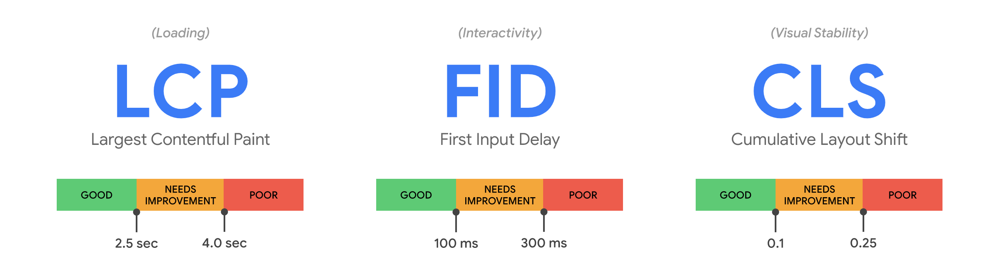
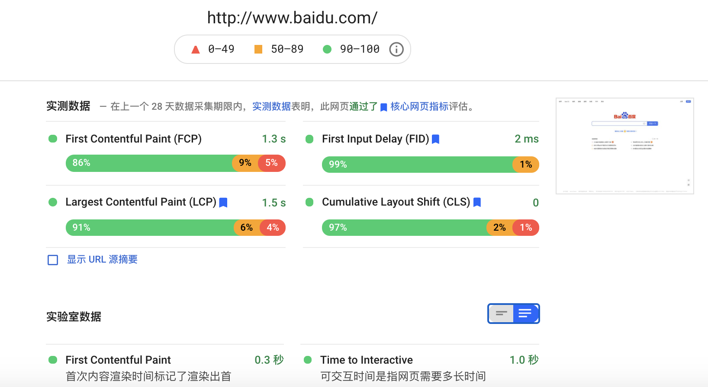
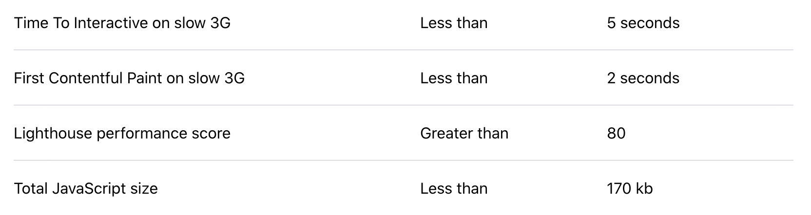
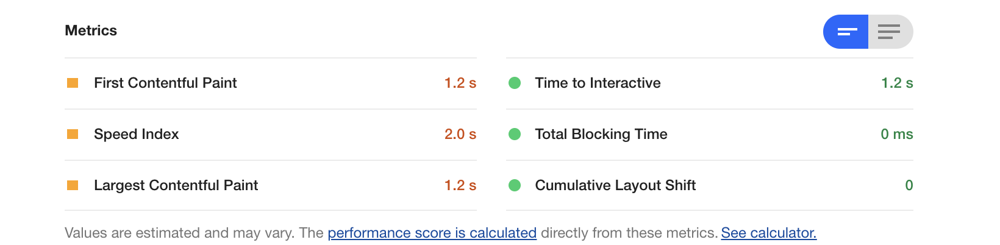
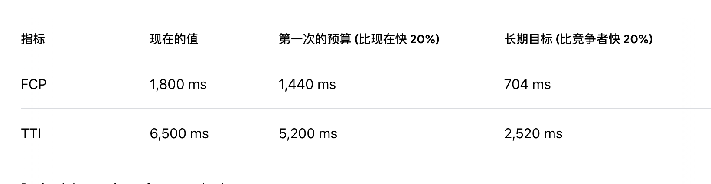

# Web 性能优化第一篇

当你优化网站性能的时候你首先做的是什么，是减少静态资源的大小、减少请求数还是加快 js 执行的速度呢？如果有三个性能等级，分布是：差、良、优，那么你的网站的性能是哪一个等级呢，这个等级是怎么评出来的呢？本文是 Web 性能优化系列文中的第一篇，优化性能的第一步是我们要精准并且用客观的标准去衡量性能。

在过去我们可能会使用 DOMContentLoaded 或 Load 事件去衡量网站的加载性能，但是这两个传统的性能指标是不可靠的，因为这两个指标与用户感知到的网站加载对应不起来。下图中的网站 load 事件触发时间是一样的，都是 7s，但是用户会觉得这两种情况的加载速度不一样


除了上图的例子，还有其他的例子也能说明用 load 事件去衡量网站的加载性能不可靠，比如服务器可以返回一个最小的页面，该页面的 load 事件会立即被触发，但随后延迟获取内容，直到 load 事件触发几秒钟后才在页面上显示内容，虽然这样的页面在技术上的加载时间很短，但该时间并不与用户实际感知到的页面加载相对应。其实上在衡量性能的时候我们会用到多个性能指标，只一个指标去衡量性能是不够的

究竟要用哪些指标去衡量网站性能呢？目前已经有一些比较推荐的通用指标，当然你也可以根据你的业务类型去自定义指标，在过去的几年里，Chrome 团队的成员与[W3C Web 性能工作组](https://www.w3.org/webperf/)致力于定义一套标准化的 API 和指标，以更准确地衡量用户对网页性能的体验，下面我们开始介绍这些指标和标准化的 API

## Web Vitals

Web Vitals 是 Google 提出来的，Web Vitals 是一套以用户体验为中心的性能指标。通过 Web Vitals 可以对网站的性能有一个大致的了解，使用这套通用的性能指标你可以将你的网站性能与竞争对手的网站进行比较。到目前为止，Web Vitals 中有三个核心指标，它们被称为 Core Web Vitals，这三个指标分别是：Largest Contentful Paint (LCP)、First Input Delay (FID) 和 Cumulative Layout Shift (CLS)，这三个指标从不同的层面去衡量网站的性能

* Largest Contentful Paint (LCP)：衡量网站的加载性能。从页面开始加载到屏幕上显示出最大文本块或图像所花的时间
* First Input Delay (FID)：衡量网站响应用户交互的性能。从用户首次与你的网页互动到浏览器响应此次互动之间的用时
* Cumulative Layout Shift (CLS)：衡量视觉稳定性。 会衡量在网页的整个生命周期内发生的所有意外布局偏移的得分总和，得分是零到任意正数，其中 0 表示无偏移，数字越大，网页的布局偏移越大

Core Web Vitals 不仅给出了指标的定义，还给这些指标提供了推荐的目标值



除了上面提到的三个核心指标，还有下面这些指标

* First contentful paint (FCP): 从页面开始加载到页面上的任一内容呈现到屏幕上花的时间
* Time to Interactive (TTI): 从页面开始加载到它能够快速可靠地响应用户交互的时间。有些时候，开发者为了提高网站的 FCP 性能，会以牺牲 TTI 性能为代价，这导致页面看上去可用但实际上不可用
* Total blocking time (TBT): 度量 FCP 和 TTI 之间的时间

虽然上面已经提到了多个从不同层面衡量与用户体验相关的指标，但它并没有包括所有方面(例如，运行时的响应性和流畅性就没有包括在内)，在某些情况下，你需要去自定义指标，关于如何自定义指标稍后再介绍

## 测量性能

测量网站的性能是网站性能优化中非常重要的一步，因为只有测量之后你才知道你的优化操作是不是有效的，当你做了任何优化操作之后，你都需要进行测量。下面介绍几个测量性能的方式和工具

### 实验室数据与实测数据

实验室数据是在受控环境中通过预定义的设备和网络环境收集到的性能数据，而实测数据是在用户实际使用过程中收集到的性能数据，这两种类型的数据都有自己的优点和局限性。

实验室数据提供了可复现的结果和调试环境，但可能无法捕获到用户实际的性能瓶颈，使用实验室测量性能的时候，您需要了解你的用户常用的设备和网络环境，并在测试性能时尽可能地接近这些条件。实测数据也被称为真实用户监控数据，它能够捕捉真实的用户体验，但是它的调试能力有限。

在开发阶段只能在实验室测量性能，在上线之后再使用 RUM 分析工具去确认你对站点所做的更改是否真的达到了预期。前面我们提到的那些指标并不是所有的都可以在实验室和实际中测量，FCP、LCP、CLS 可以在实验室和实际中测量；FID 在实际中测量；TTI 和 TBT 在实验室中测量

### 测量工具

实验室测量工具

* Chrome 开发着工具: 它是一套直接内置到谷歌 Chrome 浏览器的 web 开发工具,它允许您分析页面的运行时，以及识别并调试性能瓶颈。
* Lighthouse: Lighthouse 是一个开源的自动化工具，可以用于改进 Web 应用的质量。能在 Chrome 开发着工具中使用 Lighthouse，也能在命令行中使用 Lighthouse，你也可以将 Lighthouse 作为一个 node 模块集成到你的 CI 中

实测测量工具

* Chrome User Experience Report: 提供用户在 Chrome 上实际使用情况的报告
* PageSpeed Insights：既能够生成实验室数据也能够生成实测数据，它使用 Lighthouse 生成实验室数据，使用 Chrome User Experience Report 生成实测数据
* Web 性能工作组提供的性能度量 API：如 User Timing API、Long Tasks API 等，除了直接使用这些 API，还能使用 web-vitals，web-vitals 是基于性能度量 API 封装的 js 库

Lighthouse 生成的报告如下：


PageSpeed Insights 生成的报告下：



使用在 javascript 性能度量 API，如下：

```javascript
new PerformanceObserver((entryList) => {
  for (const entry of entryList.getEntries()) {
    const delay = entry.processingStart - entry.startTime;
    console.log('FID candidate:', delay, entry);
  }
}).observe({type: 'first-input', buffered: true});
```

## 性能预算

你可能会发现当你做了性能优化之后网站的性能确实变好了，但是过一段时间之后网站的性能又下降了，这是因为网站性能很像健身，只健身一次是不够的，你必须改变你的生活方式。也许你听说过财务预算，在这里也有一个类似的概念，叫做性能预算，性能预算是一组影响网站性能的度量标准的限制，当你设定一个限制之后，在未来要确保你的网站性能在这个范围内。下面是一个性能预算例子：



### 制定你的性能预算

如果你要优化一个已经存在的网站，你首先要确定你要优化哪些页面，确定好要优化的页面之后再使用性能分析工具测量这些页面目前的性能，比如你使用 lightHouse 测量结果如下：



现在你可以去分析你竞争者的网站性能了，然后以竞争者网站性能至少提升 20% 为你的网站的性能预算，其实你也可以不用以竞争者的网站性能为标准，你可以直接使用 Core Web Vitals 中各指标推荐的目标值为性能预算。要将一个已经存在的页面性能直接优化到高于竞争者网站性能 20% 或者优化到 Core Web Vitals 推荐的性能值并不容易，但是你可以一步一步的优化，先将你的性能预算设置成你的网站性能提升 20%，你的性能预算可能是这样的：



在制定性能预算的时候，你可以从各个方面的制定性能预算，可以是以用户为中心的时间指标、资源的大小、资源的数量、HTTP 请求的数量、你甚至可以将 lightHouse 测量的分数作为预算

### 将性能预算整合到你的构建流程中

你能使用下面的这些工具将你制定的性能预算整合到构建流程中

* [Webpack performance features](https://webpack.js.org/configuration/performance/)
* [bundlesize](https://github.com/siddharthkp/bundlesize)
* [Lighthouse CI](https://github.com/GoogleChrome/lighthouse-ci)

## 自定义指标

Web Vitals 中通用的指标为我们了解网站性能提供了一个很好的参考，但是在有些情况下为了获得网站的完整体验您需要度量的不仅仅是这些指标，如果通用的指标不能满足你的需要，你可以自定义指标，例如：

1. 一个单页面应用程序(SPA)从一个“页面”过渡到另一个“页面”需要多长时间
2. 已登录用户从数据库获取的数据到数据显示在页面上需要多长时间 
3. 用户二次网站时访问资源的缓存命中率

在过去，web 开发人员没有太多底层 API 去衡量性能，因此他们不得不使用一些 hack 的方式去衡量一个站点是否运行良好。例如，使用 requestAnimationFrame 计算每两帧之间的增量来确定主线程是否由于 JavaScript 任务的长时间运行而阻塞，我们不推荐使用这种方法，因为它会影响性能(例如，会消耗电池)。在做性能评估的时候不能因为性能评估技术影响网站的性能，因此，如果你要使用 Web API 度量网站的性能，最好使用以下 API

### PerformanceObserver

使用 PerformanceObserver 可以创建一个性能观察者，使用它你可以订阅与性能相关的事件，它不会影响页面的性能，因为它们的回调会在浏览器空闲期间触发。给 PerformanceObserver 传递一个回调函数就能够创建一个性能观察者对象，使用观察者的 observe 方法告诉观察者要监听哪些类型的性能条目，每当分派新的性能条目时都会运行这个回调。代码如下：

```javascript
// 捕获错误，因为一些浏览器在使用 'type' 这个新的参数时会抛出错误
// https://bugs.webkit.org/show_bug.cgi?id=209216
try {
  const po = new PerformanceObserver((list) => {
    for (const entry of list.getEntries()) {
      console.log(entry.toJSON());
    }
  });

  po.observe({type: 'some-entry-type'});
} catch (e) {
  // 如果浏览器不支持这个 API
}
```

observe()方法的参数对象中可以是 entryTypes 数组(为了通过同一个观察者观察多类记录)。entryTypes 是一个较早的参数选项，到目前为止被浏览器广泛支持，但现在推荐使用 type，因为当使用 type 时，observe 方法还允许指定额外的参数项，如 buffered 标志，在后面会讨论 buffered。在一些较新的浏览器中，你可以使用 PerformanceObserver.supportedEntryTypes 检查 performanceObserver 支持观察哪些类型的性能条目

#### buffered 标志

默认情况下，performanceObserver 不能得到历史的性能条目，所以如果您希望延迟加载性能分析代码这会产生问题，要想得到历史发生的性能条目，你可以将 observe 方法的 buffered 参数设置为 true，当第一次调用 performanceObserver 回调时浏览器将从它的性能条目缓冲区中取出历史条目。

```javascript
po.observe({
  type: 'some-entry-type',
  buffered: true,
});
```

性能条目缓冲区不是无限大的，对于大多数的页面而言性能条目缓冲区不太可能被填满，所以性能条目也不会丢失。

### User Timing API

User Timing API 是基于时间的通用度量 API，你可以使用它任意标记时间点，然后测量这些标记之间持续的时间，代码如下：


```javascript
// 记录任务运行前的时间。
performance.mark('myTask:start');
await doMyTask();
// 记录任务运行后的时间。
performance.mark('myTask:end');

// 测量任务开始和结束之间的增量
performance.measure('myTask', 'myTask:start', 'myTask:end');
```

这只是 User Timing API 的用法之一。虽然这很像 Date.now() 或 performance.now() 这样的API，但使用 User Timing API 的好处是它与性能工具集成得很好。例如，在 Lighthouse 生成的报告中你可以看到 User Timing API 的测量结果，还有一些性能分析提供商也会自动跟踪测量结果，并将数据发送到他们的后端进行分析。

只是测量 User Timing 可能是不够的，你需要配合 PerformanceObserver 去观察类型为 measure 的性能条目，代码如下：


```javascript
try {
  const po = new PerformanceObserver((list) => {
    for (const entry of list.getEntries()) {
      console.log(entry.toJSON());
    }
  });
  // 开始监听
  po.observe({type: 'measure', buffered: true});
} catch (e) {
  // 如果浏览器不支持这个 API
}
```

### Long Tasks API

使用 Long Tasks API 你可以知道在你的页面中是否有执行时间超过 50ms 的任务，执行时间超过 50ms 的任务被认为是长任务，像 TTI 和 TBT 这些指标都是建立在 Long Tasks API 之上的。配合 PerformanceObserver 可以去观察脚本是否执行了长任务。

```javascript
try {
  const po = new PerformanceObserver((list) => {
    // 如果有长任务被执行了，在这里可以得到与长任务相关的信息
    for (const entry of list.getEntries()) {
      console.log(entry.toJSON());
    }
  });
  // 开始监听长任务
  po.observe({type: 'longtask', buffered: true});
} catch (e) {
  // 如果浏览器不支持这个 API
}
```

### Element Timing API

LCP 指标用来测量最大可见内容元素绘制到页面上花的时间，但在某些时候，您可以需要更精准的测量不同的元素绘制到页面上的时间，使用 Element Timing API 可以实现这个需求，Largest Contentful Paint 就是基于 Element Timing API 的。通过在元素上添加 elementtiming 属性来标记要观察的元素，然后再配合 PerformanceObserver 去观察，用法如下：

```html

<p elementtiming="important-paragraph">This is text I care about.</p>
...
<script>
try {
  const po = new PerformanceObserver((entryList) => {
    for (const entry of entryList.getEntries()) {
      console.log(entry.toJSON());
    }
  });

  po.observe({type: 'element', buffered: true});
} catch (e) {

}
</script>
```

该 API 并不支持所有的元素，它支持 `` 元素、`<svg>` 内的 `<image>` 元素、`<video>` 元素的封面，具有 background-image 的元素，以及文本节点组，例如 `<p>`

### Event Timing API

通过 Event Timing API 可以得到用户输入事件相关的时间信息，例如事件的延迟、事件处理程序中同步代码的执行时间等，用法如下：

```javascript
const observer = new PerformanceObserver(function(list) {
  const perfEntries = list.getEntries().forEach(entry => {
      const inputDelay = entry.processingStart - entry.startTime;
  });
});

observer.observe({type: "event", buffered: true});
```

通过 Event Timing API 能够访问到的事件性能条目的属性包括但不仅限于下面的这些：

1. startTime: 浏览器接受到事件的时间
2. processingStart: 浏览器能够开始处理事件处理程序的时间。
3. processingEnd: 浏览器执行完事件处理程序中所有同步代码的时间。
4. duration: 度量事件的整个持续时间，从浏览器接收输入到处理完所有事件处理程序后绘制下一帧为止。
5. name: 事件类型，如：mouseout，click 等

如果没有给事件绑定处理程序，processingEnd 与 processingStart 的值是相等的。如果在你的页面中有一个按钮的功能是单击它之后将更改表格的排序顺序，你可以使用 Event Timing API 测量从点击到显示重新排序的内容所花费的时间。

Event Timing API 并不支持所有的事件，它支持的事件有：auxclick, click, contextmenu, dblclick, mousedown, mouseenter, mouseleave, mouseout, mouseover, mouseup, pointerover, pointerenter, pointerdown, pointerup, pointercancel, pointerout, pointerleave, gotpointercapture, lostpointercapture, touchstart, touchend, touchcancel, keydown, keypress, keyup, beforeinput, input, compositionstart, compositionupdate, compositionend, dragstart, dragend, dragenter, dragleave, dragover, drop。

### Resource Timing API

Resource Timing API 让开发人员可以详细了解页面上的资源是如何加载的,这些资源可以是 XMLHttpRequest, `<SVG>`、图片、脚本等等。用法如下：

```javascript
const po = new PerformanceObserver((list) => {
    for (const entry of list.getEntries()) {
      // 如果 transferSize 为 0 就说明资源是从缓存中取的
      console.log(entry.name, entry.transferSize, entry);
    }
  });
  po.observe({type: 'resource', buffered: true});
```

通过 Resource Timing API 可以得到资源加载的各个阶段的时间戳，如重定向、DNS 查询、TCP 连接，这些阶段和他们的属性名如下：


这个 API 不仅仅会提供时间相关的信息，它还会提供其他的信息，如下：

1. initiatorType: 这个资源是怎么被捕获的，通过 `script`、`css`、`img` 还是 `xmlhttprequest`
2. nextHopProtocol: 捕获这个资源用的协议，例如：h2、http/1.1 等
3. encodedBodySize：编码之后资源的大小
4. decodedBodySize：解码之后资源的大小
5. transferSize：在网络上实际传输的资源的大小。如果资源是在缓存中获取的，该值可以比 encodedBodySize 小得多，它的值甚至可能是 0。可以使用 transferSize 属性来度量缓存命中率，也能度量缓存资源的总大小

### Navigation Timing API

Navigation Timing API 与 Resource Timing API 类似，但是 Navigation Timing API 只会上报导航请求，它会包含一些与导航请求相关属性。导航请求的目标是“document”，通俗地说，当你在浏览器的位置栏中输入一个 URL 并且按回车键或访问从一个网页到另一个网页的链接，导航请求就会发生，在页面上放置 iframe 这会导致 iframe 的 src 对应页面的导航请求。

可以通过 Navigation Timing API 的 responseStart 属性来得到服务器响应时间

```javascript
const po = new PerformanceObserver((list) => {
    for (const entry of list.getEntries()) {
      console.log('Time to first byte', entry.responseStart);
    }
  });
  po.observe({type: 'navigation', buffered: true});
```

### Server Timing API

如果你想将服务器指标传递给浏览器，你可以在响应头中返回

```
Server-Timing: db;dur=123, tmpl;dur=56
```

Server Timing 并不帮你去测量这些指标，使用它可以拿到这些服务器返回的指标。然后，在浏览器中您可以从 navigation 和 resource 性能条目中得到这些服务器返回的指标

```javascript
const po = new PerformanceObserver((list) => {
    for (const entry of list.getEntries()) {
      // 打印这个资源相关的所有服务器指标
      console.log('Server Timing', entry.serverTiming);
    }
  });
  po.observe({type: 'navigation', buffered: true});
```

Server Timing 被限制为只能拿到同源的服务器指标，但是您可以使用 timingallow-origin 头来指定浏览器允许访问服务器指标的源，它仅在 HTTPS 协议中可用

关于 W3C Web 性能工作组提供的 Web 性能分析 API 就介绍到这里。如果你不使用第三方的工具，你想自己测试性能，你可以使用 web-vitals，它是一个基于性能分析 API 的 js 库

## 将性能指标发送到服务器

如果使用第三方 RUM 工具通常你不需要自己写代码去发送性能分析得到的数据，你只需要简单的引入一个他们的 SDK。在这里假设你需要自己发送数据到服务器，有的性能指标在页面加载完成的时候就能被确定，但是某些性能指标则跟随页面整个生命周期，例如：CLS，只有在页面卸载的时候才最终确定。对于跟随页面整个生命周期的性能指标，我们什么时候将计算出的数据发送到服务器呢？在这里不推荐使用 beforeunload 和 unload 事件，这是因为 unload 事件和 beforeunload 事件在某些情况不会被触发，并且这两个事件会阻止浏览器进行 back/forward 导航优化，推荐使用 visibilitychange 事件。

```javascript
document.addEventListener('visibilitychange', function logData() {
  if (document.visibilityState === 'hidden') {
    if (navigator.sendBeacon) {
        navigator.sendBeacon('/analytics', body)
    } else {
        fetch('/analytics', {body, method: 'POST'});
    }
  }
});
```

虽然 beforeunload 的触发不可靠并且会让页面不被添加到 Back-Forward 缓存中，但是 beforeunload 也有用武之地，在用户离开时判断有无未保存的改变可以使用 beforeunload。

```javascript
window.addEventListener("beforeunload", function( event ) {
  if (pageHasUnsavedChanges()) {
      event.preventDefault();
      return event.returnValue = 'Are you sure you want to exit?';
  }
});
```

## 总结

当你要优化一个已经存在的网站的性能时，比较推荐的步骤是：

1. 测量你将要优化的页面的性能
2. 定义性能预算
3. 开始优化。你可以使用性能分析工具提供的优化建议进行优化，比如: Lighthouse 就会提供优化建议
4. 每做完一个优化操作之后都要进行测量，确定你的优化操作是有效的