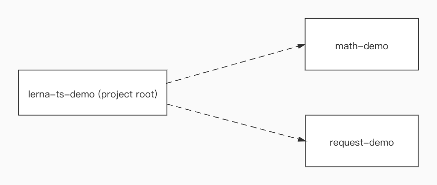
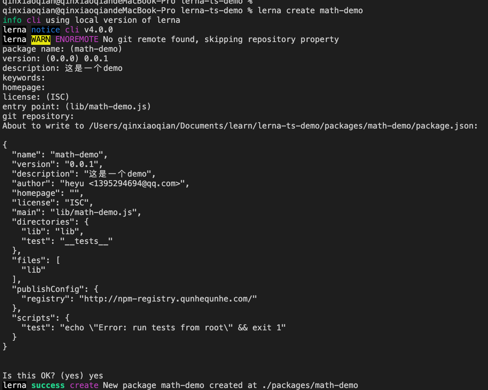
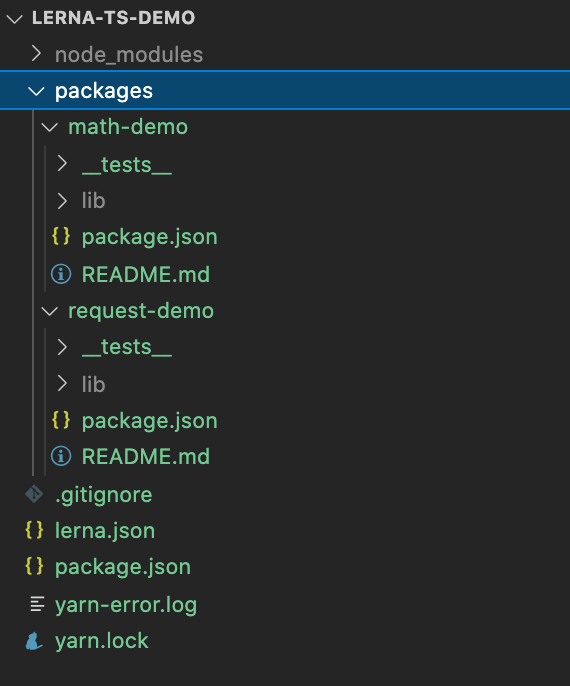
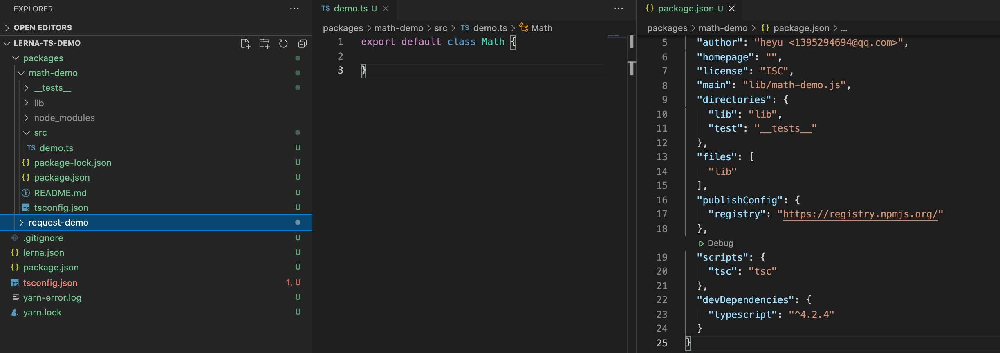
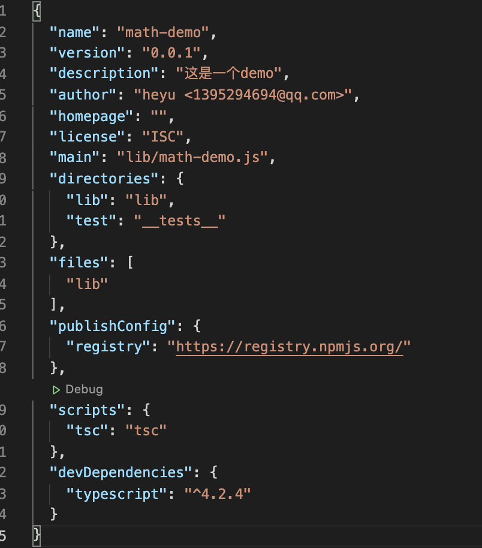
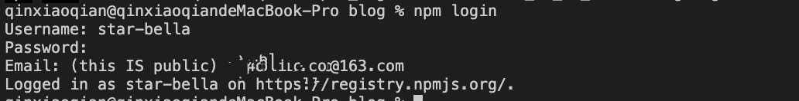

# 用 Lerna 管理 TypeScript monorepo

这是一篇写给 Lerna 初学者的文章，在这篇文章我将从零创建一个 TS 项目，并且使用 Lerna 将项目中的多个包发布到 npm 中

## Lerna 介绍

Lerna 是一个使用 git 和 npm 管理多包仓库的工具，它用于管理具有多个包的 JavaScript 项目。lerna 有两种模式：fixed 模式和 independent 模式

### fixed 模式

fixed 模式是 lerna 的默认模式，在这种模式下，版本被保存到项目根目录的 lerna.json 文件的 version 字段中。当你运行`lerna publish`时，如果从上一次发布之后有模块被更新了，被更新的模块将会以新版本发布，有更新的模块才会被发布，没有更新的模块不会被发布（注：如果主版本为 0 或者更新主版本号，会导致所有的模块都被发布，不管模块是否有更新）。在 fixed 模式下你只需要为待发布的模块选择一次版本号，被发布的模块的版本号是一样的。

### independent 模式

将 lerna.json 文件的 version 字段设置为`independent`，这会让 lerna 运行在 independent 模式下，independent 模式需要开发者单独修改每个待发布模块的版本号。

## 前置条件

### 全局安装 Lerna

```
npm install -g lerna
```

### NPM

在这个 demo 中，我使用 Lerna 将包发布到 npm 公有库中，所以需要到[www.npmjs.com](https://www.npmjs.com)创建一个 npm 账户.

### GIT

Lerna 依赖 git 检查文件改动，自动发布，管理版本号，根据 commit message 自动生成 changelog，所以需要安装 git。

## 开始动手

我要演示的项目中包含了2个包，结构如下：



创建一个名为 leran-ts-demo 的文件夹，在这个文件中执行

```
lerna init
```

这个命令执行完之后，leran-demo 的文件夹中会包含如下的文件：

* /packages
* lerna.json
* package.json

/packages 是一个空文件夹，我将 lerna 要管理的包放在这个文件夹中。

lerna.json 是 lerna 的配置文件，它的内容如下：

```json
{
  "packages": [
    "packages/*"
  ],
  "version": "0.0.0"
}
```

Lerna 不会创建 .gitignore，所以我们要自己创建 .gitignore，文件内容下：

```
node_modules/
lerna-debug.log
npm-debug.log
packages/*/lib
.idea
```

### 创建包

在这个 demo 中，lerna 要管理的包是：math-demo 和 request-demo，通过`lerna create`命令创建包。在仓库的根目录中运行 `lerna create math-demo`，结果如下：



重复上面的过程创建 request-demo。创建完成之后目录结构：



在项目中我们使用 TS 语法写源代码，所以需要安装 typescript，在仓库的根目录中运行 lerna add 命令将 typescript 添加到每个包的依赖中

```
lerna add typescript --dev
```

由于在所有的包中都使用了 TS，所有我在仓库中根目录中创建一个公共的 tsconfig.json，内容如下：

```json
{
 "compilerOptions": {
   "module": "commonjs",
   "declaration": true,
   "noImplicitAny": false,
   "removeComments": true,
   "noLib": false,
   "emitDecoratorMetadata": true,
   "experimentalDecorators": true,
   "target": "es6",
   "sourceMap": true,
   "lib": [
     "es6"
   ]
 },
 "exclude": [
   "node_modules",
   "**/*.spec.ts"
 ]
}
```

创建完公共的 tsconfig.json 之后，我们还需要给每个包创建它自己的 tsconfig.json，如下：

```json
{
 "extends": "../../tsconfig.json",
 "compilerOptions": {
   "outDir": "./lib"
 },
 "include": [
   "./src"
 ]
}
```

在为每个包添加 tsconfig.json 之后，我还为每个包创建了 src 目录，src 目录中保存这个包的 TS 文件。为了让 TS 文件能够被编译成 JS 文件，我还在每个包中的 package.json 中定义的 tsc 脚步，结果如下：



在仓库中根目录下运行

```
lerna run tsc
```

上面的命令会运行所有包中的 tsc 脚本


如果一切顺利，我们将把 TS 文件从 src 文件夹编译到每个包的 lib 文件夹中。我们看一下每个包 package.json 中的 directories, files, typings, publishConfig 和 main 属性：



这些对我们来说非常重要，因为它们控制着哪些文件将被推送到NPM，也决定了我们库的入口。

### 将代码托管到 gitHub

在 gitHub 创建一个仓库，并且将本地的仓库与远程仓库关联

### 将包发布到 npm 上

我已经有一个 npm 账户了，现在我只需要在终端上登录 npm



现在，我们已经准备好了项目结构和构建脚本，我将 publish 命令定义到仓库根目录的 package.json 中

```json
{
 "scripts": {
   "publish": "lerna run tsc && lerna publish"
 }
}
```

在仓库的根目录运行

```
npm run publish
```

Lerna 将指导我们完成发布过程，在这个过程中我们需要选择一次包版本，并将 Tag 推送到 Github。如果一切顺利，我们将在结尾看到消息:lerna success 发布了 2 个包。

### 验证发布成功

在命令行运行

```
npm info request-demo
npm info math-demo
```

你将看到相关 npm 的详细信息

## 写在后面

在这个 demo 中我用的是 leran 的 fixed 模式，你可以改成 independent 模式试试有什么不一样的地方。