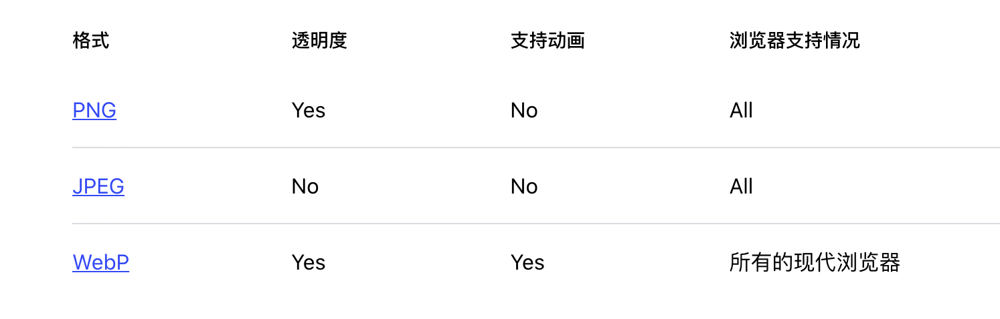
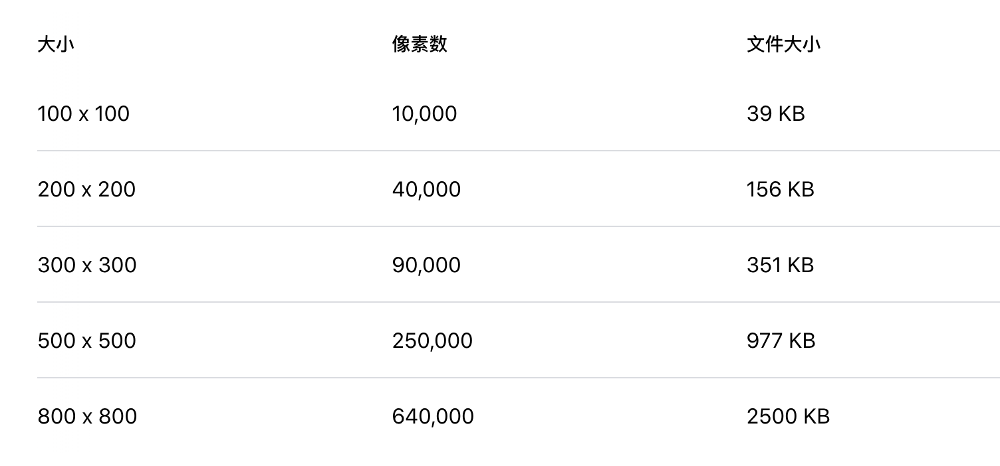
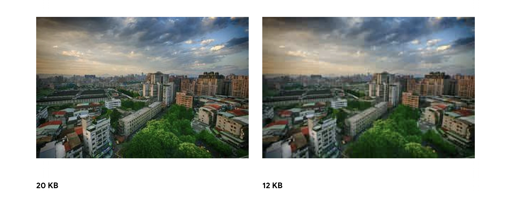
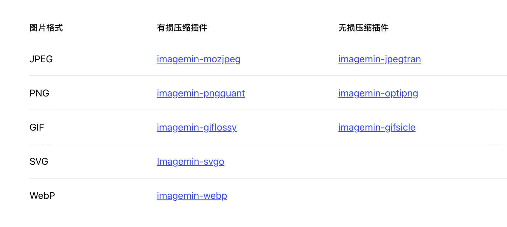

## 选择正确的图像格式

你应该问自己的第一个问题是，你的图片是否真的能够传递你想要的效果。如果你消除这个图像资源，而需要大量 HTML、CSS、JavaScript和页面上的其他资产来传递信息，那么这张图片可能是最好的策略，一张恰到好处的图片传达的信息要比文字要多

接下来，您应该考虑是否有一种替代技术可以以更有效的方式交付所需的结果

* CSS效果(如阴影或渐变)和CSS动画产生的效果不受设备分辨率和缩放效果的影响，在每个分辨率和缩放级别上都看起来清晰
* Web fonts 允许你使用漂亮的字体，同时保留了浏览器文字选择、搜索和调整文本大小的功能

如果您发现自己在图像资源中使用文本，请停止并重新考虑。优秀的排版对于良好的设计、品牌和可读性至关重要，但图像中的文本提供了糟糕的用户体验，因为图片上文本不可选择、不可搜索，而且对高dpi设备不友好。

### 选择正确的图片格式

如果你确定要使用图片，那么你应该仔细选择图片的格式


* 矢量图使用线、点和多边形来表示图像。上图中的左边的图是矢量图
* 位图通过编码矩形网格中每个像素的值来表示图像。

每种格式都有自己的优缺点。矢量图非常适合用于 logo、文本或 icon 等简单几何形状组成的图像，它们在每个分辨率和缩放等级下都能提供清晰的显示效果，然而，当图像比较复杂时(例如，一张照片)，矢量图就显得不够用了，为了描述图片上的所有形状，需要用到的 SVG 标记的数量可能高得令人望而却步，而且输出的效果可能仍然看起来不“逼真”。在这种情况下，就应该使用位图，如PNG、JPEG或WebP。

位图不具有分辨率或缩放无关的良好特性，当你放大位图时，你会看到锯齿状和模糊的图形。因此，您可能需要以不同的分辨率保存多个版本的光栅图像，以便为用户提供最佳的体验。

### 高分辨率屏幕的含义

有两种不同的像素: CSS 像素和设备像素。单个 CSS 像素可以直接对应单个设备像素，也可能对应多个设备像素，设备像素越多，屏幕上显示内容的细节就越精细。


位图在高DPI (HiDPI)屏幕能产生更好看的效果，但有这需要图像有更多细节，以利用更高的设备像素计数，矢量图在任何分辨率下渲染的效果都是相同的。位图按像素对图像数据进行编码的，因此，像素数越大，位图的文件大小就越大


当我们将物理屏幕的分辨率提高一倍时，总像素数将增加四倍，这是因为水平像素数增加一倍，垂直像素数增加一倍。因此，“2x”屏幕所需要的像素数是 1x 屏幕的四倍!

在高分辨率的屏幕上能够让显示的图像更好看，然而，高分辨率的屏幕也需要高分辨率的图像，因此：

* 尽可能选择矢量图像，因为它们与分辨率无关，并且总是能提供清晰的结果。
* 如果必须使用位图，可以查看 [serve responsive images](https://web.dev/serve-responsive-images/)

### 不同格式的位图的特点

除了不同的有损和无损压缩算法，不同的图像格式有不同的特性，如动画和透明度(alpha)通道。因此，为特定图像选择“正确的格式”是期望的视觉结果和功能需求的结合



有两种被浏览器广泛支持的位图格式: PNG 和 JPEG。除了这些格式外，现代浏览器还支持较新的WebP格式，它提供了更好的整体压缩和更多的特性。那么，应该使用哪种格式呢?

WebP格式通常提供比旧格式更好的压缩，应该尽可能使用。您可以将WebP与另一种图像格式一起使用作为备用方案。在 [Use WebP images](https://web.dev/serve-images-webp/)

对于较老的图像格式，请考虑以下几点:

* 你需要动画? 你使用 video 元素。为什么不用GIF呢? GIF将颜色限制在最多256种，并创建比视频元素大得多的文件大小。查看[Replace animated GIFs with video](https://web.dev/replace-gifs-with-videos/)
* 如果你需要更多的细节，那么使用 PNG。除了颜色模式大小的选择，PNG不应用任何有损压缩算法。因此，它将产生最高质量的图像，但文件大小比其他格式高得多的。如果图像资产包含由几何形状组成的图像，考虑将其转换为矢量(SVG)格式!
* 如果你在优化图片，可以使用 JPEG。JPEG 使用有损和无损优化的组合来减少图像资产的文件大小。尝试几个JPEG质量级别，以找到您的资产的最佳质量与文件大小的权衡。

## 选择正确的压缩等级

图片通常占据网页上下载的大部分字节，也经常占据大量的视觉空间。因此,优化图像往往能够改进你的网站的性能。

图像优化既是一门艺术也是一门科学:艺术是因为对于如何最好地压缩单个图像没有一个确定的答案，科学是因为有许多成熟的技术和算法可以显著减少图像的大小。为您的图像找到最佳设置需要从多个方面仔细分析:格式功能、编码数据的内容、质量、像素维度等等。

### 优化矢量图

所有现代浏览器都支持矢量图形(Scalable Vector Graphics, SVG)，这是一种用于二维图形的基于xml的图像格式。可以将SVG标记直接嵌入页面或作为外部资源。大多数基于矢量的绘图软件都可以创建SVG文件，或者您可以直接在您喜欢的文本编辑器中手工编写它们。

```xml
<?xml version="1.0" encoding="utf-8"?>
<!-- Generator: Adobe Illustrator 17.1.0, SVG Export Plug-In . SVG Version: 6.00 Build 0)  -->
<svg version="1.2" baseProfile="tiny" id="Layer_1" xmlns="http://www.w3.org/2000/svg" xmlns:xlink="http://www.w3.org/1999/xlink"
    x="0px" y="0px" viewBox="0 0 612 792" xml:space="preserve">
<g id="XMLID_1_">
  <g>
    <circle fill="red" stroke="black" stroke-width="2" stroke-miterlimit="10" cx="50" cy="50" r="40"/>
  </g>
</g>
</svg>
```

上面的例子渲染了一个简单的圆形，黑色的轮廓和红色的背景

如您所知，它包含大量元数据，如层信息、注释和XML名称空间，这些通常对在浏览器中呈现资产是不必要的。因此，通过运行SVGO之类的工具来缩小SVG文件总是一个好主意。

去掉空格和备注可以将上面的例子的文件大小减小 58%

```xml
<svg version="1.2" baseProfile="tiny" xmlns="http://www.w3.org/2000/svg" viewBox="0 0 612 792"><circle fill="red" stroke="#000" stroke-width="2" stroke-miterlimit="10" cx="50" cy="50" r="40"/></svg>
```

因为SVG是一种基于xml的格式，所以您还可以应用GZIP压缩来减少它的传输大小—确保您的服务器配置为压缩SVG资产!

位图是由一系列“像素”组成的二维网格，例如：一个100x100像素的图像是一个10000像素的序列。反过来，每个像素存储“RGBA”值:(R)红色通道，(G)绿色通道，(B)蓝色通道，和(A) alpha(透明度)通道。在内部，浏览器为每个通道分配256个值，每个通道8位(2 ^ 8 = 256)，每个像素4字节(4通道x 8位= 32位= 4字节)。如果知道像素大小，我们可以计算出文件大小

10000像素  x 4 字节 = 40000 字节，40000 字节 / 1024 = 39 KB

另外，不管从服务器向客户端传输数据使用的图像格式是什么，当浏览器对图像进行解码时，每个像素总是占用4字节的内存。



对于100x100像素的图像来说，39 KB似乎不是什么大问题，但是对于较大的图像，文件大小会迅速膨胀，这使得图像资产的下载既慢又昂贵。到目前为止，这篇文章只关注“未压缩”的图像格式。值得庆幸的是，可以做很多事情来减小图像文件的大小。

减小文件大小一个简单的策略是将图像的 bit-depth 从每通道8位减少，每通道8位给我们每个通道可以有256个值，RGB三个通道合在一起可以表示16,777,216(256 ^ 3)种颜色。如果将颜色减少到256种会怎样?然后，RGB通道总共只需要8位，每像素立即节省两个字节——这比原来的4字节每像素格式节省了50% 


带有渐变颜色过渡(例如，渐变或天空)的复杂场景需要更大的调色板，以避免5位资产中的像素化天空等视觉伪影。另一方面，如果图像只使用一些颜色，那么一个大的调色板只是浪费宝贵的比特!

接下来，一旦你优化了存储在单个像素中的数据，你可以变得更聪明，也可以查看附近的像素:结果是，许多图像，特别是照片，有许多附近的像素具有相似的颜色——例如，天空，重复纹理，等等。利用这些信息对你有利的压缩机可以应用增量编码而不是存储每个像素的个人价值,你可以商店附近的像素之间的区别:如果相邻像素是相同的,那么三角洲是“零”,你只需要存储一个点!但为什么到此为止呢?

人眼对不同颜色有不同的敏感度:你可以通过减少或增加调色板来优化你的颜色编码。“附近”的像素形成一个二维网格。这意味着每个像素有多个邻居:您可以利用这一事实进一步改进增量编码。您可以查看附近像素的更大块，并使用不同的设置对不同块进行编码，而不是只查看每个像素的近邻。

### 无损与有损图像压缩

对于某些类型的数据,比如一个页面的源代码,或一个可执行文件,压缩不能改变或丢失任何原始信息，因为一个缺失或错误的数据可以完全改变文件的内容的含义,或者更糟。对于其他类型的数据，如图像、音频和视频，提供原始数据的“近似”表示是完全可以接受的。

事实上，由于眼睛的工作方式，我们经常可以为了减少图像的文件大小而丢弃关于每个像素的一些信息，例如，我们的眼睛对不同的颜色有不同的敏感度，这意味着我们可以用更少的位元来编码一些颜色。因此，一个典型的图像优化流水线由两个高级步骤组成:

1. 用[有损滤波器]()https://en.wikipedia.org/wiki/Lossy_compression处理图像，消除一些像素数据。
2. 采用[无损滤波器](https://en.wikipedia.org/wiki/Lossless_compression)压缩像素数据。

第一步是可选的，确切的算法将取决于特定的图像格式，但重要的是要理解，任何图像都可以经过有损压缩步骤来减小其大小。事实上，各种图像格式(如GIF、PNG、JPEG等)之间的区别在于它们在应用有损和无损步骤时使用(或省略)的特定算法的组合。

那么，什么是有损和无损优化的“最优”配置呢?答案取决于图像内容和您自己的标准，比如文件大小和图像细节之间的权衡。在某些情况下，您可能希望跳过有损优化，以完全保真的方式传达复杂的细节。在其他情况下，您可以应用激进的有损优化来减少图片资产的文件大小。

作为一个实际操作的例子，当使用有损格式如JPEG时，压缩器通常会暴露可定制的“质量”设置(例如，Adobe Photoshop中的“Save for Web”功能提供的质量滑块)，它通常是一个介于1到100之间的数字，控制有损和无损算法的特定集合的内部工作。为了获得最好的效果，尝试不同的图像质量设置，不要害怕降低图像质量——视觉效果通常非常好，节省的文件大小可以相当大。

请注意，由于用于编码图像的算法不同，不同图像格式的质量级别不能直接进行比较:90 JPEG的质量与90 WebP的质量会产生非常不同的结果。事实上，基于压缩器的实现，即使是相同图像格式的质量级别也可能产生明显不同的输出!

### 图像优化清单

当你在优化你的图像时，要记住一些技巧和技巧：

1. 尽量使用矢量图：矢量图像的显示效果与分辨率无关，这使它们非常适合用于多设备和高分辨率
2. 缩小和压缩SVG资产：大多数绘图应用程序生成的XML标记通常包含可以删除的不必要的元数据;确保您的服务器配置为对SVG资产应用GZIP压缩。
3. 在使用位图时尽量使用 WebP 格式：WebP图像通常比旧的格式图像小得多。
4. 选择最佳的光栅图像格式:确定您的功能需求，并选择适合每个特定资产的格式。
5. 尝试位图的最佳质量设置:不要害怕降低“质量”设置，结果通常非常好，字节节省是显著的。
6. 删除不必要的图像元数据:许多栅格图像包含关于图片的不必要的元数据:地理信息、相机信息
7. 服务缩放图像:调整图像的大小，并确保“显示”的大小是尽可能接近真实的图像大小。特别要注意大图像，因为它们在调整大小时占用了最大的开销!

## 使用 Imagemin 压缩图片

### 你为什么要关心

未压缩的图像会用不必要的字节使页面膨胀。右边的照片比左边的小40%，但看起来可能和没有压缩的图片一样。



### Imagemin

Imagemin是图像压缩的最佳选择，因为它支持多种图像格式，并且很容易与构建脚本和构建工具集成。Imagemin可以作为CLI和npm模块使用。一般来说，npm模块是最好的选择，因为它提供了更多的配置选项，但如果您想在不涉及任何代码的情况下尝试Imagemin，那么CLI也是一个不错的选择。

#### Plugins

Imagemin是围绕“插件”构建的。一个插件是一个npm包，它可以压缩特定的图像格式(如“mozjpeg”压缩jpeg)。常见的图像格式可能有多个插件可供选择。

在选择插件时，最重要的是要考虑它是“有损的”还是“无损的”。在无损压缩中，没有数据丢失。有损压缩减少文件大小，但可能会降低图像质量。如果一个插件没有提到它是“有损的”还是“无损的”，你可以通过它的API来判断:如果你可以指定输出的图像质量，那么它就是“有损的”。

对于大多数人来说，有损的插件是最好的选择。它们大大节省了文件大小，您可以定制压缩级别以满足您的需要。下表列出了流行的Imagemin插件。这些不是唯一可用的插件，但对于您的项目来说它们都是很好的选择。



#### Imagemin CLI

Imagemin CLI使用5个不同的插件:Imagemin -gifsicle、Imagemin -jpegtran、Imagemin -optipng、Imagemin -pngquant和Imagemin -svgo。Imagemin根据输入的图像格式使用适当的插件。

使用如下命令压缩“images/”目录下的镜像文件并保存到同一目录下(覆盖原有文件):

```vstscli
$ imagemin images/* --out-dir=images
```

#### Imagemin node 模块

如果您使用这些构建工具之一，可以使用 webpack、gulp 或 grunt 签出 Imaginemin 的代码库。还可以单独使用Imagemin作为Node脚本。这段代码使用“imagemin-mozjpeg”插件将JPEG文件压缩到50的质量(“0”是最差的;“100”是最好的):

```javascript
const imagemin = require('imagemin');
const imageminMozjpeg = require('imagemin-mozjpeg');

(async() => {
  const files = await imagemin(
      ['source_dir/*.jpg', 'another_dir/*.jpg'],
      {
        destination: 'destination_dir',
        plugins: [imageminMozjpeg({quality: 50})]
      }
  );
  console.log(files);
})();
```

## 将gif动画替换为视频，以更快的页面加载

你是否曾在Imgur或Gfycat等服务上看到过GIF动画，在开发工具中查看过它，却发现它其实是一个视频?这是有原因的，因为 gif 动画文件的大小非常大。


值得庆幸的是，这是加载性能的一个方面，您可以做相对较少的工作来实现巨大的收益!通过将大的动图转换成视频，你可以大大节省用户的带宽。

使用 lightHouse 可以检查出你的网站上那些 gif 替换成 video


### 创建MPEG视频

有许多方法可以将gif转换为视频，FFmpeg是其中之一。要使用FFmpeg转换GIF, 请在控制台中运行以下命令:

```vstscli
ffmpeg -i my-animation.gif -b:v 0 -crf 25 -f mp4 -vcodec libx264 -pix_fmt yuv420p my-animation.mp4
```

ibx264 编码器只适用于大小为偶数的文件，比如320px * 240px。如果输入的GIF的大小时奇数，你可以在命令中包括一个 filter ，以避免FFmpeg抛出“高度/宽度不能被2整除”的错误:

```vstscli
ffmpeg -i my-animation.gif -vf "crop=trunc(iw/2)*2:trunc(ih/2)*2" -b:v 0 -crf 25 -f mp4 -vcodec libx264 -pix_fmt yuv420p my-animation.mp4
```

### 创建WebM视频

MP4从1999年就出现了，WebM是一种相对较新的文件格式，最初发布于2010年。WebM视频比MP4视频小得多，但并不是所有浏览器都支持WebM，所以生成两者都有意义。

要使用FFmpeg将my-animation.gif转换为WebM视频，请在控制台中运行以下命令:

```vstscli
ffmpeg -i my-animation.gif -c vp9 -b:v 0 -crf 41 my-animation.webm
```

GIF和视频之间的成本节约是相当可观的。


在这个例子中，最初的GIF是3.7 MB，而MP4版本是551 KB, WebM版本只有341 KB!

### 将GIF img 替换为视频

```html
<video autoplay loop muted playsinline></video>
```

带有 autoplay loop muted playsinline 属性的视频元素会自动播放，无休止地循环，不播放音频，播放内联(即不是全屏播放)，所有的标志性行为都是gif动画所期望的!

最后，video元素需要一个或多个源子元素指向浏览器可以选择的不同视频文件，这取决于浏览器的格式支持。同时提供WebM和MP4，这样如果浏览器不支持WebM，它可以退回到MP4。

```HTML
<video autoplay loop muted playsinline>
  <source src="my-animation.webm" type="video/webm">
  <source src="my-animation.mp4" type="video/mp4">
</video>
```

浏览器不会猜测哪个是最优的，所以源代码的顺序很重要。例如，如果你先指定一个MP4视频，而浏览器支持WebM，浏览器将跳过 WebM 而使用 MPEG4。如果你想先使用WebM ，请先指定它!

## 使用响应式图片

为移动设备提供桌面大小的图像需要比实际需要多2 - 4倍的数据。不同于“一刀切”的图像处理方法，不同的设备可以提供不同的图像大小。

### 调整图像大小

有两个很流行的用于改变图像大小的工具，分别是：[sharp npm package](https://www.npmjs.com/package/sharp) 和 [ImageMagick CLI tool](https://www.imagemagick.org/script/index.php)

sharp 包是自动调整图像大小的好选择(例如，为你网站上的所有视频生成多个尺寸的缩略图)。它可以快速、轻松地与构建脚本和工具集成。另一方面，ImageMagick对于一次性调整图像大小很方便，因为它完全是从命令行使用的。

### sharp

要使用sharp作为Node脚本，请将此代码保存为项目中的单独脚本，然后运行它来转换图像:

```javascript
const sharp = require('sharp');
const fs = require('fs');
const directory = './images';

fs.readdirSync(directory).forEach(file => {
  sharp(`${directory}/${file}`)
    .resize(200, 100) // width, height
    .toFile(`${directory}/${file}-small.jpg`);
  });
```

### ImageMagick

要将图像调整为原来大小的33%，请在终端中运行以下命令:

```vstscli
convert -resize 33% flower.jpg flower-small.jpg
```

要调整图像的大小，以适应300px宽200px高，运行以下命令:

```vstscli
# macOS/Linux
convert flower.jpg -resize 300x200 flower-small.jpg

# Windows
magick convert flower.jpg -resize 300x200 flower-small.jpg
```

### 应该创建多少个图像版本?

这个问题没有唯一的“正确”答案。然而，通常是为3-5个不同大小的图像服务。提供更大的图像尺寸对网站性能更好，但是会占用服务器上更多的空间，并且需要编写更多的HTML。

#### 提供多个图片版本

指定多个图像版本，浏览器将选择最合适的尺寸展示给用户:


img 标签的 src, srcset 和 sizes 属性被浏览器用于实现这个目标

#### src 属性

src 属性使得这段代码可以在不支持srcset和size属性的浏览器中工作。如果浏览器不支持这些属性，它将退回到加载src属性指定的资源。所以 src 属性指定的资源应该足够大，足以在所有设备上正常工作。

#### srcset 属性

srcset 属性是一个以逗号分隔的图像文件名及其宽度或密度描述符的列表。使用w单位(而不是px)来编写宽度描述符。例如，1024px宽的图像会被写成1024w。

这个例子使用了宽度描述符。480w是一个宽度描述符，告诉浏览器flower-small.jpg是480px宽;1080w是一个宽度描述符，告诉浏览器flower-large.jpg是1080px宽。

“宽度描述符”听起来很花哨，但它只是告诉浏览器图像宽度的一种方式。这将使浏览器不需要下载图像来确定其大小。

密度描述符用于根据设备的像素密度提供不同的图像。

#### sizes 属性

size属性告诉浏览器图像显示时的宽度。然而，size属性对显示大小没有影响，你仍然需要CSS。浏览器使用这些信息，以及它对用户设备的了解(比如它的尺寸和像素密度)，来决定加载哪个图像。

如果浏览器不能识别"sizes"属性，它将退回到加载由"src"属性指定的图像。(浏览器同时提供了对“size”和“srcset”属性的支持，所以浏览器要么支持这两个属性，要么不支持。)

sizes 可以使用多种单位指定。以下是所有有效的大小:

* 100px
* 33vw
* 20em
* calc(50vw-10px)

以下不是有效的大小

20% （sizes属性不能使用百分比）

如果想要更花哨，还可以使用sizes属性指定多个插槽大小。这适用于不同视口大小使用不同布局的网站。请查看这个多槽代码示例来了解如何做到这一点。

```html

```

size属性的值指示图像显示宽度将是:在480px宽的视图上为“viewport宽度的100%”，在481-1024px宽的屏幕上为“viewport宽度的50%”，在1024px宽的屏幕上为800px。这些宽度与CSS中指定的宽度相匹配。

### 验证

一旦实现了响应式图像，就可以使用 Lighthouse 来确保没有遗漏任何图像。运行 Lighthouse 性能审查(Lighthouse > Options > Performance)，并查看 Properly size images，在哪儿将列出需要调整大小的图像。

## 提供正确尺寸的图片

我们都遇到过这样的情况:在添加图像到页面之前，忘记缩放图像。图像看起来不错，但它浪费了用户数据，并损害了页面性能。

### 识别大小不正确的图像

使用 Lighthouse

### 确定正确的图像大小

图像大小调整可能看起来很复杂。为此，我们提供了两种方法:“好”和“更好”。这两种方法都将提高性能，但“更好”的方法可能需要更长的时间来理解和实现。然而，它也将奖励您更大的性能改进。对您来说，最好的选择是您感到舒适的实现

### 关于CSS单元的一个简短说明

有两种类型的CSS单元用于指定HTML元素的大小，包括图像:

* 绝对单位:使用绝对单位样式的元素将始终以相同的大小显示，不管设备是什么。有效的，绝对的CSS单位示例:px, cm, mm, in。
* 相对单位:使用相对单位样式的元素将根据指定的相对长度显示不同的大小。有效的相对CSS单位示例:%，vw (1vw =视口宽度的1%)，em (1.5 em = 1.5倍字体大小)。

### 好的实现方式

图像的大小基于：

* 相关单位: 调整图像的大小，使其适用于所有设备。

你可能会发现检查你的分析数据(例如谷歌analytics)很有帮助，看看哪些显示尺寸是你的用户常用的。或者，screen size .es提供关于许多常见设备的显示信息。

* 绝对单位:调整图像的大小，以匹配它显示的大小。

DevTools Elements面板可以用来确定图像显示的大小。


### 更好的方式

图像的大小基于：

* 相关单位: 使用srcset和size属性为不同显示密度提供不同图像

“显示密度”是指不同的显示具有不同的像素密度。在其他条件相同的情况下，高像素密度显示器比低像素密度显示器看起来更清晰。

因此，如果你想让用户体验到尽可能清晰的图像，不管他们的设备的像素密度，多个图像版本是必要的。

响应式图像技术可以让您列出多个图像版本，并让设备选择最适合它的图像。

* 相对单位:使用响应图像服务不同的图像显示大小。

在所有设备上工作的映像对于较小的设备来说会不必要地大。响应式图像技术，特别是srcset和尺寸，允许您指定多个图像版本，并让设备选择最适合它的尺寸。

## 使用 WebP 格式的图片

WebP图像比JPEG和PNG图像要小——通常在文件大小上减少25-35%。这将减少页面大小并提高性能。WebP是JPEG、PNG和GIF图像的绝佳替代品。此外，WebP还提供无损压缩和有损压缩。在无损压缩中不丢失数据。有损压缩减少文件大小，但可能会降低图像质量。

### 转换图像到WebP

人们通常使用以下方法将图像转换为WebP: [cwebp command-line tool](https://developers.google.com/speed/webp/docs/using) 或 [Imagemin WebP插件](https://github.com/imagemin/imagemin-webp)。如果你的项目使用构建脚本或构建工具(例如Webpack或Gulp)， Imagemin WebP插件通常是最好的选择，而CLI则是简单项目的好选择，或者如果你只需要转换一次图像。

当您将图像转换为WebP时，您可以选择设置各种各样的压缩设置——但对于大多数人来说，您唯一需要关心的是质量设置。您可以指定从0(最差)到100(最好)的质量级别。根据您的需要，在图像质量和文件大小之间找到合适的权衡级别是值得尝试的。

### Use cwebp

转换单个文件，使用cwebp的默认压缩设置:

```dotnetcli
cwebp images/flower.jpg -o images/flower.webp
```

转换单个文件，使用质量等级50:

```dotnetcli
cwebp -q 50 images/flower.jpg -o images/flower.webp
```

转换目录中的所有文件:

```dotnetcli
for file in images/*; do cwebp "$file" -o "${file%.*}.webp"; done
```

### Use Imagemin 

Imagemin WebP插件可以自己使用，也可以与你喜欢的构建工具(Webpack/Gulp/Grunt/等)一起使用。这通常涉及到向构建脚本或构建工具的配置文件添加大约10行代码。下面是Webpack、Gulp和Grunt如何做到这一点的示例。

如果您没有使用这些构建工具中的任何一个，您可以单独使用Imagemin作为Node脚本。这个脚本将转换images目录中的文件，并将它们保存在compressed_images目录中。

```javascript
const imagemin = require('imagemin');
const imageminWebp = require('imagemin-webp');

imagemin(['images/*'], {
  destination: 'compressed_images',
  plugins: [imageminWebp({quality: 50})]
}).then(() => {
  console.log('Done!');
});
```

### 使用 WEbP 图片

如果你的网站只支持WebP兼容的浏览器，你可以停止阅读。否则，为较新的浏览器提供WebP，并为较旧的浏览器提供备用图像:

Before:

```html

```

After:

```html
<picture>
  <source type="image/webp" srcset="flower.webp">
  <source type="image/jpeg" srcset="flower.jpg">
  
</picture>
```

图片、源和img标记，包括它们彼此之间的顺序，都是通过交互来实现这个最终结果的。

#### picture

picture 标记为零或多个 source 标记和一个img标记提供了一个包装器。

#### source

source 标签指定一个媒体资源

浏览器使用它支持的格式列出的第一个源代码。如果浏览器不支持源标记中列出的任何格式，它将退回到加载img标记指定的图像。

* “preferred”图像格式(在本例中是WebP)的标签应该在其他标签之前列出。
* type属性的值应该是对应于图像格式的MIME类型。一个图像的MIME类型和它的文件扩展名通常是相似的，但它们不一定是相同的东西(例如。jpg vs. image/jpeg)。

#### img

img 标记使这段代码在不支持 picture 标记的浏览器上运行。如果浏览器不支持 picture 标签，它会忽略不支持的标签。因此，它只“看到”``标签并加载该图像。

* 应该始终包含img标记，并且它应该始终列在最后，在所有 source 标记之后。
* 由img标记指定的资源应该是普遍支持的格式(例如JPEG)，所以它可以用作备用格式。

## 使用图像cdn优化图像

### 为什么使用图像CDN

图像内容分发网络(cdn)在优化图像方面非常出色。切换到图像CDN可以节省40-80%的图像文件大小。理论上，只使用构建脚本就可以实现相同的结果，但在实践中很少。

### 什么是图像CDN?

图像cdn专门用于图像的转换、优化和交付。您还可以将它们视为访问和操作站点上使用的图像的api。对于从图像CDN加载的图像，图像URL不仅指示要加载哪个图像，还指示像大小、格式和质量这样的参数。这使得为不同的用例创建不同的映像变得很容易。


图像cdn与  build-time 图像优化脚本不同，因为它们根据需要创建映像的新版本。因此，与构建脚本相比，cdn通常更适合为每个客户创建高度定制的映像。

#### 图像cdn如何使用url来指示优化选项

图像cdn使用的图像url传递了关于图像的重要信息，以及应该应用到它的转换和优化。URL格式会因图像CDN而异，但在高层，它们都有类似的功能。让我们来看看一些最常见的特性。


#### Origin

图像CDN可以存在于您自己的域或我的图像CDN的域。第三方图像cdn通常提供付费使用自定义域名的选项。使用您自己的域名可以更容易地在以后切换图像cdn，因为不需要更改URL。

上面的示例使用图像CDN的域(“example-cdn.com”)和个性化的子域，而不是自定义域。

#### Image

图像cdn通常可以配置为在需要时自动从现有位置检索图像。这种功能通常是通过在由图像CDN生成的图像的URL中包含现有图像的完整URL来实现的。例如，您可能会看到这样的URL: https://my-site.example-cdn.com/https://flowers.com/daisy.jpg/quality=auto。这个URL将检索并优化存在于https://flowers.com/daisy.jpg上的图像。

另一种广受支持的将图片上传到图片CDN的方法是通过HTTP POST请求将它们发送到图片CDN的API。

#### Security key

安全密钥可以防止其他人创建您的图像的新版本。如果启用了此功能，则每个新版本的映像都需要一个惟一的安全密钥。如果有人试图更改图像URL的参数，但没有提供有效的安全密钥，他们将无法创建新版本。您的图像CDN将负责为您生成和跟踪安全密钥的细节。

#### Transformations

图像cdn提供数十种，有时甚至数百种不同的图像转换。这些转换是通过URL字符串指定的，并且对同时使用多个转换没有限制。在web性能方面，最重要的图像转换是大小、像素密度、格式和压缩。这些转换就是为什么切换到图像CDN通常会显著减小图像大小的原因。

对于性能转换，有一个客观的最佳设置，因此一些图像cdn支持这些转换的“自动”模式。例如，不需要指定将图像转换为WebP格式，而可以允许CDN自动选择并提供最佳格式。图像CDN可以用来确定转换图像的最佳方法的信号包括:

* [客户端提示](https://developers.google.com/web/updates/2015/09/automating-resource-selection-with-client-hints)(例如，视口宽度、DPR和图像宽度)
* The Save-Data header
* The User-Agent request header
* The Network Information API

例如，图像CDN可能为Edge浏览器提供JPEG XR，为Chrome浏览器提供WebP，为非常旧的浏览器提供JPEG。自动设置之所以流行，是因为它们允许您利用图像CDN在优化图像方面的重要专业知识，而不需要更改代码来采用新的技术，一旦图像CDN支持这些技术。

#### Types of Image CDNs

图像cdn可分为两类:自我管理和第三方管理。

自我管理

对于那些愿意维护自己基础设施的工程人员来说，自我管理的cdn是一个不错的选择。

[Thumbor](https://github.com/thumbor/thumbor)是目前唯一可用的自我管理的图像CDN。虽然它是开源的，可以免费使用，但它的功能通常比大多数商业cdn要少，而且它的文档也有些有限。Wikipedia, Square和99designs是三个使用Thumbor的网站。请参阅[如何安装Thumbor图像CDN帖子](https://web.dev/install-thumbor/)，以获得设置它的说明。

第三方管理

第三方图像cdn提供镜像cdn作为服务。正如云计算提供商付费提供服务器和其他基础设施一样;图像cdn提供图像优化和交付费用。由于第三方映像cdn维护底层技术，因此入门相当简单，通常只需10-15分钟即可完成，不过对于大型站点来说，完全迁移可能需要更长的时间。第三方镜像cdn通常基于使用级别定价，大多数镜像cdn提供免费级别或免费试用，让你有机会试用他们的产品。

### Choosing an image CDN

对于图像cdn有许多不错的选择。有些会比其他的有更多的功能，但它们都可能会帮助你节省图片上的字节，从而更快地加载你的页面。除了特性集之外，在选择图像 CDN时还要考虑其他因素:成本、支持、文档以及设置或迁移的易用性。

在做决定之前自己尝试一下也会很有帮助。下面你可以找到关于如何快速开始使用几个图像cdn的代码库。

## 使用延迟加载来提高加载速度

在一个网站的典型有效负载中，图片和视频的比例可能非常大。不幸的是，项目涉众可能不愿意从他们现有的应用程序中削减任何媒体资源。这种僵局令人沮丧，尤其是当所有相关方都想改善网站性能，但却不能就如何实现达成一致时。幸运的是，延迟加载是一种降低初始页面有效负载和加载时间的解决方案，但并不会节省内容。

### 什么是延迟加载

延迟加载是一种在页面加载时延迟加载非关键资源的技术。相反，这些非关键资源是在需要的时候加载的。在图像方面，“非关键”常常是“屏幕外”的同义词。如果你曾经使用过Lighthouse，你可能会发现 Lighthouse 的性能审计之一是识别屏幕外的图像，它们是延迟加载的候选者。


你可能已经看到过惰性加载的实际操作，它是这样的:
1. 您到达一个页面，并开始滚动，您阅读内容。
2. 在某些时候，您将占位符图像滚动到视口中。
3. 占位符图像突然被最终图像所取代。


### 为什么要延迟加载图像或视频而不是直接加载它们呢?

因为有可能你加载的东西用户可能永远不会看到。原因有以下几个:

1. 它浪费数据。在未计量的连接上，这并不是可能发生的最糟糕的事情(尽管您可能会使用宝贵的带宽来下载用户确实会看到的其他资源)。然而，在有限的数据计划中，加载用户从未见过的东西实际上是在浪费他们的钱。
2. 它浪费处理时间、电池和其他系统资源。媒体资源下载后，浏览器必须对其进行解码，并在视口中呈现其内容。

延迟加载图像和视频可以减少初始页面加载时间、初始页面权重和系统资源使用，所有这些都对性能有积极的影响。

### 实施延迟加载

有很多方法可以实现延迟加载。您在选择解决方案时必须考虑到您支持的浏览器，以及您试图延迟加载的浏览器。

现代浏览器实现了浏览器级的延迟加载，可以使用图像和iframes上的loading属性来启用。为了提供与旧浏览器的兼容性，或者在没有内置延迟加载的情况下对元素执行延迟加载，您可以使用自己的JavaScript实现解决方案。还有许多现有的库可以帮助您做到这一点。所有这些方法的详细信息可以在这个网站上看到:

### 结论

小心使用，延迟加载图片和视频可以大大降低站点的初始加载时间和页面有效负载。用户将不会产生不必要的网络活动和媒体资源的处理成本，他们可能永远不会看到，但他们仍然可以查看这些资源，如果他们想。

就性能改进技术而言，延迟加载是毫无争议的。如果您的站点中有很多内联图像，那么这是减少不必要下载的绝佳方法。您站点的用户和项目干系人将会感激它!

## 懒加载图片

图像可以出现在网页上，因为在HTML中作为img元素或作为CSS背景图像。在这篇文章中，你会发现如何延迟加载这两种类型的图像。

### 内联图像

最常见的延迟加载候选对象是img元素中使用的图像。对于内联图像，我们有三种延迟加载的选项，可以组合使用，以获得最佳的浏览器兼容性:

1. 使用浏览器级延迟加载
2. 使用 Intersection Observer API
3. 使用 scroll 和 resize 事件处理程序

#### 浏览器级延迟加载

Chrome和Firefox都通过loading属性支持延迟加载。这个属性可以添加到img元素，也可以添加到iframe元素。loading="lazy" 告诉浏览器，如果图像在视口中，就立即加载它，当用户在其他图像附近滚动时，就获取其他图像。如果浏览器不支持 loading="lazy"，那么该属性将被忽略，图像将像往常一样立即加载。

#### 使用 Intersection Observer API

为了 polyfill img元素的惰性加载，我们使用JavaScript来检查它们是否在视口中。如果是，它们的src(有时是srcset)属性将使用指向所需图像内容的url填充。

如果您以前编写过延迟加载代码，那么您可能已经通过使用滚动或调整大小等事件处理程序完成了任务。虽然这种方法在所有浏览器中是最兼容的，但是现代浏览器提供了一种更高效的方法来通过Intersection Observer API检查元素的可见性。

并不是所有的浏览器都支持Intersection Observer，尤其是IE11及以下。如果跨浏览器的兼容性非常重要，请务必阅读下一节，该节将向您展示如何使用性能较差(但更兼容!)的滚动和调整事件处理程序延迟加载图像。

与依赖于各种事件处理程序的代码相比，Intersection Observer更易于使用和读取，因为您只需要注册一个观察者来监视元素，而不需要编写冗长的元素可见性检测代码。剩下要做的就是决定当元素可见时该做什么。让我们假设惰性加载的img元素有以下基本标记模式:

```html

```

您应该关注 img 标记的三个相关部分:

1. class属性，在JavaScript中您将使用它选择元素。
2. src属性，它引用在页面首次加载时出现的占位符图像。
3. data-src和data-srcset属性，它们是占位符属性，包含元素进入视区后将加载的图像的URL。

现在让我们看看如何在JavaScript中使用Intersection Observer来使用这个标记模式延迟加载图像:

```javascript
document.addEventListener("DOMContentLoaded", function() {
  var lazyImages = [].slice.call(document.querySelectorAll("img.lazy"));

  if ("IntersectionObserver" in window) {
    let lazyImageObserver = new IntersectionObserver(function(entries, observer) {
      entries.forEach(function(entry) {
        if (entry.isIntersecting) {
          let lazyImage = entry.target;
          lazyImage.src = lazyImage.dataset.src;
          lazyImage.srcset = lazyImage.dataset.srcset;
          lazyImage.classList.remove("lazy");
          lazyImageObserver.unobserve(lazyImage);
        }
      });
    });

    lazyImages.forEach(function(lazyImage) {
      lazyImageObserver.observe(lazyImage);
    });
  } else {
    // Possibly fall back to event handlers here
  }
});
```

在文档的DOMContentLoaded事件上，该脚本使用lazy class 查询DOM中所有元素。如果 IntersectionObserver 是可用的，创建一个新的观察者运行一个回调img。惰性元素进入视口。

交集观察者在所有现代浏览器可用。因此，使用它作为polyfill for loading="lazy"将确保大多数访问者都可以使用惰性加载。在Internet Explorer中不可用。如果Internet Explorer支持非常重要，请继续阅读。

#### 使用事件处理程序支持Internet Explorer

虽然应该使用Intersection Observer进行延迟加载，但应用程序的要求可能是浏览器兼容性至关重要。你可以使用polyfill Intersection Observer支持(这是最简单的)，但是你也可以使用scroll, resize，以及可能的orientationchange事件处理程序与getBoundingClientRect一起来确定一个元素是否在视区。

假设与之前相同的标记模式，这个Glitch示例在滚动事件处理程序中使用getBoundingClientRect来检查是否有  img.lazy 元素在视口中。

```javascript
document.addEventListener("DOMContentLoaded", function() {
  let lazyImages = [].slice.call(document.querySelectorAll("img.lazy"));
  let active = false;

  const lazyLoad = function() {
    if (active === false) {
      active = true;

      setTimeout(function() {
        lazyImages.forEach(function(lazyImage) {
          if ((lazyImage.getBoundingClientRect().top <= window.innerHeight && lazyImage.getBoundingClientRect().bottom >= 0) && getComputedStyle(lazyImage).display !== "none") {
            lazyImage.src = lazyImage.dataset.src;
            lazyImage.srcset = lazyImage.dataset.srcset;
            lazyImage.classList.remove("lazy");

            lazyImages = lazyImages.filter(function(image) {
              return image !== lazyImage;
            });

            if (lazyImages.length === 0) {
              document.removeEventListener("scroll", lazyLoad);
              window.removeEventListener("resize", lazyLoad);
              window.removeEventListener("orientationchange", lazyLoad);
            }
          }
        });

        active = false;
      }, 200);
    }
  };

  document.addEventListener("scroll", lazyLoad);
  window.addEventListener("resize", lazyLoad);
  window.addEventListener("orientationchange", lazyLoad);
});
```

虽然这段代码在几乎所有浏览器中都可以工作，但它有潜在的性能问题，因为重复的setTimeout调用可能会造成浪费，即使其中的代码已经被调整。在这个例子中，检查将在文档滚动或窗口大小调整中每200毫秒运行一次，而不管视图中是否有图像。另外，跟踪延迟加载和解绑定滚动事件处理程序剩下多少元素的繁琐工作留给了开发人员。你可以在《延迟加载图像完整指南》中找到更多关于这项技术的信息。

简单地说:尽可能使用带有回退Intersection Observer实现的浏览器级延迟加载，并且只有在最广泛的兼容性是应用程序的关键需求时才使用事件处理程序。

### 图片在 CSS 中

虽然 img 标签是在网页上使用图像最常见的方式，图像也可以通过CSS background-image 属性(和其他属性)调用。浏览器级别的延迟加载不适用于CSS背景图像，因此，如果需要延迟加载背景图像，则需要考虑其他方法。

与img元素加载时不考虑其可见性不同，CSS中的图像加载行为是通过更多的猜测来完成的。在构建 document 和 CSS 对象模型以及 render 树之后，浏览器在请求外部资源之前会检查CSS是如何应用到文档的。如果浏览器已经确定涉及外部资源的CSS规则不适用于当前构造的 document，则浏览器不会请求它。

这种推测行为可以用来延迟CSS中图像的加载，方法是使用JavaScript来确定某个元素何时在视口中，然后对该元素应用一个 class 来应用样式调用背景图像。这将导致在需要的时候下载图像，而不是在初始加载时。例如，让我们以一个包含大英雄背景图像的元素为例:

```html
<div class="lazy-background">
  <h1>Here's a hero heading to get your attention!</h1>
  <p>Here's hero copy to convince you to buy a thing!</p>
  <a href="/buy-a-thing">Buy a thing!</a>
</div>
```

div.lazy-background元素通常会包含一些CSS调用的英雄背景图像。然而，在这个延迟加载的例子中，你可以通过在视图中添加一个 visible class 来隔离div.lazy-background元素的background-image属性:

```css
.lazy-background {
  background-image: url("hero-placeholder.jpg"); /* Placeholder image */
}

.lazy-background.visible {
  background-image: url("hero.jpg"); /* The final image */
}
```

从这里开始，使用JavaScript来检查元素是否在视口中(使用Intersection Observer!)，然后将visible类添加到div.lazy-background元素中，然后加载图像:

```javascript
document.addEventListener("DOMContentLoaded", function() {
  var lazyBackgrounds = [].slice.call(document.querySelectorAll(".lazy-background"));

  if ("IntersectionObserver" in window) {
    let lazyBackgroundObserver = new IntersectionObserver(function(entries, observer) {
      entries.forEach(function(entry) {
        if (entry.isIntersecting) {
          entry.target.classList.add("visible");
          lazyBackgroundObserver.unobserve(entry.target);
        }
      });
    });

    lazyBackgrounds.forEach(function(lazyBackground) {
      lazyBackgroundObserver.observe(lazyBackground);
    });
  }
});
```

如前所述，如果您需要Internet Explorer支持延迟加载背景图像，您将需要polyfill Intersection Observer代码，因为该浏览器缺乏支持。

这里有一些懒加载的开源库

1. [lazysizes](https://github.com/aFarkas/lazysizes)
2. [vanilla-lazyload](https://github.com/verlok/vanilla-lazyload)
3. [lozad.js](https://github.com/ApoorvSaxena/lozad.js)
4. [yall.js](https://github.com/malchata/yall.js)
5. [react-lazyload](https://github.com/twobin/react-lazyload)

## 延迟加载视频

与图像元素一样，您也可以延迟加载视频。视频通常使用video元素加载。但是，如何延迟加载视频取决于用例。让我们讨论两个场景，每个场景都需要不同的解决方案。

### 懒加载不需要自动播放的视频

```html
<video controls preload="none" poster="one-does-not-simply-placeholder.jpg">
  <source src="one-does-not-simply.webm" type="video/webm">
  <source src="one-does-not-simply.mp4" type="video/mp4">
</video>
```

上面的例子使用了一个preload属性，值为none，以防止浏览器预加载任何视频数据。poster属性为video元素提供了一个占位符，该占位符将在视频加载时占据空间。因为浏览器关于预加载的默认行为并不是固定不变的，明确指定可能是你最好的选择。在用户开始播放的情况下，使用preload="none"是在所有平台上延迟视频加载的最简单的方法。

不幸的是，当您想要使用视频来代替gif动画时，它并没有多大用处。

### 用于视频作为动画GIF替换

虽然gif动画得到了广泛的使用，但它们在许多方面都不及视频等价物，尤其是在文件大小上。动画gif可以延伸到数兆字节的数据范围。视觉质量相似的视频往往要小得多。

使用video元素替换GIF动画不像使用img元素那么简单。gif动画有三个特点:

1. 自动播放
2. 循环播放
3. 静默播放

使用video元素实现这个效果如下所示:

```html
<video autoplay muted loop playsinline>
  <source src="one-does-not-simply.webm" type="video/webm">
  <source src="one-does-not-simply.mp4" type="video/mp4">
</video>
```

如何进行惰性加载?要开始，请相应地修改您的视频标记:

```html
<video class="lazy" autoplay muted loop playsinline width="610" height="254" poster="one-does-not-simply.jpg">
  <source data-src="one-does-not-simply.webm" type="video/webm">
  <source data-src="one-does-not-simply.mp4" type="video/mp4">
</video>
```

给 video 元提供了 poster 属性，并且将 source src 属性改成了 data-src 

然后使用类似于基于Intersection observer的图像延迟加载示例的JavaScript代码:

```javascript
document.addEventListener("DOMContentLoaded", function() {
  var lazyVideos = [].slice.call(document.querySelectorAll("video.lazy"));

  if ("IntersectionObserver" in window) {
    var lazyVideoObserver = new IntersectionObserver(function(entries, observer) {
      entries.forEach(function(video) {
        if (video.isIntersecting) {
          for (var source in video.target.children) {
            var videoSource = video.target.children[source];
            if (typeof videoSource.tagName === "string" && videoSource.tagName === "SOURCE") {
              videoSource.src = videoSource.dataset.src;
            }
          }

          video.target.load();
          video.target.classList.remove("lazy");
          lazyVideoObserver.unobserve(video.target);
        }
      });
    });

    lazyVideos.forEach(function(lazyVideo) {
      lazyVideoObserver.observe(lazyVideo);
    });
  }
});
```

当惰性加载视频元素时，需要遍历所有子源元素，并将它们的data-src属性转换为src属性。一旦你这样做了，你需要通过调用 video 的load方法来触发视频的加载，之后媒体将根据autoplay属性自动播放。


