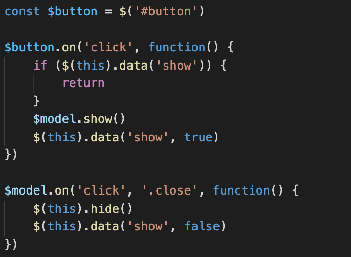
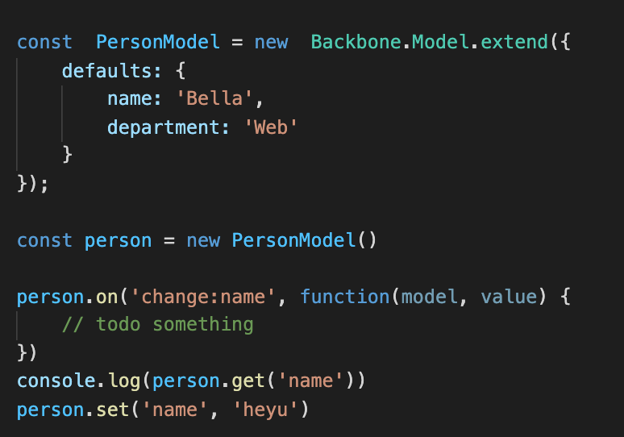
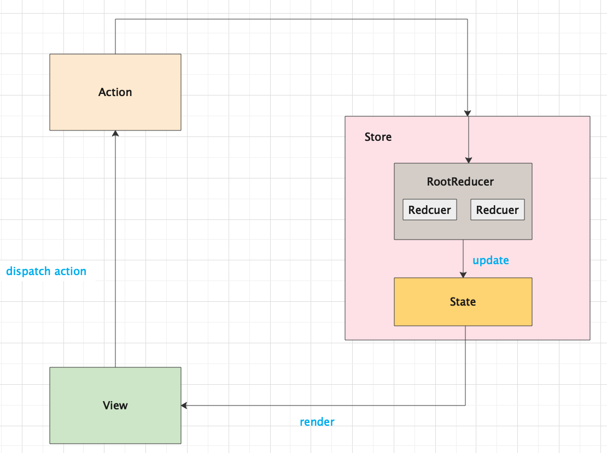
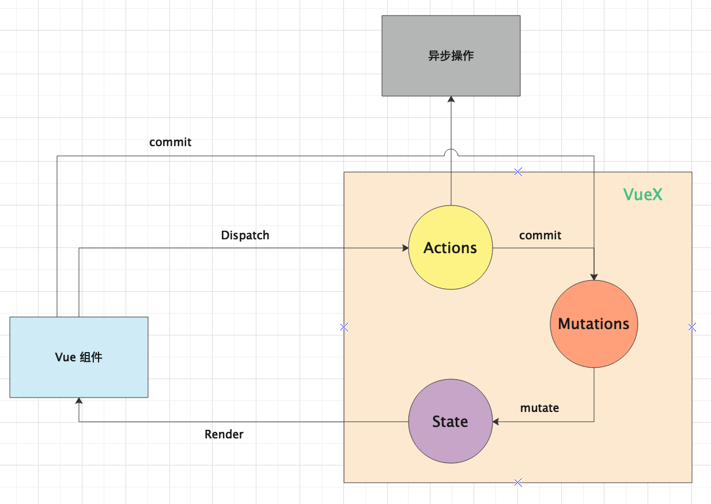

# 前端状态管理的历史回溯与思考

如果非要去解释应用程序‘状态’这个词，那我就自以为是的总结——应用程序状态就是应用程序现在的样子，应用程序的状态与时间强相关，理论上应用程序任何时刻的状态都不相同。

## jquery 时代

前端状态管理这个概念出现的时间还不长，但是在状态管理概念出现之前，在前端就已经有状态管理相关的实践了，我从 2017 年开始使用 jquery，在 jquery 时代，我们经常取 DOM 节点的某个属性值，然后根据这个属性值判断接下来的操作。很多地方都能取属性值，很多地方都能修改属性值。那个时候的状态存储是分散的，我们对相互依赖的状态很难进行处理，或者说处理起来很麻烦。在这个时候要如何去规范状态管理，如何组织项目结构也没有规范可以遵循。



总的来说，在 jquery 时候没有状态管理的概念，状态存储是分散的，状态的访问与修改没有限制。

## backbone

随着前端的发展后来出现了 backbone，在 backbone 中有 model 这个概念，我们可以将状态存储到 model 中，而且 model 中状态只能通过 get 去获取，只能通过 set 去修改，backbone 还有一个很大的亮点，就是 model 上的 on 方法，它可以对数据进行监听，当数据发生变化之后，在 on 的监听函数中对 view 进行操作。backbone 将数据和视图进行解耦，在 backbone 中状态管理有一个质的变化，backbone 通常配合 jquery 使用。



backbone 在状态管理上更进一步，状态集中存储在 model中，状态有读写限制，视图层与数据层进行解耦，但是 backbone 只作用于数据层，它不处理视图层，视图层通常使用 jquery。

## 前端社区现代状态管理

对于现在前端社区流行的状态管理库，在这里只分析 Redux、MobX、Vuex。

### Redux

Redux 是在 Flux 思想的基础上编写出的一个状态容器。redux 将状态以一个可 JSON 序列化的对象的形式存储在单个 store 中，也就是说 redux 将状态集中存储。Redux 遵循 Flux 思想，它也是单向数据流的，如果要修改 store 中的状态，必须通过 store 的 dispatch 方法。调用 store.dispatch 之后，store 中的 rootReducer 会被调用，进而调用所有的 reducers 生成一个新的 state。在 redux 中，dispatch 一个 action 的时候不能确定这个 action 被哪个 reducer 响应，它影响的数据范围如何。如果某一次 dispatch 只需要修改 store 中很小一部分状态，但是 dispatch 结束之后 store 中的状态与之前状态相比是一个新的，这在某些时候会是一个性能问题。store 的状态更新之后，store 会通知所有的订阅者它的状态已经更新，使用 Redux 需要手动订阅状态的更新。理想的情况下手动订阅状态会使开发者明确的知道他想做什么，但是随着软件的迭代，手动订阅可能导致订阅不足或者订阅过多的问题，订阅的不足会导致视图不能及时更新，订阅太多会导致视图做无用的更新。

```javascript
import { createStore } from 'redux'

// 这是一个 reducer，它是一个无副作用函数，它根据当前的 state 和 action 生成一个新的 state。Redux state 应该只包含纯 JS 对象、数组和原始类型。
function counterReducer(state = { value: 0 }, action) {
  switch (action.type) {
    case 'counter/incremented':
      return { value: state.value + 1 }
    case 'counter/decremented':
      return { value: state.value - 1 }
    default:
      return state
  }
}

// 创建一个 store 来保存应用程序的状态
const store = createStore(counterReducer)


// 订阅 state 的变更
store.subscribe(() => console.log(store.getState()))

// 只能通过 dispatch 一个 action 的方式去修改 store 中的状态.
store.dispatch({ type: 'counter/incremented' })
```

下面是 Redux 数据流图



从上图可以看出状态的修改朝着一个特定的方向进行，状态变更必须经过 reducers，状态以一种可预测的方式变化。总结 Redux 状态管理的特点：

1. 遵循 Flux 思想，单向数据流
2. 集中存储管理应用的状态
3. 状态是可 JSON 序列化的对象的形式
4. 需要手动订阅

### Mobx

Mobx 是另一个状态管理库，Mobx 中有四个核心概念，分别是：Observable state，Computed values，Reactions，Actions。Observable state 是源数据，它可以是任何值。Computed values 由 Observable state 和纯函数计算而来。Reactions 与 Computed values 类似，它们都是衍生数据，但是与 Computed values 不同的是 Reactions 可以是一个 side effect，例如：网络请求，将组件树对应到 DOM 上这都是 Reactions。Actions 用于修改 Observable state。Mobx的灵感来源于电子表格，所有有值的数据单元格都是 Observable state，单元格中的值加公式可以生成一个 Computed values，将单元格的值绘制到屏幕上是 Reactions，改变单元格中的值是 Actions。

```javascript
class Person {
  @observable firstName = "Michel";
  @observable lastName = "Weststrate";
  @observable nickName;
  
  @computed get fullName() {
    return this.firstName + " " + this.lastName;
  }
}

const michel = new Person();

// Reaction: log the profile info whenever it changes
autorun(() => console.log(michel.nickName ? michel.nickName : michel.fullName));

// Example React component that observes state
const profileView = observer(props => {
  if (props.person.nickName)
    return <div>{props.person.nickName}</div>
  else
    return <div>{props.person.fullName}</div>
});

// Action:
setTimeout(() => michel.nickName = "mweststrate", 5000)

React.render(React.createElement(profileView, { person: michel }), document.body);
```

Mobx 与 Redux 差异很大，总结为两点：

1. 他不要求状态的数据结构是可 JSON 序列化的，可以用对象、数组、类。 循环数据结构、引用来存储状态
2. MobX 会自动收集并追踪依赖，他不需要手动订阅状态的更新，当状态变化之后能够精准更新受影响的内容

开始使用 Mobx 时会感觉非常灵活。MobX 推荐的数据流图是：


从上图可以看出 MobX 推荐使用 Action 去修改 state，但是这只是在严格模式下做的限制，如果不是严格模式下可以在很多地方去直接修改 state。随意修改 store 中的状态，会导致状态变更安全性降低。Mobx 只关注原始数据到衍生数据之间的变更，你要如何组织代码没有规范遵循，不同经验的开发人员写出来的代码差异很大，这在重业务逻辑的项目中很不利。

### Vuex

Vuex 是 Vue 的一个插件，可以说它是专门为 Vue 应用程序做状态管理而生的。与 redux 一样，Vuex 它集中存储管理应用的状态，要改变 store 中的 state 只能通过 commit mutation，从这点来看 Vuex 也遵循 Flux 思想。由于 Vue 在渲染的时候会自动收集并追踪依赖， Vuex 的状态是响应式的。如果 Vue 组件从 store 中读取状态，当 store 中的状态发生变化时，那么相应的组件也会得到更新。

```javascript
const store = new Vuex.Store({
  state: {
    count: 1
  },
  mutations: {
    increment (state) {
      // mutate state
      state.count++
    }
  },
  actions: {
    incrementAsync ({ commit }) {
      setTimeout(() => {
        commit('increment')
      }, 1000)
    }
  }
})

store.commit('increment')
store.dispatch('incrementAsync')
```

数据流图如下：



在 Redux 和 MobX 中的 action 是一个虚拟的概念，Vuex 中的 action 是 store 中的一部分，它是专门用来做异步操作的，它可以返回一个 promise。

## 总结

使用 Redux，MobX 和 Vuex 做状态管理，状态的变化能够被感知和响应，当配合视图层框架或库使用时，状态的变化能够驱动界面的变化，这只是当代状态管理库的基本功能。在实际项目中我们还应该关注代码的组织结构，特别是在一些重业务逻辑轻视图的项目中，规范化和结构化业务逻辑尤为重要；在开发范式上面让复杂系统有结构，让不同经验的开发人员写出来的代码相差不大，能够让业务逻辑结构简单化。Redux，MobX 和 Vuex 或多或少在代码的组织结构上有一些要求，但是在让业务逻辑结构化上关注的还比较少。