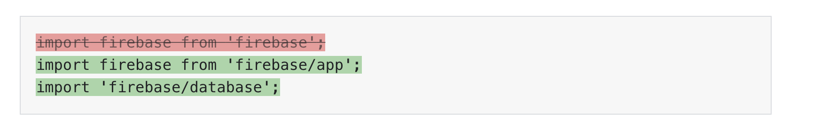

# 优化你的 JS

## 使用 PRPL 模式应用即时加载

PRPL 是一个缩略词，描述了一种用于使网页加载和交互性更快的模式:

* Push(或 preload)最重要的资源
* Render: 尽快渲染初始路线
* Pre-cache: 欲渲染剩余资产
* Lazy load: 延迟加载其他路径和非关键资源

在本指南中，学习如何将这些技术组合在一起，但仍然可以独立使用以实现性能结果

### 使用 Lighthouse 审查你的页面

运行 Lighthouse 以确定与 PRPL 相一致的改进机会:

1. 按 `Control+Shift+J`(在 mac 上 Command+Option+J) 打开 DevTools
2. 切换到 Lighthouse tab
3. 点 Run Audits 按钮生成审查报告

### 预加载关键资源


Preload 是一个声明性的获取请求，它告诉浏览器尽快请求资源，通过在你的HTML文档的头部添加一个带有rel=" Preload "的标签来预加载关键资源:

```html
<link rel="preload" as="style" href="css/style.css">
<link rel="preload" href="main.js" as="script">
```

浏览器会为资源设置一个更合适的加载优先级，以便在不延迟 onload 事件的情况下更快地下载资源。

### 尽快渲染初始路线

当你的站点在屏幕上呈现像素时，如果有资源延迟 First Paint, Lighthouse会提供一个警告:


为了改进 First Paint, Lighthouse 建议内联关键的 JavaScript 以及内联关键的 CSS，并异步延迟加载其余部分,通过消除与服务器获取呈现阻塞资产的往返，这提高了性能,然而，从开发的角度来看，内联代码更难维护，并且不能由浏览器单独缓存。

改进First Paint的另一种方法是在服务器端生成页面的初始HTML。这将在脚本仍在获取、解析和执行时立即向用户显示内容。然而，这可能会显著增加 HTML 文件的有效负载，这可能会损害到Time to Interactive，或者您的应用程序变得具有交互性并能够响应用户输入所需的时间。

没有一个确定的解决方案可以减少应用程序中的First Paint，只有当内联样式和服务器端呈现的好处超过应用程序的权衡时，才应该考虑内联样式和服务器端呈现。您可以通过下面的参考资料了解更多关于这两个概念的知识。

1. [优化CSS交付](https://developers.google.com/speed/docs/insights/OptimizeCSSDelivery)
2. [什么是服务器端渲染?]()

### Pre-cache 资产

通过充当代理，service worker 可以在重复访问时直接从缓存而不是服务器获取资产，这不仅允许用户在离线时使用您的应用程序，而且还会在重复访问时导致更快的页面加载时间。


使用第三方库来简化生成 service worker 的过程，除非你有比库所能提供的更复杂的缓存需求。例如，Workbox提供了一组工具，允许您创建和维护service worker来缓存资产。更多关于service worker和离线可靠性的信息，请参阅可靠性学习路径中的service worker指南。

### 懒加载

如果您通过网络发送过多的数据，Lighthouse将显示一个失败的审计


这包括所有资产类型，但大型 JavaScript 文件有效负载的成本特别高，因为浏览器需要花费时间来解析和编译它们。在适当的时候，Lighthouse 也提供了一个警告。


要发送一个更小的JavaScript有效负载(仅包含用户最初加载应用程序时所需的代码)，可以根据需要拆分整个bundle和惰性加载块。一旦你成功分割了你的bundle，预加载更重要的块(参见预加载关键资产指南)。预加载可以确保浏览器更快地获取和下载更重要的资源。

除了按需分割和加载不同的JavaScript块外，Lighthouse还提供了延迟加载非关键图像的审计。


如果你在你的网页上加载了很多图片，当页面加载时，延迟所有在折叠下面或者设备视图之外的图片(参见使用 lazysizes 来 lazyload 图像)

现在，您已经理解了 PRPL 模式背后的一些基本概念，请继续阅读本节中的下一个指南以了解更多信息。重要的是要记住，并不是所有的技术都需要一起应用。使用以下任何方法所做的任何努力都将提供显著的性能改进。

## 通过代码分割减少 JavaScript 有效负载

发送大体积的 JavaScript 有效负载会显著降低站点的速度，不要在加载应用程序的第一页时就将所有的JavaScript发送给用户，而是将包分成多个部分，只在一开始发送必要的内容。

### 测量

当执行页面上的所有JavaScript花费大量时间时，Lighthouse会显示一个失败的审计


拆分 JavaScript 包，以便在用户加载应用程序时只发送初始路由所需的代码,这将最小化需要解析和编译的脚本数量，从而加快页面加载时间

webpack、Parcel和Rollup等流行的工具允许你使用动态导入来拆分你的包。例如，考虑下面的代码片段，它显示了在提交表单时触发的someFunction方法的示例。

```javascript
import moduleA from "library";

form.addEventListener("submit", e => {
  e.preventDefault();
  someFunction();
});

const someFunction = () => {
  // uses moduleA
}
```

在这里，someFunction 使用从第三方导入的模块，如果没有在其他地方使用此模块，则可以修改代码，使其仅在用户提交表单时使用动态导入来获取它。

```javascript
form.addEventListener("submit", e => {
  e.preventDefault();
  import('library.moduleA')
    .then(module => module.default) // using the default export
    .then(someFunction())
    .catch(handleError());
});

const someFunction = () => {
    // uses moduleA
}
```

经过修改之后第三方库的代码不会包含在初始代码包中，现在是惰性加载的，只有在表单触发 submit 事件后需要它时才提供给用户，为了进一步提高页面性能，可以预加载关键块，以优先排序并更快地获取它们。

尽管前面的代码片段是一个简单的示例，但延迟加载第三方依赖项在大型应用程序中不是一种常见模式。通常，第三方依赖关系被分割成一个独立的 vendor 包，可以缓存，因为它们不经常更新。你可以阅读更多关于 SplitChunksPlugin 如何帮助你做到这一点的信息。

在使用客户端框架时，在路由或组件级别进行拆分是惰性加载应用程序不同部分的一种更简单的方法。许多使用webpack的流行框架都提供了抽象，使得惰性加载比自己钻研配置更容易。

## 删除未使用的代码

像 npm 这样的注册表允许任何人轻松下载和使用超过50万个公共包，从而使JavaScript世界变得更好，但是我们经常包含我们没有充分利用的库，要解决这个问题，请分析您的包以检测未使用的代码，然后删除不使用和不需要的库。

### 审查你的代码包

DevTools 让我们很容易看到所有网络请求的大小:

1. 按`Control+Shift+J`(`Command+Option+J` 在 mac) 打开 DevTools
2. 切换到 Network tab


DevTools中的Coverage选项卡还会告诉你应用程序中有多少CSS和JS代码没有使用。


通过 Node CLI 指定完整的 Lighthouse 配置，还可以使用“未使用的 JavaScript”审计来跟踪应用程序中有多少未使用的代码。


如果你使用webpack ，webpack Bundle Analyzer 将帮助你分析代码包的组成，像其他插件一样在你的 webpack 配置文件中包含该插件:

```javascript
module.exports = {
  //...
  plugins: [
    //...
    new BundleAnalyzerPlugin()
  ]
}
```

虽然webpack通常用于构建单页应用程序，但其他捆绑包，如Parcel和Rollup，也有可视化工具，你可以使用它们来分析你的捆绑包。


使用这种可视化可以让您检查包的哪些部分比其他部分更大，并更好地了解要导入的所有库。这有助于识别您是否使用了任何未使用或不必要的库。

### 删除未使用的库

在前面的treemap映像中，单个@firebase域中有相当多的包。如果你的网站只需要 firebase database 组件，更新导入来获取该库:



需要强调的是，对于较大的应用程序来说，这个过程要复杂得多。对于您非常确定没有在任何地方使用的神秘的包，后退一步，看看哪些顶级依赖项正在使用它。尝试找到一种方法，只从它导入您需要的组件，如果您没有使用库，请删除它，如果初始页面加载不需要库，请考虑是否可以延迟加载。

如果你正在使用webpack，请查看那些可以[自动删除流行库中未使用代码的插件列表](https://github.com/GoogleChromeLabs/webpack-libs-optimizations)

### 删除不需要的库

并不是所有的库都可以很容易地分解成部分并有选择地导入，在这些场景中，考虑是否可以完全删除库，构建自定义解决方案或利用更轻的替代方案总是值得考虑的选项，然而，在完全从应用程序中删除库之前，重要的是要衡量这些工作所需的复杂性和工作量。

## 最小化和压缩网络有效负载

有两种有用的技术可以用来提高你的网页的性能:

1. 缩小
2. 数据压缩

结合这两种技术可以减少负载大小，进而提高页面加载时间。

### 测量

如果在页面上检测到任何可以缩小的CSS或JS资源，Lighthouse将显示一个失败的审计。


它还审计任何未压缩的资产


### 缩小

最小化是删除空白和任何代码的过程，这些代码对于创建更小但完全有效的代码文件来说是不必要的。Terser是一个流行的JavaScript压缩工具，webpack v4默认包含了一个用于该库的插件，用于创建迷你构建文件。

* 如果您正在使用webpack v4或以上的版本，那么你应该可以不用做任何额外的工作。
* 如果你使用的是旧版本的 webpack，请安装TerserWebpackPlugin并将其包含到你的webpack配置设置中。按照[文档了解如何操作](https://webpack.js.org/plugins/terser-webpack-plugin/)。
* 如果您没有使用模块构建工具，可以使用Terser作为CLI工具，或者直接将其作为应用程序的依赖项，[项目文档](https://github.com/terser-js/terser)提供了说明

### 数据压缩

压缩是使用压缩算法修改数据的过程。[Gzip](https://www.youtube.com/watch?v=whGwm0Lky2s&feature=youtu.be&t=14m11s)是服务器和客户端交互中使用最广泛的压缩格式。[Brotli](https://opensource.googleblog.com/2015/09/introducing-brotli-new-compression.html) 是一种较新的压缩算法，它可以提供比Gzip更好的压缩结果。

压缩文件可以显著提高网页的性能，但你很少需要自己做这件事。许多托管平台、cdn和反向代理服务器要么默认使用压缩对资产进行编码，要么允许您轻松地配置它们。在尝试推出自己的解决方案之前，请阅读所使用工具的文档，以了解是否已经支持压缩。

有两种不同的方法来压缩发送到浏览器的文件:

1. 动态
2. 静态

这两种方法都有各自的优点和缺点，将在下一节中介绍，使用最适合您的应用程序的。

### 动态压缩

这个过程包括在浏览器请求时动态压缩资源，这可能比手动压缩或使用构建过程压缩文件更简单，但如果使用高压缩级别，可能会导致延迟。

Express是Node的一个流行的web框架，提供了一个压缩中间件库。使用它来压缩任何被请求的资产。下面是一个正确使用它的整个服务器文件的例子:

```javascript
const express = require('express');
const compression = require('compression');

const app = express();

app.use(compression());

app.use(express.static('public'));

const listener = app.listen(process.env.PORT, function() {
	console.log('Your app is listening on port ' + listener.address().port);
});
```

这将使用gzip压缩您的资产,如果您的web服务器支持它，可以考虑使用一个单独的模块，如shrink-ray通过Brotli压缩，以获得更好的压缩比。

### 静态压缩

静态压缩涉及提前压缩和节省资产，这可能会使构建过程花费更长的时间，特别是在使用高压缩级别时，但可以确保浏览器获取压缩资源时不会发生延迟。如果你的web服务器支持Brotli，使用[BrotliWebpackPlugin](https://github.com/mynameiswhm/brotli-webpack-plugin)插件来压缩你的资产，作为构建步骤的一部分。否则，使用[CompressionPlugin](https://github.com/webpack-contrib/compression-webpack-plugin)压缩你的资产用 gzip，它可以像任何其他插件一样包含在webpack配置文件中:

```javascript
module.exports = {
	//...
	plugins: [
		//...
		new CompressionPlugin()
	]
}
```

一旦压缩文件成为build文件夹的一部分，在服务器中创建一个路由来处理所有JS端点来服务压缩文件。下面是一个使用Node和Express实现gzip资产的示例。

```javascript
const express = require('express');
const app = express();

app.get('*.js', (req, res, next) => {
	req.url = req.url + '.gz';
	res.set('Content-Encoding', 'gzip');
	next();
});

app.use(express.static('public'));
```

## 为现代浏览器提供现代代码，以更快地加载页面

构建在所有主流浏览器上运行良好的网站是开放网络生态系统的核心原则。然而，这意味着需要额外的工作，以确保您所编写的所有代码都能在您计划瞄准的每个浏览器中得到支持。如果希望使用新的JavaScript语言特性，则需要将这些特性转换为不支持它们的浏览器的向后兼容格式。

Babel是最广泛使用的工具，它可以将包含更新语法的代码编译成不同浏览器和环境(如Node)可以理解的代码。本指南假设您正在使用Babel，因此如果您还没有将其包含到应用程序中，您需要按照设置说明进行操作。如果你在应用中使用webpack作为模块绑定器，请在Build Systems中选择webpack。

要使用Babel只transpile什么是你的用户需要的，你需要:

1. 确定您想要的目标浏览器。
2. 使用@babel/preset-env和适当的浏览器目标。
3. 使用 `<script type="module"></script>`来停止向不需要的浏览器发送编译代码。

### 确定您想要的目标浏览器

在您开始修改应用程序中代码的编译方式之前，您需要确定哪些浏览器访问您的应用程序。分析您的用户目前使用的浏览器以及您计划针对的浏览器，以便做出明智的决定。

### 使用 @babel/preset-env

编译代码通常会得到一个比原始格式更大的文件。通过最小化编译量，可以减少包的大小，从而提高网页的性能。

Babel没有包含特定的插件来选择性地编译您正在使用的某些语言特性，而是提供了许多将插件捆绑在一起的预置。使用@babel/preset-env只包含您计划针对的浏览器所需的 transforms 和 polyfills 填充。

在你的Babel配置文件的presets数组中包含@babel/preset-env:

```javascript
{
 "presets": [
   [
     "@babel/preset-env",
     {
       "targets": ">0.25%"
     }
   ]
 ]
}
```

通过在浏览器字段中添加适当的查询，使用 targets 字段指定要包含的浏览器版本。@babel/preset-env 集成了 browserslist，一个开源的配置，在针对浏览器的不同工具之间共享。兼容查询的完整列表在 [browserslist 文档](https://github.com/browserslist/browserslist#full-list)中。另一种选择是使用[.browserslistrc](https://babeljs.io/docs/en/babel-preset-env#browserslist-integration)文件列出您希望目标的环境。

“>0.25%”的值告诉Babel只包含支持占全球使用量0.25%以上的浏览器所需的转换。这将确保您的包不会包含针对只有极少数用户使用的浏览器的不必要的编译代码。

在大多数情况下，这是一个比使用以下配置更好的方法:

```javascript
  "targets": "last 2 versions"
```

“最后两个版本”值转换每个浏览器的最后两个版本的代码，这意味着不支持已停产的浏览器，如Internet Explorer。如果您不希望使用这些浏览器访问您的应用程序，那么这可能会不必要地增加bundle的大小。

最后，您应该选择合适的查询组合，只针对适合您需求的浏览器。

### Enable modern bugfixes

@babel/preset-env将多个JavaScript语法特性分组到集合中，并根据指定的目标浏览器启用/禁用它们，尽管这工作得很好，但当目标浏览器包含一个只有一个特性的错误时，整个语法特性集合都会被转换，这通常会导致转换的代码过多。

@babel/preset-env中的bug修复选项最初是作为一个单独的预设来开发的，它通过将在某些浏览器中被破坏的现代语法转换为在那些浏览器中没有被破坏的最接近的等价语法来解决这个问题。其结果是几乎相同的现代代码，只是稍微做了一些语法调整，以保证在所有目标浏览器中的兼容性。要使用此优化，请确保您已经安装了@babel/preset-env 7.10或更高版本，然后将bug修复属性设置为true:

```javascript
{
 "presets": [
   [
     "@babel/preset-env",
     {
       "bugfixes": true
     }
   ]
 ]
}
```

在Babel 8中，bug修复选项将在默认情况下启用。

### 使用 `<script type="module">`

JavaScript模块或ES模块是所有主流浏览器都支持的一个相对较新的特性。你可以使用模块来创建可以从其他模块导入和导出的脚本，但是你也可以使用@babel/preset-env来只针对支持它们的浏览器

考虑在.babelrc文件的target字段中指定"esmodules": true，而不是查询特定的浏览器版本或市场份额。

```javascript
{
   "presets":[
      [
         "@babel/preset-env",
         {
            "targets":{
               "esmodules": true
            }
         }
      ]
   ]
}
```

许多使用Babel编译的ECMAScript新特性已经在支持JavaScript模块的环境中得到了支持。因此，通过这样做，您简化了确保只在真正需要它的浏览器中使用转译代码的过程。

支持模块的浏览器会忽略带有nomodule属性的脚本。相反，不支持模块的浏览器会忽略type="module"的脚本元素。这意味着您可以包括一个模块以及编译后的回退。理想情况下，应用程序的两个版本脚本如下所示:

```javascript
  <script type="module" src="main.js"></script>
  <script nomodule src="compiled.js" defer></script>
```

支持 module 的浏览器将获取 main.js 忽略 compiled.js，不支持 module 的浏览器将获取 compiled.js 忽略 main.js。`<script type="module"></script>` 不用加 defer，因为它默认就会延迟

如果你使用webpack，你可以在你的应用程序的两个不同版本的配置中设置不同的目标:

* 仅支持 module 的浏览器的版本
* 包含在任何遗留浏览器中工作的编译脚本的版本，这有一个更大的文件大小，因为翻译需要支持更广泛的浏览器。

尽管这种HTML方法可以提供性能优势，但某些浏览器在指定模块和nomodule脚本时，会双重获取，Jason Miller的[Modern Script Loading](https://jasonformat.com/modern-script-loading/)更详细地解释了这一点，并涵盖了一些可用于规避这一问题的选项。

## 为了更快的应用程序，发布、发布和安装现代 JavaScript

超过90%的浏览器都能运行现代的JavaScript，但遗留JavaScript的流行仍然是当今web性能问题的最大贡献者之一。[EStimator.dev](https://estimator.dev/) 是一个简单的基于web的工具，它可以计算通过交付现代JavaScript语法可以实现的站点大小和性能改进。


今天的 web 应用受到了遗留JavaScript的限制，没有任何一种优化能比使用ES2017语法编写、发布和发布你的网页或包更能提高性能。

### 现代 JavaScript

现代JavaScript并不是按照特定的ECMAScript规范版本编写的代码，而是采用所有现代浏览器都支持的语法。像Chrome、Edge、Firefox和Safari这样的现代网络浏览器占据了超过90%的浏览器市场，而依赖于相同底层渲染引擎的不同浏览器只占额外的5%。

这意味着全球95%的网络流量来自支持过去10年最广泛使用的JavaScript语言特性的浏览器，包括:

* Classes (ES2015)
* Arrow functions (ES2015)
* Generators (ES2015)
* Block scoping (ES2015)
* Destructuring (ES2015)
* Rest and spread parameters (ES2015)
* Object shorthand (ES2015)
* Async/await (ES2017)

语言规范的新版本的特性在现代浏览器间的一致性支持通常较差。例如，ES2020和ES2021的许多特性只有70%的浏览器支持——仍然是大多数浏览器，但还不足以保证直接依赖这些特性是安全的。这意味着，尽管“现代”JavaScript是一个不断变化的目标，但ES2017具有最广泛的浏览器兼容性，同时包括大多数常用的现代语法特性。换句话说，ES2017是最接近现代语法的。

### 遗留的JavaScript

遗留JavaScript是专门避免使用上述所有语言特性的代码。大多数开发人员使用现代语法编写源代码，但为了增加对浏览器的支持，将所有内容都编译为遗留语法。编译到遗留语法确实增加了浏览器支持，但是效果通常比我们意识到的要小。在许多情况下，支持从大约95%增加到98%，同时产生了巨大的成本:

* 传统的JavaScript通常比同等的现代代码大20%，慢20%。工具缺陷和错误配置经常会进一步扩大这个差距。
* 安装的库占典型生产JavaScript代码的90%。库代码会产生更高的遗留JavaScript开销，因为可以通过发布现代代码来避免填充和助手复制。

### npm上的现代JavaScript

最近，Node.js标准化了一个“exports”字段来定义包的入口点:

```javascript
{
  "exports": "./index.js"
}
```

"exports"字段引用的模块意味着Node版本至少为12.8，支持ES2019。这意味着任何使用“exports”字段引用的模块都可以用现代JavaScript编写。包消费者必须假定带有“exports”字段的模块包含现代代码，如果必要的话，还可以进行transpile。

### Modern-only

如果您想要发布一个带有现代代码的包，并让使用者在使用它作为依赖项时处理它，那么只使用“exports”字段。

```javascript
{
  "name": "foo",
  "exports": "./modern.js"
}
```

不推荐使用这种方法。在理想情况下，每个开发人员都已经配置了构建系统，将所有依赖项(node_modules)转换为所需的语法。但是，这不是当前的情况，并且只使用现代语法发布包会阻止在可以通过旧浏览器访问的应用程序中使用它。

### Modern with legacy fallback

使用“exports”字段和“main”字段，以便使用现代代码发布包，但同时也包含用于传统浏览器的ES5 + CommonJS回退。

```javascript
{
  "name": "foo",
  "exports": "./modern.js",
  "main": "./legacy.cjs"
}
```

### 现代的遗留的回退和ESM绑定器优化

除了定义一个回退的CommonJS入口点，“module”字段还可以用来指向一个类似的遗留回退包，但使用的是JavaScript模块语法(导入和导出)。

```javascript
{
  "name": "foo",
  "exports": "./modern.js",
  "main": "./legacy.cjs",
  "module": "./module.js"
}
```

许多 bundlers，如webpack和Rollup，都依赖于这个字段来利用模块特性并实现摇树功能。这仍然是一个遗留bundle，除了导入/导出语法之外不包含任何现代代码，所以使用这种方法来发布带有仍然为绑定优化的遗留回退的现代代码。

### 应用程序中的现代JavaScript

第三方依赖构成了web应用程序中绝大多数典型的产品JavaScript代码。虽然npm依赖历来都是作为遗留的ES5语法发布的，但这不再是一个安全的假设，依赖更新可能会破坏应用程序中的浏览器支持。

随着越来越多的npm包向现代JavaScript转移，确保构建工具能够处理它们是很重要的。您所依赖的一些npm包很有可能已经在使用现代语言特性。有许多选项可以在不破坏旧浏览器中的应用程序的情况下使用npm中的现代代码，但一般的想法是让构建系统将依赖关系转换为与源代码相同的语法目标。

#### webpack

从webpack 5开始，现在可以配置webpack在生成包和模块代码时使用的语法。这不会转换你的代码或依赖，它只会影响webpack生成的“胶水”代码。要指定浏览器支持目标，添加一个browserslist配置到你的项目中，或者直接在你的webpack配置中执行:

```javascript
module.exports = {
  target: ['web', 'es2017'],
};
```

也可以配置webpack来生成优化的包，在针对现代ES Modules环境时省略不必要的包装器功能。这也配置webpack使用`<script type="module"></script>`加载代码拆分包。

```javascript
module.exports = {
  target: ['web', 'es2017'],
  output: {
    module: true,
  },
  experiments: {
    outputModule: true,
  },
};
```

现在有很多webpack插件可以在支持传统浏览器的同时编译和发布现代JavaScript，比如Optimize Plugin和BabelEsmPlugin。

#### Optimize Plugin

[Optimize Plugin](https://github.com/developit/optimize-plugin)是一个webpack插件，它将最终的代码从现代的JavaScript转换到遗留的JavaScript，而不是每个单独的源文件。它是一个自包含的设置，允许你的webpack配置假设一切都是现代JavaScript，没有针对多个输出或语法的特殊分支。

因为Optimize Plugin操作的是包而不是单独的模块，所以它同样处理应用程序的代码和依赖项。这使得使用来自npm的现代JavaScript依赖项是安全的，因为它们的代码将被打包并翻译成正确的语法。它还可以比涉及两个编译步骤的传统解决方案更快，同时仍然为现代和遗留浏览器生成独立的包。这两组包被设计为使用module/nomodule模式加载。

```javascript
// webpack.config.js
const OptimizePlugin = require('optimize-plugin');

module.exports = {
  // ...
  plugins: [new OptimizePlugin()],
};
```

Optimize Plugin 可以比自定义webpack配置更快、更高效，后者通常将现代代码和遗留代码分开打包。它还为您处理运行Babel，并使用Terser最小化包，并为现代和遗留输出分别进行优化设置。最后，生成的遗留包所需的腻子填充被提取到专用脚本中，这样它们就不会被复制或不必要地加载到新的浏览器中。

#### BabelEsmPlugin

BabelEsmPlugin是一个webpack插件，它与@babel/preset-env一起工作，生成现有包的现代版本，以向现代浏览器提供更少的编译代码。它是module/nomodule最流行的现成解决方案，被Next.js和Preact CLI使用。

```javascript
// webpack.config.js
const BabelEsmPlugin = require('babel-esm-plugin');

module.exports = {
  //...
  module: {
    rules: [
      // your existing babel-loader configuration:
      {
        test: /\.js$/,
        exclude: /node_modules/,
        use: {
          loader: 'babel-loader',
          options: {
            presets: ['@babel/preset-env'],
          },
        },
      },
    ],
  },
  plugins: [new BabelEsmPlugin()],
};
```

BabelEsmPlugin支持广泛的webpack配置，因为它运行你的应用程序的两个很大程度上独立的构建。对于大型应用程序来说，编译两次可能会花费一点额外的时间，但是这种技术允许BabelEsmPlugin无缝集成到现有的webpack配置中，并使其成为最方便的选项之一。

#### 配置babel-loader来编译node_modules

如果你使用的是babel-loader而不是前面两个插件中的一个，那么为了使用现代的JavaScript npm模块，有一个重要的步骤是必需的。定义两种独立的Babel加载器配置可以自动将node_modules中发现的现代语言特性编译到ES2017，同时仍然可以使用项目配置中定义的Babel插件和预置编译自己的第一方代码。这不会为模块/nomodule的设置生成现代的和遗留的包，但它确实使安装和使用包含现代JavaScript的npm包成为可能，而不会破坏旧的浏览器。

[Webpack-plugin-modern-npm](https://www.npmjs.com/package/webpack-plugin-modern-npm)使用这种技术来编译包中有“exports”字段的NPM依赖项。Json，因为它们可能包含现代语法:

```javascript
// webpack.config.js
const ModernNpmPlugin = require('webpack-plugin-modern-npm');

module.exports = {
  plugins: [
    // auto-transpile modern stuff found in node_modules
    new ModernNpmPlugin(),
  ],
};
```

或者，你也可以在你的webpack配置中通过检查包中的“exports”字段手动实现这项技术。解析模块时的Json。为了简洁起见，省略缓存，自定义实现可能如下所示:

```javascript
// webpack.config.js
module.exports = {
  module: {
    rules: [
      // Transpile for your own first-party code:
      {
        test: /\.js$/i,
        loader: 'babel-loader',
        exclude: /node_modules/,
      },
      // Transpile modern dependencies:
      {
        test: /\.js$/i,
        include(file) {
          let dir = file.match(/^.*[/\\]node_modules[/\\](@.*?[/\\])?.*?[/\\]/);
          try {
            return dir && !!require(dir[0] + 'package.json').exports;
          } catch (e) {}
        },
        use: {
          loader: 'babel-loader',
          options: {
            babelrc: false,
            configFile: false,
            presets: ['@babel/preset-env'],
          },
        },
      },
    ],
  },
};
```

在使用这种方法时，您需要确保迷你符支持现代语法。[Terser](https://github.com/terser/terser#minify-options)和[uglify-es](https://github.com/mishoo/UglifyJS/tree/harmony#minify-options)都有一个指定{ecma: 2017}的选项，以便在压缩和格式化期间保留并在某些情况下生成ES2017语法。

### 总结

EStimator.dev 提供了一种简单的方法来评估为大多数用户切换到具有现代能力的JavaScript代码会产生多大的影响。今天，ES2017是最接近现代语法的，npm、Babel、webpack和Rollup等工具使配置构建系统和使用这种语法编写包成为可能。这篇文章涵盖了几种方法，你应该使用最简单的方法。

## CommonJS是如何让你的包变大的

在这篇文章中，我们将了解什么是CommonJS，以及为什么它会让你的JavaScript包变得比需要的更大。摘要:为了确 bundler 能够成功优化你的应用程序，避免依赖CommonJS模块，并在整个应用程序中使用ECMAScript模块语法。

### What's CommonJS

CommonJS是2009年的一个标准，它为JavaScript模块建立了约定。它最初的目的是在web浏览器之外使用，主要用于服务器端应用程序。

使用CommonJS，你可以定义模块，从它们导出功能，并在其他模块中导入它们。例如，下面的代码片段定义了一个模块，该模块导出了五个函数:add, subtract, multiply, divide, and max:

```javascript
// utils.js
const { maxBy } = require('lodash-es');
const fns = {
  add: (a, b) => a + b,
  subtract: (a, b) => a - b,
  multiply: (a, b) => a * b,
  divide: (a, b) => a / b,
  max: arr => maxBy(arr)
};

Object.keys(fns).forEach(fnName => module.exports[fnName] = fns[fnName]);
```

稍后，另一个模块可以导入并使用这些函数中的部分或全部:

```javascript
// index.js
const { add } = require('./utils');
console.log(add(1, 2));
```

使用node调用index.js将在控制台上输出数字3。

由于在2010年代早期浏览器中缺乏标准化的模块系统，CommonJS也成为了JavaScript客户端库的流行模块格式。

### CommonJS如何影响最终的包大小?

服务器端JavaScript应用程序的大小不像在浏览器中那么重要，这就是为什么CommonJS在设计时没有考虑到减少生产包的大小。与此同时，分析表明JavaScript包的大小仍然是导致浏览器应用变慢的首要原因。

JavaScript bundlers 和 minifiers，如webpack和terser，执行不同的优化来减少你的应用程序的大小。在构建时分析你的应用程序，他们试图从你没有使用的源代码中删除尽可能多的内容。

例如，在上面的代码片段中，你的最终bundle应该只包含add函数，因为这是你在index.js中导入的唯一来自utils.js的函数。

让我们使用下面的webpack配置来构建应用程序:

```javascript
const path = require('path');
module.exports = {
  entry: 'index.js',
  output: {
    filename: 'out.js',
    path: path.resolve(__dirname, 'dist'),
  },
  mode: 'production',
};
```

这里我们指定要使用生产模式优化，并使用index.js作为入口点，调用webpack后，如果我们探索输出大小，我们会看到这样的东西:

```vstscli
$ cd dist && ls -lah
625K Apr 13 13:04 out.js
```

注意，这个包是625KB。如果我们查看输出，我们会发现utils.js中的所有函数和lodash中的许多模块。虽然我们没有在index.js中使用lodash，但它是输出的一部分，这给我们的生产资产增加了很多额外的权重。

现在让我们将模块格式更改为ECMAScript模块，然后再试一次,这一次，utils.js看起来像这样:

```javascript
export const add = (a, b) => a + b;
export const subtract = (a, b) => a - b;
export const multiply = (a, b) => a * b;
export const divide = (a, b) => a / b;

import { maxBy } from 'lodash-es';

export const max = arr => maxBy(arr);
```

而index.js会使用ECMAScript模块语法从utils.js导入:

```javascript
import { add } from './utils';

console.log(add(1, 2));
```

使用相同的webpack配置，我们可以构建应用程序并打开输出文件。它现在是40字节的输出如下:

```javascript
(()=>{"use strict";console.log(1+2)})();
```

注意，final bundle不包含任何我们不使用的utils.js函数，也没有来自lodash的跟踪!甚至，terser (webpack使用的JavaScript缩小器)在console.log中内联了add函数。

您可能会问一个合理的问题，为什么使用CommonJS会导致输出包增大近16000倍?当然，这只是一个简单的示例，实际上，大小差异可能没有那么大，但CommonJS很可能会为您的产品构建增加重要的权重。

一般情况下，CommonJS模块更难优化，因为它们比ES模块更动态。为了确保你的绑定器和迷你器能够成功优化你的应用程序，避免依赖CommonJS模块，并在整个应用程序中使用ECMAScript模块语法。

注意，即使你在index.js中使用ECMAScript模块，如果你使用的模块是CommonJS模块，你的应用包大小也会受到影响。

### 为什么CommonJS会让你的应用变大

为了回答这个问题，我们将看看webpack中的ModuleConcatenationPlugin的行为，然后讨论静态可分析性。这个插件将你所有模块的作用域连接到一个闭包中，允许你的代码在浏览器中有更快的执行时间。让我们来看一个例子:

```javascript
// utils.js
export const add = (a, b) => a + b;
export const subtract = (a, b) => a - b;
```

```javascript
// index.js
import { add } from './utils';
const subtract = (a, b) => a - b;

console.log(add(1, 2));
```

上面，我们有一个ECMAScript模块，我们在index.js中导入了它。我们还定义了一个减法函数。我们可以使用上面相同的webpack配置来构建项目，但这次，我们将禁用最小化:

```javascript
const path = require('path');

module.exports = {
  entry: 'index.js',
  output: {
    filename: 'out.js',
    path: path.resolve(__dirname, 'dist'),
  },
  optimization: {
    minimize: false
  },
  mode: 'production',
};
```

让我们看看生成的输出:

```javascript
/******/ (() => { // webpackBootstrap
/******/ 	"use strict";

// CONCATENATED MODULE: ./utils.js**
const add = (a, b) => a + b;
const subtract = (a, b) => a - b;

// CONCATENATED MODULE: ./index.js**
const index_subtract = (a, b) => a - b;**
console.log(add(1, 2));**

/******/ })();
```

在上面的输出中，所有函数都在同一个名称空间中。为了避免冲突，webpack将index.js中的subtract函数重命名为index_subtract。

如果一个 minifier 处理上面的源代码，它将:

* 删除不使用的函数subtract和index_subtract
* 删除所有注释和冗余空格
* 在console.log调用中内联add函数体

开发人员通常将这种未使用导入的删除称为摇树。摇树是唯一可能的，因为webpack能够静态地(在构建时)理解我们从utils.js中导入的符号和它导出的符号。ES模块默认启用此行为，因为与CommonJS相比，它们更易于静态分析。

让我们看看完全相同的例子，但这次将utils.js改为使用CommonJS而不是ES模块:

```javascript
// utils.js
const { maxBy } = require('lodash-es');

const fns = {
  add: (a, b) => a + b,
  subtract: (a, b) => a - b,
  multiply: (a, b) => a * b,
  divide: (a, b) => a / b,
  max: arr => maxBy(arr)
};

Object.keys(fns).forEach(fnName => module.exports[fnName] = fns[fnName]);
```

这个小更新将显著改变输出。因为它太长了，嵌入这个页面，我只分享了它的一小部分:

```javascript
...
(() => {

"use strict";
/* harmony import */ var _utils__WEBPACK_IMPORTED_MODULE_0__ = __webpack_require__(288);
const subtract = (a, b) => a - b;
console.log((0,_utils__WEBPACK_IMPORTED_MODULE_0__/* .add */ .IH)(1, 2));

})();
```

注意，最终的包包含一些webpack“运行时”:注入的代码，负责从绑定的模块中导入/导出功能。这一次，我们没有将utils.js和index.js中的所有符号放在同一个命名空间下，而是在运行时使用__webpack_require__动态地要求add函数。

这是必要的，因为使用CommonJS，我们可以从任意表达式获得导出名称。例如，下面的代码是一个绝对有效的构造:

```javascript
module.exports[localStorage.getItem(Math.random())] = () => { … };
```

捆绑器无法在构建时知道导出符号的名称，因为这需要的信息只能在运行时在用户浏览器的上下文中可用。

这样，minifier 就无法理解index.js从它的依赖项中到底使用了什么，所以它不能用树来摆脱它。对于第三方模块，我们也会观察到完全相同的行为。如果我们从node_modules导入CommonJS模块，你的构建工具链将无法正确地优化它。

### 与CommonJS Tree-shaking

分析CommonJS模块要困难得多，因为根据定义，它们是动态的。例如，ES模块中的导入位置总是一个字符串字面值，而在CommonJS中它是一个表达式。

在某些情况下，如果你使用的库遵循了使用CommonJS的特定约定，那么可以在构建时使用第三方webpack插件删除未使用的导出。尽管这个插件增加了对摇树的支持，但它并没有覆盖所有依赖项使用CommonJS的不同方式。这意味着您不会得到与ES模块相同的保证。此外，它还会在默认webpack行为的基础上增加额外的成本，作为构建过程的一部分。

### 结论

为了确保捆绑器可以成功地优化你的应用程序，避免依赖CommonJS模块，并在整个应用程序中使用ECMAScript模块语法。

以下是一些可行的建议，可以证明你正处于最佳状态:

* 使用Rollup.js的[node-resolve](https://github.com/rollup/plugins/tree/master/packages/node-resolve)插件并设置modulesOnly标志来指定你只想依赖于ECMAScript模块。
* 使用包[is-esm](https://github.com/mgechev/is-esm)来验证npm包是否使用了ECMAScript模块。
* 如果你正在使用Angular，默认情况下，如果你依赖于不可摇树的模块，你会收到一个警告。