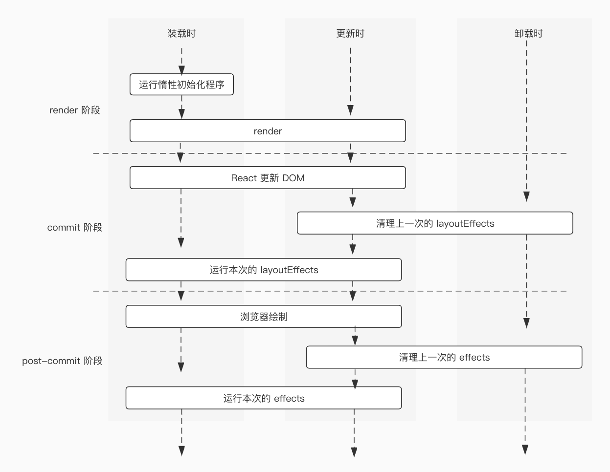

# 我搞懂了 React 的 useState 和 useEffect

之前在不讨论 [React Hooks 和组件生命周期的基础上介绍了函数组件和类组件的差别](/documents/summary/functionComponent/index),现在介绍一个为函数组件而生的知识点，即：React Hooks。Hooks 是函数，在 React 16.8 正式发布，它对类组件没有影响。

类组件的功能强大，能拥有自己的state，有生命周期，开发人员能根据需求在特定的生命周期中执行自己要想的操作，如：发送Ajax请求等。类组件功能虽强，但它存在如下问题：

1. 必须时常关注 this 关键字的指向，这对初学者而言不是一件容易的事。
2. 相同的生命周期函数在类组件中最多定义一个，这导致彼此无关的逻辑代码被揉杂在同一生命周期函数中。
3. 不同的生命周期函数可能包含相同的代码，最常见便是 componentDidMount 和 componentDidUpdate。

Hooks 发布之后，函数组件能拥有自己的 state，也能感知到组件被销毁和 DOM 被绘制到屏幕上的时机，但是没有类组件存在的那三个问题。React提供了很多内置的Hooks，在本文介绍 useState 和 useEffect。

## useState

它是一个与状态管理相关的hook，它让函数组件拥有状态，是最常用的Hooks之一，类型定义如下：

```typescript
function useState<S>(initialState: S | (() => S)): [S, Dispatch<SetStateAction<S>>];
function useState<S = undefined>(): [S | undefined, Dispatch<SetStateAction<S | undefined>>];
```

从类型定义可以看出，useState 有两个重载，分别是传参数和不传参数，不论是否传参数，useState 都返回一个长度为 2 的数组，数组的第一个位置是状态，它可以是任何数据类型，类型参数 S 用于注释它的类型，第二个位置是一个用于更新状态的函数，为了语言上的便利本小节将该函数记为 setState。接下来，介绍 useState 的基本用法。

### 当 useState 的参数不是函数

此时，useState 的参数作为状态的初始值，如果没有传参数，那么状态的初始值为 undefined。用法如下：

```jsx
import React, { useState } from 'react'

export function UseStateWithoutFunc() {
    const [name, setName] = useState<string>('何遇')
    const [age, setAge] = useState<number>()

    function onChange() {
        setName(Math.random() + '') // 修改name
        setAge(Math.random()) // 修改age
    }

    return (
        <>
        <div>姓名: {name}</div>
        <div>年龄: {age === undefined ? '未知' : age}</div>
        <button onClick={onChange}>click</button>
        </>
    )
}
```

UseStateWithoutFunc 组件有 name 和 age 这两个状态，name 只能是 string 类型，初始值为'何遇'，age 的数据类型是 number 或 undefined，初始值为undefined。

### 当 useState 的参数是函数

此时，函数的返回值是状态的初始值。某些时候，状态的初始值要经过计算才能得到，此时推荐将函数作为 useState 的参数，该函数只在组件初始渲染执行一次。用法如下：

```jsx
function UseStateWithFunc() {
    const [count, setCount] = useState<number>(() => {
        // 这个函数只在初始渲染的时候执行，后续的重新渲染不再执行
        return Number(localStorage.getItem('count')) || 0
    })
    function onChange() {/** todo*/}
    return (
        <>
        <div>count: {count}</div>
        <button onClick={onChange}>click</button>
        </>
    )
}
```

上述 useState 的参数是函数，count 的初始值为该函数的返回值，数据类型是 number。

### 修改状态的值

延用上述代码中的 setCount，修改状态有两种方式。用法如下：

```typescript
// 用法一
setCount((count) => {
   return count + 1
})
// 用法二
setCount(0)
```

如果 setCount 的参数是函数，那么 count 现在的值将以参数的形式传给该函数，函数的返回值用于更新状态。如果 setCount 的参数不是函数，那么该参数将用于更新状态。修改状态只能使用与它相关的 setState ，且必须满足 Immutability 原则，状态值发生变更将导致组件重新渲染，重新渲染时，useState 返回的第一个值始终是状态最新的值，不会重置为初始值。

目前已介绍完 useState 的基本用法，观察下面这段更复杂的代码，分析浏览器打印的结果。

```jsx
function UseStateAdvanceDemo() {
    // count 的初始值为 0
    const [count, setCount] = useState<number>(0)

    const onClick = () => {
        setCount((prevCount) => prevCount + 1) // 将count在原来的基础上加1
        setTimeout(() => {
            console.log(count) // 分析浏览器打印的结果
        }, 1000)
    }

    return <button onClick={onClick}>打开开发者工具再点击</button>
}
```

如果你理解了[React 的函数组件](/documents/summary/functionComponent/index)中介绍的知识，那么能轻而易举的分析出浏览器打印的值为0而不是1。再强调一次，在函数组件中取 state 和 props 拿到的都是本次渲染的值，在本次渲染范围内，props 和 state 始终不变。在上述代码中，调用 setCount 会导致组件重新渲染，在下一次渲染时 count 的值为 1，但 console.log(count) 打印的是本次渲染时 count 的值，所以结果为 0。

## useEffect

useEffect 是除 useState 之外另一个常用的 Hook，它比 useState 的理解难度更大，但只要你明白函数组件每次渲染都有它自己的 state 和 props，那么理解useEffect 将变得容易。使用 useEffect 能让开发人员知道 DOM 什么时候被绘制到了屏幕，组件什么时候被销毁了，有些开发人员认为它是类组件 componentDidMount、componentDidUpdate 和 componentWillUnmount 生命周期函数的结合，但实际上函数组件没有与类组件类似的生命周期概念。useEffect 类型定义如下：

```typescript
type EffectCallback = () => (void | Destructor);
function useEffect(effect: EffectCallback, deps?: DependencyList): void;
```

从类型定义可以看出，useEffect 最多接受两个参数，第一个参数是函数，可以有返回值，之后将该函数称为 effect；第二个参数非必填，是个数组，它是 effect 的依赖，称为 deps。deps 用于确定 effect 在本次渲染是否执行，如果执行，那么在浏览器将 DOM 绘制到屏幕之后执行,可以将 Ajax 请求，访问 DOM 等操作放在effect 中,它不会阻塞浏览器绘制。函数组件可以多次使用 useEffect，每使用一次就定义一个 effect，这些 effect 的执行顺序与它们被定义的顺序一致，建议将不同职责的代码放在不同的 effect 中。接下来从 effect 的清理工作和它的依赖这两个方面介绍 useEffect。

### effect没有清理工作

effect 没有清理工作就意味着它没有返回值，代码如下：

```typescript
function EffectWithoutCleanUp() {
    const [name, setTitle] = useState<string>('何遇')
    useEffect(() => {
        document.title = name
    })

    return (
      	// something
    )
}
```

上述代码定义了一个 effect，它的作用是将 document.title 设置成本次渲染时 name 的值。

### effect 有清理工作

effect 的清理工作指 effect 返回的函数，该函数在组件重新渲染后和组件卸载时被调用，下面的代码定义了一个有清理工作的 effect。

```typescript
function EffectWithCleanUp() {
    const [name, setTitle] = useState<string>('何遇')
    useEffect(() => {
        const onBodyClick = () => {/** todo */}

        document.body.addEventListener('click', onBodyClick)
        // 在返回的函数中定义与该effect相关的清理工作
        return () => {
            document.body.removeEventListener('click', onBodyClick)
        }
    })

    return (
        // something
    )
}
```

上述 effect 在 DOM 被绘制到界面之后给 body 元素绑定 click 事件，组件重新渲染之后将上一次 effect 绑定的 click 事件解绑。该 effect 在组件首次渲染和之后的每次重新渲染都将执行，如果组件的状态更新频繁，那么组件重新渲染也会很频繁，这导致 body 频繁绑定 click 事件又解绑 click事件。是否有办法使组件只在首次渲染时给 body 绑定事件呢？当然有。

### effect 的依赖

前面两个示例定义的 effect 没有指明依赖，因此组件每一轮渲染都会执行它们。下面的代码让组件只在首次渲染时给 body 绑定事件，代码如下：

```typescript
useEffect(() => {
        const onBody = () => {/** todo */}
        document.body.addEventListener('click', onBody)
        return () => {
            // 在组件卸载时将事件解绑
            document.body.removeEventListener('click', onBody)
        }
}, [])
```

给 useEffect 第二个参数传空数据意味着 effect 没有依赖，该 effect 只在组件初始渲染时执行，它的清理工作在组件卸载时执行。对于绑定 DOM 事件而言这是一件好事，它可以防止事件反复绑定和解绑，但问题是，如果在事件处理程序中访问组件的 state 和 props，那么只能拿到它们的初始值，拿不到最新的值。是否有办法让 effect 始终拿到 state 和 props 最新的值呢？有。

给 effect 传递依赖项，React 会将本次渲染时依赖项的值与上一次渲染时的值进行浅对比，如果结论是它们其中之一有变化，那么该 effect 会被执行，否则不会执行。为了让 effect 拿到它所需 state 和 props 的最新值，effect 中所有要访问的外部变量都应该作为依赖项放在 useEffect 第二个参数中。代码如下：

```typescript
useEffect(() => {
       const onBody = () => {
	   console.log(name) // 始终得到最新的name值
	}
        document.body.addEventListener('click', onBody)
        return () => {
            document.body.removeEventListener('click', onBody)
        }
}, [name])
```

上述 effect 在组件初始渲染会执行，当 name 发生变化导致组件重新渲染也会执行，相应的，组件卸载时和由 name 变化导致组件渲染之后将清理上一个 effect。

> 提示：函数组件每次渲染时，effect 都是一个不同的函数，在函数组件内的每一个位置（包括事件处理函数，effects，定时器等等）只能拿到定义它们的那次渲染的 props 和 state。

函数组件生命周期内 hooks 的调用顺序如下图


