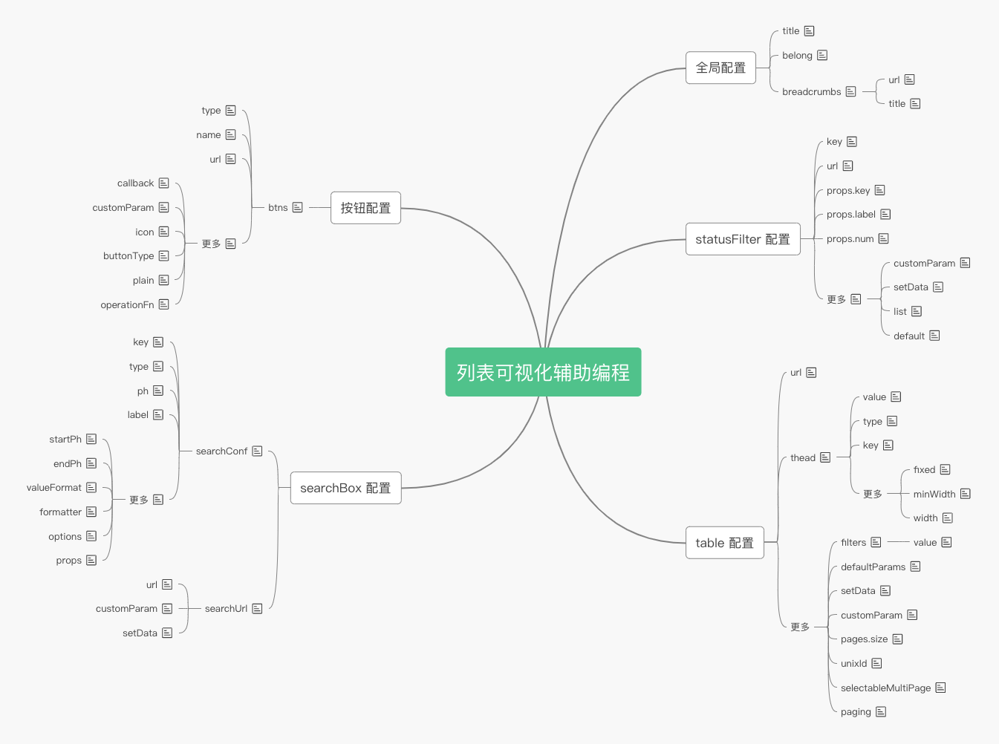

# 列表可视化辅助编程

列表的配置分为 5 个大的部分，分别是全局配置，按钮操作，statusFilter 配置，searchBox 配置，table 配置。这 5 大部分在同一个页面中配置，但是又具有明显的区域划分。

## 目的

1. 减少记忆配置字段名的压力
2. 减少在一串json字段中找需要修改的位置的压力

## 流程图

## 思维导图

## 实现

界面上的数据与最终生成的数据结构一一对应，减少不必要的数据转换
