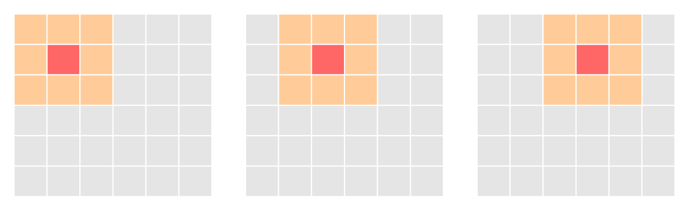
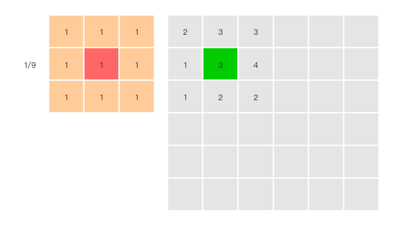
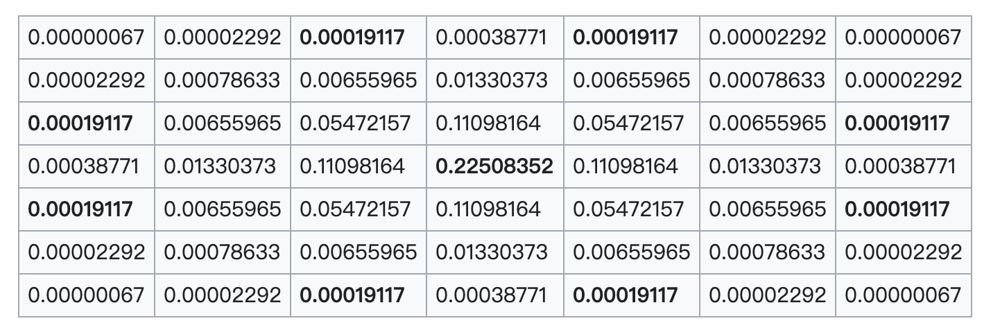
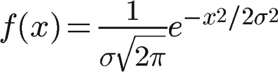
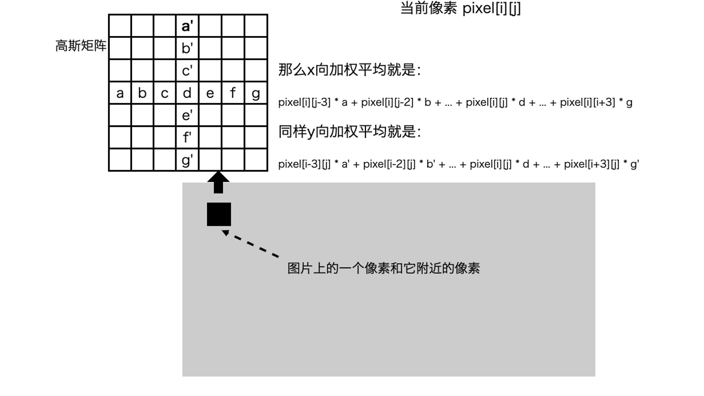
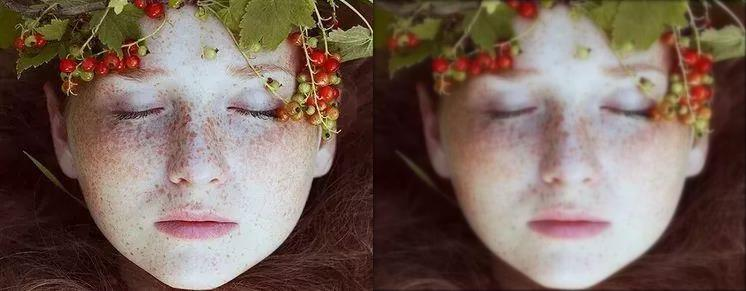

# 图片美化

在日常生活中对图片进行美化已经见怪不怪了，常见的美化操作有：加滤镜、磨皮等，在这篇文章中我会使用 canvas 2D 来介绍一些简单的图片美化操作，通过这篇文章我希望大家对图片美化有一个大概的认识，在这篇文章中会涉及到一些数学知识，但是我不会去演示如何推导结论，我只会给出一个结论。在这篇文章中会包含两种美化方式，分别是：给图片加滤镜和模糊

## 前置条件

在这篇文章中会用的 API 如下：

OffscreenCanvas：创建一个脱离屏幕渲染的 canvas 对象

context.drawImage：将图片画在 canvas 2d 上下文画布上

context.getImageData：得到 canvas 2D 画布矩型区域的 ImageData 对象，有了 ImageData 对象你可以通过操作 ImageData 对象来操纵像素数据

context.putImageData：将 ImageData 对象绘制到画布上

在这里你至少要知道如何将图片绘制到 canvas 2d 画布上，如下所示：

```javascript
    const canvas = document.getElementById('canvas1')
    const ctx = canvas.getContext('2d')
    // loadImg 函数用于加载图片，在其他地方实现了这个函数
    const Img = await loadImg('/WechatIMG27.jpeg')
    canvas.width = Img.width 
    canvas.height = Img.height
    
    ctx.drawImage(Img, 0, 0);
```

得到的结果如下：


## ImageData 对象

我们知道，图片由多个像素点组成，对一张 100 * 100 的图片而言，它有 1 万个像素点。canvas 2D 用 4 个通道来存放像素点的颜色信息，每个通道是 8 个二进制位，转化为十进制就是 0~255，这 4 个通道对应 RGBA 的四个值。在前面我提到过通过 context.getImageData 可以得到 canvas 2D 画布矩型区域的 ImageData 对象，ImageData 对象中保存了像素信息。ImageData 接口如下：

```javascript
interface ImageData {
    /**
     * 矩型区域的像素信息，它是一个一纬数组，数组中的每一位的取值范围是 0~255
     */
    readonly data: Uint8ClampedArray;
    /**
     * 矩型区域的高度，单位是像素
     */
    readonly height: number;
    /**
     * 矩型区域的宽度，单位是像素
     */
    readonly width: number;
}
```

每个像素有 RGBA 4 个通道，二维的图片像素信息以从上倒下，从左到右以 RGBA 的顺序依次保存到 ImageData.data 中，ImageData.data 数组的长度为 `ImageData.height * ImageData.width * 4`

```javascript
data[0] // 第1行第1列的红色通道值
data[1] // 第1行第1列的绿色通道值
data[2] // 第1行第1列的蓝色通道值
data[3] // 第1行第1列的Alpha通道值
data[4] // 第1行第2列的红色通道值
data[5] // 第1行第2列的绿色通道值
...
```

## 给图片添加滤镜

接下来我们操作 ImageData 对象中像素信息，然后再将 ImageData 对象绘制到画布上，通过这种方式来实现一些简单的滤镜效果。

### 灰度图

我们先以灰度图入手，灰度图只有一个采样颜色的图像，它有 256 个灰度等级，255 代表全白，0 表示全黑，将红绿蓝三个通道的数值设定为相同值就可以看到其对应的灰度效果。要将彩色图转换成灰度图需要用到一个公式，在本片文章中我使用的灰度公式如下，除了使用这个公式你还能够使用其他的公式，不同的公式计算出的精准度不同


得到 Gray 后，将原来的 RGB(R,G,B) 中的 R,G,B 通道值统一用 Gray 替换，形成新的颜色 RGB(Gray,Gray,Gray)，将新的通道值写回原来的通道就能得到灰度图了。代码如下：

```javascript
  for(let i = 0, len = imageData.data.length; i < len; i += 4) {
    const data = imageData.data[i];
    const r = data[i],
      g = data[i + 1],
      b = data[i + 2],
      a = data[i + 3];
    // 使用灰度公式
    const gray = 0.3 * r + 0.59 * g + 0.11 * b;
    data[i] = gray;
    data[i + 1] = gray;
    data[i + 2] = gray;
    data[i + 3] = a;
  }
```

计算出新的像素信息之后，我们还需要将 ImageData 对象绘制到画布上，在这一步使用的 API 是：

```javascript
context.putImageData(imageData, 0, 0)
```

得到的结果如下：


我把灰度化图片的过程总结了一张流程图，你可以参考它来理解。


分析灰度化图片整个过程，我们可以发现修改 ImageData 中的每个像素点信息是最关键的，在灰度化图片时我们使用了一个公式计算出 Gray，然后将 RGB 通道值都改成了 Gray。如果使用其他的方式改变 RGB 通道的值，我们就能得到新的美化效果。

### 使用颜色矩阵改变像素信息

我们创建一个 4*5 颜色矩阵，让它的第一行决定红色通道，第二行决定绿色通道，第三行决定蓝色通道，第四行决定 Alpha 通道。


如果要改变像素的颜色效果，我们只需要将该矩阵与像素的颜色向量相乘就可以了。


颜色矩阵与像素的颜色向量相乘之后能够得到 `R'`、`G'`、`B'`和`A'`，我们将新得到通道值赋给原来的通道，就能得到新的滤镜效果了。

下面是一些简单的颜色矩阵

```javascript
// 灰度颜色矩阵
export function grayscale(p: number = 1) {
    const r = 0.3;
    const g = 0.59;
    const b = 0.11;
  
    return [
      r, g, b, 0, 0,
      r, g, b, 0, 0,
      r, g, b, 0, 0,
      0, 0, 0, 1, 0,
    ];
  }

// 过滤或增强某个颜色通道
export function channel({r = 1, g = 1, b = 1}) {
    return [
      r, 0, 0, 0, 0,
      0, g, 0, 0, 0,
      0, 0, b, 0, 0,
      0, 0, 0, 1, 0,
    ];
  }

// 改变亮度的颜色矩阵，p = 0 全暗，p > 0 且 p < 1 调暗，p = 1 原色， p > 1 调亮
export function brightness(p: number) {
    return [
      p, 0, 0, 0, 0,
      0, p, 0, 0, 0,
      0, 0, p, 0, 0,
      0, 0, 0, 1, 0,
    ];
  }
  
  // 改变饱和度的颜色矩阵，与grayscale正好相反
  // p = 0 完全灰度化，p = 1 原色，p > 1 增强饱和度
  export function saturate(p: number) {
    const r = 0.3 * (1 - p);
    const g = 0.59 * (1 - p);
    const b = 0.11 * (1 - p);
    return [
      r + p, g, b, 0, 0,
      r, g + p, b, 0, 0,
      r, g, b + p, 0, 0,
      0, 0, 0, 1, 0,
    ];
  }
  
  // 对比度的颜色矩阵, p = 1 原色， p < 1 减弱对比度，p > 1 增强对比度
  export function contrast(p: number) {
    const d = 0.5 * (1 - p);
    return [
      p, 0, 0, 0, d,
      0, p, 0, 0, d,
      0, 0, p, 0, d,
      0, 0, 0, 1, 0,
    ];
  }
  
  // 透明度的颜色矩阵，p = 0 全透明，p = 1 原色
  export function opacity(p: number) {
    return [
      1, 0, 0, 0, 0,
      0, 1, 0, 0, 0,
      0, 0, 1, 0, 0,
      0, 0, 0, p, 0,
    ];
  }
  
  // 反色的颜色矩阵， p = 0 原色， p = 1 完全反色
  export function invert(p: number) {
    const d = 1 - 2 * p;
    return [
      d, 0, 0, 0, p,
      0, d, 0, 0, p,
      0, 0, d, 0, p,
      0, 0, 0, 1, 0,
    ]
  }
```

颜色矩阵和颜色向量相乘可以得到新的滤镜效果，根据矩阵运算的性质，我们可以将多次颜色变换的过程，简化为将相应的颜色矩阵相乘，然后用最终的那个矩阵与颜色向量相乘。流程图如下：


接下来我们需要实现颜色矩阵与颜色矩阵相乘以及颜色矩阵与颜色向量的函数，下面是颜色矩阵与颜色向量相乘的函数

```javascript
export function transformColor(color: number[], ...matrixs: number[][]) {
  const [r, g, b, a] = color;
  // 颜色矩阵相乘
  const matrix: number[] = matrixs.reduce((m1, m2) => multiply(m1, m2));

  color[0] = matrix[0] * r + matrix[1] * g + matrix[2] * b + matrix[3] * a + matrix[4];
  color[1] = matrix[5] * r + matrix[6] * g + matrix[7] * b + matrix[8] * a + matrix[9];
  color[2] = matrix[10] * r + matrix[11] * g + matrix[12] * b + matrix[13] * a + matrix[14];
  color[3] = matrix[15] * r + matrix[16] * g + matrix[17] * b + matrix[18] * a + matrix[19];
  return color;
}
```

矩阵与矩阵相乘就不在文章中展示了。

现在我同时增强图片的饱和度、图片的亮度以及红色通道

```javascript
  for(let i = 0, len = imageData.data.length; i < len; i += 4) {
    const data = imageData.data[i];
    const r = data[i],
      g = data[i + 1],
      b = data[i + 2],
      a = data[i + 3];

    const color = transformColor([r,g,b,a], saturate(1.5), brightness(1.5), channel({r: 1.5}));

    data[i] = color[0];
    data[i + 1] = color[1];
    data[i + 2] = color[2];
    data[i + 3] = color[3];
  }
```

得到的结果如下：


### 图片融合

在前面的两个滤镜案例中我们使用了像素点的颜色通道，在接下来的这个滤镜效果中我们要用像素点的坐标来实现两张图的叠加。我要将一张透明的 PNG 图叠加到前面用到的图上来实现阳光照射的效果


现在我们需要加载两张图片，一张纹理图，另一张是主图，我们要从纹理中得到与主图对应的像素点的颜色值

```javascript
const Img = await loadImg('/WechatIMG27.jpeg')
const texture = await loadImg('/sunlight.png')
const textureImagedata = getImageData(texture);
const imageData = getImageData(Img);

for(let i = 0, len = imageData.data.length; i < len; i += 4) {
  const data = imageData.data[i];
  const r = data[i],
    g = data[i + 1],
    b = data[i + 2],
    a = data[i + 3];
  
  // 得到纹理中的像素颜色值，在这里只需要使用到透明度
  const { a: aOfTexture } = getPixels(textureImagedata, i);

  const color = transformColor([r,g,b,a], saturate(2 - aOfTexture), brightness(1 + 0.7 * aOfTexture))

  data[i] = color[0];
  data[i + 1] = color[1];
  data[i + 2] = color[2];
  data[i + 3] = color[3];
}

function getPixels(imageData: ImageData, index: number) {
  const data = imageData.data;
  if (!data[index]) {
      return {
          r: 0,
          g: 0,
          b: 0,
          a: 0
      }
  }
  return {
      r: data[index] / 255,
      g: data[index + 1] / 255,
      b: data[index + 2] / 255,
      a: data[index + 3] / 255
  }
}
```

## 给图片添加模糊效果

图片模糊在日常中应用非常广泛，例如：磨皮，图片数据的降噪，图片的有损压缩等，模糊算法也有很多，在这个章节我只介绍均值模糊和高斯模糊。图片模糊的原理非常简单——图片上每个像素都是它周围像素的平均，图片模糊就是对原图从上到下从左到右做卷积核变换，在这个过程中会涉及到一个矩阵，在数学上将这个矩阵成为卷积核。我画了一个图帮助大家理解这个过程



6 * 6 的矩阵代表图片像素，3 * 3 的矩阵代表卷积核。卷积核在图片上从上到下从左到右移动，每步只移动一个像素，卷积核中红色的格子对应的像素就是要做卷积核变换的像素。对于任何一个像素来说，我取它周围 3 * 3 的格子，也就是 9 个数做一次卷积核变换，然后再把结果写回像素本身，这样一来图片就模糊了。3 * 3 的格子说明模糊半径为 1，我们可以取更大的模糊半径，模糊半径越大，图像就越模糊。

为了方便理解我先介绍均值模糊

### 均值模糊



均值模糊，也称为均值滤波，它用到的卷积核的矩阵值全部为1/(卷积SIZE)，如上图所示都是 1/9。进行卷积核变换之后绿色格子的值就是 `2 * 1/9 + 3 * 1/9 + 3 * 1/9 + 1 * 1/9 + 3 * 1/9 + 4 * 1/9 + 1 * 1/9 + 2 * 1/9 + 2 * 1/9 = 2.33`，将得到的结果写回绿色格子。

### 高斯模糊

高斯模糊与均值模糊很类似，它们都会使用到卷积核，不同点是高斯模糊使用的卷积核矩阵值不一样。在均值模糊中，像素周围每个点的权重是一样的，在前面的例子中都是 1/9，如果使用简单平均，显然不是很合理，因为图像都是连续的，越靠近的点关系越密切，越远离的点关系越疏远。因此，加权平均更合理，距离越近的点权重越大，距离越远的点权重越小，高斯模糊使用正态分布（也称为高斯分布）计算像素周围每个点的权重


因为正态分布涉及比较专业的数学知识，这里不做介绍，我们来看一下高斯公式，在 N 维空间定义为


在二维空间定义为


其中 r 是模糊半径 （r * r = u * u + v * v），σ是正态分布的标准偏差

在实际应用中，在计算高斯函数的离散近似时，在大概 3σ 距离之外的像素都可以看作不起作用，这些像素的计算也就可以忽略。通常，图像处理程序只需要计算 （6σ + 1）x (6σ + 1) 的矩阵就可以保证相关像素影响。对于边界上的点，通常采用复制周围的点到另一面再进行加权平均运算。

这是一个计算σ = 0.84089642 的高斯函数生成的示例矩阵。注意中心元素 (4,4)处有最大值，随着距离中心越远数值对称地减小。


由于图片是二维的，所以在整个图片模糊章节，为了方便大家理解，所有的图例我都使用了二维的卷积核，但是在本篇文章中我们使用的 canvas 2D 上下文的 ImageData 对象保存的像素像素是一维的，在这里我们使用一维的高斯公式计算卷积核，高斯公式在一维空间定义为



运用高斯公式生成卷积核，代码如下：

```javascript
function gaussianMatrix(radius: number, sigma: number = radius / 3): {matrix: number[], sum: number} {
  const a = 1 / (Math.sqrt(2 * Math.PI) * sigma);
  const b = -1 / (2 * sigma ** 2);
  let sum = 0;
  const matrix = [];
  for(let x = -radius; x <= radius; x++) {
    const g = a * Math.exp(b * x ** 2);
    matrix.push(g);
    sum += g;
  }

  for(let i = 0, len = matrix.length; i < len; i++) {
    matrix[i] /= sum;
  }
  return {matrix, sum};
}
```

高斯模糊可以在二维图像上对两个独立的一维空间分别进行计算，这叫作线性可分。这也就是说，使用二维卷积核变换得到的效果可以通过在水平方向进行一维卷积核变换再加上在竖直方向的一维卷积核变换得到，这样以来我们通过一维高斯公式得到的卷积核就可以使用了。



实现代码如下：

```javascript
/**
  * 高斯模糊
  * @param  {Array} pixes  pix array 对应 ImageData.data
  * @param  {Number} width 图片的宽度
  * @param  {Number} height 图片的高度
  * @param  {Number} radius 取样区域半径, 正数, 可选, 默认为 3.0
  * @param  {Number} sigma 标准方差, 可选, 默认取值为 radius / 3
  * @return {Array}
  */
export function gaussianBlur(pixels: Uint8ClampedArray, width: number, height: number, radius: number = 3, sigma: number = radius / 3): Uint8ClampedArray {
    // 运用高斯公式得到卷积核
    const {matrix, sum} = gaussianMatrix(radius, sigma);
    // x 方向一纬卷积核变换
    for(let y = 0; y < height; y++) {
      for(let x = 0; x < width; x++) {
        let r = 0,
          g = 0,
          b = 0;
  
        for(let j = -radius; j <= radius; j++) {
          const k = x + j;
          if(k >= 0 && k < width) {
            const i = (y * width + k) * 4;
            r += pixels[i] * matrix[j + radius];
            g += pixels[i + 1] * matrix[j + radius];
            b += pixels[i + 2] * matrix[j + radius];
          }
        }
        const i = (y * width + x) * 4;
        // 除以 sum 是为了消除处于边缘的像素, 高斯运算不足的问题
        pixels[i] = r / sum;
        pixels[i + 1] = g / sum;
        pixels[i + 2] = b / sum;
      }
    }
  
    // y 方向一纬卷积核变换
    for(let x = 0; x < width; x++) {
      for(let y = 0; y < height; y++) {
        let r = 0,
          g = 0,
          b = 0;
  
        for(let j = -radius; j <= radius; j++) {
          const k = y + j;
          if(k >= 0 && k < height) {
            const i = (k * width + x) * 4;
            r += pixels[i] * matrix[j + radius];
            g += pixels[i + 1] * matrix[j + radius];
            b += pixels[i + 2] * matrix[j + radius];
          }
        }
        const i = (y * width + x) * 4;
        pixels[i] = r / sum;
        pixels[i + 1] = g / sum;
        pixels[i + 2] = b / sum;
      }
    }
    return pixels;
  }
```

执行完 gaussianBlur 函数之后，我们就修改了 ImageData.data 中的像素值，然后将 ImageData 绘制到 canvas 画布上，得到的结果如下



## 总结

在本片文章中不管是给图片添加滤镜还是做模糊操作，我们都是对图片中的像素进行处理，这种处理图像的思路就叫做像素化，不过，不管我们用 Canvas 的 ImageData API 应用滤镜、模糊还是纹理合成都有一个弊端，那就是我们必须循环遍历图片上的每个像素点。如果这个图片很大，比如它是 2000px 宽、2000px 高，我们就需要遍历 400 万像素！这个计算量是相当大的。

在前面的例子中，我们生成的都只是静态的图片效果，所以这个计算量的问题还不明显。一旦我们想要利用像素处理制作出更酷炫的动态效果，这样的计算量注定会成为性能瓶颈，这种时候我们可以使用 WebGL 这个神器