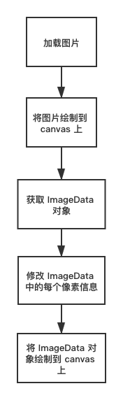
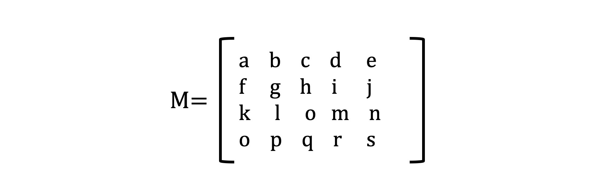
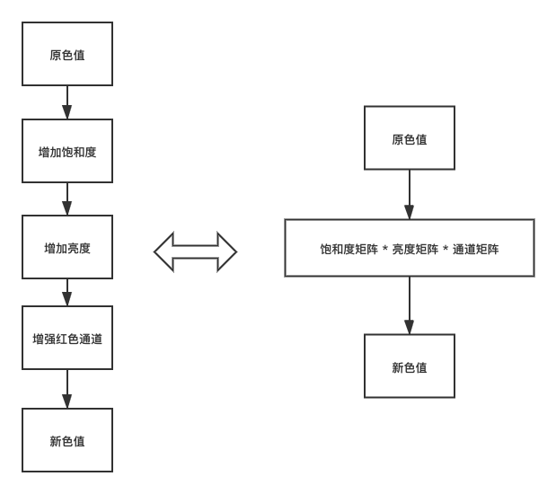

# 图片美化

在日常生活中对图片进行美化已经见怪不怪了，常见的美化操作有：加滤镜、磨皮等，在这篇文章中我会使用 canvas 2D 来介绍简单的图片美化操作，通过这篇文章我希望大家对图片美化有一个大概的认识，在这篇文章中会涉及到一些数学知识，但是我不会去演示如何推导结论，我只会给出一个结论。在这篇文章中会包含两方面的美化操作，分别是：给图片加滤镜和模糊操作

## 前置条件

在这篇文章中会用的 API 如下：

OffscreenCanvas：创建一个脱离屏幕渲染的 canvas 对象

context.drawImage：将图片画在 canvas 2d 上下文画布上

context.getImageData：得到 canvas 2D 画布矩型区域的 ImageData 对象，有了 ImageData 对象你可以直接通过 ImageData 对象操纵像素数据

context.putImageData：将 ImageData 对象绘制到画布上

在这里你至少要知道如何将图片绘制到 canvas 2d 画布上，如下所示：

```javascript
    const canvas = document.getElementById('canvas1')
    const ctx = canvas.getContext('2d')
    // loadImg 函数用于加载图片，在其他地方实现了这个函数
    const Img = await loadImg('/WechatIMG27.jpeg')
    canvas.width = Img.width 
    canvas.height = Img.height
    
    ctx.drawImage(Img, 0, 0);
```

得到的结果如下：


## ImageData 对象

我们知道，图片由多个像素点组成，对一张 100 * 100 的图片而言，它有 1 万个像素点。canvas 2D 用 4 个通道来存放每个像素点的颜色信息，每个通道是 8 个二进制位，转化为十进制就是 0~255，这 4 个通道对应 RGBA 颜色的四个值。在前面我提到过通过 context.getImageData 可以得到 canvas 2D 画布矩型区域的 ImageData 对象，ImageData 对象中保存了像素信息。ImageData 接口如下：

```javascript
interface ImageData {
    /**
     * 矩型区域的像素信息，它是一个一纬数组，数组中的每一位的取值范围是 0~255
     */
    readonly data: Uint8ClampedArray;
    /**
     * 矩型区域的高度，单位是像素
     */
    readonly height: number;
    /**
     * 矩型区域的宽度，单位是像素
     */
    readonly width: number;
}
```

图片是二维的，但是 ImageData 对象的 data 属性却是一纬数组，那么像素信息是如何保存到 ImageData.data 中的呢？每个像素有 RGBA 4 个通道，二维的图片像素信息以从上倒下，从左到右以 RGBA 的顺序依次保存到 ImageData.data 中，ImageData.data 数组的长度为 `ImageData.height * ImageData.width * 4`

```javascript
data[0] // 第1行第1列的红色通道值
data[1] // 第1行第1列的绿色通道值
data[2] // 第1行第1列的蓝色通道值
data[3] // 第1行第1列的Alpha通道值
data[4] // 第1行第2列的红色通道值
data[5] // 第1行第2列的绿色通道值
...
```

## 给图片添加滤镜

接下来我们操作 ImageData 对象中像素信息，然后再将 ImageData 对象绘制到画布上，通过这种方式来实现一些简单的滤镜效果。

### 灰度图

我们先以灰度图入手。要将彩色图转换成灰度图需要用到一个公式，在本片文章中我使用的灰度公式如下，除了使用这个公式你还能够使用其他的公式，不同的公式计算出的精准度不同


求得 Gray 后，将原来的 RGB(R,G,B) 中的 R,G,B 统一用 Gray 替换，形成新的颜色 RGB(Gray,Gray,Gray)，用它替换原来的RGB(R,G,B)就是灰度图了。接下来我们遍历 ImageData.data 数组，将 Gray 的值赋给像素的 RGB 通道，代码如下：

```javascript
  for(let i = 0, len = imageData.data.length; i < len; i += 4) {
    const data = imageData.data[i];
    const r = data[i],
      g = data[i + 1],
      b = data[i + 2],
      a = data[i + 3];
    // 使用灰度公式
    const gray = 0.3 * r + 0.59 * g + 0.11 * b;
    data[i] = gray;
    data[i + 1] = gray;
    data[i + 2] = gray;
    data[i + 3] = a;
  }
```

计算出新的像素信息之后，我们还需要将 ImageData 对象绘制到画布上，在这一步使用的 API 是：

```javascript
context.putImageData(imageData, 0, 0)
```

得到的结果如下：


我把灰度化图片的过程总结了一张流程图，你可以参考它来理解。



分析灰度化图片整个过程，我们可以发现修改 ImageData 中的每个像素点信息是最关键的，在灰度化图片时我们使用了一个公式计算出 Gray，然后将 RGB 通道值都改成了 Gray。如果使用其他的方式改变 RGB 通道的值，我们就能得到新的美化效果。

### 使用颜色矩阵改变像素颜色

我们创建一个 4*5 颜色矩阵，让它的第一行决定红色通道，第二行决定绿色通道，第三行决定蓝色通道，第四行决定 Alpha 通道。



如果要改变像素的颜色效果，我们只需要将该矩阵与像素的颜色向量相乘就可以了。


像素矩阵与像素的颜色向量相乘之后能够得到 `R'`、`G'`、`B'`和`A'`，我们将新得到通道值赋给原来的通道，就能得到新的滤镜效果了。

下面是一些简单的颜色矩阵

```javascript
// 灰度颜色矩阵
export function grayscale(p: number = 1) {
    const r = 0.3;
    const g = 0.59;
    const b = 0.11;
  
    return [
      r, g, b, 0, 0,
      r, g, b, 0, 0,
      r, g, b, 0, 0,
      0, 0, 0, 1, 0,
    ];
  }

// 过滤或增强某个颜色通道
export function channel({r = 1, g = 1, b = 1}) {
    return [
      r, 0, 0, 0, 0,
      0, g, 0, 0, 0,
      0, 0, b, 0, 0,
      0, 0, 0, 1, 0,
    ];
  }

// 改变亮度的颜色矩阵，p = 0 全暗，p > 0 且 p < 1 调暗，p = 1 原色， p > 1 调亮
export function brightness(p: number) {
    return [
      p, 0, 0, 0, 0,
      0, p, 0, 0, 0,
      0, 0, p, 0, 0,
      0, 0, 0, 1, 0,
    ];
  }
  
  // 改变饱和度的颜色矩阵，与grayscale正好相反
  // p = 0 完全灰度化，p = 1 原色，p > 1 增强饱和度
  export function saturate(p: number) {
    const r = 0.3 * (1 - p);
    const g = 0.59 * (1 - p);
    const b = 0.11 * (1 - p);
    return [
      r + p, g, b, 0, 0,
      r, g + p, b, 0, 0,
      r, g, b + p, 0, 0,
      0, 0, 0, 1, 0,
    ];
  }
  
  // 对比度的颜色矩阵, p = 1 原色， p < 1 减弱对比度，p > 1 增强对比度
  export function contrast(p: number) {
    const d = 0.5 * (1 - p);
    return [
      p, 0, 0, 0, d,
      0, p, 0, 0, d,
      0, 0, p, 0, d,
      0, 0, 0, 1, 0,
    ];
  }
  
  // 透明度的颜色矩阵，p = 0 全透明，p = 1 原色
  export function opacity(p: number) {
    return [
      1, 0, 0, 0, 0,
      0, 1, 0, 0, 0,
      0, 0, 1, 0, 0,
      0, 0, 0, p, 0,
    ];
  }
  
  // 反色的颜色矩阵， p = 0 原色， p = 1 完全反色
  export function invert(p: number) {
    const d = 1 - 2 * p;
    return [
      d, 0, 0, 0, p,
      0, d, 0, 0, p,
      0, 0, d, 0, p,
      0, 0, 0, 1, 0,
    ]
  }
```

颜色矩阵和颜色向量相乘可以得到新的滤镜效果，根据矩阵运算的性质，我们可以将多次颜色变换的过程，简化为将相应的颜色矩阵相乘，然后用最终的那个矩阵与颜色向量相乘。流程图如下：

