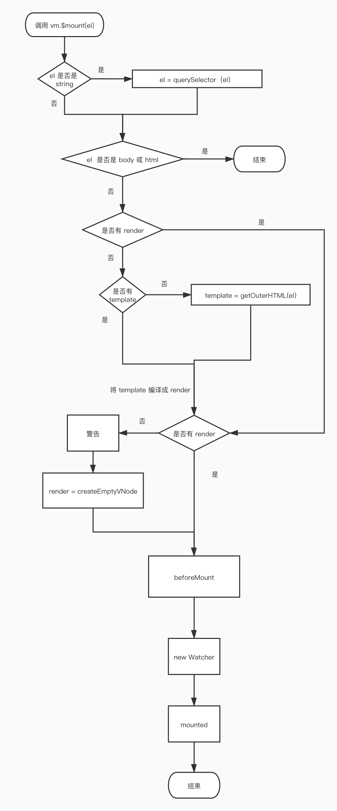

# vue 源码解读

## flow

静态类型检查，通过类型推断和类型注释检查类型

在 vue 源码的 flow 目录中定义了 vue 中用到的自定义类型

## 目录结构

在 vue 的源码中，作者将功能模块拆分的非常的细，相关的逻辑放在一个单独的目录中维护，将复用的逻辑也抽成一个单独的目录。

## 构建

使用 rollup 构建，rollup 只处理 js 代码，它比 webpack 更轻量

### runtime-only vs runtime+compiler

runtime-only 版本的 vue,会在 webpack 打包的过程中将 .vue 文件编译成 js 代码。这样打包出的项目代码会小很多并且性能也更好。

runtime+compiler 版本的 vue,是在项目运行的时候去编译 vue 的 template 编译成 render. 项目代码更多并且性能更差。在定义 vue 组件时使用的 template 属性就要使用 runtime+compiler 版本

## 在引入 Vue 时

在引入 Vue 时(即 import vue form Vue)，就会在 vue 原型和 vue 构造函数上挂载一些方法

## new Vue

在 new Vue 时会设置 vue 实例的父子关系，给 data, props, methods 设置代理，初始化 injections,初始化 provide等

## Vue 实例挂载

